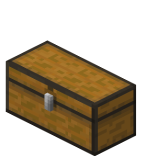
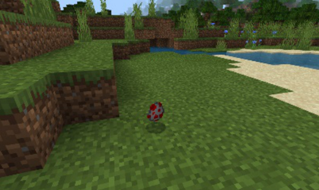

# 认识Minecraft世界

#### 作者：境界

在Minecraft世界中，构建世界的基本单位是方块(block)。建筑是由方块组成的，群系是由方块组成的，自然世界中的生物也是由模型中的方块构成的。

学会认识方块，代表你开始慢慢接受MC风格对自己创作的影响，也将会对你接下来的学习过程带来很大帮助。除此之外，世界还有许多延伸出来的内容，它们以各自的功能特色服务着这个世界。

 

#### 世界

世界即是一个游戏存档。它可能是你本地游玩的单人存档，是多人联机的云端存档，或是大型服务器联机的服务器存档。存档可以不局限于某一个终端，因此，你可以把服务器的存档放到单人上游玩，或者将单人的生存存档放到服务器上使用。

理论上，在Minecraft世界中，玩家无法走遍世界的全部角落。因为这个世界没有边界，每个世界都会因“世界种子”而长得独一无二。世界种子由一串包含正负整数的数字字符组成，游戏会根据这个值来创建不同样子的世界。玩家可以通过存档的设置界面来分享种子，共享具有相同地貌模样的世界存档。

当玩家不断冒险的时候，游戏会根据世界种子和算法生成玩家要探索的下一个区域。由于世界是无限大的，因此Minecraft世界使用区块概念来实现这一功能。

#### 区块

区块是由长宽各16格，高度255格的世界方块组成的区域。当玩家进入游戏时，他所出现在的位置一定坐落于世界的某个区块当中。
通过设置世界存档的模拟距离，例如下图中的6个区块，则玩家所能看到的区域只有这6个区块大小。其他区块不会加载。只有当玩家移动到其他区块时，游戏才会开始加载那些区块， 并卸载此前的区块，达到流畅的游戏体验。

 

#### 生物群系

生物群系会横跨多个区块。不同的生物群系有着不同的自然环境。如上图展示了沼泽、森林、平原三者交汇。沼泽的水犹如墨绿色，而森林和平原的水呈淡蓝色。两者在汇流处会有颜色的过渡。不仅如此，生物群系的种类还决定了它的海拔高度、植物群、地理特征、温度、湿度、天空、植被颜色、生物分布等。这种近似现实地球的气候区，又会因为“世界种子”而永不重样：玩家在同样的位置，会看到不一样的方块、不一样的生物，每个人在Minecraft世界的故事也因此而不同。

#### 方块

方块是我的世界的基本组成单位，大多数方块长宽高在1单位长度上。不同的方块具有不同的材质。一种方块可能存在多种方块状态，例如不同颜色的羊毛。同时一种方块可能可以贮存数据，例如箱子会保存箱子内的道具信息。

例：不同颜色的羊毛

例：一个大箱子拥有54格的储存空间，每格格子可以存放一种物品，每种物品都包含着复杂的物品信息，它们被以数据的格式保存在箱子方块中。

#### 生物

生物是在游戏内可见的、处于活动中的、拥有自主意识的实体统称。生物都具有自己独特的AI行为，受到游戏的调度，并影响着世界。

例：正在扑向鸡的狐狸！

例：正在采花蜜的蜜蜂。

玩家是一种特殊的生物，他的行为来自玩家自身的意志，需要屏幕前的人来操控。与其他生物相比，玩家有着其他的作为Minecraft核心的玩法机制。如获取经验、合成道具、进食等。

例：默认情况下，玩家拥有两款基础皮肤，Steve和Alex。在皮肤创作中，分别对应着粗手臂皮肤和细手臂皮肤。

#### 实体

实体是在游戏内具有典型行为的运动对象，它是生物的基类。在Minecraft世界中，并不是所有的实体都具有自主的AI，有些需要借由外力去操控，有些则会表现得像方块一样。

例：船具有行驶速度、碰撞体积等典型行为，但它被放置于水上时不会自主滑动。需要由玩家控制来帮助其进行移动迁徙。

例：画是悬挂在墙上的装饰型实体，除观赏性外无自主行为。

#### 抛射物

抛射物是一种受外力被抛射至空中的实体，它们在飞行过程中会受到重力与摩擦力的影响。不同的抛射物可能具有不同的能力。

例：基岩版世界种，除了普通的箭以外，还有16种带有状态效果的药水箭。玩家持弓蓄力的程度会直接影响到随后箭在空气中飞行的加速度。

#### 物品

物品是物品实体和物品道具的统称。物品道具通常只会出现在储存格，包括玩家背包栏和快捷栏、各种箱子、生物背包里等。物品道具通常包含三种行为，一种是方块物品，即在物品栏里是物品，放置时是方块。一种是放置后会变成实体，如船物品。最后一种是可以被使用，如武器、工具、食物、装备、合成材料等。

当生物或者玩家丢弃某件物品道具时，物品会以实体的方式存在于地面上，若它被丢在水里，则会受到水的浮力漂浮至水面上。当具有捡起物品能力的生物靠近这个物品实体时，实体会被清理，而生物的物品栏内会出现这个物品道具。

例：作为实体形态的地狱合金剑被玩家靠近捡起来后，可以获得一个剑物品。它可以提高玩家8点攻击伤害，当玩家每次手持它并对目标挥出时生效。

例：作为实体形态的生物蛋被玩家靠近捡起来后，可以获得一个生物蛋物品。玩家右键地面可以召唤一只对应生物。

例：作为实体形态的灯被玩家靠近捡起来后，可以获得一个灯物品。玩家右键地面可以一个灯方块。

#### 资源特效

资源特效代指Minecraft游戏中使用到的各类资源文件。在后续的章节中，会针对每一块内容制作单独列出所需的文件内容。

资源可以分为音效资源、贴图资源、模型资源等。其中中国版基岩版中，针对模型资源，开花组允许开发者使用骨骼模型来替换游戏中大部分生物的模型，进而实现不同的表现效果。

特效即是在Minecraft世界中模拟各种自然效果的游戏内容。如玩家在挖掘方块时洒落的方块屑粒，经过水面时溅起的水花等。在《原版粒子和特效粒子》章节中，我们还会更加深入地了解如何制作这一系列的内容。

#### UI界面

界面是在整个游戏流程中，世界和用户之间进行交互的管道。玩家可以通过触发UI来控制对应的游戏逻辑。在《进阶：创建界面》章节中，教程会带领开发者一起学习制作新的界面的方法。

例：电脑基岩版中，通过鼠标点击物品，在界面内将其拖曳至箱子内。

例：在手游版中，通过手指点击快捷物品栏的格子来切换物品。