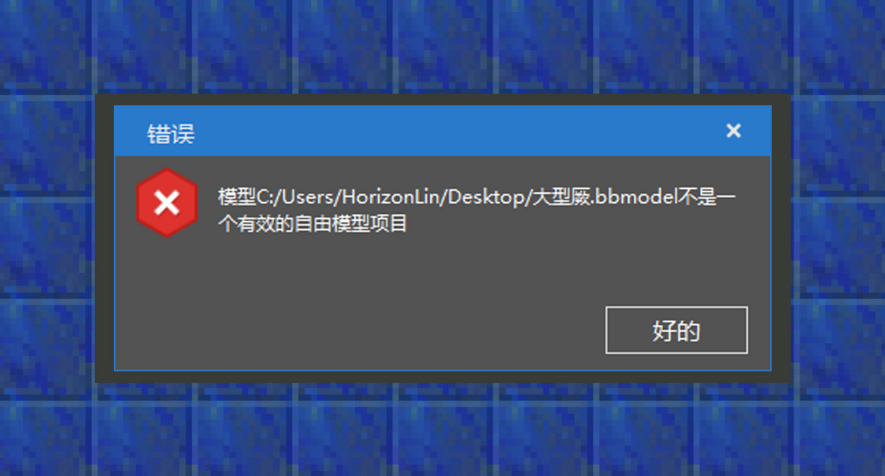
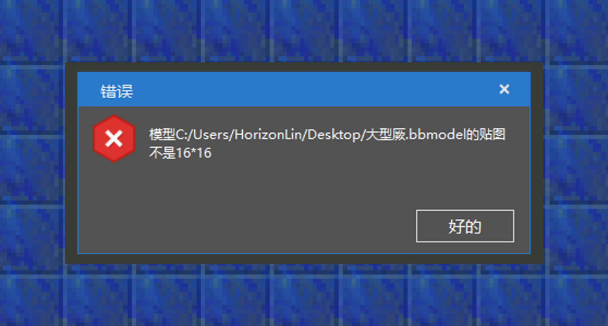

# 资源管理：转化方块模型

#### 作者：境界

在下方的资源管理列表里，会存在一个常用目录的折叠选项，对models选项进行右键，可以看到有转化Blockbench Java方块模型的选项。点击进去选择提前存好的bbmodel工程文件即可。
为了让开发者能够少踩一些坑，这里收集了一些常见的无法导入的报错信息，方便开发者自己检查。

①该模型不是一个有效的自由模型项目：虽然选项上写的是Blockbench Java方块模型，但开发者需要在创建模型时将工程文件选择为自由模型工程，才能满足导入的要求。并且Java版方块模型的旋转角度是有限制的，使用自由模型时则没有旋转角度的限制。

②该模型的贴图不是16x16大小，由于16*16的方块贴图对于游戏资源占用最小，官方建议开发者对方块模型的贴图尺寸进行更好的优化，从而将贴图限制在16x16。但有一些小技巧可以让超过16x16分辨率的模型被转化成功，即打开blockbench的工程文件，点击文件->项目，将贴图高度和宽度设置为16x16即可。但为了避免给低配终端玩家带来不好的游戏体验，这里还是建议开发者对方块贴图进行尺寸修改。