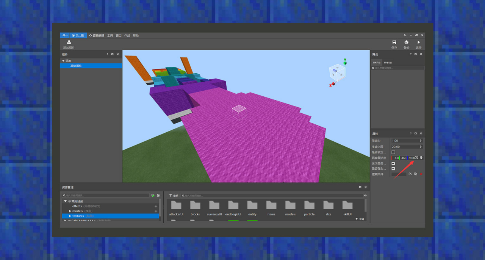

# 简易教学②：制作一条跑酷赛道

#### 作者：境界

跑酷赛道示例包下载：下载[示例包](https://g79.gdl.netease.com/guidedemo-case5.zip)。

一条跑酷赛道需要至少一个起点和终点，根据赛道的长度，可能还需要添加标记进度点，避免因为跑酷容错率小而浇灭玩家对地图玩法的热情。当玩家从跑酷地图上跌落下去时，应在一定下落高度前将玩家传送回上一个进度点。因此，本小节的简易教学将会使用多种颜色的羊毛作为建筑材料，攻击手为陷阱元素来教开发者如何制作一个不寻常的跑酷赛道。

①使用粉色羊毛为玩家搭建一个出生点，使用紫色、深蓝色、蓝色、青色、绿色、黄色、橙色羊毛铺起赛道，用红色羊毛作为终点。

②以搭建高度开始，往下十格以后的高度是会将玩家拉回复活点的高度，该功能需要使用命令方块配合。在粉色区域下方放置一个循环型命令方块。条件设置为无条件，红石选择保持始终开启。将指令内容设置为/tp @a[x=-13,dx=26,y=0,dy=40,z=0,dz=100,m=!c] 0 47 8。这会将筛选出所有玩家中，在x坐标从-13到13，y坐标从40到0，z坐标从0到100且不是创造模式的玩家，传送到起始点。因此在这个范围内的玩家若从跑酷位置掉落后，则会马上被传送到安全位置。传送时会在聊天信息里出现指令结果信息，若希望提示信息消失，可以使用gamerule指令的commandblockoutput、sendcommandfeedback选项设置为false。

③在终点位置的羊毛下方，放置一个循环型命令方块。条件设置为无条件，红石选择保持始终开启。将指令内容设置为/title @a[x=5,dx=-12,y=47,dy=10,z=74,dz=14,m=!c,tag=!success] title 恭喜你完成比赛。这会筛选出在进入红色羊毛区域内的玩家，并对他们发送比赛完成的信息。接着，在该命令方块指向的方向上，放置一个紧贴着该命令方块的连锁型命令方块。条件设置为无条件，红石选择保持始终开启。将指令内容设置为/tag @a[x=5,dx=-12,y=47,dy=10,z=74,dz=14,m=!c] add "success"。根据之前的教程可以知道，当循环型命令方块执行一次比赛完成的title指令后，紧接着会执行连锁型命令方块内的指令，并添加success这个标签，这样循环型命令方块的指令内容只会对该名通关玩家执行一次。

④在拉回玩家的循环型命令方块指向的方向上，放置一个紧贴着该命令方块的连锁型命令方块。条件设置为无条件，红石选择保持始终开启。将指令内容设置为/tag @a[x=-13,dx=26,y=0,dy=40,z=0,dz=100,m=!c] remove "success"。因此，当玩家从赛道跌落后被拉回来时，会尝试清除success标签，达到重复游玩的目的。

⑤在靠近终点位置设立两个橙色羊毛塔，这里将会作为攻击手所在的位置，会对靠近该区域的玩家进行骚扰攻击。

⑥将地图导入至MCSTUDIO，使用组件功能-玩家-基础属性，将玩家复活点设置在粉色羊毛的中心点。

⑦新增生物组件，将生物继承流浪者，资源设置为流浪者，并放大流浪者大小体型，将两种速度皆设置为0，因为我们希望它是站桩输出的远程射手。新增一个名为player标签的攻击类型，这样流浪者会对玩家进行攻击，其他属性由开发者自行决定。

⑧点击组件-生物-攻击手右侧的位置符号按钮，解锁放置攻击手新生物的功能。将攻击手生物放在两个橙色柱子上，对临近终点的玩家进行骚扰性攻击。

⑨在运行前必须保存当前的制作进度，点击右上角快捷按钮的“保存”按钮后，就可以点击运行进入游戏测试啦！