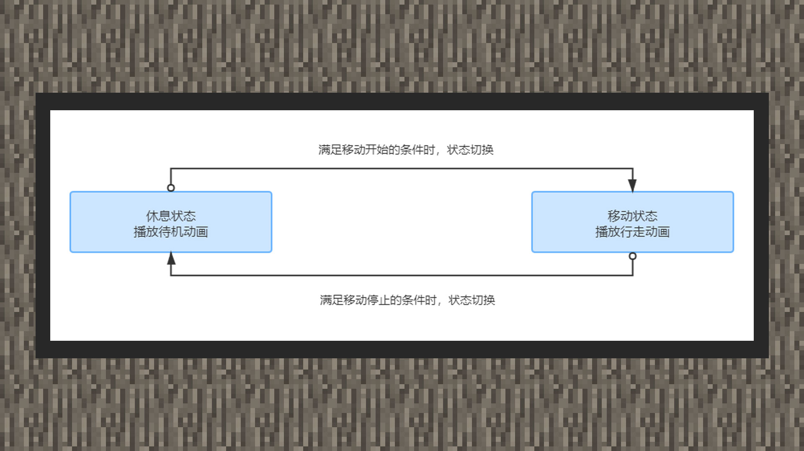

# 动画控制器


#### 作者：境界


动画控制器掌管生物播放动画的时机。一个生物实体可以同时加载多个动画资源，也可以同时加载多个动画控制器。动画控制器实际上是一个状态控制机，它在资源包上会用来播放动画，它在行为包上用来执行指令，或者指令“动画”。

浅粗地了解状态控制机，它实际上是一个特殊的逻辑管理模式，每个状态都有两个属性：

1)在当前状态下做什么；

2)如何转移到其他状态；

状态机之所以有用，是因为它们使开发者能够自然地将动画分解成逻辑流程，每个状态都处理自己的动画和逻辑。




例如，假设开发者要为自定义生物松鼠设置一个休息-移动动画，则它包含两种状态：

休息状态和移动状态，可视化流程图如上方所示。

```
{
    "format_version":"1.10.0",
    "animation_controllers":{
        "controller.animation.squirrel.general":{
            "initial_state":"default",
            "states":{
                "default":{
                    "blend_transition":0.1,
                    "blend_via_shortest_path":true,
                    "animations":[
                        "idle"
                    ],
                    "transitions":[
                        {
                            "move":"query.is_moving"
                        }
                    ]
                },
                "move":{
                    "animations":[
                        "move"
                    ],
                    "transitions":[
                        {
                            "default":"!query.is_moving"
                        }
                    ]
                }
            }
        }
    }
}
```


#### format_version

format_version是指代定义动画控制器文件的版本号，目前有1.8.0、1.10.0这两个格式版本号。1.10.0的版本里，基岩版再次重新整理了自定义生物的动画控制器写法格式。一般情况下，使用最新的1.10.0的格式，是现在自定义生物的通用规范。


#### controller.animation.

每个控制器都必须以controller.animation.为固定前缀。后面的名称可以以生物名称作区隔。


#### initial_state

initial_state是指动画控制器的初始状态，默认不写时，默认值为default。


#### states

states是状态的集合，在里面会包含动画集合，切换状态集合。其中动画集合可以同时放置多个动画，它们会在切换到该状态时马上播放。如：松鼠摇头待机动画和松鼠摇尾巴待机动画。切换状态集合内，会有存放其他状态的对象数据，如上图中：切换到移动状态时，必须满足生物移动的条件。

最后是两个特殊属性，blend_transition和blend_via_shortest_path。

blend_transition意为让动画状态切换更加顺滑，合理分配该值可能会做出更加顺畅的动画切换效果，它的值取0.0~1.0之间。


#### blend_via_shortest_path

blend_via_shortest_path意为是马上切换过渡到下个状态，根据开发者需求而定。