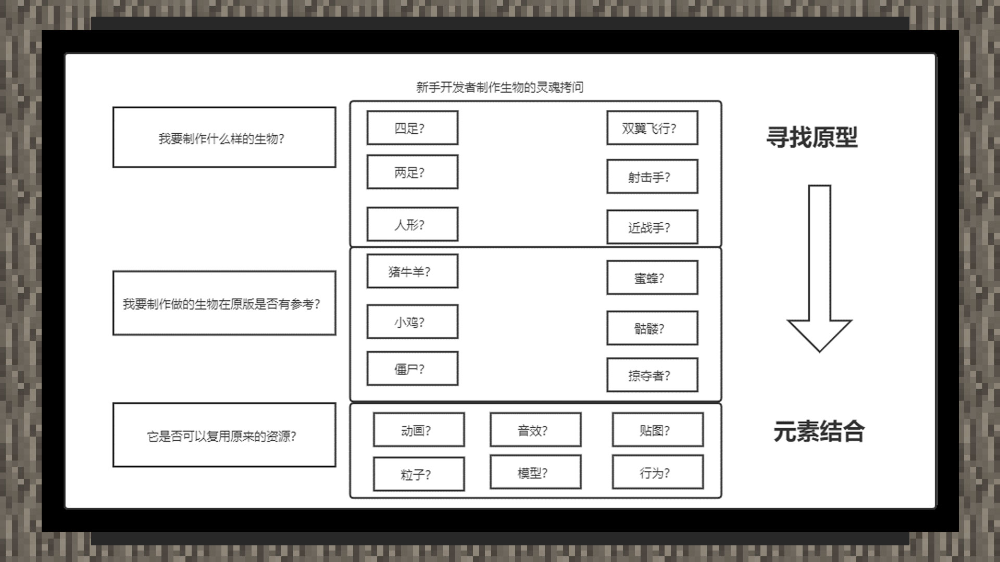

# 继承与复用思维

#### 作者：境界

新手开发者在制作自定义生物时，往往带有很多奇妙的点子，但在实际操作过程中，难免遇到暂时无法攻克的问题。正所谓“千里之行始于足下”，学会使用原版生物资源来制作一些带有额外行为、功能、特效的生物，往往是一个能够不断积累经验，又不容易遇到挫败感的方法。

当制作一个新的生物时，一个可靠的逻辑链参考可如以下所示：

在制作新的自定义生物时，最好的学习资料来自原版的资源包。最好的仿照生物，也同样来自于原版世界中的原版生物。学习是一个不断积累，不断解决困难的过程。只要锲而不舍，则金石可镂。