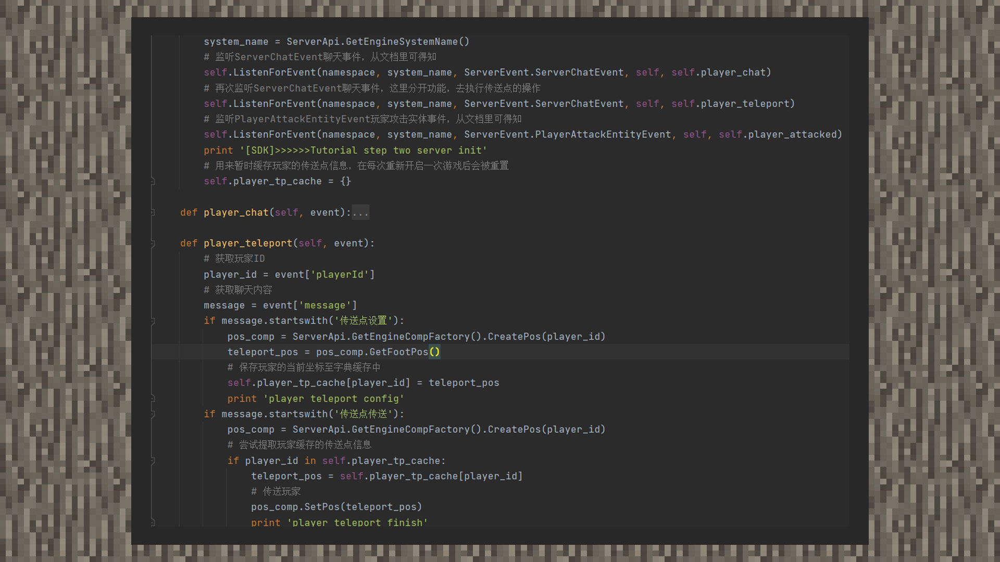

# 简易教程②：传送点

#### 作者：境界

传送点示例包下载：下载[示例包](https://g79.gdl.netease.com/guidedemo-case10.zip)。

①我的世界地图面积辽阔，通过模组为玩家提供传送点的功能，可以方便玩家在地图内快速移动。

②下载示例包在MCStudio中导入进游戏，通过聊天窗口输入“传送点设置”，即可把当前坐标设置为传送点，通过聊天窗口输入“传送点传送”，无论走的多远都可以把自己传送回来。

③由于目前中国版尚未支持自定义指令，我们通过监听玩家聊天的信息，来模拟指令效果，并执行玩家标记传送点、管理传送点、传送至传送点的逻辑。在简易教程里，我们只为玩家提供一个传送点，只在一次游戏房间内有效，离开房间后就会消失，并在匹配聊天内容成功后将玩家传送过去。

