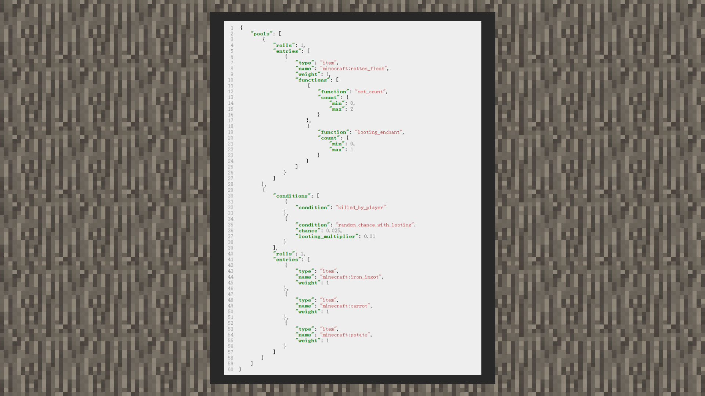

# 战利品池

 

#### 作者：境界

我们以原版僵尸的战利品池（pools）为例，它与其他生物的战利品配置不同的是，在战利品池中一共有两种组合。

#### rolls

rolls可以理解为投掷骰子的次数，它接受整型数值和包含最小次数和最大次数的随机区间，因此当次数等于1时，可以从战利品入口处筛选一次战利品。若大于1次时，可以筛选多次战利品。而当写成区间对象时，则会在最小次数和最大次数之间取一个数值，来筛选几次战利品。

#### type

type一共有三种参数，item代表战利品为物品，empty代表战利品为空，loot_table则会将该战利品指向其他战利品配置文件中。

当type为item时，可以通过name指定物品名称，格式为命名空间：标识符。weight是权重的意思。

当type为loot_tables时，可以通过name指定战利品文件路径，路径名一般以loot_tables开头。weight是权重的意思。

当入口存在多个战利品时，权重越高的越容易中到。name在类型为empty下无效。

 

在每个战利品中依旧可以开启一个战利品池，当战利品配置表被游戏触发时，会依次从最头部的战利品池内筛选出一个战利品，紧接着若在战利品内还有一个战利品池，则会继续筛选下去。这种方法会在需要玩家生成某件物品时，若还要再生成另一件物品时会非常好用。

 

如果战利品池里有两次以上的筛选组合，在没有加入条件前，全部会根据rolls的数值执行次数。若在筛选组合内加入条件，则必须满足条件后才可以筛选其中的战利品。

### 补充内容：
我的世界中国版自2.1版本增加玩家的幸运属性，因此战利品表也同步支持quality和bonus_rolls两个字段，如下图所示。
>此部分内容不在原版僵尸的战利品表内，需要开发者自行配置战利品表实现

luck：幸运值属性，与Java版的幸运值类似，属于玩家属性的一种，能够配合战利品表的quality和bonus_rolls字段改变战利品池的投掷次数和每个物品的抽取权重，最终实现幸运值越高，掉落物品更丰富和宝贵的效果。

quality：配合幸运值属性增加此物品的权重，值只能为整数，可以为负数，计算公式如下

    weight = weight + luck*quality

bonus_rolls：配合幸运值属性增加战利品投掷的次数，值可为浮点数，可以为负数，等同于在rolls的次数基础上增加额外的抽取次数。计算公式如下：

    最终投掷次数=rolls+luck*bonus_rolls（结果向下取整，若最终投掷次数≤0则不掉落）

>注意事项1：幸运属性的影响范围仅限被玩家击杀的生物和钓鱼的战利品表（掉落表），暂不支持自然生成的容器（箱子），破坏方块的掉落物，猪灵的以物易物的战利品表。

>注意事项2：钓鱼时的战利品还可以被海之眷顾的附魔效果影响，但是这并不会提升玩家的幸运值属性

>注意事项3：掠夺附魔效果额外得到的数量会受最终投掷次数影响而成倍增长，例如：受幸运值影响最终投掷次数为3，则掠夺附魔效果会额外得到的数量基准为3，附魔等级每增加一级，将额外得到3个物品，因此请避免将bonus_rolls值设置过大。
