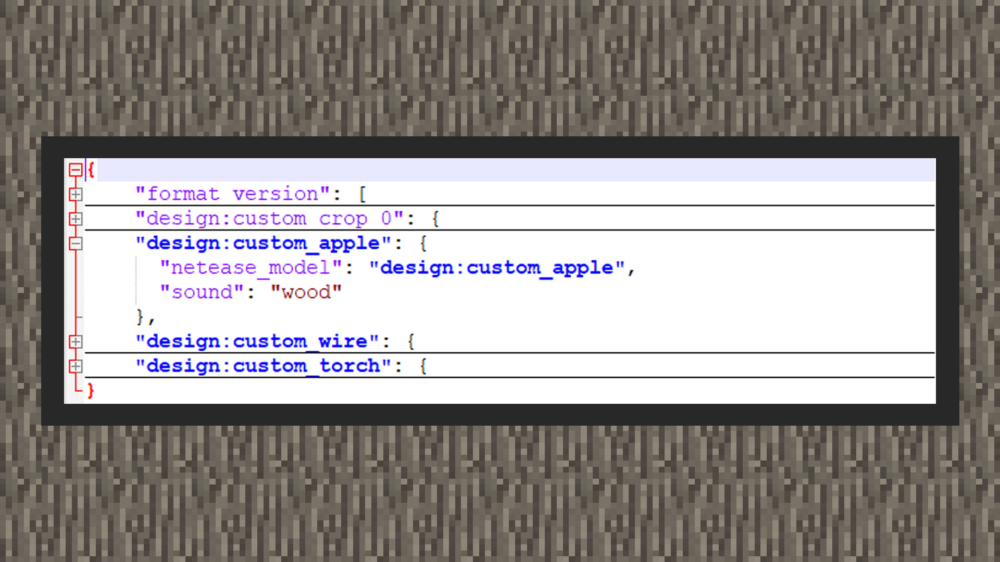

# 简易教程①：制作一个挂载果实的树


#### 作者：境界


挂载苹果示例包下载：下载[示例包](https://g79.gdl.netease.com/guidedemo-case13.zip) 。

#### 增加苹果方块


#### 实现代码逻辑如下：


```
{
    "format_version": "1.16.0",
    "minecraft:block": {
        "description": {
            "identifier": "design:custom_apple",
            "register_to_creative_menu": true
        },
        "components": {
            "minecraft:block_light_absorption": 0,
            "minecraft:destroy_time": 1.0,
            "netease:render_layer": {
              "value": "alpha"
            },
            "netease:aabb": {
              "collision": {
                "min": [0.3125, 0.375, 0.3125],
                "max": [0.6875, 1.0, 0.6875]
              },
              "clip": {
                "min": [0.3125, 0.375, 0.3125],
                "max": [0.6875, 1.0, 0.6875]
              }
            },
            "minecraft:loot": "loot_tables/custom_apple.json",
			"netease:solid": {
				"value": false
			},
			"netease:pathable": {
				"value": true
			}
        }
    }
}
```


1）首先我们将方块的透光率设置为0，即将minecraft:block_light_absorption值写为0。这是由于苹果方块用到自定义模型，游戏内的日夜光照会对模型进行阴影覆盖，我们希望方块受到阴影的程度的影响小一些，因此将值设置为0。开发者也可以根据自己的实际情况，在0~15间内进行微调，这是透光率组件允许接受的数值范围。

2）接着用netease:render_layer将方块材质设置为透明材质，以允许方块模型使用带有透明图层的贴图。

3）之后在netease:aabb里，将碰撞体积和射线检测贴准苹果方块真实的样子。组件中，每1点对应blockbench建模空间中16格，也就是每0.0625的长度对应blockbench内的一格空间。

4）接着将方块设置为非实心方块，这是由于我们希望避免玩家与苹果方块接触时，偶尔会因为碰撞盒重叠出现窒息扣血的情况。

5）接着将方块指向自定义的苹果战利品表，使玩家在挖掉苹果方块后会掉落苹果物品。

6）最后，将方块设置为生物无视其继续循着自己的寻路路径走。

 

#### 添加苹果战利品表


1）添加战利品池，设置筛选次数为1次，战利品入口设置为只有苹果这一个物品。

```
{
	"pools": [
		{
			"rolls": 1,
			"entries": [
				{
					"type": "item",
                    "name": "minecraft:apple"
				}
			]
		}
	]
}
```


#### 添加苹果方块资源文件


```
{
    "format_version": "1.13.0",
    "netease:block_geometry": {
        "bones": [
        ],
        "description": {
            "identifier": "design:custom_apple",
            "textures": [
                "design:custom_apple"
            ],
            "use_ao": false
        }
    }
}
```





```
{
    "format_version": [
      1,
      1,
      0
    ],
    "design:custom_apple": {
      "netease_model": "design:custom_apple",
      "sound": "wood"
    }
}
```


1）使用MCSTUDIO导出苹果方块工程文件，获得json模型文件

2）将模型放入材质包/models/netease_block文件夹内

3）将材质放入材质包/textures/blocks文件夹内

4）新建terrain_texture.json文件，列入资源键和路径

5）将资源键写入模型文件中，将环境光遮罩关闭("use_ao": false)

6）在材质包/blocks.json内配置苹果方块的模型和破坏音效

 

#### 制作特征

实现游戏内自然放置苹果方块，一共有三个维度。分别要用到单方块特征、检索特征、和总和特征。其中单方块特征负责设定苹果方块放置的规则、检索特征帮助苹果方块寻找放置的位置、总和特征会作为最后打包的部分被特征规则所使用。详细的细节请看以下：


#### 单方块特征

1） 首先在行为包根目录下的netease_features文件夹内新建custom_apple_feature.json的特征，特征类型为单方块特征。基本格式如下：

```
{
    "format_version":"1.14.0",
    "minecraft:single_block_feature":{
        "description":{
            "identifier":"特征的identifier，以命名空间：标识符为格式，其中命名空间后面的标识符还必须与文件名称匹配""
        },
        "places_block":"方块",
        "enforce_placement_rules":false,
        "enforce_survivability_rules":false,
        "may_place_on":[
            "方块"
        ],
        "may_replace":[
            "方块"
        ]
    }
}
```


2）接着，我们需要希望单方块特征会放置自定义的苹果方块。一共有两种写法，即只指定方块类型和指定方块类型加方块状态。由于自定义的苹果方块不存在任何方块状态，因此可以用places_block: “design:custom_apple”的方式。在未来开发者如果想要放置一些带有方块状态的，例如原版方块。则可以参考下面放置成熟小麦的例子：

```
“places_block”: {
  “name”: “minecraft:wheat”,
“states”: {
  “growth”: 7
}
}
```


3） 之后，为了能够保证苹果方块放置的其中之一条件必须是所替换的方块只能是空气方块，我们在may_replace_on这个属性集合内放入minecraft:air。从常理上，只有当放置规则在放置苹果方块时，满足了单方块特征里只能替换掉空气方块的规则，最后苹果方块才能放置成功。否则如果是替换任何一种方块，则在游戏内会让玩家察觉到非常不适的视觉效果。例如，苹果方块占用了叶子的位置，将叶子替换成了自己。

4） 紧接着，为了实现能够让果实挂载在树叶底下。我们要加入may_attach_to属性字段，并告知单方块特征，果实会挂载在叶子的下面，即方块的顶面top会贴在原版的树叶方块，即树叶方块的下面。auto_rotate字段用来决定是否自动旋转方块来符合贴近规则，这里我们填写false假。示例教程里，我们单独挑出橡木树叶和桦木树叶作为例子。

5） 最后是enforce_placement_rules和enforce_survivability_rules字段，前者会触发方块自我检查是否定义了方块放在什么方块边上的行为，后者会触发方块自我检查是否定义了方块可以在什么方块上存活保留的行为。由于自定义方块功能当前没有存活条件的行为，我们将此enforce_survivability_rules字段设置为false，enforce_placement_rules设置为true。


```
{
  "format_version": "1.14.0",
  "minecraft:single_block_feature": {
    "description": {
      "identifier": "design:custom_apple_feature"//特征名称域
    },
    "places_block": {
      "name": "design:custom_apple",//方块名称域
      "states": {}
    },
    "enforce_placement_rules": true,//是否根据放置规则放置特征，这里要写为true真
    "enforce_survivability_rules": false,
    "may_attach_to": {
      "auto_rotate": false,
      "min_sides_must_attach": 1,
      "top": [
        {
          "name": "minecraft:leaves",// 方块必须上部贴住橡树树叶才会生成
          "states": {
            "old_leaf_type": "oak"
          }
        },
        {
          "name": "minecraft:leaves",// 方块必须上部贴住桦树树叶才会生成
          "states": {
            "old_leaf_type": "birch"
          }
        }
      ]
    },
    "may_replace": [//只会在有空气的位置替换成苹果方块
      "minecraft:air"
    ]
  }
}
```


#### 检索特征


 1）首先在行为包根目录下的netease_features文件夹内新建custom_apple_search_feature.json的特征，特征类型为检索特征。基本格式如下：

```
{
  "format_version":”1.14.0”,
  "minecraft:search_feature": {
    "description": {
      "identifier": "特征的identifier，以命名空间：标识符为格式，其中命名空间后面的标识符还必须与文件名称匹配""
    },
    "places_feature": "特征identifier",
    "search_volume": {
      "min": [ -3, -3, -3 ],
      "max": [ 3, 3, 3 ]
    },
    "search_axis": "-y",
    "required_successes": 3
}
```


2）然后我们将检索特征下所放置的特征挂载为前面设定的苹果单方块特征。

3）紧接着，我们将检索特征会寻找的放置坐标范围，这需要用到search_volume对象，在min和max中进行调整。min代表左下角起点，max代表右上角最大点。这样拉出来的空间是一个方型。我们希望在之后和原版数特征组合用总和特征打包起来后，检索特征会检索前一个树木特征放下来后，从它的特征放置点下，在最小点到最大点的空间内进行偏移，寻找空间内是否有树叶，并且必须满足前面单方块特征的条件，包括苹果方块只能替换空气方块，以及放置单方块特征时必须是树叶下面的坐标点。这样子特征联动的效果就打通了。

4）接着，我们将寻找的位置从这个空间开始出发，以最小点【0，0，0】，即检索特征被放置的坐标点开始，以Y轴往上，进行向x轴正8格，Y轴正16格，Z轴正8格的方向去寻找树叶。当然，在search_axis字段内，不仅允许从Y轴往上的方向去寻找，也可以从其他方向去找，这其中包括-x、+x、-y、+y、-z、+z。

5）最后，required_successes字段用来指定寻找到的合适放置苹果方块的坐标究竟要达到多少个，整个特征才会正确放置。如果最后找到的坐标不满足要求的数量，则整个特征就会放置失败。在许多情况下这个也属于情理之中，因为有些树可能紧靠在一些突起的地貌环境，树叶的数量不足以挂接这么多的苹果，亦或是总和特征中放置的树木大小本来就小，承载不了要求的最低数量的苹果方块。但这也让环境变得更加多样变化与不同了。


```
{
  "format_version": "1.14.0",
  "minecraft:search_feature": {
    "description": {
      "identifier": "design:custom_apple_search_feature"//自定义名称域
    },
    "places_feature": "design:custom_apple_feature",//放置的规则为前面自定义的单方块特征
    "search_volume": {//寻找的位置是从放置坐标开始，位移X轴正8格、Y轴16格、Z轴8格内的体积内
      "min": [ 0, 0, 0 ],
      "max": [ 8, 16, 8 ]
    },
    "search_axis": "+y",//寻找的位置从设定的点开始，以Y轴往上
    "required_successes": 5
    //至少要有5个可放置苹果的位置，该特征才会放置成功
  }
}
```


#### 总和特征

1） 在行为包根目录下/netease_features文件夹内新建oak_tree_with_custom_apple_feature.json的特征，特征类型为总和特征。它的基本格式如下：

```
{
  "format_version": “1.14.0”,
  "minecraft:aggregate_feature": {
    "description": {
      "identifier": "特征的identifier，以命名空间：标识符为格式，其中命名空间后面的标识符还必须与文件名称匹配"
    },
    "features": [
      “特征1”，
		 “特征2”
    ]
  }
}
```


2）这里我们将写好的检索特征和原版的橡木树木特征放在里面。需要注意的是，在features内写好的特征，所处于的顺序不代表它们最终放置的顺序。因此有时候可能是先尝试放置了树木特征后再尝试放置苹果，有时候则相反。因此通过这个特征所放置的橡木不一定全部都挂接着苹果，因为先尝试放置苹果的检索特征，大概率会导致检索特征放置失败，因为可能树木特征还没有来得及放下去，所放置的坐标点此时可能光秃秃一片。但这也符合常理，毕竟不是所有野外的树木都挂载着果实。如果开发者希望做到必须挂接着果实的树木，可以期待后续的教程更新中，关于 队列特征的内容。

```
{
  "format_version": "1.14.0",
  "minecraft:aggregate_feature": {
    "description": {
      "identifier": "design:oak_tree_with_custom_apple_feature"
    },
    "features": [
      "minecraft:oak_tree_feature",
      "design:custom_apple_search_feature"
    ]
  }
}
```


#### 特征规则


1）首先在行为包根目录下/netease_feature_rules文件夹内新建overworld_apple_oak_tree_feature.json的特征规则。

2）接着我们需要设定特征放置的群系条件，通过conditions对象，我们希望整个主世界的群系都能够长出带有苹果方块的橡木。但请不用担心这会让我们在例如海洋、冰原群系也看得到它，因为原版的橡木特征里会携带着橡木能够生长在什么方块上的规则，因此奇怪的群系是看不到苹果树的。每个主世界群系都会携带overworld的标签，因此只要判断是否携带overworld标签，就能够放置在整个主世界维度当中。

3）最后我们在分布规则distribution里，在iterations中写下数字1，即每一个区块尝试放置一次。在区块内放置时，我们希望特征遵守先确定好X和Z轴，再决定Y轴的规则，我们希望X和Z坐标取从区块起始坐标开始，随机偏移0~16格的范围内的其中一个点。在Y轴在X和Z轴点确定下，这个点位置最高的非实心方块Y轴坐标点。保证树木会放置在地面上，而不是可能在地面中或者地面下。 


```
{
  "format_version": "1.14.0",
  "minecraft:feature_rules": {
    "description": {
      "identifier": "design:overworld_apple_oak_tree_feature",
      "places_feature": "design:oak_tree_with_custom_apple_feature"
    },
    "conditions": {
      "placement_pass": "surface_pass",
      "minecraft:biome_filter": [
        {
          "test": "has_biome_tag",
          "operator": "==",
          "value": "overworld"
        }
      ]
    },
    "distribution": {
      "iterations": 1,
      "x": {
        "distribution": "uniform",
        "extent": [ 0, 16 ]
      },
      "y": "query.heightmap(variable.worldx, variable.worldz)",
      "z": {
        "distribution": "uniform",
        "extent": [ 0, 16 ]
      }
    }
  }
}
```


#### 效果图如下：


