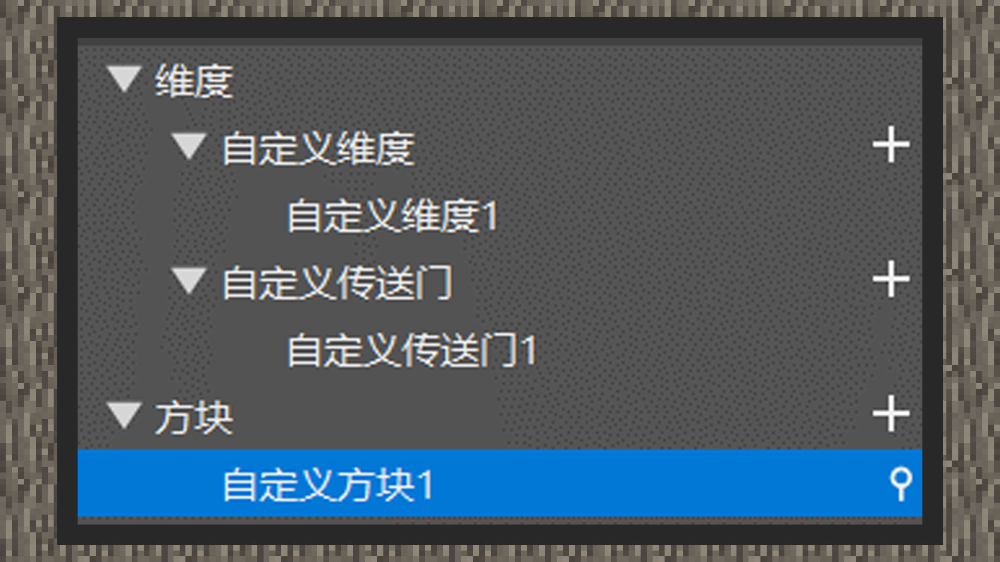

# 自定义维度

 

#### 作者：境界

 

自定义维度在刚推出时，开花组只开放了ID为3~20的维度世界，这17个世界不需要开发者新建文件来生成，只需配置好相应的传送逻辑即可前往。面对庞大的开发者数量，这种规模远远无法满足所有的组件。因此在之后的更新中，我们需要使用附加包的方式添加新的维度ID让游戏能够开通去往那个维度的入口，这里使用mcstudio的关卡编辑器可以快速帮助初级开发者建立新的文件，扫除一开始理解上的困难，让我们来看一下。

在关卡编辑器中，右键组件区域，指针指向维度，创建自定义维度组件、自定义传送门组件、方块组件。

①点击维度的子选项，可以看到右下角属性面板上可以自定义维度ID，维度ID的取值范围是0~int的最大值【一般为2147483647】。每次新建立一个维度组件时，都会帮我们默认填好一次随机的维度ID，可以不再去修改。

②点击方块组件的“+”号，至少创建两个自定义方块，将方块类型都设置为传送门。将其中一个自定义方块设置为去向传送门方块，将维度ID设置为新维度的ID。另一个自定义方块设置为返向传送门方块，将维度ID设置为主世界的ID，即0。

③在自定义传送门组件中，将传送门类型改为双向传送门，并将传送门方块设置为去向传送门方块，反向传送门方块设置为返回时的传送门方块。需要注意的是，当前传送门的边框方块还不支持自定义的普通方块，只能使用原版方块。

④右上角点击保存，运行进行测试。