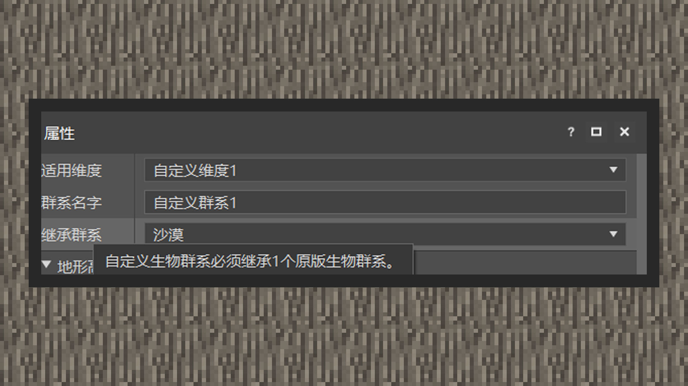
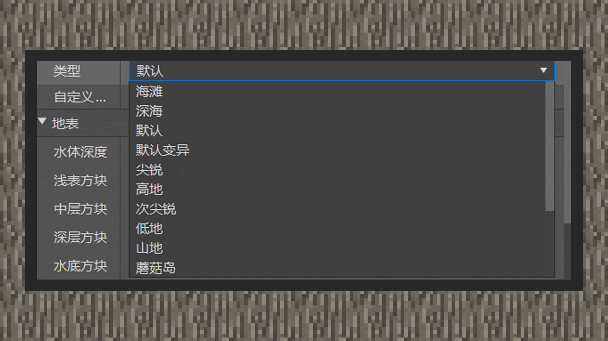

# 自定义群系

 

#### 作者：境界

 

附加包允许自定义群系群落，在中国版可以使用特定的目录结构来自定义某个维度的群系。自定义群系时必须使用继承关系，即每个群系都有一个对应的原版群系。虽然无法添加新的群系，但通过改变表面高度、气候调整、重新分配生物群落的稀有性，这些维度依然能变得与众不同。例如，使用新的树类型或方块建筑结构来激进地改变一个群系，添加新的自定义矿物方块到洞穴中等。群系要掌握的知识点如下：

①群系继承

②群系高度

③群系气候

④群系表面结构

⑤屏蔽原版群系特征

⑥自定义生物生成

 

#### 群系继承

自定义生物群系必须继承一个原版群系。在继承的时候，若没有复写原来群系的组件设定，则会默认使用原版群系的设定。原版群系的文件内容可以在modpc客户端根目录/data/definitions/biomes找到。

在MCSTUDIO中，选择继承群系的选项会继承一个原版群系。

在文本级编辑中，需要在identifier键对同级下新增一个inherts键对，值内容为一个原版群系名称。

 

#### 群系高度

群系的高度设定只能针对overworld进行自定义，换句话说，即高度设定必须给定到主世界存在的群系才会表现正确。像下界群系的高度设定由专门的下界群系生成器控制，由于中国版目前无法对下界群系进行自定义，这里不再赘述。而末地由于是一个虚空环境，该组件行为也不对末地产生效果。

群系高度可以设置为预设高度和噪声参数的高度，在通常情况下，使用预设高度可以降低学习难度和快速对自定义群系高度进行成型。而在使用噪声参数需要注意以下几个点：

噪声参数noise_params为一个二维数组，第一个值表示生物群落的平均高度。公式为：f（值）=（高度 -67）/ 16。因此，将此值设置为1将会产生高度大约为83的平均高度，类似丘陵群系中的山丘高度，将此值设置为-2会形成深海表面，并且处于海平面以下。群系的最大平均高度最多只能达到高度128以下。因此噪声参数数组的第一个数值在3.8125以上作用效果将不会表现出来。数组的第二个值确定高度变化，输入负值通常表现得非常不稳定，建议不要这样设置。值0将使地形变化较小，但不能使其完全平坦。值等于0.125将产生特别平滑的地形，大于此值开始形成悬崖、海湾和凹陷。像针叶林群系这样的极端群系高度始于0.25。设置较为激进的数值会让玩家在群系生存和移动产生困扰。

在目前关卡编辑器中，高度类型和噪声参数可以混用在一起，但实际上在群系生成的管道中，两者只能存在一个。要么是使用高度类型要么使用噪声参数类型。

 

#### 群系气候

群系气候组件会调节任何一个我的世界群系，包括在末地也存在气候。气候主要包括三个部分，downfall、temperature、snow_accumulation。Downfall取值区间在0.0~1.0间，若超过1.0会取1.0，它主要作用在降水与降雪中，可以理解为降水量或者降雪量。调整downfall并不会直接明显地表现在降水粒子和降雪粒子中，如果要看出它的效果，比较具有参考性地可以观察降雪时雪方块堆积的程度，坩埚收集水的速度，以及钓鱼时鱼出现的时间。Temperature是基础温度，给定基础温度不代表群系每个地方都是这个温度，温度还会随着群系高度变高而降低。温度公式为：T(实际温度) = 基础温度 - ((高度 - 63) / 600)。63为世界中海平面的高度，在原版设定中，温度为0.15时是冻结的气候，即会形成雪。因此假设我们给予一个0.2温度的气候，在0.15的温度时的高度群系会积雪，则高度为93格高。snow_accumulation为雪的堆积。

在通常情况下，开发者继承原来的群系都带有原本的温度，若需要自定义这些参数，需要进行文件级别的修改，而目前关卡编辑器尚不支持。

 

#### 群系地表

群系地表包含了群系在生成时的地表方块结构，可以自定义群系的浅表方块、中层方块、深层方块、水底方块、水底高度。

 

#### 屏蔽原版特征

由于自定义群系继承于原版群系，因此像森林的桦树、平原的橡树、热带草原的金合欢树，都会一起出现在新的群系里。为了屏蔽掉这些原版的特征，需要使用一个特定的组件行为屏蔽掉。

打开指定自定义群系的文本内容，在components下加入"minecraft:ignore_automatic_features"即可。

但有部分特征无法使用该组件行为去除，如村庄、沙漠神殿、林中府邸等。

 

#### 自定义生物生成

生物生成在前面的章节有提到，生成在群系的条件是根据群系标签来决定的。因此在自定义群系中，会自带原来群系的标签，这会导致一些原版生物也出现在新的自定义群系中，若要屏蔽这些生物，可以使用MODSDK处理。

在新的群系添加新的标签可以让自定义的生物生成在这里，要做到这样的效果，只需在关卡编辑器的群系标签列表里新增标签名字即可。或者在群系文件中的components下加入"标签名": {}。