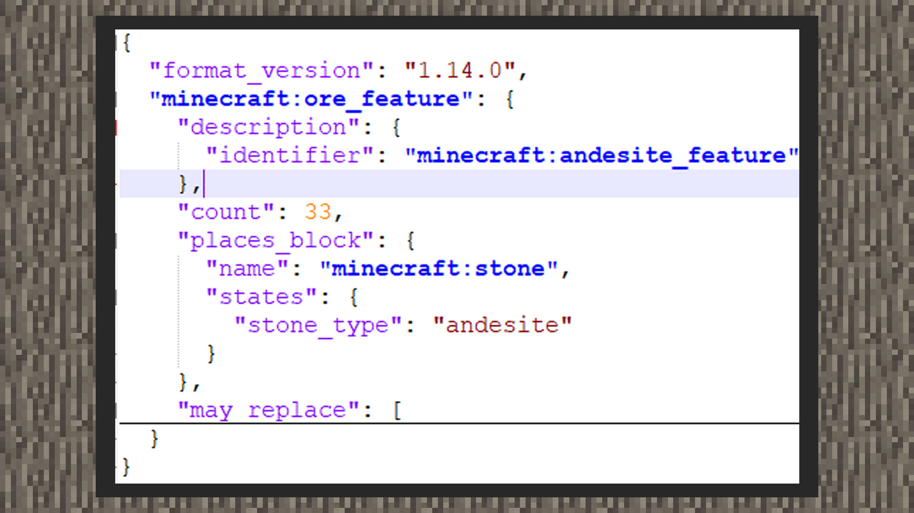
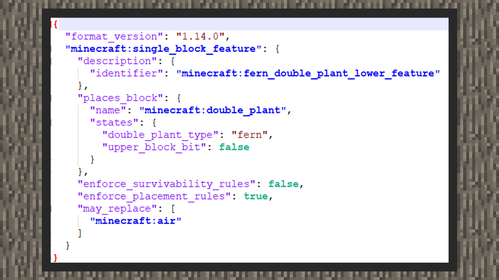

# 自定义特征

 

#### 作者：境界

 

群系中会存在一些自然的植被、矿物、建筑，它们都用到了特征功能。在关卡编辑器中，当前只支持使用中国版的建筑模板特征。为了让开发者了解更多的特征放置组合，有以下几个特征适合了解并掌握：

①矿物特征

②散布特征

③总和特征

④单方块特征

⑤建筑模板特征

想要了解更多的原版特征和写法，可以打开modpc根目录/definitions/features中查看。

 

#### 矿物特征

矿物特征用来替换地表下的方块为矿物方块。它是相对容易掌握的一种特征，写法格式并不复杂。

①Identifier是特征的唯一名称域，其中以namespace:identifier的格式为基准。并且identifier必须与文件名字一样，否则在modpc客户端下会测试出断言错误并强制关闭客户端。

②count是放置的次数。

③places_block接收一个方块内容，若方块不需要指明方块数据，如羊毛的颜色等，则可以直接以"places_blocks": "方块名字"代替。否则需要查询方块数据后根据上图示例的格式来写。

④may_replace下接收一组方块内容，即会被矿物方块取代的方块类型。

 

#### 单方块特征

单方块特征用来放置一种方块，并可以决定它放置时替换的方块是什么。

①identifier是特征的唯一名称域，其中以namespace:identifier的格式为基准。并且identifier必须与文件名字一样，否则在modpc客户端下会测试出断言错误并强制关闭客户端。

②places_block接收一个方块内容，若方块不需要指明方块数据，如羊毛的颜色等，则可以直接以"places_blocks": "方块名字"代替。否则需要查询方块数据后根据上图示例的格式来写。

③enforce_survivablility_rules会强制特征放置时遵守方块能存活下来的方块，如草方块无法存活在沙子上，因此当这个键对设置为真时，则草方块特征不会放在沙子上。

④enforce_placement_rules会强制特征方式时遵守方块放置的规则。

⑤may_replace下接收一组方块内容，即会被该方块取代的方块类型。

 

#### 总和特征

总和特征用来放置一组特征，即包括在features下内的特征都会按照随机顺序放置。

① identifier是特征的唯一名称域，其中以namespace:identifier的格式为基准。并且identifier必须与文件名字一样，否则在modpc客户端下会测试出断言错误并强制关闭客户端。

②early_out是提前退出的意思，有first_success和first_failure两种类型，即若放置的第一个特征成功或者失败时，则特征放置结束。

③features下接收一组特征，它们会共用一个放置特征的位置。即若该总和特征放置在世界坐标(63,63,63)上时，集合内的特征放置位置都会从这里开始。

小贴士:在上图中，集合内放置了两个特征，分别是原版蕨方块的上部分和下部分，由于我的世界中超过两格的方块都是由两种方块组成的。因此在示例的写法中，由于原版的蕨方块上部要有下部分方块存在才能放置。因此若一开始放置了蕨方块上部特征，则触发第一次放置就失败的规矩而提前退出。

 

#### 散布特征

散布特征用来再次将另一个特征进行偏移及调整放置次数。

①identifier是特征的唯一名称域，其中以namespace:identifier的格式为基准。并且identifier必须与文件名字一样，否则在modpc客户端下会测试出断言错误并强制关闭客户端。

① iterations为放置次数，因此，若特征规则里使用了某个定义了额外放置次数的散布特征，最后的放置次数为：特征规则的放置次数 x 散布特征的放置次数。

③coordinate_eval_order是寻找放置坐标的依次顺序，坐标系有x、y、z三种轴，因此存在xzy、xyz、yxz、yzx、zxy、zyx等组合。

④x为特征规则放置时，所偏移的x系数。若不使用随机分布distribution，则可以使用"x": 整数值来给定偏移的格数。

⑤y为特征规则放置时，所偏移的y系数。若不使用随机分布distribution，则可以使用"y": 整数值来给定偏移的格数。

⑥z为特征规则放置时，所偏移的z系数。若不使用随机分布distribution，则可以使用"z": 整数值来给定偏移的格数。

⑦places_feature为放置的特征

小贴士：在上图中，原版将高度两格的蕨特征重新用散布特征包装起来再让特征规则放置，这样是因为散布特征可以对特征进行再放置，若开发者希望放一朵花、或一堆聚在一起的方块，可以先用散布特征将方块以比如0到8的xz区间聚拢在一起，被特征规则放置后就可以看到它们被集中放置在一片区域里了。

 

#### 建筑模板特征

建筑模板特征用来放置一块由结构方块或地图编辑器导出的方块结构，适合用来放一些具有成型价值的建筑模板。建筑模板特征可以直接使用地图编辑器将地图内的建筑大观进行切割、打包导出。最后使用维度大类下的自定义特征组件，将结构文件从资源管理器拖入属性面板即可。