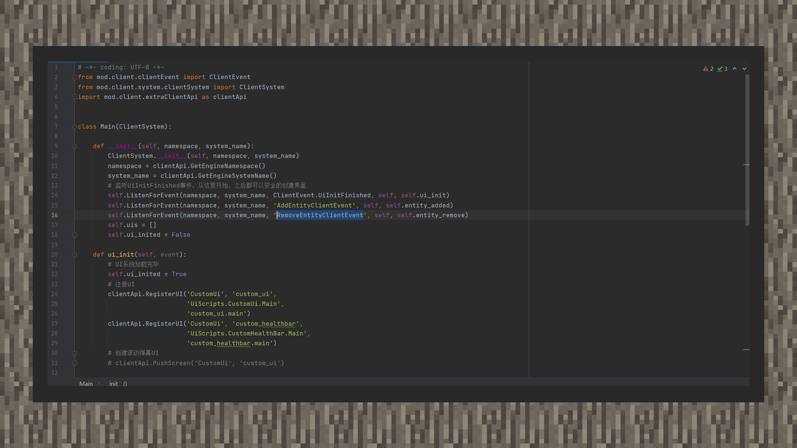
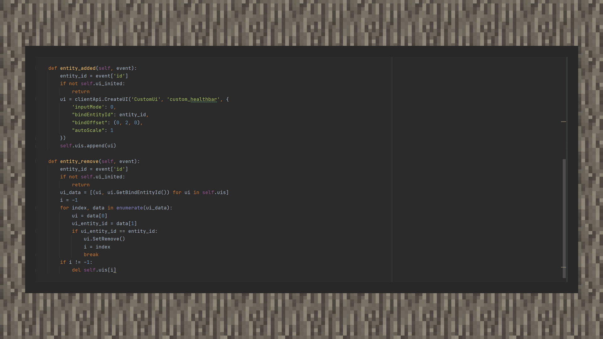
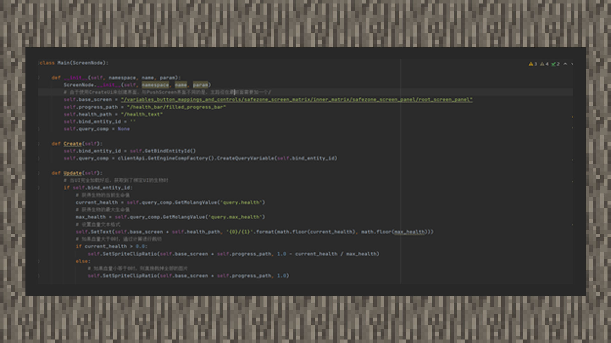

# 简易教程② 制作一个简易的生物血条

#### 作者：境界

生物血条示例包下载：下载[示例包](https://g79.gdl.netease.com/guidedemo-case16.zip) 。

#### 设计UI部分：

①在主节点下新建一个进度条控件，取名为health_bar。锚点设置为置中，并将长度设置为80像素，宽度设置为10像素。

②在主节点下新建一个文本控件，取名为health_text。锚点设置为置中，并将长度宽度设置为与health_bar相当，同时字号设置为8号，行间距设置为3。

#### 脚本代码部分：

重写UI类的Create方法和Update方法，当UI每一游戏刻更新时，都会调用Update方法，我们在里面使用一个小技巧，通过query函数表可知，query.health会返回生物的生命值，而query.max_health会返回生物的最大生命值。往常处理时，获取生物的血量需要通过服务端获取，而使用GetMolangValue接口可以在客户端获取生物的血量信息。我们在这里更新血量的数值和进度条的裁切程度。

而在客户端系统上，我们通过在UiInitFinish事件里，添加一个实例变量来确保从这之后开始，在AddEntityClientEvent事件里才能为其他实体生物绑定UI。在RemoveEntityClientEvent里移除UI。