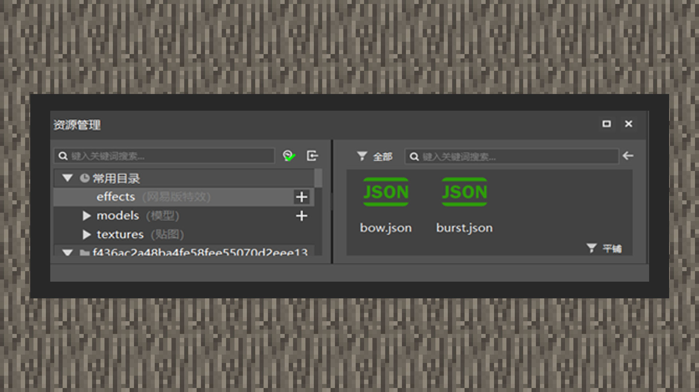
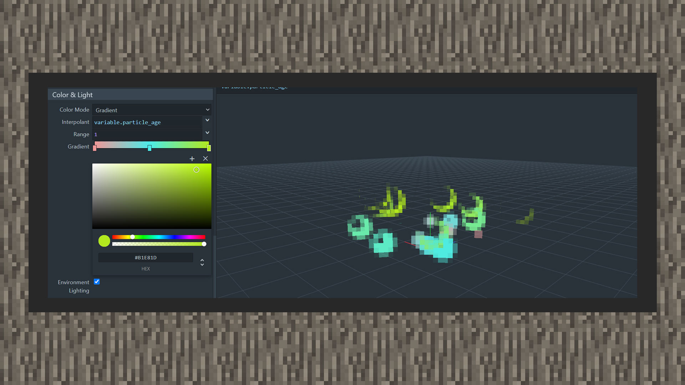
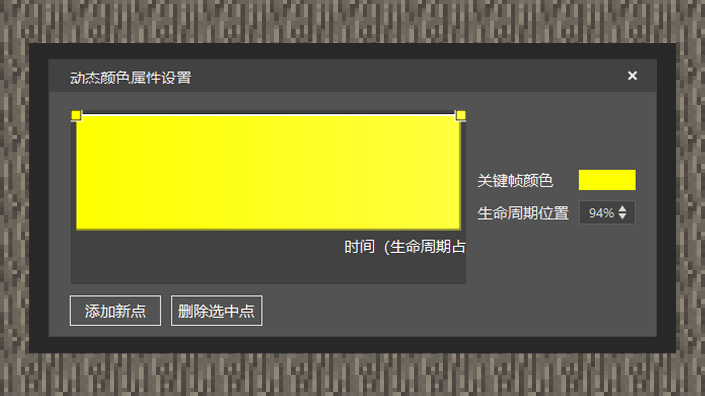
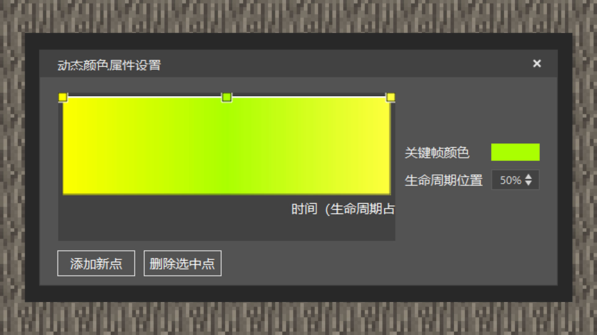

# 渲染粒子和着色

 

#### 作者：境界

 

#### 原版粒子渲染教程

#### 设置贴图纹理

1）进入[https://jannisx11.github.io/snowstorm/](https://jannisx11.github.io/snowstorm/)，下拉到texture（贴图纹理）。选择文件选择原版贴图粒子，它位于原版材质包/textures/particle的particles文件。由于原版粒子贴图是一张集合贴图，它将多种粒子集合在一张图片文件中，里面既有单张粒子纹理也有连续性多张粒子纹理的序列帧，每单张粒子纹理是8x8的尺寸。我们将贴图尺寸（texture size）设置为128x128，与硬盘中的贴图文件像素匹配。UV起点是以左上角的点为起点，我们将Y轴向下移动24格像素，x轴不变，接着将uv尺寸设置为8x8，这样粒子纹理就锁定在了火焰粒子上。

2）使用序列帧纹理时，需要将uv mode（贴图模式）改成animated（动态式），则在uv尺寸下会新增uv step（uv步进）、fps（一秒内播放几帧）、max frame（最大序列帧数）、stretch to life time（序列帧数匹配粒子持续时间）、loop（循环播放序列帧）等参数。

以原版粒子贴图倒数第6列的爆炸序列帧为例，从左往右数一共有16张连续性的贴图纹理，因此最大序列帧数应设为16，fps设置为可以被16整除的数值，如2就是一秒播放2帧、16就是一秒内播放完16帧。uv步进设置为8x0，即每一帧结束时，uv向右增加8个像素点，开始播放下一帧，粒子会在帧数到尾时回到第一帧。

stretch to life time一旦打勾选取，则会让序列帧数匹配粒子生命周期且无视fps，如粒子生命周期时长为1秒，则序列帧会在1秒内播放16帧，如果生命周期为0.5秒，则会在0.5秒内播放完16帧，FPS等于1秒播放32帧。

loop参数勾选可以循环播放序列帧，直到发射器被游戏清理为止。

#### 特效粒子教程

#### 设置贴图纹理

1）进入MCSTUDIO，可以在新建入口快速创建特效制作模板，创建好进入编辑器后，页面会自动划转到特效编辑器。

2）在页面下方中央的资源入口列表里，选择effects（网易版特效）选项的+号键，可以选择创建粒子或是创建序列帧，取决于届时开发者制作自定义特效时所用到的贴图纹理类型。在教程里，我们创建一个粒子特效。

3）在资源管理入口点击一次特效json文件，将粒子贴图拖拉进名为贴图的入口，粒子带有默认的位移和生命周期，为了马上看到效果，可以在属性-预览设置里将右侧面板切换到预览设置中。在场景特效内点击“+”号，默认设置都不用改动，在特效选项选择之前创建好的粒子，开发者便能看到特效在世界中的变化了。

 

#### 原版粒子着色教程

#### 设置颜色

1）点击color&light（颜色和光照）面板，拖动下方第一格滑轨来调整颜色色相，拖动第二条滑轨设置颜色透明度，点选颜色调盘选取颜色。

2）若有提前选好的颜色，可以直接在下方输入口输入颜色代码。

3）若希望粒子颜色受到光照影响，即会随着游戏内天亮天黑而增强&衰弱颜色。若不勾选，粒子颜色在黑夜或白天都会显示原来的颜色。

4）若想要设置动态颜色，需要将color mode（颜色模式）设置为渐变（Gradient），在Interpolant插值窗口输入variable.particle_age，将range调整为1，可以让粒子在渐变颜色选区中播放完所有的颜色。

#### 特效粒子渲染教程

#### 设置颜色

1） 点击粒子的属性面板，划到动态属性折叠窗口内，选择动态颜色。若只想着一种颜色，可将左右两点选择相同的颜色。

2） 若想要多种颜色，可以选择插入关键帧选取点，在每个选取点上选择需要的颜色。

3）选取点拉得越高，越不透明，拉得越低，透明度越低。

