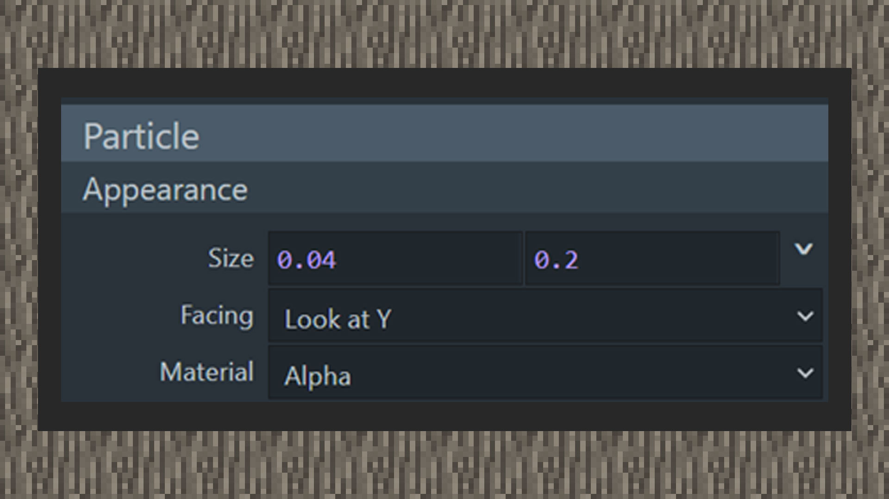

# 让粒子动起来

 

#### 作者：境界

 

#### 雨水粒子教程

 

#### 制造位移

1） 选择方型粒子发射器，将方形发射器的形状调整为8,0,8，同时将粒子发射器高度便宜到10格。

2） 制作一个只有1格像素点的贴图，并将它作为粒子贴图纹理，用颜色叠加叠加上蓝色。

3） 叠加一个蓝色颜色后，粒子变为蓝色，并将粒子大小调整为宽比长大，拉出一条下落蓝色直线。将朝向设置为朝向地面，材质保留为带有透明通道的默认设定。

4） 提高粒子的生命周期时长，给予加速度中填写0，-4，0，提供一个向y轴下方移动的加速度，这样粒子就实现好了。

