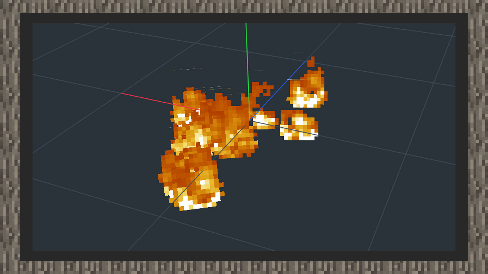
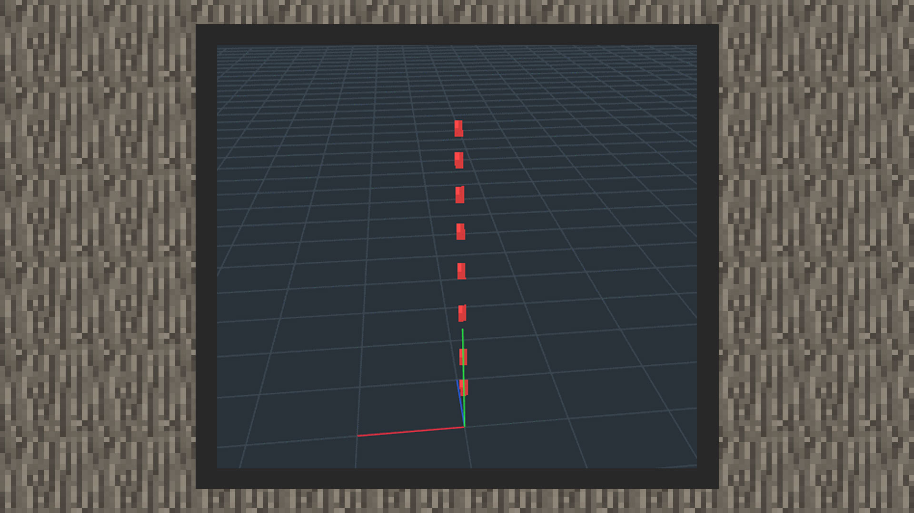

# 简易教学

 

### 作者：境界

 

### 简易教学① ：制作火焰蔓延粒子

1）首先打开snowstorm编辑器，定义一个粒子的名称域，格式与物品、方块、生物等大同小异，以命名空间：名称为格式。

2）Texture选择原版的火焰序列帧贴图，路径位于原版材质包的textures/flame_atlas.png。将UV MODE设置为animate，贴图大小设置为16x512，uv start设置为0x0，uv size设置为16x16，uv step设置为0x16，FPS设置为32，勾选stretch to lifetime。

3）打开Rate发射频率面板，相当于MCSTUDIO的特效编辑器的粒子发射频率，选择Steady模式，将发射率设置为10，最大值为20。

4）Emitter Lifetime内将循环模式设置为once（只播放一次），其余设定不变。

5）emitter shape设置不变。

6）将Apperance内的size（粒子大小）设置为合适大小，朝向方式设置为lookat xyz，材质设置为透明材质（alpha）。

7）Motion内将speed设置为1.0。

#### 效果图如下：

#### 简易教学② ：制作岩浆滴落粒子

1）首先打开snowstorm编辑器，定义一个粒子的名称域，格式与物品、方块、生物等大同小异，以命名空间：名称为格式。

2）Texture选择原版的粒子集合贴图，路径位于原版材质包的textures/particle/particles.png。将UV MODE设置为static，贴图大小设置为128x128，uv start设置为8x56，uv size设置为8x8。

3）打开Rate发射频率面板，相当于MCSTUDIO的特效编辑器的粒子发射频率，选择Steady模式，将发射率设置为10，最大值为20。

4）Emitter Lifetime内将循环模式设置为once（只播放一次），其余设定不变。

5）emitter shape使用默认的点形，并将发射器偏移Y轴高度到4格位置上。

6）将Apperance内的size（粒子大小）设置为0.15x0.3，拉长粒子贴图，朝向方式设置为lookat xyz，材质设置为透明材质。

7）Motion内将acceleration的y轴加速度设置为-3，让粒子向下飞行。

8）点开collision面板，勾选expire on contact，使粒子在与地面接触后消失。

#### 效果图如下：

