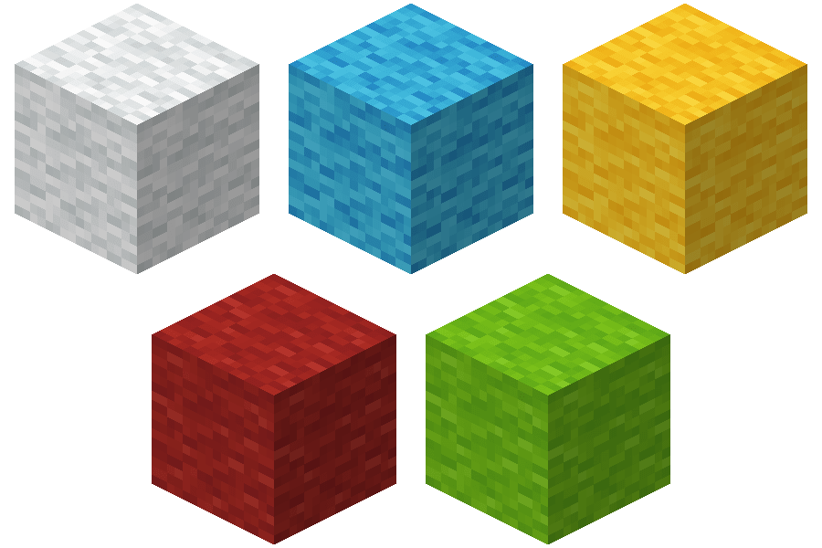
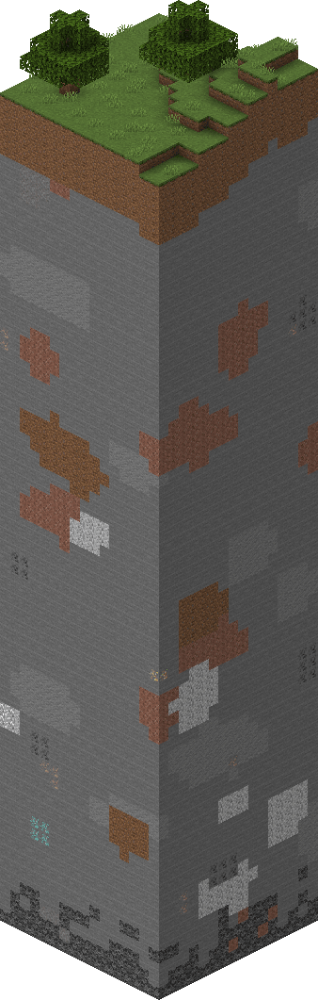

# 区块、世界和存档

在本节中，我们将一起了解我的世界中一个世界的组成方式。

## 世界和存档

在我的世界中，**世界**（**World**）是玩家最主要的游玩场所。一个世界便是玩家进入游戏后所观察到一切事物的总和。丰富多彩的群系，林林总总的生物和各式各样的地形与组成地形的方块，都是这个世界的一部分。对于每一个世界，我们都有一个**存档**（**Level**）来储存它。存档是一个世界的文件记录，它通常是以一个文件夹的形式而存在的。在游戏选择世界的界面上，我们能看到我们创建过、游玩过的的各式各样的存档。这其中每一个条目都是代表着一个存档，同时也是一个可以供我们选择进入的世界

在我们进入世界后，我们最先接触到的便是**方块**（**Block**）了。由于世界约等于是无限大的，所以方块也可以认为是无限多的。一个方块便是在游戏中以1m³为单位的一个块状物体。有的方块可以充斥这个1m³的空间，我们称作完整方块；有的则更小一些，形状也多样一些，这些都是不完整方块；开发者还可以通过自定义方块定义出超过该空间大小的方块。方块组成了这个世界的基本形状，配合以生物群系和各种生物，使得这个世界更加多彩。

## 区块

世界在横向上非常广大，为了使世界与世界之间不出现重复，游戏使用**种子**（**Seed**）来配合生成世界。每一个种子都将对世界生成器造成随机的影响，使得每一个世界的每一个相同的位置都会出现不同的结果。再加之以玩家后续在世界中还会进行各种建筑、开采和改造，我们便需要一种存储方式来将这种不同存储在存档中。**区块**（**Chunk**）应运而生。

区块是一个尺寸为16×256×16个方块的集合。由于在我的世界的坐标中，x坐标和z坐标代表长宽，y坐标代表高度。所以我们可以看到区块其实是一个竖长条的长方体。而一个存档，便是由一个个区块并排横向排列的一个二维地图。

区块又由一个个的**子区块**（**Subchunk**）组成，每个子区块是一个16×16×16个方块的立方体。所以一个区块事实上是由16个子区块自下而上排列而成的。我的世界中很多游戏机制都是以区块或者子区块为单位的，更多的信息可以参考[Minecraft Wiki上的区块页面](https://zh.minecraft.wiki/w/%E5%8C%BA%E5%9D%97)。