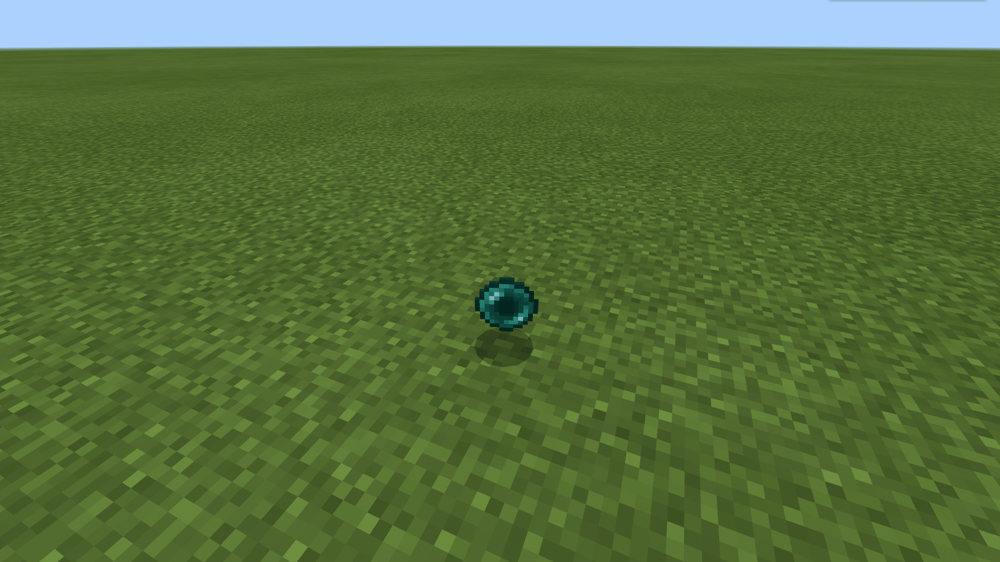

# 方块、物品和物品实体

在本节中，我们将一起进一步学习方块，学习物品和物品实体的区别。

## 方块

**方块**（**Block**，又称作**Tile**）是世界的基本组成单位，是玩家和这个世界交互的重要途径。方块可以被玩家拿在物品栏里，也可以被放置在世界中。当方块被放置在世界中时，大部分方块将在世界中占据一个块状的位置，阻止玩家和其他生物从此处通过，这被称作方块的**碰撞箱**（**Collision Box**）。并非所有的方块都有碰撞箱，如草、告示牌和火把都没有碰撞箱，玩家可以直接从其中穿过。

有些方块具有发光的能力，会使周围的亮度大为提升，如火把和荧石。而有些方块则会阻挡光的前进，减少或消除光照的等级，如会完全阻挡光线的石头和会部分阻挡光线的冰。不同光照属性的方块使世界中的**亮度**（**Lighting**）系统丰富多彩。

方块有着不同的**材料**（**Material**）和**形状**（**Shape**）。方块的材料决定了其固液性质、开采性质和在地图上的颜色表现，而方块的形状则决定了其碰撞箱的造型、视觉的形状和渲染效果。

水和岩浆等方块属于**液体**（**Liquid**），他们也是方块的一种。只不过，他们有着一种特殊的传播方式。水和岩浆的流动本质上属于在其周围特定的位置放置一个新的方块，只不过新方块的碰撞体积会表现得要么更小一些（向四周流动），要么是整个方块（向下流动）。

## 物品

**物品**（**Item**，又称作**Icon**）是出现在玩家或其他实体的手上或物品栏中的物体。物品往往具有一些和方块或实体的交互性。例如，拿着名为剪刀的物品对着绵羊按下使用键，就可以将绵羊身上的毛剪落。有一些物品的图标是一个方块，放置后也可以在世界上生成一个方块，这种物品便是**方块物品**（**Block Item**），方块被破坏后被玩家收集到物品栏中的便是方块物品。广义上讲，方块物品也是物品的一种，只不过他们都是和方块一一对应的，因此大部分人也不区分方块物品和方块的关系，将其混淆使用，统一称呼为方块。此时，剩下的非方块物品便被称呼为狭义的物品。

很多物品可被**堆叠**（**Stack**）。堆叠后的物品会在物品的右下角显示一个数字，代表其目前的堆叠数目。有些物品可以被使用，使用后往往会减少其堆叠数目。但是，有一类特殊的物品的使用并不会减少堆叠数目，相反，他们会损失一种被称作**耐久**（**Durability**）的属性，这种特殊的物品往往是一种**武器**（**Weapon**）、**工具**（**Tool**）或**盔甲**（**Armor**）。当然，一般来说，这种特殊物品的最大堆叠数目是1，不过他们却可以使用相当多的次数而不消失。

## 物品实体

**物品实体**（**Item Entity**）其实便是我们常说的**掉落物**（**Drop Item**）。破坏方块、击杀生物都有可能会产生掉落物，即物品实体。顾名思义，物品实体本质上是一种实体，但是其被渲染成了一个或一组物品的样子，并且可以自动与玩家交互——被靠近的玩家拾获。所以物品实体其实并不是物品，只不过他们存储了物品的数据，拥有物品的外观，并且可以在被玩家拾获变成玩家物品栏内的物品。

为了使大家对概念更加地明晰，我们可以考虑如下场景：世界中存在一个草方块，它是一个方块。我破坏了草方块，他掉落了一块泥土，这个泥土其实是一个物品实体。更精确地说，它是一个方块物品的物品实体。我拾起了泥土，它变成了我物品栏中真真正正的物品。不过，这个物品是一个方块物品。在我对着地面放置这个物品后，它再次变成了方块，变成了世界中某处的一个泥土方块。