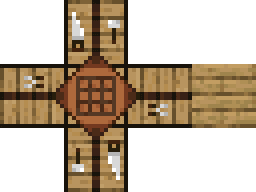

# 模型、纹理和动画

在本节中，我们将一起学习我的世界中的模型，了解模型的本质和分类。进一步了解纹理和动画对于模型的依赖性和重要性。

## 模型

在我的世界中，不论是方块、物品还是实体，他们本质上都是由一些具有体积的更基础的元素构成的，比如，绵羊是由头部的长方体、身体的长方体和四个代表着四肢的竖直长方体构成的。我们通常将这种具有一定体积的一个由多种基本元素构成的几何形状称为一个**模型**（**Model**）。

在我的世界中，每种生物由具备一个模型。我们可以轻松地在游戏中通过观察看出每种生物模型的形状。每种方块也有一个应用在它身上的模型，不过在游戏中，很多方块可能会共用一个模型。比如全体的1×1×1的完整方块，他们共用一个被称作`block`的模型，代表着标准正方体。

开发者也可以在自己的模组中自定义生物和方块的模型。我的世界中国版支持两种模型格式，一种是微软开发支持的**原版模型**格式，使用该格式编写的模型作品被称为**几何**（**Geometry**），另一种是网易开发支持的**骨骼模型**格式，使用该格式得到的作品被称作**骨架**（**Skeleton**）。在我的世界开发工作台中，我们可以通过外部文件导入这两种模型。根据这两种模型的制作工具和格式的不同，又分别称作**BlockBench模型**（`*.bbmodel`）和**FBX模型**(`*.fbx`)。

### 原版模型

**原版模型**本质上是一个按照国际版的[几何JSON模式（Geometry JSON Schema）](https://docs.microsoft.com/en-us/minecraft/creator/reference/content/schemasreference/schemas/minecraftschema_geometry_1.16.0)编写的JSON文件。开发者可以使用低多边形风格的编辑器Blockbench中可以通过可视化编辑的形式来创建原版模型几何，然后通过我的世界开发工作台导入到模组中。在下一章中我们将重点介绍该编辑器的使用方法。

原版模型可以直接挂接在实体上，稍加修改后也可以挂接到方块上，为我们自定义模型提供了很大的便利。通过挂接在**附着物**（**Attachable**，***挂件***）上后，还可以通过和物品配合实现3D物品模型的制作。但是，原版模型也有相当大的缺点。最重要的一点就是原版模型只支持低多边形风格，即我们俗称的方块像素风格。这导致我们最多实现至四边形网格，而无法实现曲线和曲面。同时，由于模型的局限性，我们也无法在原版模型的基础上实现动态的纹理。因此，通过网易开发组的努力，我们实现了骨骼模型的支持。

### 骨骼模型

**骨骼模型**本质上也是一个JSON文件，但是它是可以由FBX格式文件导入而生成的，因此具备几乎所有原FBX模型的性质。因此，骨骼模型支持各种高级的模型特性，比如可以创造曲线和曲面。同时，由于我的世界中国版的支持，骨骼模型还可以加载模型贴图序列帧动画、绑定各种高级特效，从而使模组玩法和外观更加丰富。

不管是原版模型还是骨骼模型，模型中的基本部件都被称作是一个**骨骼**（**Bone**）。每个骨骼有着自己特定的形状和位置，而骨骼与骨骼之间又相对独立，这有助于模型更好地完成预期的操作。

## 纹理

**纹理**（**Texture**，旧译**材质**）是指覆盖在模型上的一层贴图文件，也是我们在游戏中最能直观感受到的一个事物。不管是方块、物品还是实体，他们都是以特定的纹理展示到玩家的镜头前的。比如，在工作台方块上，我们看到工作台顶部有一块桌布，桌布上有一个3×3网格，而侧面则摆放着锯子、齿轮等工具。这些外观贴图其实就是纹理，而工作台本身就是在一个1×1×1的立方体模型的6个面上分别贴上了特定的纹理而得到的方块。实体亦然，只不过由于实体的模型较为复杂，我们看到的纹理贴图也稍微有些复杂。

## 动画

一个模型如果仅仅是一个模型，那么它便只能是静态的，好似一个假人。为了让模型更加逼真，实现各种运动或姿态的需要，**动画**（**Animation**）是必不可缺的一部分。一个动画就是一个和模型中的各个骨骼相绑定，然后通过**动画控制器**（**Animation Controller**）来使各个骨骼进行相对运动的过程。玩家的奔跑，生物的攻击，鱼儿的游泳，乃至潜影贝盖子旋转打开，这些都是动画。有了动画，我们的游戏内容才会更加生动形象。

潜影贝的动画行为，其中盖子旋转打开时，盖子所对应的骨骼进行了旋转变换和平移变换：

动画并不是实体独有的，只要游戏引擎支持，所有的模型都可以配以动画。比如，通过中国版的自定义方块实体功能，便可以为方块模型添加动画，以达到和实体模型动画相同的效果。

## 序列帧动画

在我的世界中一提到动画，人们往往想起的是“模型的动画”，也就是我们刚才介绍的动画。但是，还有一种“动画”存在于游戏中，它便是**序列帧动画**（**Frame Animation**）。序列帧动画是一种“纹理的动画”，又称**逐帧动画**，其原理是在“连续的关键帧”中分解动画动作，在时间轴的每帧上逐帧绘制不同的内容，使其连续播放而成动画。所以，这种动画非常类似于我们小时候玩的翻页书，在微软的开发文档中又称作**翻书动画**（**Flipbook Animation**）。大家口中经常说的动态纹理或动态贴图，便是指的序列帧动画。