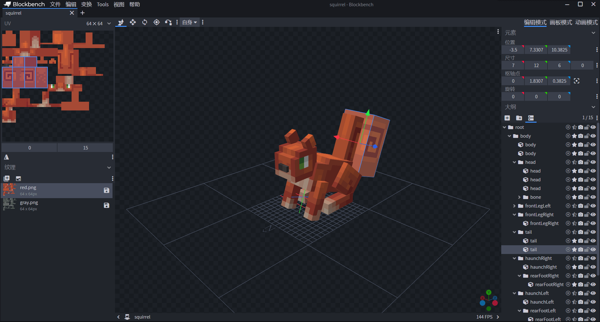
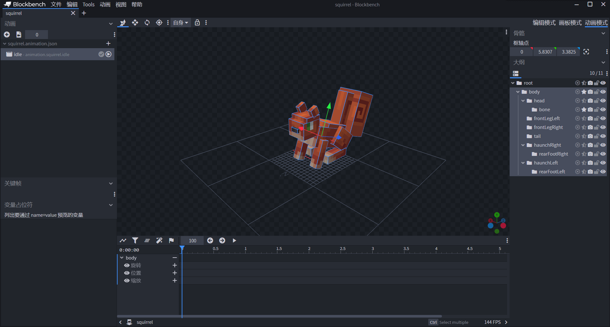
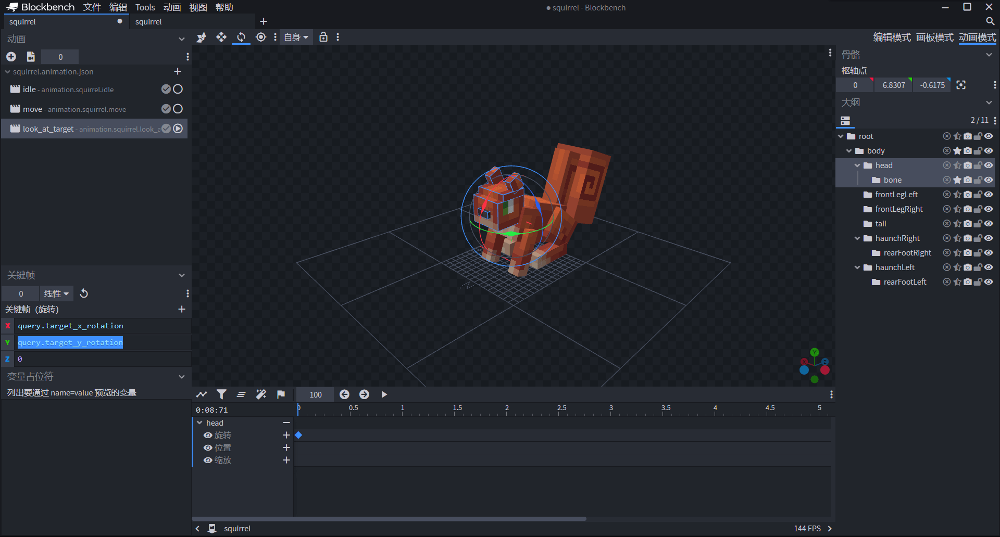

# 自定义松鼠实体资源

在本节中，我们将一起完成松鼠的资源部分。有关[松鼠模型](https://g79.gdl.netease.com/addonguide-12.zip)的资源可以点击链接下载。

## 挂接几何体和贴图纹理资源

类似以第八章中的步骤，我们在Blockbench中创建松鼠模型的几何和纹理。



在这里，我们创建了一个松鼠的几何，同时为这个几何创建了两套纹理，一套红色纹理，一套灰色纹理。我们希望在世界中生成的有些松鼠是红色松鼠，有些松鼠是灰色松鼠，因此两套纹理便可以满足我们的需求。

我们将松鼠的几何`squirrel.geo.json`导出到资源包的`models\entity`文件夹下，将纹理`red.png`和`gray.png`分别导出到资源包的`textures\entity\squirrel`文件夹下。我们展示一下松鼠导出的几何JSON文件：

```json
{
  "format_version": "1.12.0",
  "minecraft:geometry": [
    {
      "description": {
        "identifier": "geometry.squirrel",
        "texture_width": 64,
        "texture_height": 64,
        "visible_bounds_width": 4,
        "visible_bounds_height": 2,
        "visible_bounds_offset": [0, 1, 0]
      },
      "bones": [
        {
          "name": "root",
          "pivot": [0, 7, 3],
          "rotation": [-20, 0, 0],
          "mirror": true
        },
        {
          "name": "body",
          "parent": "root",
          "pivot": [0, 5.83072, 3.3825],
          "cubes": [
            {"origin": [-3, 8.83072, 1.3825], "size": [6, 1, 7], "uv": [22, 0]},
            {"origin": [-3, 3.83072, -1.6175], "size": [6, 5, 10], "uv": [0, 0]}
          ]
        },
        {
          "name": "head",
          "parent": "body",
          "pivot": [0, 6.83072, -0.6175],
          "rotation": [20, 0, 0],
          "mirror": true,
          "cubes": [
            {"origin": [-2.5, 6.83072, -5.6175], "size": [5, 4, 5], "uv": [26, 26], "mirror": false},
            {"origin": [-2.5, 10.83072, -4.6175], "size": [5, 1, 4], "uv": [40, 21], "mirror": false},
            {"origin": [-1, 8.33072, -6.1175], "size": [2, 1, 1], "uv": [0, 19], "mirror": false}
          ]
        },
        {
          "name": "bone",
          "parent": "head",
          "pivot": [0, 11.83072, -1.6175],
          "rotation": [25, 0, 0],
          "cubes": [
            {"origin": [-2.5, 11.83072, -2.6175], "size": [1, 2, 2], "uv": [0, 15]},
            {"origin": [1.5, 11.83072, -2.6175], "size": [1, 2, 2], "uv": [0, 15], "mirror": true}
          ]
        },
        {
          "name": "frontLegLeft",
          "parent": "body",
          "pivot": [-3, 5.83072, 0.3825],
          "mirror": true,
          "cubes": [
            {"origin": [-4, -1.16928, -0.6175], "size": [2, 7, 2], "uv": [0, 44], "mirror": false}
          ]
        },
        {
          "name": "frontLegRight",
          "parent": "body",
          "pivot": [3, 5.83072, 0.3825],
          "mirror": true,
          "cubes": [
            {"origin": [2, -1.16928, -0.6175], "size": [2, 7, 2], "uv": [0, 44]}
          ]
        },
        {
          "name": "tail",
          "parent": "body",
          "pivot": [0, 5.83072, 7.3825],
          "mirror": true,
          "cubes": [
            {"origin": [-1.5, 4.33072, 7.3825], "size": [3, 14, 3], "uv": [32, 8], "mirror": false},
            {"origin": [-3.5, 7.33072, 10.3825], "size": [7, 12, 6], "uv": [0, 15], "mirror": false}
          ]
        },
        {
          "name": "haunchRight",
          "parent": "body",
          "pivot": [3, 7.33072, 7.0825],
          "rotation": [-20, 0, 0],
          "mirror": true,
          "cubes": [
            {"origin": [-4, 3.92839, 4.80079], "size": [2, 5, 6], "uv": [0, 33], "mirror": false}
          ]
        },
        {
          "name": "rearFootRight",
          "parent": "haunchRight",
          "pivot": [0, 3.92839, 9.80079],
          "rotation": [40, 0, 0],
          "mirror": true,
          "cubes": [
            {"origin": [-4, 2.42839, 4.10079], "size": [2, 2, 7], "inflate": 0.05, "uv": [16, 35], "mirror": false}
          ]
        },
        {
          "name": "haunchLeft",
          "parent": "body",
          "pivot": [3, 7.33072, 7.0825],
          "rotation": [-20, 0, 0],
          "mirror": true,
          "cubes": [
            {"origin": [2, 3.92839, 4.80079], "size": [2, 5, 6], "uv": [0, 33]}
          ]
        },
        {
          "name": "rearFootLeft",
          "parent": "haunchLeft",
          "pivot": [0, 3.92839, 9.80079],
          "rotation": [40, 0, 0],
          "mirror": true,
          "cubes": [
            {"origin": [2, 2.42839, 4.10079], "size": [2, 2, 7], "inflate": 0.05, "uv": [16, 35]}
          ]
        }
      ]
    }
  ]
}
```

然后我们就可以开始在资源包定义中挂接几何和纹理了。

```json
{
  "format_version": "1.8.0",
  "minecraft:client_entity": {
    "description": {
      "identifier": "tutorial_demo:squirrel",
      "materials": {
        "default": "rabbit"
      },
      "textures": {
        "red": "textures/entity/squirrel/red",
        "gray": "textures/entity/squirrel/gray"
      },
      "geometry": {
        "default": "geometry.squirrel"
      },/*
      "animations": {
        
      },
      "animation_controllers": [
        
      ],
      "render_controllers": [
        
      ],
      "spawn_egg": {
        
      }*/
    }
  }
}
```

这样，我们的纹理和几何便挂接完毕了，接下来我们需要使用渲染控制器来将材质、纹理和几何应用到实体上，同时为红色和灰色纹理制作单独的变体渲染。

## 使用渲染控制器制作变体

我们在资源包的`render_controllers`文件夹中创建`squirrel.render_controllers.json`文件。然后在先其中写入我们的纹理数组、几何和材质。

```json
{
  "format_version": "1.8.0",
  "render_controllers": {
    "controller.render.squirrel": {
      "arrays": {
        "textures": {
          "Array.skins": [ 
        "Texture.red",
      "Texture.brown"
      ]
        }
      },
      "geometry": "Geometry.default",
      "materials": [ { "*": "Material.default" } ],
      "textures": [
        // texture list
      ]
    }
  }
}
```

最重要的便是如何使用变体制作纹理。事实上，原版的兔子便提供了一种非常好的变体方案。那便是在行为包定义中使用`minecraft:variant`组件。`minecraft:variant`组件只接受一个整数值，这个值可以作为实体的“变体ID”，从而定义实体的一个**变体**（**Variant**）。而实体的变体ID又可以通过Molang查询函数`query.variant`在客户端得到。所以我们可以使用该ID来引用纹理数组。我们假设我们已经在行为包中定义了红色的变体ID是0，灰色的变体ID是1，这是和我们的纹理数组索引相一致的定义。这样我们就可以使用`Array.skins[query.variant]`这样的Molang表达式来做到实时根据变体来变换纹理。补全的控制器如下：

```json
{
  "format_version": "1.8.0",
  "render_controllers": {
    "controller.render.squirrel": {
      "arrays": {
        "textures": {
          "Array.skins": [ 
            "Texture.red",
            "Texture.gray"
          ]
        }
      },
      "geometry": "Geometry.default",
      "materials": [ { "*": "Material.default" } ],
      "textures": [
        "Array.skins[query.variant]"
      ]
    }
  }
}
```

我们将该控制器定义到实体资源包定义文件中，得到如下定义文件：

```json
{
  "format_version": "1.8.0",
  "minecraft:client_entity": {
    "description": {
      "identifier": "tutorial_demo:squirrel",
      "materials": {
        "default": "rabbit"
      },
      "textures": {
        "red": "textures/entity/squirrel/red",
        "gray": "textures/entity/squirrel/gray"
      },
      "geometry": {
        "default": "geometry.squirrel"
      },/*
      "animations": {
        
      },
      "animation_controllers": [
        
      ],*/
      "render_controllers": [
        "controller.render.squirrel"
      ],/*
      "spawn_egg": {
        
      }*/
    }
  }
}
```

## 自定义实体蛋贴图

接下来我们自定义实体的刷怪蛋贴图。我们可以仿照之前水鸭的定义，通过两个颜色**基色**（**Base Color**）和**覆盖色**（**Overlay Color**）来来定义刷怪蛋的颜色。颜色使用的是16进制颜色码。开发者可以使用网上很多公开的颜色预览软件来预览颜色并使用。我们也可以使用Blockbench的Minecraft Entity Wizard插件来快速预览，这是一种取巧的办法。


我们将刷怪蛋颜色添加到客户端定义文件中：

```json
{
  "format_version": "1.8.0",
  "minecraft:client_entity": {
    "description": {
      "identifier": "tutorial_demo:squirrel",
      "materials": {
        "default": "rabbit"
      },
      "textures": {
        "red": "textures/entity/squirrel/red",
        "gray": "textures/entity/squirrel/gray"
      },
      "geometry": {
        "default": "geometry.squirrel"
      },/*
      "animations": {
        
      },
      "animation_controllers": [
        
      ],*/
      "render_controllers": [
        "controller.render.squirrel"
      ],
      "spawn_egg": {
        "base_color":"#1778D2",
        "overlay_color":"#1778D2"
      }
    }
  }
}
```


至此，我们初步制作了一个“不会动”的松鼠。我们可以先进入游戏自测来查看这个松鼠的渲染情况了。接下来，我们为松鼠制作动画。由于我们还没有为松鼠定义行为，因此我们的动画目前还不能在游戏中预览，因此我们打算采用Blockbench可视化地制作动画。

## 利用Molang制作闲置动画


我们再次打开我们之前制作的松鼠模型的Blockbench项目文件。点击右上角的“**动画模式**”进入动画制作模式。


我们可以看到，整个界面的各个窗格发生了改变。左侧原来是纹理贴图的窗格变为了“**动画**”窗格，这里存放着我们为该实体添加的动画。动画窗格的下方是“**关键帧**”窗格和“**变量占位符**”窗格。关键帧窗格将显示当前通道当前关键帧的各个轴向的值。而变量占位符则是用于定义一些只有在游戏内才能获取的变量或查询的“占位”值。因为这些变量或查询是需要在游戏中有上下文的，而在Blockbench中是没有值的。为了预览效果，我们需要在这里给他们定义值。最下方是动画的**时间轴**，我们可以通过时间轴进行调整时间、预览动画等操作。


我们在动画窗格中右键，点击“**添加动画**”。


然后将名称改为`animation.squirrel.idle`，循环改为“循环播放”。因为我们希望我们的`idle`动画在松鼠的闲置AI意向触发时持续播放，所以我们使用循环播放。这等价于在对应的JSON文件中为其添加`"loop": true`。这样我们就添加了一个新动画。


为了防止我们的制作成果丢失，我们先及时将其保存为JSON文件。点击文件上的保存按钮，并定位到我们的资源包中的`animations`文件夹中，然后在另存为对话框中点击“**保存(S)**”。


下面，我们开始制作待机动画。我们希望松鼠在待机时整体身子轻微前后移动。所以我们在右侧先选中`body`骨骼组。



我们可以看到，此时预览窗中`body`的轮廓已经显示出来了，同时下方时间轴中加入了`body`的三个通道。由于我们希望其仅仅是前后摇动，所以我们目前只关注“**旋转**”通道。


我们点击旋转通道右侧的“**+**”按钮，这个按钮可以在当前时间轴的位置上添加一个关键帧。由于我们的时间轴目前停留在`0.0`的初始位置，此时如果只在此处加入一个关键帧就相当于之前我们讲过的不使用关键帧的情形。其实这种情形就是等价于只在`0.0`处有一个关键帧。我们在这个关键帧中加入Molang表达式，同时由于这是循环动画，这样就能保证Molang表达式每帧进行运算并将每帧算出的不同的值应用到实体上，而实体就会根据Molang运算的结果进行移动。


加入关键帧后，我们可以在时间轴上发现一个菱形标记。这意味着一个关键帧。同时，我们可以在左侧“关键帧”窗格中看到当前的值。此时，松鼠上的坐标轴变为球形坐标轴。我们可以看到，我们希望的”前后摇摆“动画可以由球形坐标轴中红色代表的面进行旋转而得到。而我们又可以在“关键帧”窗格中定位到红色，这是X轴。所以我们在X轴上进行Molang撰写。事实上，X轴是模型空间的东西方向，所以X轴的垂面便是我们在预览窗中看到的红色的面。

那么，我们到底如何才能通过Molang实现身体随着时间的流逝前后摇摆呢？这需要通过Molang的查询函数`query.anim_time`来做到。`query.anim_time`是一个全局参数，代表着一个动画自开始播放以来过去的时间，单位为秒（s）。那么，我们来回忆，以时间为自变量，什么函数能够做到“来回摆动”呢？我们可能很快能想到单摆、弹簧、简谐运动。没错，我们只需要像简谐运动那样使用一个`cos`或`sin`函数来控制，就可以做到随着时间骨骼在一定方向上来回的摆动。

对于“旋转”通道来说，就是摆动的角度随着时间做简谐振动；对于“位置”通道来说，就是骨骼在某个轴向上的位移随着时间做简谐振动。简谐振动公式为：
$$
x=A\mathrm{cos}(\omega t+\varphi)+x_0
$$
其中，$A$为**振幅**，即摆动或振动的幅度，其值越大，骨骼就会“越摆”或者“越振”。$\omega$是振动的**角速度**或**角频率**，代表摆动或振动的快慢。$\varphi$代表振动的初相位，即在振动的一个循环中位于哪个初始位置。$x_0$代表初位移，一般来说，我们使用余弦函数时，不指定初相位的情况下，$t$为0时就会出现最后的计算值为1或者为其振幅$A$的情况，此时代表着动画从振动的一个端点开始，而非原点开始。如果我们希望动画从静止状态开始，即从原点开始，那么就必须令$x_0=-A$，比如，使用$x=A\mathrm{cos}(\omega t)-A$这种表达式。

在我的世界中，`query.anim_time`便代表时间$t$，我们使用`math.cos`来做到余弦函数的计算。比如，我们在Blockbench中使用这种表达：


这代表着$x=5\mathrm{cos}(450t)$。当然，其中的角速度450是我们摸索出来的比较合适的速度。你可以通过时间轴上的播放按钮来播放预览，然后根据自己的感觉再修改这里的值。


依据这个原理，我们为所有骨骼添加`0.0`的关键帧并在X轴向上添加简谐运动的动画。注意，为了保持所有的骨骼运动频率一致，我们需要所有骨骼全部使用相同的角速度，否则运动着运动着就会出现“四肢不协调”的丑态。


我们同时将其完成后的JSON展示如下：

```json
{
  "format_version": "1.8.0",
  "animations": {
    "animation.squirrel.idle": {
      "loop": true,
      "bones": {
        "tail": {
          "rotation": ["math.sin(query.anim_time * 450) * 15", 0, 0]
        },
        "head": {
          "rotation": ["math.sin(query.anim_time * 450) * 15", 0, 0]
        },
        "frontLegLeft": {
          "rotation": ["math.cos(query.anim_time * 450) * 65 - 65", 0, 0]
        },
        "frontLegRight": {
          "rotation": ["math.cos(query.anim_time * 450) * 45 - 45", 0, 0]
        },
        "body": {
          "rotation": ["math.cos(query.anim_time * 450) * 5", 0, 0]
        }
      }
    }
  }
}
```

事实上，在编辑动画的过程中，我们可以在时间轴中点击左上角的“切换图像编辑器”以打开函数图像视图。这个视图会渲染我们的Molang表达式所运算的函数图像，这将更有助于我们理解动画的过程。


而且，如果开发者有充足的数学功底，我们还可以使用多个简谐运动叠加成一个更复杂的运动，这被称为傅里叶级数的叠加。通过傅里叶叠加的运动将更加真实，不过，也将涉及到更多的数学技巧，所以这不属于我们今天的讨论范围。

## 利用Molang制作移动动画

移动动画和闲置动画原理是一致的，不过，除了各个骨骼的旋转之外，这里统控所有骨骼的`body`骨骼组需要进行一个平移。也就是说，我们需要修改`body`的位置通道。


由于我们是要前后移动，而X轴代表东西反向，也就是松鼠的左右，所以我们的X轴不懂，而其余两个轴以相同的频率前后或上下振动。


在整体平移的过程中我们再为其他各个骨骼添加同角频率旋转效果。因此，我们得到了一个移动的动画，我们命名为`move`并放置到同一个JSON文件中。


我们查看JSON文件中该动画的部：

```json
{
  "format_version": "1.8.0",
  "animations": {
    "animation.squirrel.idle": {
      // ...
    },
    "animation.squirrel.move": {
      "loop": true,
      "bones": {
        "body": {
          "position": [0, "math.cos(query.anim_time * 500) * -1.4 + 1.4", "math.cos(query.anim_time * 500) * 3 - 3"]
        },
        "head": {
          "rotation": ["math.sin(query.anim_time * 500) * 10", 0, 0]
        },
        "haunchLeft": {
          "rotation": ["math.cos(query.anim_time * 500) * -30 + 30", 0, 0]
        },
        "rearFootLeft": {
          "rotation": ["math.cos(query.anim_time * 500) * -15 + 15", 0, 0]
        },
        "frontLegLeft": {
          "rotation": ["math.cos(query.anim_time * 500) * 20 - 20", 0, 0]
        },
        "frontLegRight": {
          "rotation": ["math.cos(query.anim_time * 500) * 35 - 35", 0, 0]
        },
        "tail": {
          "rotation": ["math.sin(query.anim_time * 500) * 20", 0, 0]
        },
        "haunchRight": {
          "rotation": ["math.cos(query.anim_time * 500) * -35 + 35", 0, 0]
        },
        "rearFootRight": {
          "rotation": ["math.cos(query.anim_time * 500) * -17.5 + 17.5", 0, 0]
        }
      }
    }
  }
}
```

## 利用Molang制作头部旋转动画

我们知道，原版的很多实体在玩家靠近时都会看向玩家，这是由于实体具备看向玩家的AI意向同时具备一个`look_at_target`的动画配合完成的。那么，我们如何制作看向玩家的动画呢？这需要用到`query.target_x_rotation`和`query.target_y_rotation`。这两个Molang变量代表实体看向玩家旋转的角度，因此，我们只需要将实体的`head`骨骼的旋转通道设定为这两个查询函数即可。



```json
{
  "format_version": "1.8.0",
  "animations": {
    "animation.squirrel.idle": {
      // ...
    },
    "animation.squirrel.move": {
      // ...
    },
    "animation.squirrel.look_at_target": {
      "loop": true,
      "bones": {
        "head": {
          "rotation": ["query.target_x_rotation", "query.target_y_rotation", 0]
        }
      }
    }
  }
}
```

## 将动画挂接到实体上

由于`1.8.0`的实体客户端格式版本无法做到直接条件控制播放动画，我们使用动画控制器来控制动画的播放。我们在资源包的`animation_controllers`文件夹下新建一个`squirrel.animation_controllers.json`文件，用于控制实体的动画播放。

在编辑动画控制器之前，我们先定义动画的短名称到实体客户端定义文件中。

```json
{
  "format_version": "1.8.0",
  "minecraft:client_entity": {
    "description": {
      "identifier": "tutorial_demo:squirrel",
      "materials": {
        "default": "rabbit"
      },
      "textures": {
        "red": "textures/entity/squirrel/red",
        "gray": "textures/entity/squirrel/gray"
      },
      "geometry": {
        "default": "geometry.squirrel"
      },
      "animations": {
        "move": "animation.squirrel.move",
        "idle": "animation.squirrel.idle",
        "look_at_target": "animation.squirrel.look_at_target"
      },/*
      "animation_controllers": [
        
      ],*/
      "render_controllers": [
        "controller.render.squirrel"
      ],
      "spawn_egg": {
        "base_color":"#1778D2",
        "overlay_color":"#1778D2"
      }
    }
  }
}
```

然后我们便可以在动画控制器中写入动画的播放条件了，比如，我们按照如下格式来书写：

```json
{
  "format_version" : "1.10.0",
  "animation_controllers" : {
    "controller.animation.squirrel.general" : {
      "initial_state" : "default",
      "states" : {
        "default" : {
          "variables": {
            "move_speed": {
              "input": "query.modified_move_speed",
              "remap_curve": {
                "0.01": 0.0,
                "0.1": 1.0
              }
            },
            "is_idling": {
              "input": "query.modified_move_speed",
              "remap_curve": {
                "0.0": 1.0,
                "0.01": 0.0
              }
            }
          },
          "animations" : [
            {
              "idle" : "variable.is_idling && query.is_on_ground"
            },
            "look_at_target",
            {
              "move" : "!query.is_on_ground || variable.move_speed"
            }
          ]
        }
      }
    }
  }
}
```

其中`variables`字段用于定义后面可能会用到的变量。这里我们使用了`remap_curve`字段，即**曲线重映射**（**Curve Remap**）功能。根据`query.modified_move_speed`的值，当其在0.01到0.1之间变动时`variable.move_speed`将线性重映射到0.0至1.0之间，低于0.01则重映射到0.0，大于0.1将重映射到1.0；同时，当其在0.0到0.01之间变动时，`variable.is_idling`将线性重映射到1.0至0.0之间，当其大于0.01时将始终重映射到0.0。

`"idle" : "variable.is_idling && query.is_on_ground"`和`"move" : "!query.is_on_ground || variable.move_speed"`的意思便是冒号后面两个Molang表达式的值分别传入`idle`和`move`动画，作为`query.anim_time`的流逝速度取值来源。本来`query.anim_time`的取值来源是计算机的时间计时器流逝速度，但是一旦更改为我们修改过的速度，比如`!query.is_on_ground || variable.move_speed`，由于`||`的短路性，这便相当于`query.anim_time`变成了实体在生成后走过的实际距离，同时只有在实体离地时`query.anim_time`才会流逝。这是更加合理的。

我们将动画控制器也挂接在实体上：

```json
{
  "format_version": "1.8.0",
  "minecraft:client_entity": {
    "description": {
      "identifier": "tutorial_demo:squirrel",
      "materials": {
        "default": "rabbit"
      },
      "textures": {
        "red": "textures/entity/squirrel/red",
        "gray": "textures/entity/squirrel/gray"
      },
      "geometry": {
        "default": "geometry.squirrel"
      },
      "animations": {
        "move": "animation.squirrel.move",
        "idle": "animation.squirrel.idle",
        "look_at_target": "animation.squirrel.look_at_target"
      },
      "animation_controllers": [
        { "general": "controller.animation.squirrel.general" },
        { "move": "controller.animation.squirrel.move" }
      ],
      "render_controllers": [
        "controller.render.squirrel"
      ],
      "spawn_egg": {
        "base_color":"#1778D2",
        "overlay_color":"#1778D2"
      }
    }
  }
}
```

至此，我们完成了基本的资源控制，最后，为了后续讲述方便，我们再为实体添加一个功能。

## 为松鼠打开装备渲染

我们让松鼠具备穿戴**附着物**（**Attachable**，***挂件***）的功能，这样我们便可以在行为组件中使用装备组件为其添加装备，比如一个头盔。注意，各种装备的挂接骨骼名称都是硬编码的，比如头盔只能挂接在`head`骨骼上。如果你的实体几何中没有`head`骨骼，那么挂接了头盔的附着物也无法正常显示。

我们使用`enable_attachables`启用附着物：

```json
{
  "format_version": "1.8.0",
  "minecraft:client_entity": {
    "description": {
      "identifier": "tutorial_demo:squirrel",
      "materials": {
        "default": "rabbit"
      },
      "textures": {
        "red": "textures/entity/squirrel/red",
        "gray": "textures/entity/squirrel/gray"
      },
      "geometry": {
        "default": "geometry.squirrel"
      },
      "animations": {
        "move": "animation.squirrel.move",
        "idle": "animation.squirrel.idle",
        "look_at_target": "animation.common.look_at_target"
      },
      "animation_controllers": [
        { "general": "controller.animation.squirrel.general" }
      ],
      "render_controllers": [
        "controller.render.squirrel"
      ],
      "spawn_egg": {
        "base_color":"#1778D2",
        "overlay_color":"#1778D2"
      },
	  "enable_attachables": true
    }
  }
}
```

接下来，我们便需要将关注点从资源包转移到行为包了。毕竟，我们的松鼠目前还是没有任何行为，如同一个“呆鼠”，我们需要使用行为包为其赋予生命活力！
