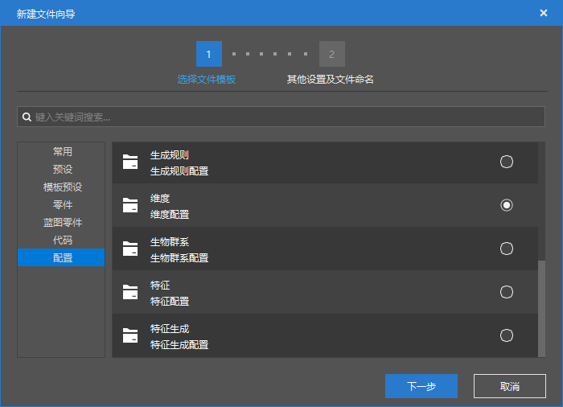
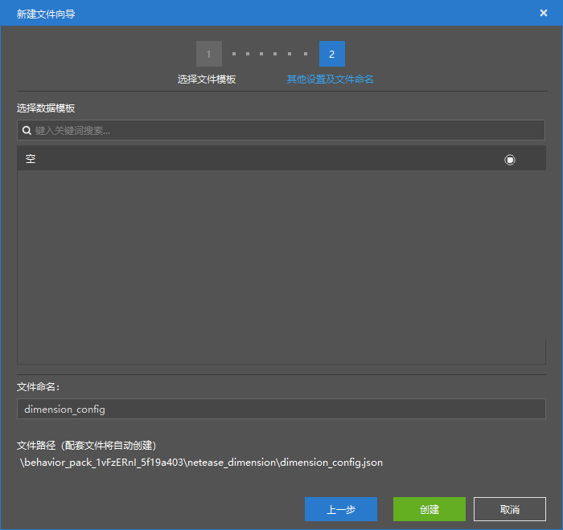
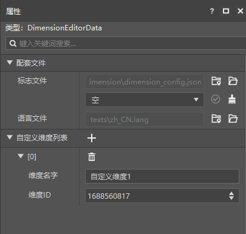

# 开始创建新维度

**维度**（**Dimension**）是世界中重要的组成部分。在一个世界中，我们往往存在多个维度。在原版游戏中，主世界、下界和末路之地便是三个原生的维度。每个维度的都是相互独立的，其中的玩家、实体、方块和各种逻辑都互不干涉。我们可以认为，一个维度便是一个独立的“世界”，而一个玩家可以通过种种方式在这些“世界”中进行穿梭跳跃，来回于不同的维度。

在模组开发中，如果开发者能够向游戏中新增一些新的自定义维度，那么模组的可玩性将大大增强。在本节中，我们就通过我的世界开发工作台的编辑器来新建一个维度。

## 使用编辑器配置新维度





我们打开编辑器，在创建配置中找到“**维度**”，即可创建一个**维度配置文件**（**Dimension Config File**）。这个文件将告诉编辑器和游戏我们的模组都自定义了哪些维度。



我们可以看到，这个维度配置文件中包含一个当前模组已创建的维度列表和**维度标识符**（**Dimension Identifier**，简称**维度ID**），列表中已经自动为我们创建了一个维度。我们可以通过修改维度名和维度ID来修改维度的信息。该文件的JSON内容如下：

```json
{
    "netease:dimension": {
        "modId": "tutorial_demo",
        "modDimensionId": [
            1688560817
        ]
    }
}
```

在编辑器中，我们每通过“+”按钮添加了一个维度，编辑器都会在行为包的`netease_dimension`文件夹中创建一个`dm<dimension id>.json`的文件，其中`<dimension id>`代表该维度的数字ID，比如上面的1688560817。编辑器在创建维度配置文件时会自动创建一个空白的维度文件，比如上面演示中编辑器就除了`dimension_config.json`文件之外还创建了一个`dm1688560817.json`文件。维度是使用一个数字ID作为其唯一标识符的，所以如果不同的模组使用了相同的数字ID，将会造成存档和生成器冲突。所以编辑器在创建维度时会尽可能随机生成一个维度ID。目前玩家可以自定义的维度ID区间为[22, 2147483647]。

类似于`dm1688560817.json`的文件是我们的**维度信息文件**（**Dimension Info File**）。每个维度信息文件都存储着一个维度必要的信息数据。维度的信息数据是使用组件的形式存储的。我们来看这里编辑器自动给我们生成的`dm1688560817.json`文件：

```json
{
    "format_version": "1.14.0",
    "netease:dimension_info": {
        "components": {
            "netease:dimension_type": "minecraft:overworld",
            "netease:generator_noise": {}
        }
    }
}
```

我们可以看到，格式版本为`1.14.0`，模式标识符为`netease:dimension_info`。在组件中，我们可以填写如下几种主要组件：

- `netease:dimension_type`：字符串类型，维度所继承的原版维度的类型。如果该文件正在修改的是原版维度，这个组件是无效的。这里可以填写`minecraft:overworld`、`minecraft:nether`或`minecraft:the_end`。
- `netease:generator_noise`、`netease:generator_flat`或`netease:generator_legacy`：空对象，世界**地形生成器**（**Terrain Generator**）的类型，分别是无限世界的噪声生成器、平坦世界的平坦生成器和旧世界的旧版生成器。对于三种生成器我们至多只能填写一个。如果该文件正在修改的是原版维度，该组件也是无效的。
- `netease:ban_vanilla_feature`：空对象，阻止原版特征（又译地物）的生成。如不欲阻止，则无需填写该对象。
- `netease:spawn_biomes`：字符串数组，该维度中允许玩家出生的生物群系的标识符列表。
- `netease:biome_source`：对象，用于定义该维度的**生物群系源**（**Biome Source**）。定义了生物群系源的维度将自动开启中国版自定义生物群系的生成流程，若没有定义生物群系源，则使用国际版原版依赖气候和噪声的生物群系生成流程。

目前世界的地形生成器只能定义使用原版的生成器，也就是上述列出的噪声、平坦和旧版生成器，尚不能自定义地形生成器，也不能进一步自定义基础地形生成器的噪声。不过，我们这里依旧稍微提点一下噪声生成地形的概念，方便各位开发者对维度有一个更深入的理解。

原版的地形是使用**噪声**（**Noise**）来生成的，特别地，使用的是分形的**Perlin噪声**（**Perlin Noise**，又译**柏林噪声**）。Perlin噪声的基本原理是利用在**格**（**Lattice**）上，也可以理解为在坐标系整数格点上，生成一系列随机数作为该点的**梯度**（**Gradient**）。然后在其他的点上分别使用邻近格点（二维为4个，三维为8个）上的梯度值来进行一个插值，得出一个噪声值。事实上，这里格的顶点不一定是整点，而是符合步长采样要求的点即可。而分形的Perlin噪声则利用了多个不同“采样”的噪声值叠加而到到最终值。分形过程中，会生成同一个种子下的多个单噪声，每个单噪声在生成时频率都为上一次的二倍，而振幅都为上一次的一半，因此，每个单噪声称为一个**倍频**（**Octave**）。最后所有的倍频叠加起来就是我们最终的噪声。

原版在生成基础地形时分别使用了一个三维噪声和一个二维噪声，三维噪声用于生成地形的竖直结构，而二维噪声又称**高度图噪声**（**Heightmap Noise**），用于生成地形的起伏。

事实上，噪声不仅用于基础地形的生成，生物群系映射、特征（又译地物）的生成也需要额外的噪声。虽然我们目前还不能自定义维度生成基础地形时的噪声算法，但是我们可以在接下来自定义生物群系或特征时自定义噪声的参数。

至此，我们成功自定义了一个维度。下一节中，我们将为其制作一个传送门方块，用于进入该维度。