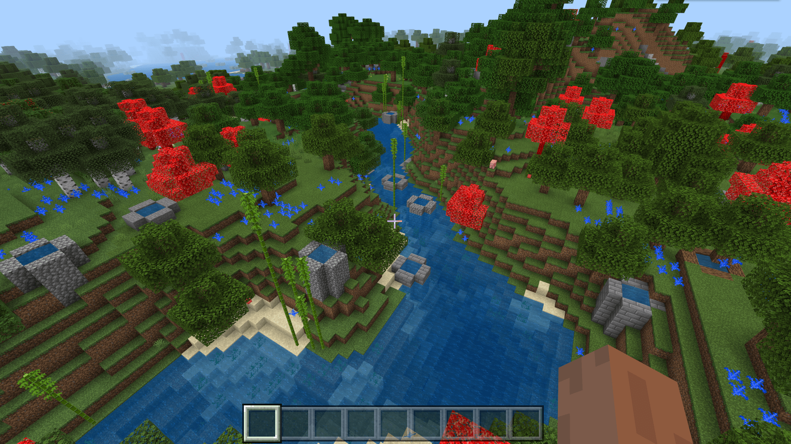

# 挑战：制作沿河畔生长的植物特征

在实践过程中，我们常常将特征分为多种类型。一般而言，我们可以将特征分为**内容特征**（**Content Feature**，又译**内容地物**）、**代理特征**（**Proxy Feature**，又译**代理地物**）、**场景特征**（**Scene Feature**，又译**场景地物**）和**雕刻器特征**（**Carver Feature**，又译**雕刻器地物**）。内容特征顾名思义是用于填充内容（方块）的特征，而代理特征也顾名思义是“代其他特征而理（放置）之”的特征，也就是说，代理特征往往是用于放置一个子特征的特征，只不过在放置之前往往会先执行一些逻辑。我们前面学习的结构特征、矿石特征、单方块特征和树特征都是内容特征，而散植特征、聚合特征、序列特征和随机加权特征都属于代理特征。通常而言，代理特征都是与内容特征相配合而放置的。这一节中，我们就将通过制作一个可以沿着河畔生成的竹子特征来加强内容特征与代理特征的学习。

## 制作设想

我们希望制作一种特征可以使竹子沿着河边生成。但是，依据我们目前所学习到的特征类型，如果单单只使用一种特征，这一设想可能会比较难以实现。我们希望能够使用一些代理特征配合一些内容特征来完成这一点。事实上，在这个过程中，我们只需要完成两个要点，第一个要点便是要寻找一个水方块，第二个要点是在该水方块相邻的固体方块，比如草方块上，分散放置一些我们的竹子。

第一个要点其实有两种实现方式，第一种便是使用搜索特征，当搜索特征在水平面上搜索时，搜索到第一个水方块便意味着这是一个邻岸的方块。第二种是在特征规则中进行多次迭代，总有一些迭代会选择到邻岸的水方块。但是，无论是第一种还是第二种方案，我们如何保证选出来的方块是水呢？这边需要单方块特征的附着和替换放置规则了。事实上，我们只需要制作一个“仅可以通过替换水而放置的水”单方块特征即可。这样的特征只要成功放置，则一定可以保证是放在了水里。但是，我们要注意一点。单方块特征自己替换自己并不能判定为成功，所以我们无法用水来替换水。不过，不知各位开发者们还记得我们在第五章最后一节中曾讲过的静止水和流动水吗？我们可以用流动水来替换静止水，来做到不改变原有的水同时成功替换到水。

第二个要点也比较简单，需要拆分成两点，其一是使用散植特征来放置我们的植物，第二是植物特征本身需要有其下必须是固体方块，比如草方块，的判定。这种判定往往也可以使用单方块特征的附着规则来实现。不过，幸运的是，我们目前还处于硬编码的竹子特征`minecraft:bamboo_feature`本身带有这种判定，我们便无需画蛇添足了。

我们选取第一个要点的第二种方案，同时配合二个要点的设想来制作一个特征层阶树：

```shell
特征规则
└─序列特征（代理）
   ├─水替换水特征（内容）
   └─散植竹子特征（代理）
      └─竹子特征（内容）
```

## 制作水替换水特征

我们新建一个`replace_water_feature.json`文件，内容如下：

```json
{
  "format_version": "1.13.0",
  "minecraft:single_block_feature": {
    "description": {
      "identifier": "tutorial_demo:replace_water_feature"
    },
	"places_block": "minecraft:flowing_water",
    "enforce_survivability_rules": false,
    "enforce_placement_rules": true,
	"may_replace": [
      "minecraft:water"
    ]
  }
}
```

## 制作散植竹子特征

我们创建一个`bamboo_scatter_feature.json`文件，内容如下：

```json
{
  "format_version": "1.13.0",
  "minecraft:scatter_feature": {
    "description": {
      "identifier": "tutorial_demo:bamboo_scatter_feature"
    },
    "places_feature": "minecraft:bamboo_feature",
    "iterations": 8,
    "scatter_chance": 100,
    "coordinate_eval_order": "zxy",
    "project_input_to_floor": true,
    "x": {
      "distribution": "uniform",
      "extent": [ -1, 1 ]
    },
    "y": "1",
    "z": {
      "distribution": "uniform",
      "extent": [ -1, 1 ]
    }
  }
}
```

注意，我们这里开启了`project_input_to_floor`，即将输入点投影到地板的功能。这代表着该散植特征的Y坐标能像特征规则中的`query.heightmap(variable.worldx, variable.worldz)`那样定位到地形的最上层。由于特征的作用域中无法访问`variable.worldx`和`variable.worldz`，所以`project_input_to_floor`也是一种非常常见的替代方案。

## 制作序列特征将它们连接在一起

我们创建一个`water_then_bamboo_scatter_feature.json`文件，内容填充如下：

```json
{
  "format_version": "1.13.0",
  "minecraft:sequence_feature": {
    "description": {
      "identifier": "tutorial_demo:water_then_bamboo_scatter_feature"
    },
    "features": [
      "tutorial_demo:replace_water_feature",
      "tutorial_demo:bamboo_scatter_feature"
    ]
  }
}
```

## 连接特征规则

最后，我们挂接特征规则。我们创建`overworld_bamboo_near_water_feature.json`文件：

```json
{
  "format_version": "1.13.0",
  "minecraft:feature_rules": {
    "description": {
      "identifier": "tutorial_demo:overworld_bamboo_near_water_feature",
      "places_feature": "tutorial_demo:water_then_bamboo_scatter_feature"
    },
    "conditions": {
      "placement_pass": "surface_pass",
      "minecraft:biome_filter": [
        {
          "any_of": [
            {
              "test": "has_biome_tag",
              "operator": "==",
              "value": "overworld"
            },
            {
              "test": "has_biome_tag",
              "operator": "==",
              "value": "overworld_generation"
            }
          ]
        }
      ]
    },
    "distribution": {
      "iterations": 20,
      "x": {
        "distribution": "uniform",
        "extent": [
          0,
          16
        ]
      },
      "y": "query.heightmap(variable.worldx, variable.worldz)-1",
      "z": {
        "distribution": "uniform",
        "extent": [
          0,
          16
        ]
      },
      "scatter_chance": 100
    }
  }
}
```



可以看到，竹子如期在河边生成了！
