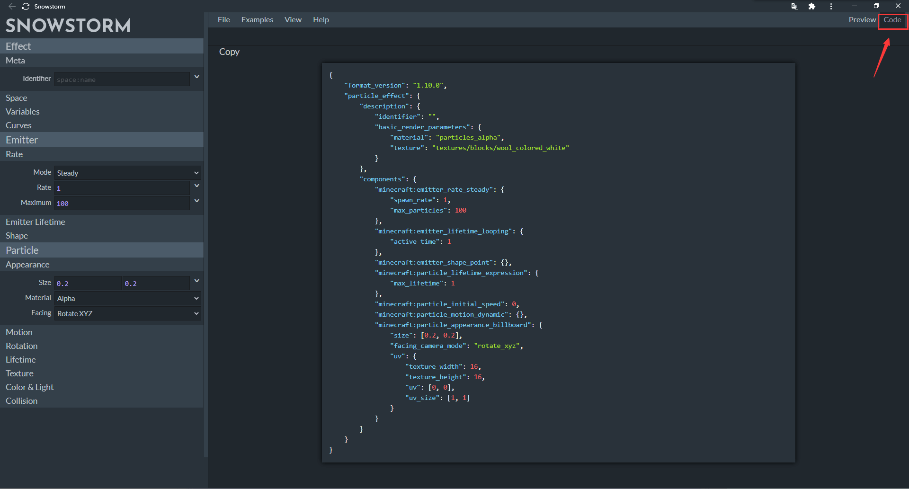
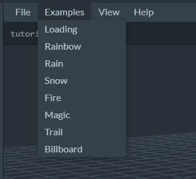
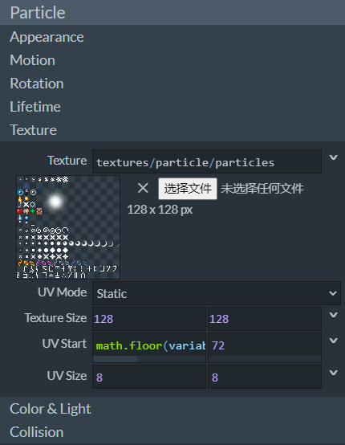
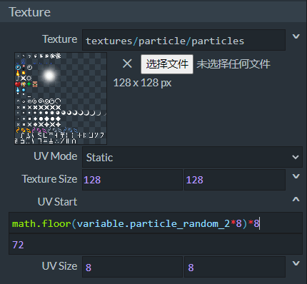
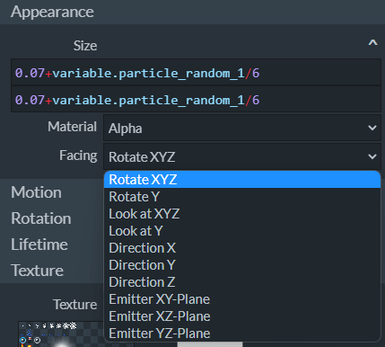
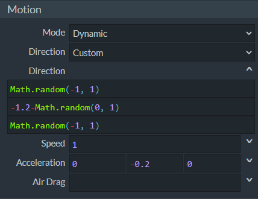
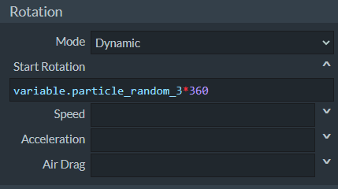

# 开始制作下雪粒子

在本节中，我们将一起来学习如何制作一个国际版粒子。我们使用知名的粒子制作软件**Snowstorm**来进行粒子的制作。

## 认识Snowstorm

曾在第三章，我们便介绍过Snowstorm软件的打开方法。我们打开Snowstorm，观察它的界面。


我们可以看到，Snowstorm的界面非常简单，分为左右两个部分。左边的部分为**属性面板**，记录着该粒子可编辑的属性；右侧是**预览窗**，可以用于实时预览编辑的结果。

我们之前已经学习过，国际版的自定义粒子本质上并不是一个单独的粒子，而是一个带有粒子发射器的**粒子系统**（**Particle System**）。下面，我们将更详细地介绍这一概念。

正如Snowstorm属性面板中划分的那样，一个粒子可以大致分为三部分。第一部分是该粒子的定义部分，包括了自身元数据的定义（即自己的名字的定义）、各种后续要是用的Molang变量和曲线的定义。

第二部分用于定义一个**发射器**（**Emitter**）。一个发射器可以理解为**发射**（**Emit**）或**喷射**（**Burst**）粒子的一个来源或一个区域。在发射器具备形状和位置的同时，发射器本身还可以具备一个粒子发射逻辑，这包含了发射器发射模式、发射时间和是否循环等属性，这通常称为发射器的**生命周期**（**Lifetime**）属性，决定着发射器的存活和消逝。

第三部分便是定义**粒子**（**Particle**）的属性，这里的粒子往往又称作**粒子实例**（**Particle Instance**），也就是我们所说的单个粒子。一个单个粒子便是发射器用于发射的一个基本单位，往往具有**纹理**、**材质**、**面向**（**Facing**或**Orientation**）、**运动**（**Motion**）方式等属性和理所当然也具有的**生命周期**。

一个国际版粒子便可以理解为一个粒子系统，其中存在一个粒子发射器，而该发射器便用于发射该粒子系统中定义的粒子实例。每个被发射出的粒子便通过生命周期控制何时消亡，而发射器本身也有发射器的生命周期来控制何时销毁。一个粒子系统便可以通过从生成到销毁的过程在世界中展现其效果。



在Snowstorm的右上角点击**Code**（**代码**）按钮，便可以从**Preview**（**预览**）模式切换到Code模式。在Code模式中，我们可以查看当前粒子的源代码。这极大地方便了我们学习各个粒子组件的进程。

我们可以看到，粒子的模式标识符不带有命名空间，是单纯的一个`particle_effect`。Snowstorm制作的粒子格式版本默认为`1.10.0`。



Snowstorm提供一些预设示例，我们可以在顶部的菜单栏中找到。

## 制作下雪粒子

我们接下来手把手地一起逐步制作一个和Snowstorm提供的预设下雪粒子效果相同的下雪粒子。

### 设置粒子定义


我们在**Effect**（**效果**）栏组中找到**Meta**（**元**）栏，填写我们粒子的**Identifier**（**标识符**）。我们不妨将其填写为`tutroial_demo:snow`。这代表着我们对JSON文件进行了如下修改：

```json
{
  "format_version": "1.10.0",
  "particle_effect": {
    "description": {
      "identifier": "tutroial_demo:snow",
    }
  }
}
```

由于我们不需要设置其他的变量，因此我们暂时忽略其他的选项栏。

### 设置粒子发射器


相对于粒子来说，粒子发射器较为简单，我们首先为我们的粒子设置粒子发射器。**Emitter**（**发射器**）栏组便是用来设置发射器的位置。

我们来设想，我们的粒子发射器应该为什么形状。我们的想制作一个下雪的粒子效果。所以粒子发射器应该在我们的头顶上喷射大量的单一雪花粒子，所以我们的粒子发射器可以呈立方体，不过我们可以允许其没有厚度。紧接着，我们希望雪一直下，而不是在特定时间结束，所以我们可以将其设置为循环。最后，我们希望其喷射时能够把粒子稳定地喷射出来，而不是一股脑全部瞬间喷出。

因此，我们可以在**Rate**（**速率**）栏中将**Mode**（**模式**）设置为**Steady**（**稳定**）而非**Instant**（**瞬时**），调整好喷射**Rate**（**速率**）和**Maximum**（**最大**）粒子数。

在**Emitter Lifetime**（**发射器生命周期**）栏，中**Mode**（**模式**）设置为**Looping**（**循环**），**Active Time**（**激活时间**）可以设置为1。这配合上述的稳定模式，意味着在1秒内稳定以80个/秒的速率稳定最大喷出4000个粒子。当然，由于我们的激活时间短，所以最大粒子数是远远达不到的。由于我们不希望粒子的喷射有喷射间期，我们将**Sleep Time**（**睡眠时间**）保留不填写，这等价于填写为0。

在**Shape**（**形状**）栏，将中**Mode**（**模式**）设置为**Box**（**立方体**）便可以使其粒子发射器具备立方体的发射区域，我们将**Box Size**（**立方体尺寸**）的Y坐标设置为0，同时将**Offset**（**偏移**）的Y设置为正20，这代表粒子发射器会在生成的位置想上20格的位置进行发射，发射区域是一个36×36的平面。事实上，我们的形状模式还有很多这里用不到的其他选择，比如**Point**（**点**）、**Sphere**（**球**）、**Disc**（**圆盘**）和**Entity Bounding Box**（**实体包围盒**）等。

上述这些操作相当于在JSON文件中进行了如下的补充：

```json
{
  "format_version": "1.10.0",
  "particle_effect": {
    "description": {
      "identifier": "tutroial_demo:snow"
    },
    "components": {
      "minecraft:emitter_rate_steady": {
        "spawn_rate": 80,
        "max_particles": 4000
      }, // 发射器速率稳定模式的组件
      "minecraft:emitter_lifetime_looping": {
        "active_time": 1
      }, // 发射器生命周期循环模式的组件
      "minecraft:emitter_shape_box": {
        "offset": [0, 20, 0],
        "half_dimensions": [36, 0, 36]
      } // 发射器形状立方体模式的组件
    }
  }
}
```

这样，我们便完成了粒子发射器的制作。接下来只需要制作好雪花粒子，即可将其组装为一个下雪的粒子发射器了。

###  制作粒子外观和纹理



我们先选择粒子的纹理。我们找到**Particle**（**粒子**）栏组的**Texture**（**纹理**）栏。我们可以看到这里是一个用于设置纹理的面板。我们在**Texture**（**纹理**）中选择我们需要的纹理贴图。我们这里可以使用原版的`particles.png`文件，也就是原版的粒子纹理的图集文件作为我们的粒子纹理贴图。我们可以选择这个图集中的第10行粒子的**精灵图**（**Sprite**）作为我们的雪花粒子。这可以通过指定该图片上的**UV**来实现。

UV说白了便是值U坐标和V坐标。$uOv$坐标系是一种用于在一个屏幕或图片上指定一个特定位置使用的坐标系，虽然类似于我们通常使用的$xOy$坐标系，但是坐标的方向是语气相反的。$uOv$坐标系的坐标原点在一张图的左上角。U坐标代表横轴，向右为正方向，V坐标代表竖轴，向下为正方向。这里我们可以看到，我们这张粒子纹理中每个精灵图尺寸为8×8像素，为了使其定位到第10行，我们在**UV Start**（**UV起始点**）的V坐标指定了72，即8的9倍，然后在**UV Size**（**UV尺寸**）的V坐标指定了8。也就是说，我们指定了V坐标从8的9倍到8的10倍处的粒子，因此代表第10行的粒子精灵图纹理。



对于Snowstorm中每一个输入框，我们都可以点击其右侧的箭头按钮来进行展开，这是方便我们进行Molang表达式的书写的。目前在本节中我们并不想深入Molang表达式的学习，我们只需要知道这里的意思为U坐标的起始点从8的0倍到8的7倍处选择其一。这样就保证了每次选出的粒子都在这一行的前8列中。



接下来我们设置**Appearance**（**外观**）。**Size**（**尺寸**）是粒子的大小，我们这里依旧使用了Molang表达式来代表一个动态的大小。**Material**（**材质**）是粒子使用的材质，我们这里选择了**Alpha**（**透明**）。**Facing**（**面向**）为粒子的面向相机模式，我们有相当多的选择。这里我们选择了**Rotate XYZ**（**旋转XYZ**），代表在XYZ三个轴向上都进行一个旋转然后再生成。

到目前为止我们的操作又相当于在JSON中补充了如下内容：

```json
{
  "format_version": "1.10.0",
  "particle_effect": {
    "description": {
      "identifier": "tutroial_demo:snow",
      "basic_render_parameters": {
        "material": "particles_alpha",
        "texture": "textures/particle/particles"
      } // 该字段是必需字段，用于设置材质和纹理贴图
    },
    "components": {
      "minecraft:emitter_rate_steady": {
        "spawn_rate": 80,
        "max_particles": 4000
      },
      "minecraft:emitter_lifetime_looping": {
        "active_time": 1
      },
      "minecraft:emitter_shape_box": {
        "offset": [0, 20, 0],
        "half_dimensions": [36, 0, 36]
      },
      "minecraft:particle_appearance_billboard": {
        "size": ["0.07+variable.particle_random_1/6", "0.07+variable.particle_random_1/6"],
        "facing_camera_mode": "rotate_xyz",
        "uv": {
          "texture_width": 128,
          "texture_height": 128,
          "uv": ["math.floor(variable.particle_random_2*8)*8", 72],
          "uv_size": [8, 8]
        }
      } // 粒子的纹理UV、大小和面向都是在粒子外观公告板模式组件中设置的
    }
  }
}
```

### 设置粒子运动



我们接下来设置粒子的**Motion**（**运动**）。为了使粒子具有如真实世界一样的运动轨迹，我们将**Mode**（**模式**）设置为**Dynamic**（**动力**）。这样，我们便可以为粒子指定动力学参数。在粒子系统中，一旦选择动力运动模式，便意味着粒子将根据$\dot{x}=f(x,t)$的微分方程进行**模拟**（**Simulate**），然后根据欧拉方法进行物理量的计算。粒子的模拟指粒子实例在生成时和接下来的每一帧中被计算和分配速度的过程。粒子效果想要呈现在玩家面前，就必须经过模拟阶段和渲染阶段，所以粒子的模拟是非常重要的一环。而这里我们便可以填入一些动力学参数来使粒子能够正确模拟。

我们通过**Direction**（**方向**）来设置粒子三个轴向上的初方向向量分量，这里我们使用了随机数来使得粒子的初方向各不相同。然后我们通过**Speed**（**速度**）来设置粒子的初速度，粒子之后的速度将根据**Acceleration**（**加速度**）和**Air Drag**（**空气阻力**）设置的值通过欧拉方法进行模拟，所以我们只需要设置方向、速度和加速度的初值即可。

至此，我们的JSON文件已经补充为如下内容：

```json
{
  "format_version": "1.10.0",
  "particle_effect": {
    "description": {
      "identifier": "tutroial_demo:snow",
      "basic_render_parameters": {
        "material": "particles_alpha",
        "texture": "textures/particle/particles"
      }
    },
    "components": {
      "minecraft:emitter_rate_steady": {
        "spawn_rate": 80,
        "max_particles": 4000
      },
      "minecraft:emitter_lifetime_looping": {
        "active_time": 1
      },
      "minecraft:emitter_shape_box": {
        "offset": [0, 20, 0],
        "half_dimensions": [36, 0, 36],
        "direction": ["Math.random(-1, 1)", "-1.2-Math.random(0, 1)", "Math.random(-1, 1)"] // 粒子的初方向事实上由发射器管理，因此被填入了发射器的组件中
      },
      "minecraft:particle_initial_speed": 1, // 粒子初速度组件
      "minecraft:particle_motion_dynamic": {
        "linear_acceleration": [0, -0.2, 0]
      }, // 粒子运动动力模式组件
      "minecraft:particle_appearance_billboard": {
        "size": ["0.07+variable.particle_random_1/6", "0.07+variable.particle_random_1/6"],
        "facing_camera_mode": "rotate_xyz",
        "uv": {
          "texture_width": 128,
          "texture_height": 128,
          "uv": ["math.floor(variable.particle_random_2*8)*8", 72],
          "uv_size": [8, 8]
        }
      }
    }
  }
}
```

## 设置粒子生命周期


我们设置粒子的**Lifetime**（**生命周期**），用来指定粒子何时存在和消亡。我们在**Mode**（**模式**）中将其更改为**Time**（**时间**）模式，然后在**Max Age**（**最大年龄**）处更改为25秒。这样，我们的粒子就会在25秒后消失。

```json
{
  "format_version": "1.10.0",
  "particle_effect": {
    "description": {
      "identifier": "tutroial_demo:snow",
      "basic_render_parameters": {
        "material": "particles_alpha",
        "texture": "textures/particle/particles"
      }
    },
    "components": {
      "minecraft:emitter_rate_steady": {
        "spawn_rate": 80,
        "max_particles": 4000
      },
      "minecraft:emitter_lifetime_looping": {
        "active_time": 1
      },
      "minecraft:emitter_shape_box": {
        "offset": [0, 20, 0],
        "half_dimensions": [36, 0, 36],
        "direction": ["Math.random(-1, 1)", "-1.2-Math.random(0, 1)", "Math.random(-1, 1)"]
      },
      "minecraft:particle_lifetime_expression": {
        "max_lifetime": 25
      }, // 时间模式其实和终止表达式共用一个组件，即粒子生命周期表达式模式组件
      "minecraft:particle_initial_speed": 1,
      "minecraft:particle_motion_dynamic": {
        "linear_acceleration": [0, -0.2, 0]
      },
      "minecraft:particle_appearance_billboard": {
        "size": ["0.07+variable.particle_random_1/6", "0.07+variable.particle_random_1/6"],
        "facing_camera_mode": "rotate_xyz",
        "uv": {
          "texture_width": 128,
          "texture_height": 128,
          "uv": ["math.floor(variable.particle_random_2*8)*8", 72],
          "uv_size": [8, 8]
        }
      }
    }
  }
}
```

## 设置粒子颜色


我们的雪花应该是白色的，所以我们无需改动**Color & Light**（**颜色和光照**）栏的设置，相同的，我们的JSON文件也将不会进行任何修改。

## 设置粒子旋转



最后，我们设置粒子的**Rotation**（**旋转**）。在**Dynamic**（**动力**）模式下，我们将**Start Rotation**（**起始转角**）同样通过Molang进行一个随机。下面的参数都将影响粒子的角速度，不过我们在本粒子中并不需要填写。

这意味着我们的最终JSON文件为：

```json
{
  "format_version": "1.10.0",
  "particle_effect": {
    "description": {
      "identifier": "snowstorm:snow",
      "basic_render_parameters": {
        "material": "particles_alpha",
        "texture": "textures/particle/particles"
      }
    },
    "components": {
      "minecraft:emitter_rate_steady": {
        "spawn_rate": 80,
        "max_particles": 4000
      },
      "minecraft:emitter_lifetime_looping": {
        "active_time": 1
      },
      "minecraft:emitter_shape_box": {
        "offset": [0, 20, 0],
        "half_dimensions": [36, 0, 36],
        "direction": ["Math.random(-1, 1)", "-1.2-Math.random(0, 1)", "Math.random(-1, 1)"]
      },
      "minecraft:particle_lifetime_expression": {
        "max_lifetime": 25
      },
      "minecraft:particle_initial_spin": {
        "rotation": "variable.particle_random_3*360"
      }, // 通过粒子初始自旋组件设置初始转角
      "minecraft:particle_initial_speed": 1,
      "minecraft:particle_motion_dynamic": {
        "linear_acceleration": [0, -0.2, 0]
      },
      "minecraft:particle_appearance_billboard": {
        "size": ["0.07+variable.particle_random_1/6", "0.07+variable.particle_random_1/6"],
        "facing_camera_mode": "rotate_xyz",
        "uv": {
          "texture_width": 128,
          "texture_height": 128,
          "uv": ["math.floor(variable.particle_random_2*8)*8", 72],
          "uv_size": [8, 8]
        }
      }
    }
  }
}
```

这样，我们就完成了下雪粒子的制作！我们可以直接在Snowstorm中预览到最终效果：


可以看到，制作出的粒子还是十分漂亮且逼真的！
