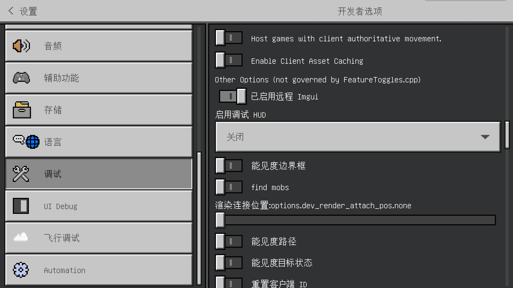
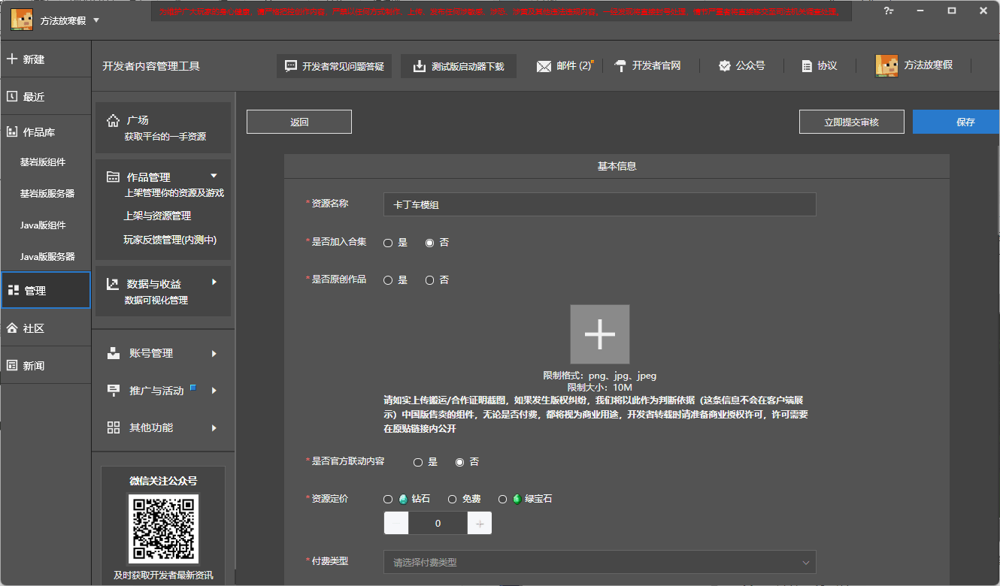
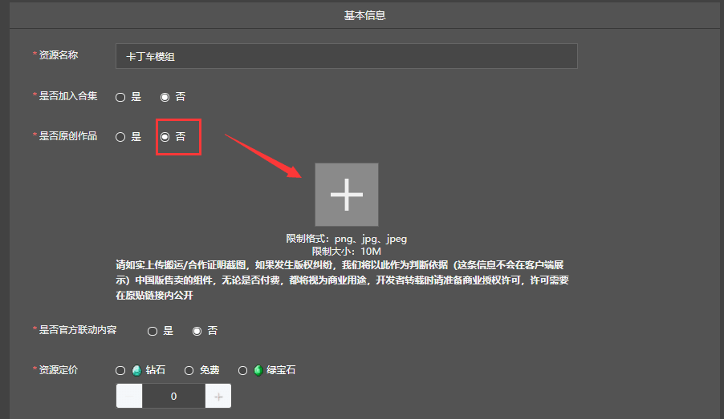

# 在手机和电脑上调试作品和发布作品

在我们开发完成作品后，我们往往需要进行**调试**（**Debug**），消除漏洞，然后才能**发布**（**Release**）。在本节中，我们将一起学如何调试和发布。

## 调试作品

我们可以通过电脑开发版和手机开发版来调试我们的作品在两种平台上的运行情况。其中，两种开发版的调试目标又稍有不同。

### 电脑开发版的调试

我们的电脑开发版是一个开发构建，因此我们可以在电脑开发版上使用与普通的发布版中不同的功能。大多数功能是用于方便开发者进行调试的内容。

#### 设置中的调试选项卡

我们打开设置，可以看到与常规的发布版本不同，我们的开发版中多出了几个新的选项卡。”**调试**“选项卡用于开关一些用于常规调试的功能；”**UI Debug**（**UI调试**）“选项卡用于开关一些专用于UI的调试功能；”飞行调试“用于测试一些微软远程发放的灰度**处理包**（**Treatment Pack**）和**进度**（**Progression**），这不在我们的使用范围之内；”**Automation**（**自动机**）“是用于配合国际版的行为树而开发的自动机系统，亦不在我们的使用范围之内。

我们将关注点放在”调试“选项卡中。调试选项卡的最上方的三个功能对开发非常有用。

“**显示调试控制台按钮**”可以使游戏的左上区域出现一个控制台按钮，按钮该按钮后就会出现一个**开发控制台**（**Dev Console**），我们可以在游戏的任意时刻在其中输入命令，控制游戏。事实上，即使我们不开启该按钮，我们也可以在游戏中通过``Ctrl+` ``的方式开启开发控制台屏幕。

“**调试器中的断言中断**”和“**断言显示一个模式对话**”皆用于控制**断言**（**Assertion**）的表现。由于我们是开发构建，我们的游戏可以触发相当庞大的开发人员在源码中设置的断言。开发人员在程序中的某些位置做出相信该位置的某个判定应该为真的假设，如果该假设在程序实际运行中被推翻，该位置将抛出一个**断言失败**（**Assertion Failure**）。如果我们将程序绑定到了调试器，那么断言失败可以在调试器中显示，否则，我们便需要特殊的弹窗来显示。这里“断言显示一个模式对话”选项便允许当断言失败时弹出一个**模态对话框**（**Modal Dialog**）。而通常而言，开发人员希望断言失败时可以阻止程序继续运行，同时在调试器中查看为什么会失败，这一行为被称为程序的**中断**（**Break**）。事实上，我们作为普通的开发者一般而言并不需要断言中断，因此“调试器中的断言中断”处于关闭状态即可。

我们在附加包开发过程中，稍有不慎就也会经常遇到源码中预先设置好的各种断言失败。因为断言失败的信息在普通的发布版中不会显示，只会在开发构建中向我们展示，因此这类错误都有可能成为我们开发的隐患。有效利用断言失败提示的信息将可以极大地方便我们对附加包进行测试。

在调试选项卡中再往下看，我们将看到**功能旗标**（**Feature Flag**）区域。功能旗标是一系列可以通过仅仅一个开关就影响一些底层功能的选项。我们可以妥善利用这些功能旗标以方便我们的开发。

离开了功能旗标，剩下的便是普通的调试选项区域。其中我们将重点介绍**调试HUD**，即我们常言的**调试屏幕**（**Debug Screen**）。

#### 调试屏幕和ImGui

**调试屏幕**是一套方便开发者进行调试游戏内容的屏幕，通常可以通过设置中的调试选项卡打开。当然，调试屏幕也可以通过快捷键`F3`和`F4`向后或向前滚动。

**ImGui**是一个使用了第三方ImGui库制作的游戏内测试界面，具有丰富的功能。具体的ImGui功能请查看<a href="../../../../mcguide/30-测试/00-ModPC开发包介绍.html#_3-顶部菜单栏" rel="noopenner"> 开发指南中的ImGui部分 </a>。有效利用ImGui将帮助开发者更快速地制作和调试模组。

#### 开发者命令

**开发者命令**是开发构建独有的方便开发者进行调试的命令。开发者命令具有相当多的功能，妥善利用开发者命令也是高效开发的重要组成部分。

#### 内容日志

**内容日志**（**Content Log**）可以通过设置打开，也可以在游戏中快速通过`Ctrl+H`来打开。内容日志是各位开发者接触最多的一种日志类型。虽然内容日志的输出程度并没有断言错误那么底层，但是依旧是不可或缺的具有重要参考价值的日志之一。

### 手机开发版的自测

手机自测需要手机开发版启动器来启动，启动器可以在我的世界开发工作台顶部“**开发者内容管理工具**”一栏中的“**测试版启动器下载**”。相比大家在第一章中便已经下载过了。

手机开发自测需要大家提交自己作品进行审核。当处于“审核中”的状态时便可以进入手机开发版找到自己的作品并下载自测。手机开发版自测的主要目的并不是为了寻找逻辑错误，而一般是用于寻找设备适配性错误。通过手机开发版的自测，我们可以对我们的模组在手机上的运行情况知根知底，从而方便我们之后正式发布作品。

如果我们的作品在发布提审时进行了定价，那么我们需要在我的世界开发工作台中找到该按钮点击申请测试货币，否则将出现在手机开发版中无法购买的情况。

我们还可以通过我的世界开发工作台中的“调试工具”进行手机开发版的测试，具体方案可以参见<a href="../../../../mcguide/30-测试/1-使用调试工具进行手机和电脑端调试.html" rel="noopenner"> 开发指南中的相关文章 </a>

## 发布作品

最后，我们便是要发布我们的作品了。我们的作品有两个主要的发布途径，分别是通过**网页版的开发者平台**和**我的世界开发工作台的“管理”选项卡**。他们都叫做“**开发者内容管理工具**”，界面也大同小异。接下来我们通过我的世界开发工作台中的内容进行讲解。

在我的世界开发工作台中，我们有两种发布方法，分别是右击我们的作品直接“**发布**”，或者是在“管理”选项卡中点击“**发布新资源**”发布。

进入发布页面后，我们需要填写一些基本的资源数据。

如果我们的作品不是原创，请务必上传授权说明和证据的图片。

我们需要选择正确的**付费类型**，一般而言，我们可以根据我们的作品实际情况选择对应的类型即可。

在选好付费类型后，下方的**资源类别**的主要类别也一并选好了，我们需要选择正确的次要类别。

接下来我们需要填写作品的介绍和更新日志。

作品的配图也是尤为重要的，我们需要根据要求上传指定大小和分辨率的各种图片，方便我们作品的宣传。

最后，如果我们的作品有配套视频，我们也可以<a href="../../../../mcguide/35-上架与入驻/课程06-作品视频格式导出与规范.html" rel="noopenner"> 上传视频 </a>来加强宣传效果。

点击右上角的“**立即提交审核**”即可进入审核环节。在此期间，我们便可以进入手机开发版进行自测，发现可疑错误并及时修正了！在审核通过后，我们便可以择期正式发布我们的作品了！

至此，我们的附加包便告一段落，如果开发者想了解更多详细的信息，可以点击官网上方的“**[开发指南](https://mc.163.com/dev/guide.html)**”和“**[API文档](https://mc.163.com/dev/apidocs.html)**”，了解更多有关开发的更深入的知识与内容！