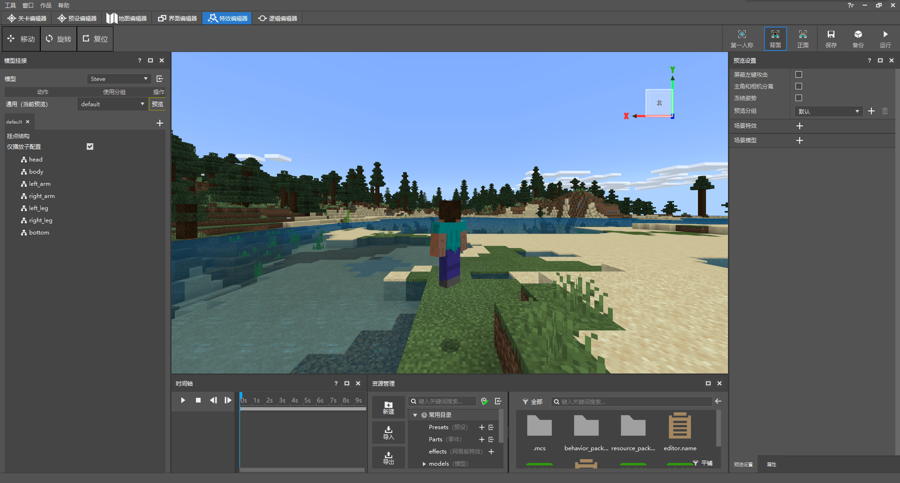

# 官方工具介绍

在本节中，我们将重点介绍**我的世界开发工作台**（**MC Studio**）这一官方工具。这是目前唯一能够进行我的世界中国版模组制作的集成开发环境。

## 主界面

我的世界工作台的下载入口位于[我的世界开发者官网首页](https://mc.163.com/dev/index.html)。进入我的世界开发工作台主界面后，我们可以看到窗口左侧有一个竖排导航栏，这分别代表着我的世界开发工作台的基本功能。

- **新建**：用于新建各种作品。

  “**基岩版组件**”选项卡：用于新建空白的**地图**或**附加包（Add-on）**组件，同时也可以用于依照模板新建一个带有一定基础功能的地图或附加包组件。

  “**基岩版网络服**”选项卡：用于申请网络服**开发机**，同时用于创建空白的或带有模板的**网络服**模组。

- **最近**：展示最近编辑过的组件，可以快速进入**编辑器**、**开发测试**或选择其他的功能，如发布模组等。

- **作品库**：用于存放你的Java版和基岩版所有的地图、附加包、网络服或其他作品。

- **管理**：开发者内容管理工具。可以在这里快速进入官网、公众号，查看协议，收取官方递送的邮件。可以通过**广场**获得第一手的平台资源，通过**作品管理**管理和推广你上架的作品，通过**数据与收益**对你的作品进行可视化数据管理。还可以在这里管理你的开发者成员，查看开发者等级，参与各种优质活动等。

- **社区**：用于进入我的世界开发者社区论坛，与其他开发者一起讨论开发中遇到的难题和灵感，与大家共同进步。

- **新闻**：用于查看官方推送的各种新闻。

## 编辑器

**编辑器**指的是我的世界开发工作台内置的可以用来可视化模组编辑的一个软件，通过**最近**或**作品库**标签页中作品上的“**编辑**”按钮便可以打开编辑器并将该作品载入其中。我们下面重点介绍**新版编辑器**，关于升级为新版编辑器作品的步骤可以在本教程第一章中找到。

对一个作品打开“编辑”后，映入我们眼帘的便是编辑器界面。我们首先查看整个编辑器的功能外观。

- **菜单栏**：在编辑器的顶部，我们可以看到很多其他的程序也同样都具有的一种界面元素——菜单栏。这里是编辑器的“控制中心”，可以操控编辑器中的全局功能。
- **切换页签**：在菜单栏的下方，有一个编辑器切换页签。切换页签是用来切换不同的编辑器类型的，目前的新版编辑器中，我们可以访问“**关卡编辑器**”“**预设编辑器**”“**地图编辑器**”“**界面编辑器**”“**特效编辑器**”和“**逻辑编辑器**”。
- **功能区**：功能区是切换页签下方一个条状区域，内置各种快捷按钮，方便我们进行一些快速操作，例如保存和运行。故而该栏又称**快捷操作栏**。
- **内嵌游戏预览窗**：一个高度修改过的我的世界构建，具备与编辑器高度兼容的接口，可以使开发者非常方便地预览到自己所做的更改。
- **状态栏**：我们在编辑器中几乎用不到底部的状态栏。只有在地图编辑器中我们可以通过状态栏查看当前所在的坐标。
- 其他窗口皆为各种**功能面板**：可以通过顶部菜单栏的“**窗口**”菜单控制是否显示。

接下来我们依次介绍各个编辑器的基本功能。

### 关卡编辑器

顾名思义，**关卡编辑器**是用来编辑整个关卡的各种属性的编辑器。通过关卡编辑器，我们可以方便地实现自定义配置，修改配置的各种属性。更重要的是，我们还可以通过关卡编辑器实现**自定义预设的实例化**、管理预设实例的各种信息，以此实现各种玩法。由于关卡编辑器往往只保存预设信息而不修改地图数据库中的属性，所以我们在关卡编辑器中在游戏预览窗里进行的大部分操作并不会真正影响地图的信息。故关卡编辑器中所做出的修改几乎都是在地图第一次打开时才会生效，此时预览窗里的只是一个预览场景的呈现，我们将关卡编辑器中的这个预览窗称为**场景**（**Scene**）。场景和左侧**舞台**（**Stage**）窗口中的信息往往是一一对应的。不过，值得注意的是，如果预设中存在实体，那么关卡编辑器的保存也会触发地图本身的保存。

### 预设编辑器

**预设编辑器**是新版编辑器的重中之重，为开发提供了极大的便利。为了了解什么是预设编辑器，我们需要先了解什么是预设。

#### 预设

**预设**（**Preset**）是新版编辑器提供的一个全新的功能。预设类似于模板，开发者可以通过它来预先设置一定的方块结构、实体属性、特效以及世界和玩家的属性，还可以通过将**零件**（**Part**）挂接在预设上来实现一定的逻辑。然后，开发者可以将这个“模板”通过关卡编辑器放置在世界中。一旦预设被放置在世界中，它便会成为一个**实例**（**Instance**），零件中的逻辑也将开始起作用。所以，我们将“把预设通过关卡编辑器放置在世界中”这一过程称为“预设在场景中的实例化”。预设一旦实例化，预设中的方块地形将实打实地放置在世界上，预设中的实体也将在指定位置召唤并执行指定逻辑。如果预设绑定了世界子预设或玩家子预设，那么世界和玩家的部分属性和逻辑也将立即生效。

**预设编辑器**便是用来编辑预设的编辑器。通过中央的内嵌游戏预览窗、左侧的预设层级面板和右侧的预设属性面板，我们可以编辑、修改预设中的地形结构，添加实体，挂接特效。我们还可以在预设编辑器中快速添加各种素材和零件，修改预设的各种属性。通过和关卡编辑器的配合，制作出含有预设的各种玩法地图或玩法组件。

### 地图编辑器

**地图编辑器**是真正用于修改存档中的世界的编辑器，它具备了非常强大的地形制作和编辑功能，可以轻松地制作出复杂而高级的地形或结构。对于附加包组件来说，地图编辑所带来的效果可能微乎其微，因为附加包最终可能并不是应用到当前的这个地图中。但是对于一个地图组件，地图编辑的重要性便是不言而喻的。当前的地图编辑器中制作的地图都将应用到最终的地图发布中去。

### 界面编辑器

**界面编辑器**是用来编辑基岩版UI的编辑器。如上一章中所述，基岩版的UI都是以JSON UI的方式存储、读取和显现的。但是，由于基岩版的JSON UI格式冗杂难懂，故如果仅仅是从JSON文件层面上编辑，将是对开发者的一个重大的挑战。界面编辑器便简化了这一流程。通过可视化和点击式的操作，我们将能动态地从中央的内嵌游戏预览窗中看到我们添加的UI以及所做的更改。有了界面编辑器，开发者便可以轻而易举地绘制出自己想要的UI，为自己的模组平添几分不一样的色彩。

### 特效编辑器

**特效编辑器**是为了编辑中国版特效而诞生的。在特效编辑器中，你可以快速添加、修改特效，还可以通过简单的拖动来将特效挂接到模型上，以展示特效的效果。在特效编辑器中，我们还有一个时间轴功能。由于一些特效中拥有序列帧动画，所以我们可以通过时间轴来实现特效的播放和调试，让特效制作得尽善尽美。

### 逻辑编辑器

**逻辑编辑器**是用来编辑逻辑**蓝图**（**Blueprint**）的编辑器。蓝图是一个可以通过在逻辑编辑器中以节点连线的方式编写的逻辑文件，可以挂接到预设的蓝图零件中，通过简单的逻辑来实现类似于模组SDK脚本的功能。虽然通过逻辑编辑器制作蓝图所获得的功能上限并没有通过模组SDK编写Python脚本来得高，但是对于初学者来说，逻辑蓝图是一个非常友好的逻辑制作抓手，这远比直接编写Python代码要简单得多。

## 电脑开发版

**我的世界基岩版电脑开发版**（**Mod PC开发包**）是我的世界开发工作台中集成的一个我的世界的开发构建版，不过这个开发构建中包含了所有网易编写的模组功能，因此可以用来进行网易模组作品上架前的PC端自测。关于如何进行自测，我们在第一章已经有了一个简要的步骤说明。在最后一章，我们还会再次详细地介绍作品自测的步骤和要点，此处仅仅介绍电脑开发版的相关概念。

我的世界电脑开发版作为一个开发构建，拥有很多开发测试用的相关功能。善用这些功能能够极大地丰富你的开发过程，极好地帮助你进行模组调试。

电脑开发版拥有许多开发者版本独占的**命令**（**Command**），这可以做到但不限于打开世界边界盒、生物AI意向和各种基本信息，调试分析器、相机，快速修改生命值、饥饿值，转储方块和物品的调试信息，改变各种世界状态等丰富的功能。善用开发者命令有助于你在自测过程中更好地把握你的模组状态、修复漏洞。

电脑开发版的设置菜单中还拥有一个调试选项卡，可以用来快速开关一些调试用的基本设置，打开或关闭一些内置的功能旗标。其中，打开“断言错误的模态窗口”的开关将非常有助于开发者发现和更正自己模组中漏洞与错误。将调试选项卡中的“调试屏幕”下拉菜单切换到“ImGui”以打开**ImGui调试屏幕**（**ImGui Debug Screen**），ImGui中丰富的功能也会有助于开发者更好地监视自己的模组在自测过程中出现的异常状况。

电脑开发版中还存在一个特殊的物品，那便是**调试棒**（**Debug Stick**）物品。调试棒在预编译时会默认编译进入开发版的游戏中，以方便开发者们对自己自定义的方块进行调试，完善自己的玩法和功能。

善于利用各种开发版中内置的工具将对开发者们开发模组大有裨益。