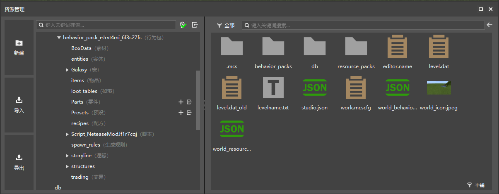
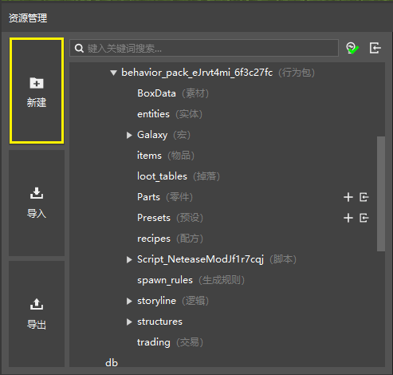
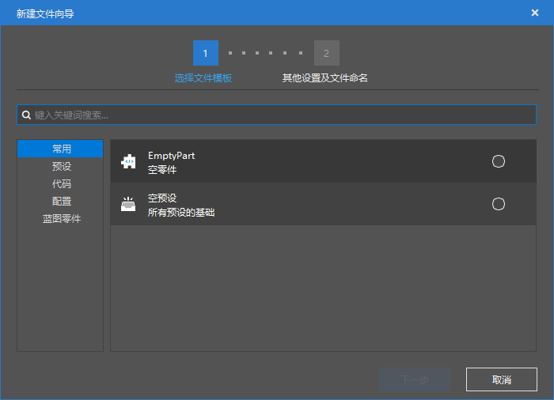
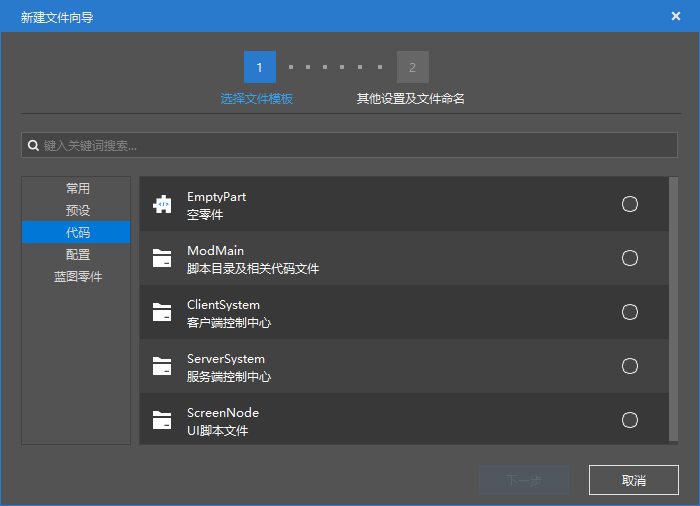
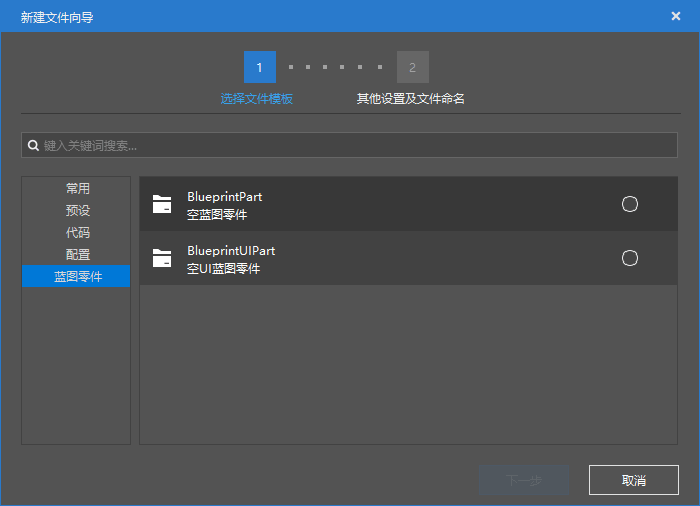
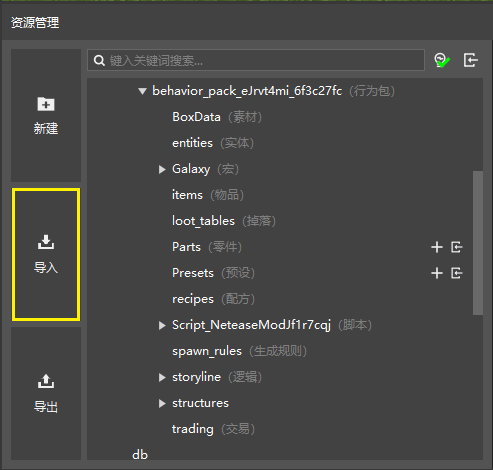

# 创建资源与导入导出

本节中，我们将一起学习如何新建资源文件，以及如何导入和导出资源。

## 快捷新建资源文件

在关卡编辑器屏幕的下方，我们可以看到一个“**资源管理**”窗格。

在“资源管理”窗格的最左侧，有三个快捷按钮。其中第一个便是“**新建**”按钮。我们可以通过“新建”按钮来快速创建我们想要的资源文件。

点击“新建”按钮后，我们来到“新建文件向导”对话框，这里列举了所有可以快速创建的资源类型。

下面我们一一进行介绍：

**预设**选项卡是用来快速建立一个预设的。

- **空预设**：快速创建一个空的预设。
- **实体预设**：快速创建一个实体预设。实体预设会同时创建一个实体配置，这意味着你在这里创建实体预设时将同时创建一个新的实体。如果想以现有的实体为基础创建预设。可以在左侧“配置”窗格中找到实体，右键并选择“**创建预设**”。
- **特效预设**：快速创建一个特效预设。特效预设并不会创建新的特效，你需要手动创建特效并将特效挂接在特效预设上。
- **玩家预设**：快速创建一个玩家预设。玩家预设会在每个玩家身上自动实例化，应用一些玩家特有的逻辑。
- **方块预设**：快速创建一个方块预设。方块预设不会同时创建新的方块，如果想将自己的自定义方块应用在该预设上，需要在创建之后在“属性”窗格中手动输入或选择你的自定义方块。
- **界面预设**：快速创建一个界面预设。你需要在创建之后手动绑定界面。

**代码**选项卡用来快速创建一个代码逻辑。

- **EmptyPart**：快速创建一个空的零件。
- **ModMain**：快速创建模组主脚本目录和相关文件。
- **ClientSystem**：快速创建客户端控制中心。
- **ServerSystem**：快速创建服务端控制中心。
- **ScreenNode**：快速创建UI节点逻辑脚本。

**配置**选项卡可以用来快速创建一个配置，即快速创建一种游戏玩法的*实体*（此实体是广义的内容实体，非游戏中的实体概念。这个广义的实体包括下面列出的所有内容）。

- **实体**：快速创建一个Minecraft中的实体。
- **物品**：快速创建一个Minecraft中的物品。
- **方块**：快速创建一个Minecraft中的方块。
- **配方**：快速创建一个Minecraft中的配方。配方是一种用来合成物品的规则。
- **交易表**：快速创建一个Minecraft中的**交易**（**Trade**）表。交易表可以用来配置类似于村民交易那样的一套交换规则。可以在自定义实体中通过相关的接口来实现交易表。
- **掉落表**：快速创建一个Minecraft中的**战利品表**（**Loot Table**，***掉落表***）。战利品表可以用于生物抢夺的掉落物抓取、宝藏和箱子的内容生成等一系列需要带有一个随机性的物品产出过程。
- **生成规则**：快速创建一个Minecraft中的**生成规则**（**Spawn Rule**）。生成规则可以用于自定义生物的**自然生成**（**Naturally Spawn**）。
- **维度**：快速创建一个Minecraft中的**维度**（**Dimension**）。类似于主世界、下界和末路之地，我们也可以通过此处新建一个新的维度，为我们的模组添加一个“新的世界”。
- **生物群系**：快速创建一个Minecraft中的**生物群系**（**Biome**）。生物群系是一种用于区分一个维度中各种地形地貌、生物植被、建筑结构的生成的一种看不到却能试试体验到的功能。善于自定义生物群系可以极大地提升模组可玩性。其中，**地形生成**（**Terrain Generation**）是一个生物群系最主要的部分。
- **特征**：快速创建一个Minecraft中的**地物**（**Feature**，***特征***）。地物是一种可以用于特定种类的结构或方块集团快速生成而编写的功能。我们在世界中看到的树木、花草、矿石的矿脉乃至水晶洞、矿洞和各种遗迹都是地物的杰作。
- **特征生成**：快速创建一个Minecraft中的**地物规则**（**Feature Rule**）。地物规则控制了地物如何**自然生成**（**Naturally Generate**）。

**蓝图零件**选项卡用来创建适用于逻辑编辑器蓝图的**蓝图零件**（**Blueprint Part**）。

- **BlueprintPart**：创建一个空的蓝图零件。
- **BlueprintUIPart**：创建一个空的UI蓝图零件。

## 导出资源包

当我们制作好了一个资源包后，我们就希望将其导出以备他用。这里的**资源包**并非指我们通常用来存放纹理、模型等客户端资源的资源包（Resource Pack），而是指代“带有资源的包”，通常指我们所创建的预设、配置、特效和模型等资源的集合体，是一个`.mep`格式文件。通过“**资源管理**”窗格左侧的导出功能，我们可以将我们目前制作的一些资源或所有资源导出为一个资源包。

点击窗格左侧的“**导出**”按钮，我们可以看到弹出了一个“导出为资源包”的对话框。选择好我们想要导出的文件，点击“**导出**”，选择好位置后即可成功将资源导出备用，以便来日再选择导入或传给他人。

## 导入内置或外部资源

正如我们可以导出资源包，我们也可以导入资源。点击“**资源管理**”窗格左侧的“**导入**“按钮，我们可以看到有”**导入预设**“”**导入零件**“”**导入内置资源包**“和”**导入自定义资源包**“。

我的世界开发工作台内置了一系列资源包供我们导入，我们可以通过这些内置资源学习各种开发功能，丰富我们的开发技巧。点击”**导入内置资源包**“即可选择一个内置资源包来导入。

”**导入自定义资源包**“则用于和上述的导出资源包功能相配套，方便我们导入之前曾经导出的资源包。