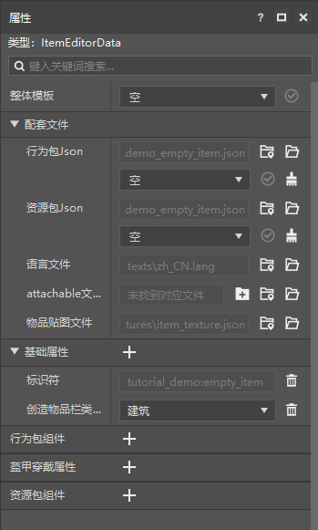
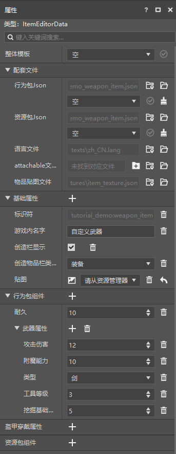
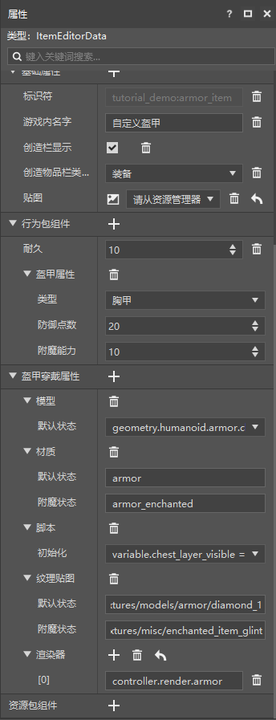
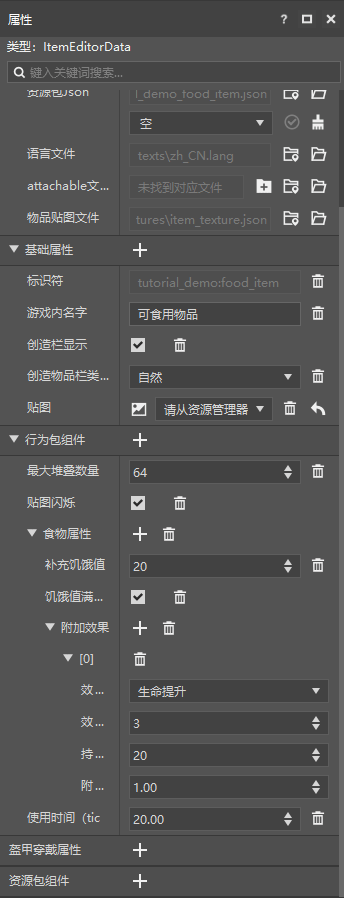

# 初步了解物品功能配置

在本节中，我们将初步了解自定义物品。一起通过物品配置来制作多种**物品**（**Item**）。

## 创建一个空物品

和实体一样，我们可以通过在编辑器中新建配置的方式新建一个自定义物品。在创建新物品之后我们依旧可以通过添加特性的方式添加物品的组件。我们接下来先创建一个空物品以观察其属性结构。

添加好新物品之后，我们可以看到物品的各种类别的属性。除了**配套文件**、**基础属性**和**行为包组件**外，我们可以看到还有**盔甲穿戴属性**和**资源包组件**。

- **盔甲穿戴属性**：盔甲穿戴属性能够定义盔甲相关的渲染属性。由于盔甲的自定义本质上是将一个**附着物**（**Attachable**，***挂件***）挂接到物品上，所以这里实际定义的便是附着物的客户端属性。
- **资源包组件**：物品的资源包定义文件中也有一些资源包独占的组件，这里定义资源包的组件。

## 制作武器

我们在创建物品时选择“自定义武器”的数据模板，我们便可以快速创建一个武器。

我们可以看到“属性”窗格丰富了起来，其中比较重要的是“**武器属性**”组件。这个组件是武器物品的核心，它定义了武器的伤害、附魔能力、类型等基础属性。我们可以在这里对这些属性进行修改，直到将其修改为我们满意的样子。

## 制作盔甲

我们在创建物品时选择“自定义盔甲”的数据模板，我们便可以快速创建一个盔甲。

由于自定义盔甲是通过附着物实现的，所以此处出现了盔甲穿戴属性。盔甲穿戴属性决定了我们穿上该盔甲后的外观。**模型**是该盔甲使用的**模型**（**Model**）。**材质**是决定该盔甲的渲染质感和模式的**材质**（**Material**）。**脚本**是盔甲初始化时执行的**Molang**脚本。**纹理贴图**是该盔甲的**纹理**（**Texture**）。**渲染器**是该盔甲的**渲染控制器**（**Render Controller**）。

行为包组件中的“**盔甲属性**”组件决定了该盔甲的护甲值和附魔能力。

## 制作消耗品

最后，我们再尝试制作一个食物消耗品。

我们可以看到“**食物属性**”组件决定了该食物能够补充的饥饿值。我们还可以利用该组件自定义食用后产生的状态效果和食用的使用时间。