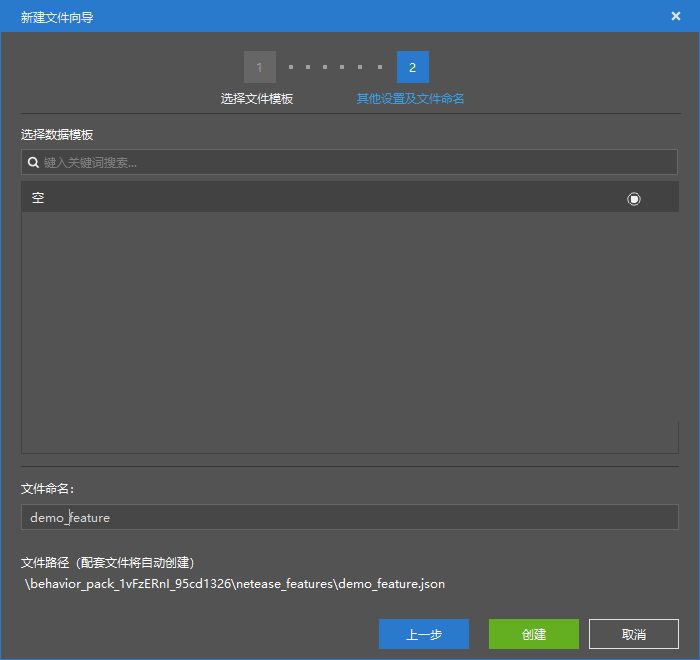
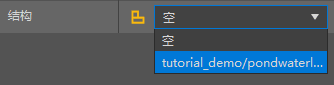

# 初步了解特征配置

在本节中，我们将初步了解自定义特征。一起通过特征配置来制作用于“点缀“世界的**特征**（**Feature**，又译**地物**）。

## 创建特征

我们通过特征配置来创建一个特征。

我们可以看到，特征属性十分简单。这是因为目前如果我们选择在编辑器内创建特征，我们目前只能创建一种特征，被称为**结构特征**（**Structure Feature**，又译**结构地物**）。结构特征支持一个结构挂接其上，然后该特征生成时就会自动放置这个结构，从而形成类似于“自然遗迹”之类的地形或建筑。

我们可以将我们上一章中一起制作的湖泊湿地结构挂接于此。

然后，一个结构模板特征就制作完成了。如果需要其自然生成，我们需要下一节讲到的特征规则。