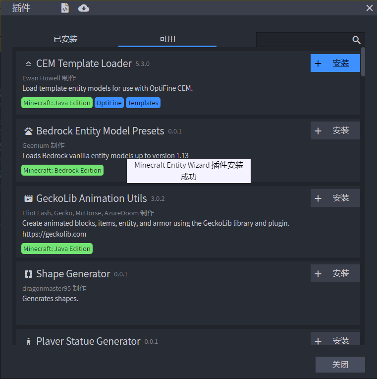
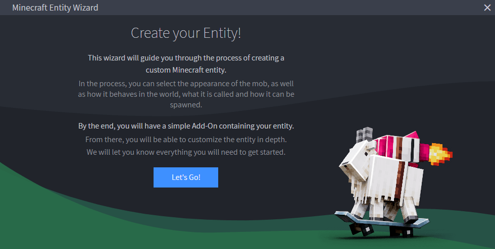
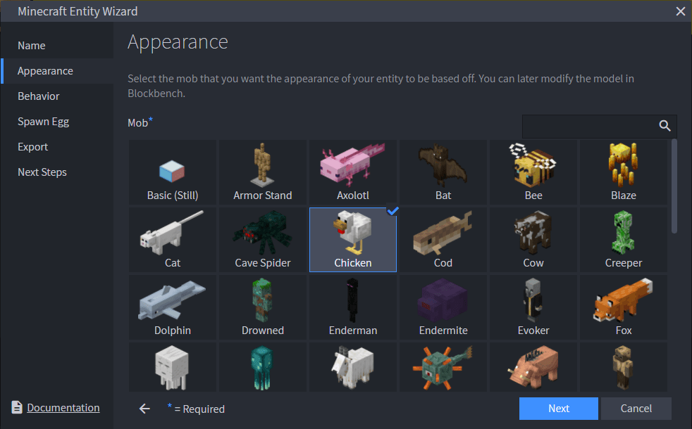
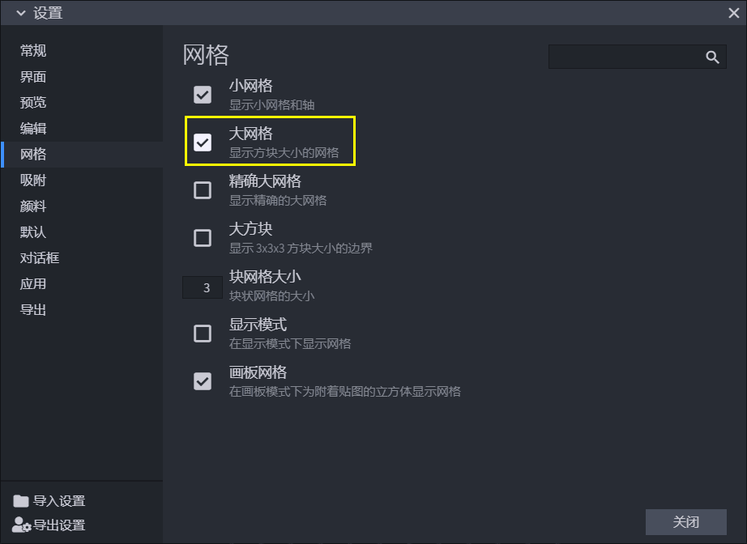

# 使用Blockbench修改鸡的几何模型

Blockbench是一个社区开发的实体模型和动画制作软件，拥有非常强大的功能和非常高的人气。我们如欲自定义一个简单的像素风模型的实体，Blockbench是我们不二的选择。更有帮助的是，在Blockbench中有一个微软官方制作的插件——**Minecraft Entity Wizard for Blockbench**（直译为**适用于Blockbench的我的世界实体向导**）。这个插件可以极大地简化新手开发者的实体开发进程。通过这个向导，我们可以快速以原版实体为模板创建一个新的实体，并且直接利用Blockbench优异的模型和动画功能为该实体更改模型，改变动画，甚至绘制纹理。在此之后，就可以直接将实体导出供游戏加载使用了。

因此，在本节中，我们便一起使用Minecraft Entity Wizard插件制作一个新的实体，不妨以鸡为模板制作一个水鸭（Teal，绿头鸭）实体。

## 安装Minecraft Entity Wizard插件

阅读过第三章的“社区工具介绍”的大家，想必已经知悉了Blockbench的安装地址或网络应用网址。接下来，我们默认大家已经安装好了Blockbench，我们一起在Blockbench中安装微软官方的Minecraft Entity Wizard插件。

我们在菜单栏中找到“**文件**”->“**插件...**”，点击该按钮打开插件的安装窗口。

在新的窗口中，我们点击上面的“**可用**”选项卡，可以看到，映入眼前的便是Minecraft Entity Wizard插件。我们点击这个插件面板右上角的“**+安装**”。

稍微等待几秒，我们便可以看到一个安装成功的提示消息。接下来，我们便可以在菜单栏的“**插件**”->“**Minecraft Entity Wizard**”来使用该插件了！

## 创建名为水鸭的新实体

打开Minecraft Entity Wizard插件，我们点击 **“Let's Go!”** （**让我们开始吧！**），即可开始新建实体。在向导中，你可以使用底部的“**Next**”（**下一步**）和“‘**Back**”（**上一步**）按钮分别向后或向前翻动向导页面。

首先是“**Name**”（**命名**）选项卡，这里应该填写该实体的名字和标识符。

- **Display Name**（**显示名称**）：该实体的显示名称，这会出现在刷怪蛋的名字上、聊天栏上和其他相关界面中。该名子自动支持本地化，所以请使用英文名称，随后开发者们可以创建`zh_CN.lang`文件来填入对应的中文名。
- **Identifier**（**标识符**）：**标识符**（**Identifier**，简称**ID**）采用**赋命名空间标识符**（**Namespaced Identifier**，简称**NSID**）的格式，即`<namespace>:<identifier>`的格式。这里我们沿用`tutorial_demo`的命名空间，使用`tutorial_demo:teal`作为标识符。

点击“下一步”后进入“**Appearance**”（**外观**）选项卡，这里选择一个实体的几何和纹理作为你的实体的初始外观。因为要制作水鸭，我们选择“Chicken”（鸡）的几何和纹理。

接下来我们进入了“**Behavior**”（**行为**）选项卡。这里是说我们的新实体是使用和原来一样的行为还是使用另一个实体的行为。注意，某些行为往往和几何模型是绑定的，如果使用了文不对题的行为，可能会导致没有动画等一系列问题，所以我们这里建议初学者选择“**Same Behavior**”（**相同行为**）而非“**Different Behavior**”（**不同行为**）。

第四步，我们进入了“**Spawn Egg**”（**刷怪蛋**）选项卡。这里有三种选择。

- **Colors**（**配色**）：这是第一种方案，采用该方案可以使用**蒙版**（**Mask**）实体的刷怪蛋作为蒙版，自定义自己想要的颜色的刷怪蛋。我们的演示也是用这种方案。
- **Custom Texture**（**自定义纹理**）：第二种方案允许开发者使用自己准备好的一个纹理贴图作为刷怪蛋贴图。
- **None**（**无**）：没有刷怪蛋，该实体只能通过命令等方式召唤。

最后，我们进入了“**Export**”（**导出**）选项卡。这里我们将我们的实体进行导出。

- **Export to Folder**（**导出到文件夹**）： **国际版功能，不适用于中国版。** 只有客户端安装的Blockbench且电脑上同时存在国际版时才可用，直接将包导出到国际版的开发文件夹`development_resource_packs`和`development_behavior_packs`。
- **Integrate into Pack**（**集成到现有的包**）： **国际版功能，不适用于中国版。** 只有客户端安装的Blockbench且电脑上同时存在国际版时才可用，将实体直接集成到国际版的工作文件夹内当前存在的包中。
- **Export as MCAddon**（**导出为MCAddon**）：通用的选项。由于Minecraft Entity Wizard不支持直接导出到中国版工作环境，所以这个选项也**是我们此处希望使用的选项**，请确保选项切换至此。我们填写好“**Pack Name**”（**包的名称**）、“**Pack Author(s)**”（**包的作者**）和“**Pack Icon**”（**包的图标**），点击“**Export**”（**导出**）按钮即可导出为一个MCAddon文件。也就是一个`.mcaddon`扩展名文件。

导出成功后，我们来到最后的“**Next Steps**”（**后续步骤**）选项卡。由于我们使用了Export as MCAddon，所以事实上我们无需再有后续步骤，就算我们点击“**Edit Model**”（**编辑模型**），也无法继续在Blockbench中编辑模型，因为我们已经将其导出为一个MCAddon文件。

为了能够继续在Blockbench中编辑模型，我们需要将本质是一个ZIP文件的MCAddon文件解压。我们不妨直接将其导入至我的世界开发工作台，这样这个文件将会自动解压并进入我们的工作环境。

暂时关闭Minecraft Entity Wizard。此时我们会遇到一个弹窗，询问我们是否保留Minecraft Entity Wizard中的实体，由于我们已经成功导出，所以我们点击“**Discard**”（**丢弃**）。如果你下次打开Minecraft Entity Wizard时还想继续使用这个实体，那么你可以选择“**Keep**”（**保留**）。

### 导入至我的世界开发工作台并在Blockbench中重新打开模型

我们打开我的世界开发工作台，在“作品库”选项卡中的右上角点击“本地导入”。

我们选中“**复制文件到默认文件夹**”并找到我们刚才导出的包。编辑好作品名称后，点击“**导入**”按钮。

此时，我们便可以在编辑器中看到我们的附加包了。找到它并**右键**或点击“**更多**”按钮，再点击“**打开目录**”按钮。此时我们能打开该包的目录。

复制或记住其地址路径，然后转到Blockbench，点击菜单栏中的“文件”->“打开模型”，找到该路径。

定位到资源包下的`models/entity`文件夹，找到一个`geo.json`后缀的文件，即是我们的模型几何文件。双击打开该文件。此时，我们可以看见，我们目前“名为水鸭实为鸡”的实体出现在中央的**观察窗**（**Viewport**）上了。

## 使用“移动”、“尺寸”和“旋转”工具

在移动、缩放和旋转之前，我们应该先了解如何在观察窗中操作视图。而在操作视图之前，我们建议先将一种特殊的网格打开，这将方便我们直观地感受模型的大小。

找到“**文件**”->“**首选项**”->“**设置...**”，打开设置窗口。找到“**网格**”选项卡，点击“**大网格**”选项以打开。

然后我们便可以看到我们展开了一个更大的**网格线**（**Grid**）。这个网格线便是方块网格线。网格线中的每个方形区域都是“一个方块大小”；而中央的网格线中每个小方形都是“1/16个方块大小”，在原版像素风格的我的世界中，这边是一个像素的大小。

至此，我们可以开始操作观察窗了。我们有三种基本操作方法。

- **鼠标左键**：拖动视图使你的**相机**（**Camera**）围绕中心进行旋转。相机在模型空间中的位置即是你的观察窗的位置，你可以认为你是通过这个相机来观察这只鸡的。
- **鼠标右键**：拖动视图使模型的**基面**（**Floor**）上下左右进行移动。基面即是鸡脚下的这个网格线所代表的面，是模型基准面。
- **鼠标滚轮**：缩放视图，即**拉近**（**Zoom in**）或**拉远**（**Zoom out**）你的相机相对于模型的位置。相当于相机的**变焦**（**Zoom**）。

现在，我们把注意力放在观察窗左上角的**工具栏**中。在工具栏的最左侧，我们有三个基础工具，分别是“**移动**”、“**尺寸**”和“**旋转**”工具。这三个工具大家看起来陌生，事实上我们在我的世界开发工作台的编辑器中便已经变相地接触过了。

首先，我们先了解到，一个模型中，不论是一个**立方体**（**Cube**）、一个**网格**（**Mesh**）还是一个**组**（**Group**）等等，我们都称之为一个**元素**（**Element**）。

- **移动**：对一个元素进行**移动**（**Move**）。这类似于关卡编辑器中选区之后的移动。我们按住小坐标系中对应的轴就可以沿轴移动。

- **尺寸**：对一个元素进行**缩放**（**Resize**）。这类似于关卡编辑器中选区之后对面的移动，即可以使选取的大小发生改变，只不过这里是拖动对应的轴来改变大小。

- 对一个元素进行**旋转**（**Rotate**）。旋转的坐标系呈球形，其中心位于该元素的**轴心点**（**Pivot Point**，又译**枢轴点**）上。轴心点是一个元素旋转的相对位置点。在轴心点处拖动对应的轴即可进行相应方向的旋转。如图我们可以看到，鸡的嘴巴立方体的轴心点其实是在鸡的脚部中间。

## 在鸡模型的基础上重新设计水鸭模型

由于绿头鸭的一大特征是脖子很长，我们拉高鸡的脖子，将脖子`head`立方体的“位置”的Y由6增加到到9。同时鸭子没有鸡的红色肉裾，因此我们去掉该红色的立方体。随后移动`beak`立方体（即喙）到靠近升高后的眼睛位置。

鸭子有比鸡更长的尾巴，因此我们在`body`组里放入两个新的立方体来模拟尾巴。将第一个立方体作为大尾巴，移动到(-3, 9, 4)的位置，缩放至(6, 2, 5)，此时枢轴点位于(0, 0, 0)。将第二个立方体作为小尾巴，移动到(-2, 8, 4)的位置，缩放至(4, 1, 4)，此时枢轴点位于(0, 0, 0)。

此时我们便完成了鸭子的几何！及时按`Ctrl+C`保存几何文件即可。但是，可以看到，我们的纹理由于我们的移动和缩放发生了奇怪的改变。不用担心，这是因为我们移动和缩放并不会自动改变纹理而导致的，所以下一节中，我们将一起来重新绘制新的纹理。