# 在Blockbench上为模型绘制鸭子贴图

在本节中我们一起为水鸭制作纹理贴图。在上一节中，我们已经制作好了水鸭的模型，但是遗憾的是，由于我们更改了一些立方体的面的大小，旧纹理已经不再适用了。我们接下来重新绘制一个纹理。

## 创建新的纹理贴图

我们定位到左侧的纹理栏，右击删掉原来的纹理贴图。我们可以看到，此时的水鸭变成了无纹理贴图的默认染色状态。

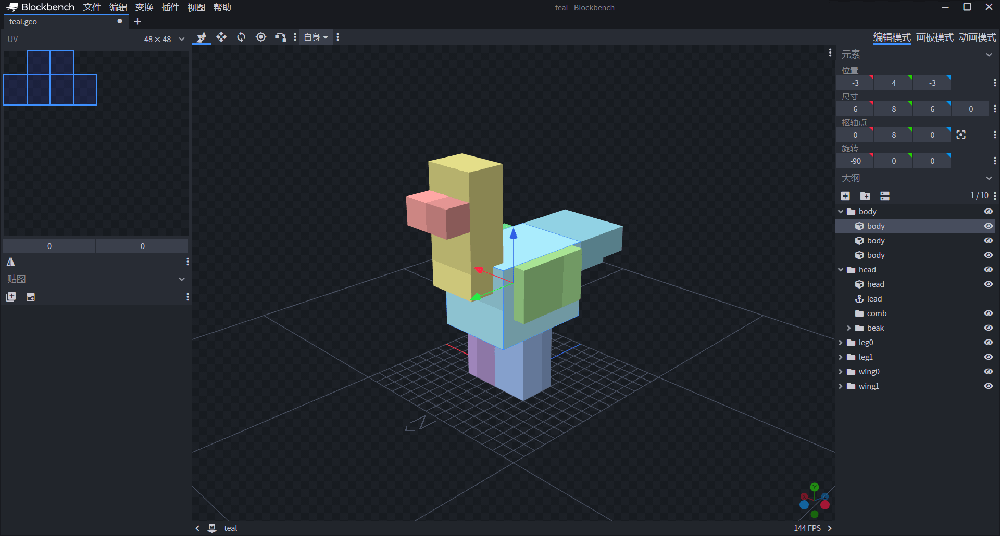

接下来，我们点击“**创建贴图**”按钮新建一个纹理贴图。

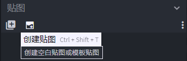

我们将“类型”改为“纹理模板”，这样我们创建一个每个立方体的每个面都已经自动染色的模板纹理文件。

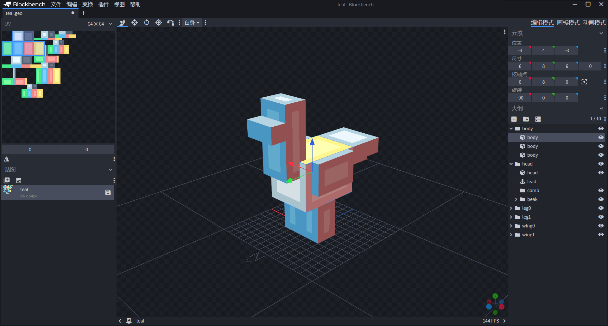

## 给水鸭上色、吸色与去色

现在，我们可以给水鸭上色了。我们在右上角的模式选择菜单中选择“画板模式”。

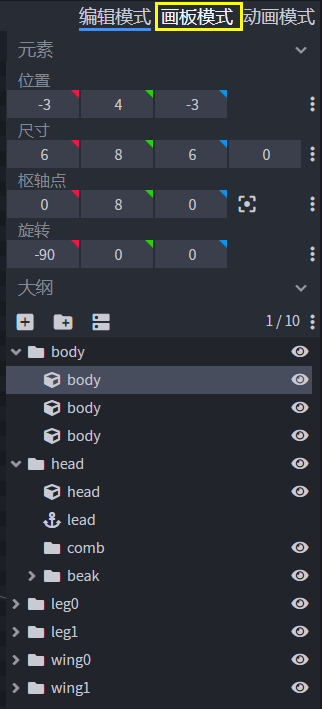

此时，我们的观察窗将出现像素网格线，右侧的模式面板将出现一个具有“**拾色器**”和“**调色板**”子面板的面板。同时，我们的鼠标指针在预览窗中将会变成一个“画笔”，通过我们的点击为每个像素**上色**。此时我们正在使用“**笔刷**”工具。

在屏幕右侧的“拾色器”子面板下，我们点击一个类似于吸管状的按钮，这是我们的“**拾色器**”。

之后我们的鼠标指针将会变成一个拾色窗，供我们进行**拾色**。当我们点击鼠标时，鼠标所在位置的颜色将出现在右侧的拾色器面板上，供我们后续使用。

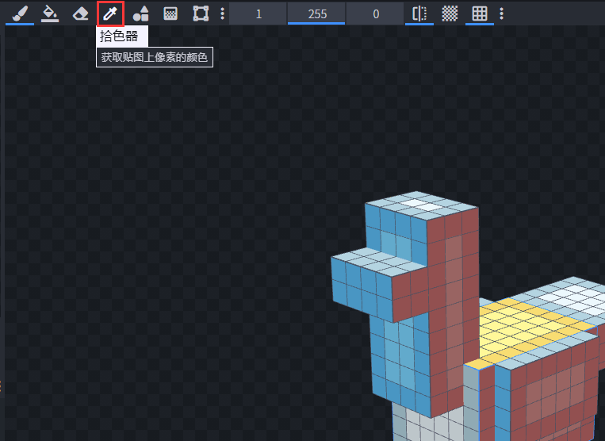

在预览窗上方的工具栏里，我们也能找到一个称为“**拾色器**”的工具，这个拾色器的功能与屏幕右侧的拾色器相同，但是可以供我们多次拾色。

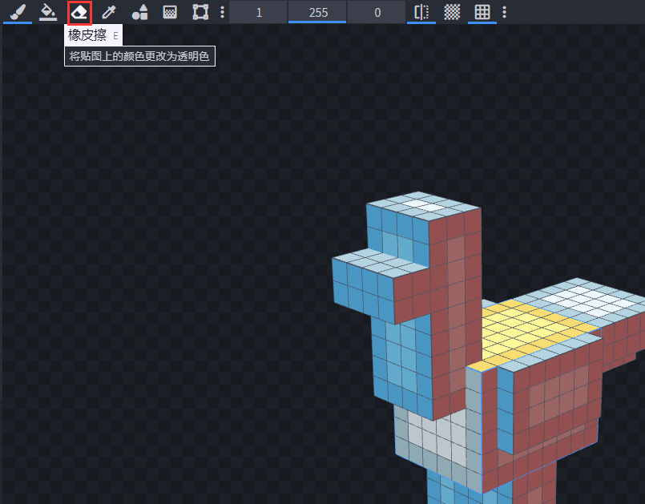

在预览窗上方的工具栏里，我们可以选择“**橡皮擦**”工具。此时，我们的鼠标光标将具有擦除像素的能力，这是我们便可以进行**去色**了

## 使用镜面模式加快绘制速度

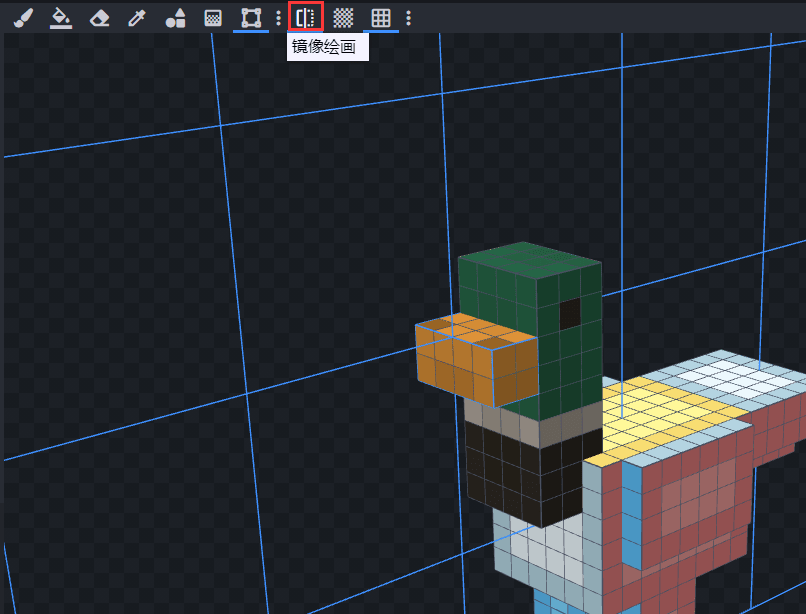

我们在预览窗上方的工具栏中找到“**镜面绘画**”。点击该工具即可使其常驻地打开。此时我们再在预览窗中上色、去色时，镜面两侧的所有纹理都将不同发生变换。这样，我们的工作量便可以瞬间减少一倍，这能够方便我们更快速地完成绘制。

## 保存贴图

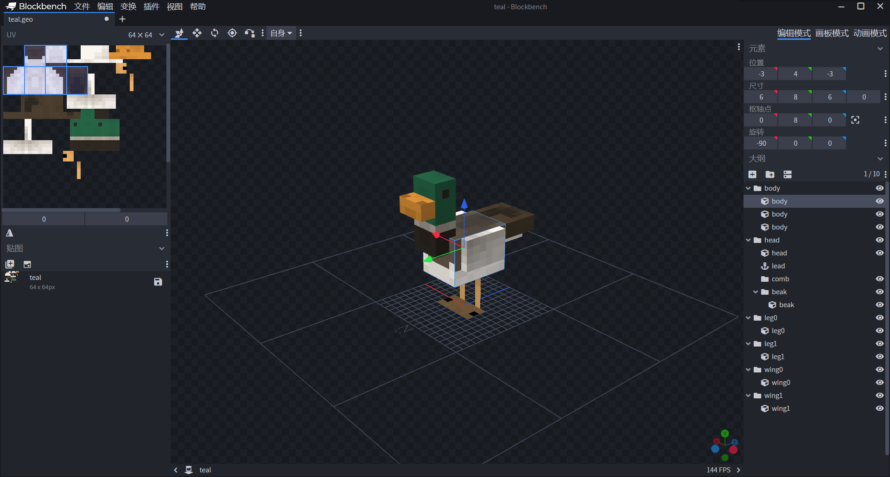

终于，我们完成了贴图的绘制，此时我们必须及时保存我们的纹理贴图，否则，一旦关闭Blockbench，我们的成果将功亏一篑。

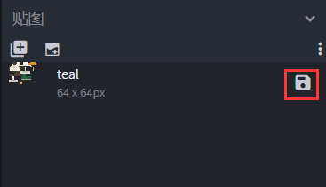

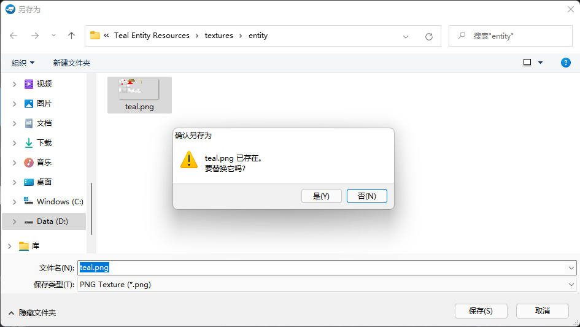

找到纹理贴图右侧的保存按钮。直接替换掉我们之前的鸡的贴图即可！再次打开Blockbench，选择最近打开的文件水鸭，我们可以看到完整的水鸭出现在了我们面前！

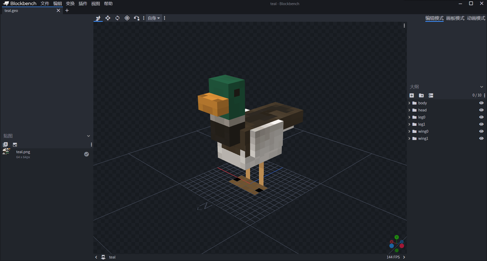