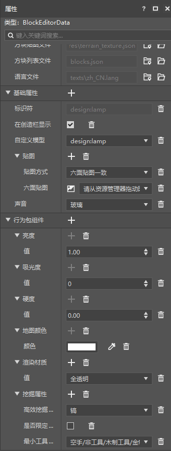

# 挑战：制作一个发光地灯

在本节中，我们完成一个挑战，制作一个发光地灯。可点击[方块模型资源](https://g79.gdl.netease.com/addonguide-10.zip)链接将模型资源下载到本地，地灯方块模型在压缩包内的bbmodel文件夹里。

## 准备模型

我们在Blockbench中绘制一个发光地灯模型。


我们使用编辑器中的导入方块模型的功能导入该模型。


## 创建并修改配置



我们创建一个方块配置，然后通过在“**基础属性**”中添加`model`和`sound`的方式加入其地灯的模型和玻璃的声音。在“**行为包组件**”中重点设置“亮度”为大于0的值，“吸光度”为0，“渲染材质”为“全透明”。如果设置了非零吸光度，则地灯将不能完全发出亮度等价的光，而渲染材质如果没有设置为透明，将出现黑色的阴影。

我们同时展示对应的JSON文件。行为包定义文件：

```json
{
  "format_version": "1.10.0",
  "minecraft:block": {
    "description": {
      "identifier": "design:lamp",
      "register_to_creative_menu": true
    },
    "components": {
      "minecraft:block_light_absorption": {
        "value": 0
      },
      "minecraft:block_light_emission": {
        "emission": 1.0
      },
      "minecraft:destroy_time": {
        "value": 0.0
      },
      "minecraft:map_color": {
        "color": "#ffffff"
      },
      "netease:render_layer": {
        "value": "alpha"
      },
      "netease:tier": {
        "destroy_special": false,
        "digger": "pickaxe",
        "level": 0
      }
    }
  }
}
```

资源包定义文件：

```json
{
  "format_version": [1, 1, 0],
  "design:lamp": {
    "netease_model": "design:lamp",
    "sound": "glass"
  }
}
```

纹理图集文件：

```json
{
  "resource_pack_name": "vanilla",
  "texture_name": "atlas.terrain",
  "texture_data": {
    "design:lamp": {
      "textures": "textures/blocks/design/lamp"
    }
  }
}
```

方块模型几何：

```json
{
  "format_version": "1.13.0",
  "netease:block_geometry": {
    "description": {
      "identifier": "design:lamp",
      "textures": ["design:lamp"],
      "use_ao": false
    },
    "bones": [{
      "name": "bone",
      "pivot": [0, 0, 0],
      "rotation": [0, 0, 0],
      "cubes": [{
        "origin": [-12.5, 1.5, 3.5],
        "pivot": [0, 0, 0],
        "rotation": [0, 0, 0],
        "size": [9, 11, 9],
        "uv": {
          "down": {
            "texture": 0,
            "uv": [5.75, 6.25],
            "uv_size": [-2.25, 2.25]
          },
          "east": {
            "texture": 0,
            "uv": [3.5, 0],
            "uv_size": [2.25, 2.75]
          },
          "north": {
            "texture": 0,
            "uv": [3.5, 3.5],
            "uv_size": [2.25, 2.75]
          },
          "south": {
            "texture": 0,
            "uv": [5.75, 5.75],
            "uv_size": [2.25, 2.75]
          },
          "up": {
            "texture": 0,
            "uv": [5.75, 2.75],
            "uv_size": [2.25, 2.25]
          },
          "west": {
            "texture": 0,
            "uv": [5.75, 0],
            "uv_size": [2.25, 2.75]
          }
        }
      }, {
        "origin": [-12, 2, 4],
        "pivot": [0, 0, 0],
        "rotation": [0, 0, 0],
        "size": [8, 10, 8],
        "uv": {
          "down": {
            "texture": 0,
            "uv": [4, 8.5],
            "uv_size": [-2, 2]
          },
          "east": {
            "texture": 0,
            "uv": [8, 8],
            "uv_size": [2, 2.5]
          },
          "north": {
            "texture": 0,
            "uv": [0, 7],
            "uv_size": [2, 2.5]
          },
          "south": {
            "texture": 0,
            "uv": [8, 0],
            "uv_size": [2, 2.5]
          },
          "up": {
            "texture": 0,
            "uv": [8, 5],
            "uv_size": [2, 2]
          },
          "west": {
            "texture": 0,
            "uv": [8, 2.5],
            "uv_size": [2, 2.5]
          }
        }
      }, {
        "origin": [-15, 0, 1],
        "pivot": [0, 0, 0],
        "rotation": [0, 0, 0],
        "size": [14, 2, 14],
        "uv": {
          "down": {
            "texture": 0,
            "uv": [3.5, 3.5],
            "uv_size": [-3.5, 3.5]
          },
          "east": {
            "texture": 0,
            "uv": [8, 7.5],
            "uv_size": [3.5, 0.5]
          },
          "north": {
            "texture": 0,
            "uv": [8, 7],
            "uv_size": [3.5, 0.5]
          },
          "south": {
            "texture": 0,
            "uv": [4, 8.5],
            "uv_size": [3.5, 0.5]
          },
          "up": {
            "texture": 0,
            "uv": [0, 0],
            "uv_size": [3.5, 3.5]
          },
          "west": {
            "texture": 0,
            "uv": [4, 9],
            "uv_size": [3.5, 0.5]
          }
        }
      }]
    }]
  }
}
```

语言本地化文件`zh_CN.lang`：

```lang
tile.design:lamp.name=地灯
```

我们进入游戏查看效果。


可以看到，地灯的模型与预期一致，而且如期发出了最高亮度的光。