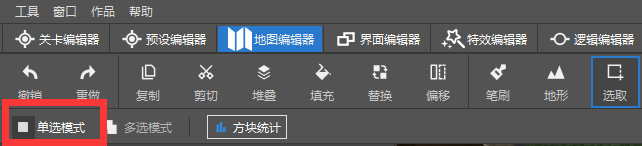
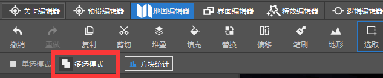

# 规划不可变动区域

不可变动区域意为地图中不可破坏、不可放置方块的区域。由于**素材地图**在前期处理时，已将世界中的全部群系设置为海洋群系，世界缺少让玩家修复资源点、建筑的材料。若场景遭到玩家无意的破坏，这一行为容易导致整体的玩法流程、美观性大打折扣。为了防止这样的行为带来的糟糕影响，我们需要对主要建筑、地形、或者资源点做无法被破坏、无法在上面加盖方块的功能。

同时，在游戏过程中，玩家需要基本的工具和食物才能生存。玩家获取金币的途径除了通过种植庄稼，还可以通过挖掘场景中资源点的**木材石头**来取得。因此我们需要提供玩家一个基础的**工具食物箱**，以使玩家能够在容错率更高的情况下顺利度过前期游戏。

## 使用Function文件固定玩家的游戏模式为冒险模式

> 在过去制作玩法地图时，对于游戏模式的处理上，命令方块作者们常会使用一个循环型命令方块设置周遭玩家的游戏模式。现在使用行为包中的function文件可以达到同样的效果，并将工作模式放入行为包中，达到更加隐蔽的效果。

在MC STUDIO编辑器中，一张玩法地图工程会由编辑器自动生成行为包和资源包的工程文件夹。Function文件会在行为包根目录下的functions文件夹内生效，若在该文件夹目录内新建一个tick.json文件，它可以命令function文件内的指令在世界加载后循环运行。

首先在电脑的任意一处新建一个以**.mcfunction**为结尾的function文件。这里推荐使用任意一种携带mcfunction智能补全的第三方编辑器，示例里，我们会用到**Visual Studio Code**（简称：vs code）。在开始工作前，需要我们在扩展区域下载Blockception's Minecraft Bedrock Development插件。


可以直接拖拉文件图标至编辑器页面内，编辑器将自动吞入并打开。简单输入其中一个指令，后续的参数就会智能提示并按enter或tab键自动补全。


与在游戏中的对输入框和命令方块打出指令时需要斜杠不同的是，在function文件内无需加入**/**符号。同时命令的执行顺序会**从上往下按顺序执行**，若function文件内的指令被循环执行，则**命令执行到末尾时，会从文件头重新跑起**。

将玩家设置成冒险模式，可以防止玩家破坏和加盖方块，因此我们首先只需在function文件内写入以下指令，来判断玩家是否为非冒险模式，是则将他们的游戏模式转变成冒险模式。

```
execute @a[m=!adventure] ~~~ gamemode adventure @s
```

接着新建functions文件夹，并将function文件放入其中，在同目录下新建tick.json文件。


在tick.json文件中打入以下JSON内容，以"values"为键，它接受一个以function文件名为主的数组。function文件里面的命令就会像循环型命令方块一样，在每一个游戏逻辑帧下执行一遍。

```json
{
    "values": [
        "gamemode" //gamemode是gamemode.mcfunction的文件名
    ]
}
```

最后使用编辑器打开地图工程，在资源管理栏下点击折叠的行为包文件夹，在右侧的窗口预览区域导入functions文件夹即可。


## 使用minecraft:can_destroy定制带有破坏特定方块能力的农具

在开启冒险模式后，玩家虽然无法任意放置方块与破坏方块，但玩法地图里依然需要为玩家提供必要的农具，以便收集资源点的素材，以及当玩家不慎踩到耕地时，还能够拥有一把锄头将耕地复原回去。在give指令里添加minecraft:can_destroy标签可以让使用者在冒险模式下依旧有挖掘特定方块的能力：

```
/give @s stone_pickaxe 1 0 {"minecraft:can_destroy": {"blocks":["log", "log2"]}} 
# 给予玩家一个满耐久度的石斧，blocks对应的数组支持多个自定义方块和原版方块，但自定义方块需要写全namespace:identifier格式的方块名称域。
```

**原版的锄头会允许使用者无视等级权限，将全部的草类方块变为耕地**。为了防止玩家对于地形进行无节制的开垦，在下一个章节中，我们会开始学习如何使用Mod来阻止玩家做出这一行为。

## 增加工具食物箱

在地图编辑器内，我们选择选取模式，并保持单选模式。



接着点选地面，并拖动Y轴将选格向上提升一格。


选择填充功能，对格子内的区域进行箱子方块填充。


我们需要提前记下起始坐标，这里以[72,66,81]为例。通过使用scoreboard指令新增一个chest计分项，我们可以设计一个每隔1200帧往箱子内添加农具的指令集。即每一帧都会给chest计数递增1，通过目标选择器的scores参数来判断玩家的chest分数是否达到1200，以执行一次填充工具食物到箱子里的动作。最后再将玩家分数重置为0，等待下一个周期后再执行重复的工作。详细指令如下：

```
scoreboard objectives add chest dummy "箱子"
scoreboard players set @a[m=!2] chest 0
execute @a[m=!2] ~~~ gamemode 2 @s
scoreboard players add @a[m=2] chest 1
execute @a[m=2,scores={chest=1200..}] ~~~ replaceitem block 72 66 81 slot.container 0 stone_axe 1 0 {"minecraft:can_destroy": {"blocks": ["log"]}}
execute @a[m=2,scores={chest=1200..}] ~~~ replaceitem block 72 66 81 slot.container 1 stone_pickaxe 1 0 {"minecraft:can_destroy": {"blocks": ["stone"]}}
execute @a[m=2,scores={chest=1200..}] ~~~ replaceitem block 72 66 81 slot.container 2 stone_hoe 1 0 {"minecraft:can_destroy": {"blocks": ["自定义植物方块名称"]}}
execute @a[m=2,scores={chest=1200..}] ~~~ replaceitem block 72 66 81 slot.container 3 bread 10
scoreboard players set @a[m=2,scores={chest=1200}] chest 0
```


## 为建筑增加内饰

玩法地图中会使用到的建筑模板都没有自带精装内饰。现在我们以服装店为例添加一部份内饰：

首先我们切换至地图编辑器，我们将功能切换为选取，并打开多选模式。



点选房梁与房顶间的空隙，并逐个往上拖。


最后用灯作为材质预设，并选择填充功能对选取的区域进行统一填充。


由于基岩版存在部分方块是需要用物品才能放置出来的。当前地图编辑器暂未支持放置物品与方块处于分离状态的方块类型。我们通过点击地图编辑器右上方的**游戏模式**退出自由摄像状态，就能够打开背包并在世界里直接放置方块。这里以放置一张床为例：


