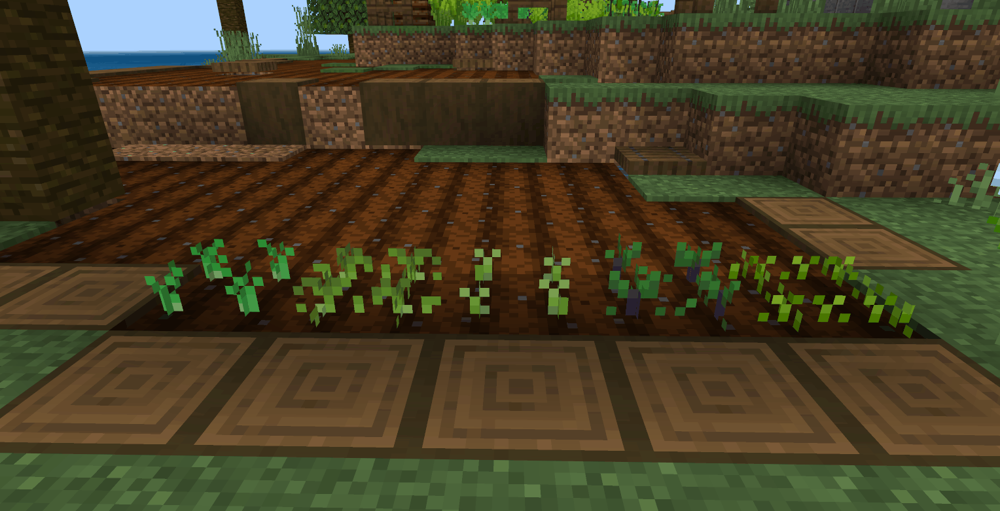
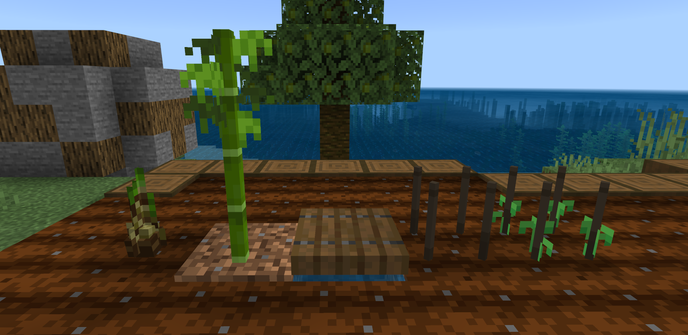
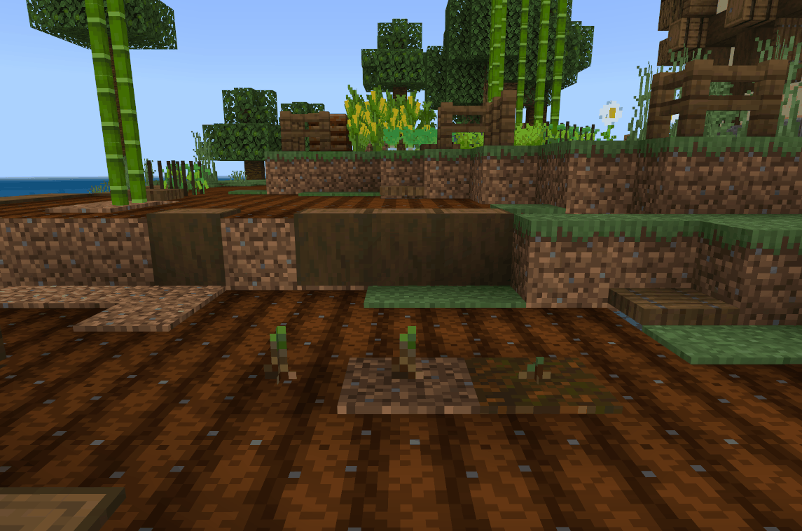
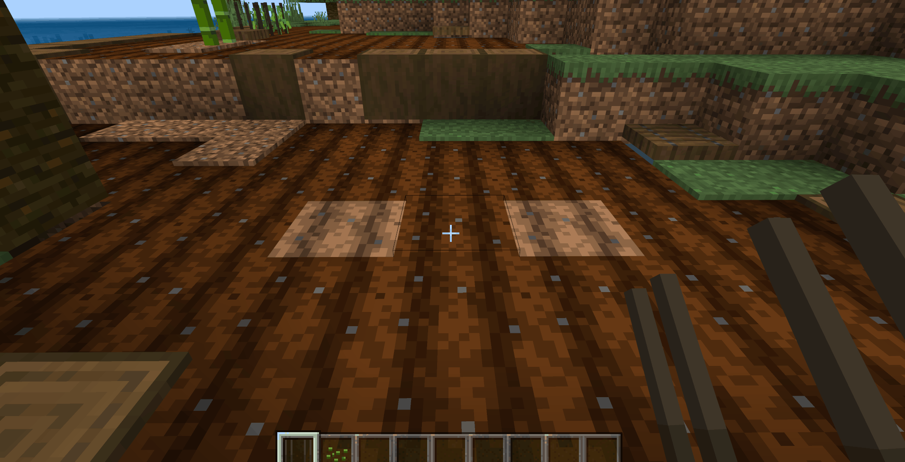
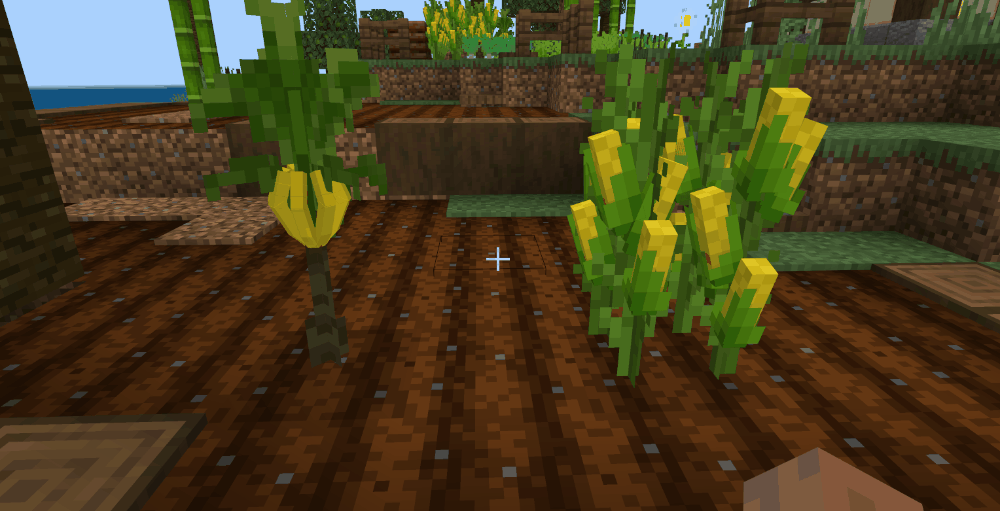

# 继续添加其它的农作物方块

上一节中，我们已经完整的制作了白萝卜这一种农作物，接下来我们将把剩余的其它农作物也都添加进来；当然，不同的农作物有不同的生长时间和环境，需要在制作的过程中做出不同程度的修改，首先是与白萝卜相似的以下几种农作物，我们只需要在方块属性中修改生长所需的刻数，就能做到农作物生长时间的把不同。

```json
{
    "format_version": "1.16.100",
	"minecraft:block": {
		"description": {
			"identifier": "farm:eggplant", //茄子
            "register_to_creative_menu": true,
			"properties": {
				"farm:age": [0, 1, 2],
                "farm:growth": [0, 1, 2, 3, 4, 5, 6, 7, 8, 9] //为growth属性添加更多的刻数
			}
		},
        "permutations": [···],
        "components": {···},
        "events": {
            "farm:on_age_count_0": {
                "sequence": [
					{
						"condition": "query.block_property('farm:growth') < 7", //事件的条件也要修改，当farm:growth小于7时
                        "set_block_property": {
                            "farm:growth": "query.block_property('farm:growth') + 1" //为farm:growth加1
                        }
                    },
                    {
                        "condition": "query.block_property('farm:growth') == 7", //当farm:growth等于7时
                        "trigger": {
                            "event": "farm:on_whiteradish_grow_to_1", //触发新的事件使其生长
                            "target": "self"
                        }
                    }
                ]
            },
            "farm:on_age_count_1": {
                "sequence": [
                    {
						"condition": "query.block_property('farm:growth') < 9",
                        "set_block_property": {
                            "farm:growth": "query.block_property('farm:growth') + 1"
                        }
                    },
                    {
                        "condition": "query.block_property('farm:growth') == 9",
                        "trigger": {
                            "event": "farm:on_whiteradish_grow_to_2",
                            "target": "self"
                        }
                    }
                ]
            },
            "farm:on_player_placing": {
                "set_block_property": {
                    "farm:age": 0,
                    "farm:growth": 0
                }
            },
            "farm:on_whiteradish_grow_to_1": {
                "set_block_property": {
                    "farm:age": 1,
                    "farm:growth": 0
                }
            },
            "farm:on_whiteradish_grow_to_2": {
                "set_block_property": {
                    "farm:age": 2,
                    "farm:growth": 0
                }
            }
        }
	}
}
```

利用这种方法，我们依次将其它农作物也进行修改：

| 农作物名称 | 生长时间                                           |
| ---------- | -------------------------------------------------- |
| 白萝卜     | 随机刻3次，进入发芽阶段； 随机刻6次，进入成熟阶段  |
| 茼蒿       | 随机刻3次，进入发芽阶段； 随机刻6次，进入成熟阶段  |
| 菠菜       | 随机刻4次，进入发芽阶段； 随机刻6次，进入成熟阶段  |
| 茄子       | 随机刻8次，进入发芽阶段； 随机刻10次，进入成熟阶段 |
| 柠檬       | 随机刻8次，进入发芽阶段； 随机刻10次，进入成熟阶段 |

修改好后，点击编辑器的开发测试进入到游戏中同时种下这些农作物来观察判断一下是否成功；茄子和柠檬设定的随机刻数最多，理应生长的最慢；



## 较为特殊的农作物方块

现在我们已经制作出了五种完整的农作物，它们都有三个成长阶段，并且会随着随机刻的触发而成长，直到最终的成熟；不过这些农作物不能千篇一律，还有其它条件需要遵循，比如下面的两种农作物：

- 竹笋：在生长为成熟竹笋后，如果没有及时采集，最后会长成竹子（不仅可以种植在耕地上，泥土和灰化土也可以）
- 豌豆：需要种植在篱笆方块上（篱笆放在耕地上）



竹笋的种植条件只需要在组件中添加灰化土和泥土就可以了：

```json
"minecraft:placement_filter": {
    "conditions": [
        {
            "allowed_faces": ["up"],
            "block_filter": ["farmland","dirt","podzol"] //耕地、泥土、灰化土
        }
    ]
}
```

而最终会长成竹子也只需要添加一个事件，将竹笋转换为竹子即可：

```json
{
    "format_version": "1.16.100",
	"minecraft:block": {
		"description": {
			"identifier": "farm:bambooshoot",
            "register_to_creative_menu": true,
			"properties": {
				"farm:age": [0, 1, 2],
                "farm:growth": [0, 1, 2, 3, 4, 5, 6, 7]
			}
		},
        "permutations": [
            {
				"condition": "query.block_property('farm:age') == 2", //当farm:age等于2时（说明竹笋已经成熟）
				"components": {
                    "minecraft:loot": "loot_tables/bambooshoot.json",
		  			"minecraft:geometry": "geometry.bambooshoot_stage_2",
					"minecraft:block_light_absorption": 0,
                    "minecraft:pick_collision": {
                        "origin": [-8, 0, -8],
                        "size": [16, 12, 16]
	                },
                    "minecraft:random_ticking": { //仍然添加随机刻触发器
                        "on_tick": {
                            "target": "self",
                            "event": "farm:on_age_count_2" //触发的事件名
                        }
                    },
					"minecraft:on_player_destroyed": {
						"event": "farm:on_destroy_stage_2"
					},
                    "minecraft:material_instances": {
                         "*": {
                            "texture": "farm:bambooshoot_stage_2",
    		                "render_method": "alpha_test",
                            "ambient_occlusion": false
                         }
                    }
				}
	  		}
        ],
        "components": {
		},
        "events": {
            "farm:setblock_bamboo": { //将竹笋改为竹子的事件
				"set_block": { //在当前方块位置 放置新的方块
					"block_type": "minecraft:bamboo" //放置竹子（将竹笋替换为竹子）
				},
                "set_block_at_pos": { //位置偏移放置方块
					"block_type": "minecraft:dirt", //放置泥土
                    "block_offset": [0,-1,0] //Y轴偏移-1（也就是在竹笋下方放置泥土）
				}
			},
            "farm:on_age_count_2": { //上方随机刻触发的事件名
                "sequence": [
                    {
						"condition": "query.block_property('farm:growth') < 4", 。
                        "set_block_property": {
                            "farm:growth": "query.block_property('farm:growth') + 1"
                        }
                    },
                    {
                        "condition": "query.block_property('farm:growth') == 4",
                        "trigger": {
                            "event": "farm:setblock_bamboo", //当条件符合时触发事件
                            "target": "self"
                        }
                    }
                ]
            }
        }
	}
}
```



豌豆的篱笆实现方式也较简单，给豌豆添加一个组合，条件是farm:age的属性为0，这个组合设置模型和贴图为篱笆，不需要添加随机刻触发器，当玩家使用种子的时候变更farm:age为1，也就对应豌豆第一个成长阶段的组合：

```json
{
    "format_version": "1.16.100",
	"minecraft:block": {
		"description": {
			"identifier": "farm:peas",
            "register_to_creative_menu": true,
			"properties": {
				"farm:age": [0, 1, 2, 3], //添加一个数，0为篱笆，所以1、2、3就对应农作物的三个生长阶段
                "farm:growth": [0, 1, 2, 3, 4, 5]
			}
		},
        "permutations": [
	  		{
				"condition": "query.block_property('farm:age') == 1",
				"components": {···}
	  		},
            {
				"condition": "query.block_property('farm:age') == 2",
				"components": {···}
	  		},
            {
				"condition": "query.block_property('farm:age') == 3",
				"components": {···}
	  		},
              {
				"condition": "query.block_property('farm:age') == 0", //当farm:age为0时
				"components": {
                    "minecraft:loot": "loot_tables/empty.json",
                    "minecraft:pick_collision": {
                        "origin": [-8, 0, -8],
                        "size": [16, 16, 16]
	                },
		  			"minecraft:geometry": "geometry.bamboo_fence",//模型使用篱笆
					"minecraft:block_light_absorption": 0,
                    "minecraft:material_instances": {
                         "*": {
                            "texture": "farm:peas_stage_0", //贴图使用篱笆
    		                "render_method": "alpha_test",
                            "ambient_occlusion": false
                         }
                    }
				}
	  		}
        ],
        "components": {
            "minecraft:placement_filter": {
                "conditions": [
                    {
                        "allowed_faces": ["up"],
                        "block_filter": ["farmland"]
                    }
                ]
            },
			"minecraft:entity_collision": false,
	  		"minecraft:on_player_placing":  {
				"event": "farm:on_player_placing",
				"target": "self"
	  		}
		},
        "events": {
            "farm:on_age_count_1": {
                "sequence": [
					{
						"condition": "query.block_property('farm:growth') < 3",
                        "set_block_property": {
                            "farm:growth": "query.block_property('farm:growth') + 1"
                        }
                    },
                    {
                        "condition": "query.block_property('farm:growth') == 3",
                        "trigger": {
                            "event": "farm:on_whiteradish_grow_to_2",
                            "target": "self"
                        }
                    }
                ]
            },
            "farm:on_age_count_2": {
                "sequence": [
                    {
						"condition": "query.block_property('farm:growth') < 5",
                        "set_block_property": {
                            "farm:growth": "query.block_property('farm:growth') + 1"
                        }
                    },
                    {
                        "condition": "query.block_property('farm:growth') == 5",
                        "trigger": {
                            "event": "farm:on_whiteradish_grow_to_3",
                            "target": "self"
                        }
                    }
                ]
            },
            "farm:on_player_placing": {
                "set_block_property": {
                    "farm:age": 0,
                    "farm:growth": 0
                }
            },
            "farm:on_whiteradish_grow_to_2": {
                "set_block_property": {
                    "farm:age": 2,
                    "farm:growth": 0
                }
            },
            "farm:on_whiteradish_grow_to_3": {
                "set_block_property": {
                    "farm:age": 3,
                    "farm:growth": 0
                }
            }
        }
	}
}
```

现在，豌豆方块刚放下时是篱笆，我们需要继续设定拿种子点击篱笆可以修改豌豆方块的farm:age为1，这里需要使用MODSDK，打开**blocklistener.py**，监听**ItemUseOnAfterServerEvent**事件，当玩家手持物品点击方块时触发：

```python
class Main(ServerSystem):
    def __init__(self, namespace, system_name):
        ServerSystem.__init__(self, namespace, system_name)
        self.ListenForEvent(namespace, system_name,
                            'ItemUseOnAfterServerEvent', self, self.using_block) #监听事件
    
    def using_block(self, event):
        #从事件中取需要的参数：玩家id、方块名称、方块附加值、手持物品的信息字典、方块的坐标
        playerid = event['entityId'] 
        blockname = event['blockName']
        blockaux = event['blockAuxValue']
        itemname = event['itemDict']
        x = event['x']
        y = event['y']
        z = event['z']
        #逻辑中需要用到的接口
        item_comp = serverApi.GetEngineCompFactory().CreateItem(playerid)
        blockstatecomp = serverApi.GetEngineCompFactory().CreateBlockState(serverApi.GetLevelId())
        #判断 手持的物品是否是豌豆种子、点击的方块是否是豌豆方块、并且方块的附加值为0（farm:age对应的值就代表blockaux）
        if blockname == 'farm:peas' and itemname['newItemName'] == 'farm:peas_seed' and blockaux == 0:
            #获取手持物品的信息
            carried_item = item_comp.GetPlayerItem(ItemPosType.CARRIED, 0, True) 
            #设定手持物品的数量-1
            carried_item['count'] -= 1 
            #将更改数量后的物品信息设置到玩家上
            item_comp.SetPlayerAllItems({(ItemPosType.CARRIED,0):carried_item}) 
             #获取对应坐标的方块
            state = blockstatecomp.GetBlockStates((x,y,z), 0)
            #将方块的farm:age改为1
            state['farm:age'] = 1 
            #将更改后的方块替换到获取的坐标上
            blockstatecomp.SetBlockStates((x,y,z), state, 0) 

```



## 增加农作物可收获的次数

| 农作物名称 | 生长时间                                            | 收获期数 |
| ---------- | --------------------------------------------------- | -------- |
| 玉米       | 随机刻8次，进入发芽阶段； 随机刻12次，进入成熟阶段  | 2次      |
| 香蕉       | 随机刻10次，进入发芽阶段； 随机刻12次，进入成熟阶段 | 2次      |

对于香蕉、玉米这种可以收获多次的农作物，我们需要继续添加新功能使其可以在收获完后回到发芽阶段继续生长：

```json
{
    "format_version": "1.16.100",
	"minecraft:block": {
		"description": {
			"identifier": "farm:corn",
            "register_to_creative_menu": true,
			"properties": {
				"farm:age": [0, 1, 2, 3, 4], //添加两个阶段
                "farm:growth": [0, 1, 2, 3, 4, 5, 6, 7, 8, 9, 10, 11]
			}
		},
        "permutations": [
	  		{
				"condition": "query.block_property('farm:age') == 0",
				"components": {···}
	  		},
            {
				"condition": "query.block_property('farm:age') == 1",
				"components": {···}
	  		},
            {
				"condition": "query.block_property('farm:age') == 2", //此阶段农作物成熟
				"components": {···}
	  		},
              {
				"condition": "query.block_property('farm:age') == 3", //收获一次后，进入到新的阶段，而这个阶段的模型和贴图都采用发芽阶段并且继续添加随机刻触发器使其可继续生长
				"components": {
		  			"minecraft:geometry": "geometry.corn_stage_0",
					"minecraft:block_light_absorption": 0,
                    "minecraft:pick_collision": {
                        "origin": [-8, 0, -8],
                        "size": [16, 12, 16]
	                },
                    "minecraft:random_ticking": {
                        "on_tick": {
                            "target": "self",
                            "event": "farm:on_age_count_3"
                        }
                    },
                    "minecraft:material_instances": {
                         "*": {
                            "texture": "farm:corn_stage_1",
    		                "render_method": "alpha_test",
                            "ambient_occlusion": false
                         }
                    }
				}
	  		},
              {
				"condition": "query.block_property('farm:age') == 4", //第二次成熟阶段，添加掉落表，玩家可以打掉农作物以第二次收获
				"components": {
                    "minecraft:loot": "loot_tables/corn.json", //添加掉落物表
		  			"minecraft:geometry": "geometry.corn_stage_2",
					"minecraft:block_light_absorption": 0,
                    "minecraft:pick_collision": {
                        "origin": [-8, 0, -8],
                        "size": [16, 12, 16]
	                },
                    "minecraft:material_instances": {
                         "*": {
                            "texture": "farm:corn_stage_2",
    		                "render_method": "alpha_test",
                            "ambient_occlusion": false
                         }
                    }
				}
	  		}
        ],
        "components": {
            "minecraft:placement_filter": {
                "conditions": [
                    {
                        "allowed_faces": ["up"],
                        "block_filter": ["farmland"]
                    }
                ]
            },
			"minecraft:entity_collision": false,
	  		"minecraft:on_player_placing":  {
				"event": "farm:on_player_placing",
				"target": "self"
	  		}
		},
        "events": {
            "farm:on_whiteradish_grow_to_3":{
                "set_block_property": {
                    "farm:age": 3,
                    "farm:growth": 0
                }
            },
            "farm:on_age_count_0": {
                "sequence": [
					{
						"condition": "query.block_property('farm:growth') < 7",
                        "set_block_property": {
                            "farm:growth": "query.block_property('farm:growth') + 1"
                        }
                    },
                    {
                        "condition": "query.block_property('farm:growth') == 7",
                        "trigger": {
                            "event": "farm:on_whiteradish_grow_to_1",
                            "target": "self"
                        }
                    }
                ]
            },
            "farm:on_age_count_1": {
                "sequence": [
                    {
						"condition": "query.block_property('farm:growth') < 11",
                        "set_block_property": {
                            "farm:growth": "query.block_property('farm:growth') + 1"
                        }
                    },
                    {
                        "condition": "query.block_property('farm:growth') == 11",
                        "trigger": {
                            "event": "farm:on_whiteradish_grow_to_2",
                            "target": "self"
                        }
                    }
                ]
            },
            "farm:on_age_count_3": { //第二个发芽阶段的随机刻事件
                "sequence": [
                    {
						"condition": "query.block_property('farm:growth') < 11",
                        "set_block_property": {
                            "farm:growth": "query.block_property('farm:growth') + 1"
                        }
                    },
                    {
                        "condition": "query.block_property('farm:growth') == 11",
                        "trigger": {
                            "event": "farm:on_whiteradish_grow_to_4", //符合条件触发的事件
                            "target": "self"
                        }
                    }
                ]
            },
            "farm:on_player_placing": {
                "set_block_property": {
                    "farm:age": 0,
                    "farm:growth": 0
                }
            },
            "farm:on_whiteradish_grow_to_1": {
                "set_block_property": {
                    "farm:age": 1,
                    "farm:growth": 0
                }
            },
            "farm:on_whiteradish_grow_to_2": {
                "set_block_property": {
                    "farm:age": 2,
                    "farm:growth": 0
                }
            },
            "farm:on_whiteradish_grow_to_4": { 
                "set_block_property": {
                    "farm:age": 4,
                    "farm:growth": 0
                }
            }
        }
	}
}
```

现在的已经有了两次成熟的阶段，在第一次成熟的时候不能选择直接打掉农作物，所以需要玩家点击农作物进行第一次收获，仍然需要使用MODSDK监听**ServerBlockUseEvent**事件，当玩家点击第一次成熟的农作物时生成掉落物并将农作物替换到下一生长阶段：

```python
class Main(ServerSystem):
    def __init__(self, namespace, system_name):
        ServerSystem.__init__(self, namespace, system_name)
        self.ListenForEvent(namespace, system_name,
                            'ServerBlockUseEvent', self, self.using_item)
    def using_item(self, event):
        # 获取玩家ID
        player_id = event['playerId']
        # 创建玩家的物品接口
        item_comp = serverApi.GetEngineCompFactory().CreateItem(player_id)
        # 获取玩家手持物品信息
        carried_item = item_comp.GetPlayerItem(ItemPosType.CARRIED, 0, True)
        # 获取事件里交互的方块类型
        block_name = event['blockName']
        #获取交互方块的坐标
        x = event['x']
        y = event['y']
        z = event['z']
        #获取交互方块的附加值
        block_aux = event['aux']
        #玉米物品掉落物的信息字典
        corn_item = {
            'newItemName': 'farm:corn_item',
            'count': 1,
            'newAuxValue': 0,
            }
        #香蕉物品掉落物的信息字典
        banana_item = {
            'newItemName': 'farm:banana_item',
            'count': 1,
            'newAuxValue': 0,
            }
        #如果农作物方块的名称为farm:corn（玉米）并且方块的附加值为2（对应farm:age为2的第一次成熟阶段）
        if block_name == "farm:corn" and block_aux == 2:
            #获取并修改对应坐标方块的farm:age
            blockstatecomp = serverApi.GetEngineCompFactory().CreateBlockState(serverApi.GetLevelId())
            state = blockstatecomp.GetBlockStates((x,y,z), 0)
            state['farm:age'] = 3
            blockstatecomp.SetBlockStates((x,y,z), state, 0)
			#在交互方块的坐标位置生成掉落物
            drop_comp = serverApi.GetEngineCompFactory().CreateItem(serverApi.GetLevelId())
            drop_comp.SpawnItemToLevel(corn_item, 0, (x, y, z))
            
        #如果农作物方块的名称为farm:banana（香蕉）并且方块的附加值为2（对应farm:age为2的第一次成熟阶段）
        elif block_name == "farm:banana" and block_aux == 2:
            #下方逻辑与上方玉米一致
            blockstatecomp = serverApi.GetEngineCompFactory().CreateBlockState(serverApi.GetLevelId())
            state = blockstatecomp.GetBlockStates((x,y,z), 0)
            state['farm:age'] = 3
            blockstatecomp.SetBlockStates((x,y,z), state, 0)

            drop_comp = serverApi.GetEngineCompFactory().CreateItem(serverApi.GetLevelId())
            drop_comp.SpawnItemToLevel(banana_item, 0, (x, y, z))

```



## 农作物可以被骨粉催熟

使用骨粉催熟农作物的功能与上面种植豌豆在篱笆上是差不多的，代码如下：

```python
class Main(ServerSystem):

    def __init__(self, namespace, system_name):
        ServerSystem.__init__(self, namespace, system_name)
        #时间戳参数
        self.interact_cooldown = {}
        #监听玩家使用物品与方块交互
        self.ListenForEvent(namespace, system_name,'ItemUseOnAfterServerEvent', self, self.using_block)
    
    def using_block(self, event):
        #普通农作物列表
        normal_plant_list = ['farm:bambooshoot', 'farm:crown_dasiy', 'farm:eggplant', 'farm:lemon', 'farm:spinach',
                             'farm:whiteradish'] 
        #需收获两次的农作物列表
        double_plant_list = ['farm:banana','farm:corn'] 
        #事件获取的方块名称
        blockname = event['blockName']
        #事件获取的方块附加值
        blockaux = event['blockAuxValue']
        #事件获取的手持物品信息字典
        itemname = event['itemDict']
		
        #如果交互的方块名称在普通农作物列表中并且玩家手持的物品是骨粉，且方块的附加值小于2（小于2是为了避开已经成熟的农作物）
        if blockname in normal_plant_list and itemname['newItemName'] == 'minecraft:bone_meal' and blockaux < 2:
            #执行函数
            self.use_bone_meal(event)

        #如果交互的方块名称在需收获两次的农作物列表中并且玩家手持的物品是骨粉，且方块的附加值小于4（收获两次的农作物的farm:age比普通农作物多）
        elif blockname in double_plant_list and itemname['newItemName'] == 'minecraft:bone_meal' and blockaux < 4:
            #执行函数
            self.use_bone_meal(event)

		#如果交互的方块是豌豆并且玩家手持的物品是骨粉，且方块的附加值等于1或2
        elif blockname == "farm:peas" and itemname['newItemName'] == 'minecraft:bone_meal' and (blockaux == 1 or blockaux == 2):
            #执行函数
            self.use_bone_meal(event)
        else:
            pass

    def use_bone_meal(self, event):
        playerid = event['entityId']
        x = event['x']
        y = event['y']
        z = event['z']
        item_comp = serverApi.GetEngineCompFactory().CreateItem(playerid)
        blockstatecomp = serverApi.GetEngineCompFactory().CreateBlockState(serverApi.GetLevelId())
        
        #利用时间戳避免瞬间使用多次骨粉的情况
        #如果玩家id不在这个变量中（说明第一次使用骨粉）
        if playerid not in self.interact_cooldown:
            #给这个变量添加一个参数，键是玩家id，值是当前的时间戳
            self.interact_cooldown[playerid] = time.time()
            #获取手持物品的字典信息
            carried_item = item_comp.GetPlayerItem(ItemPosType.CARRIED, 0, True)
            #给获取到的物品数量减1
            carried_item['count'] -= 1
            #将修改数量后的物品信息设置到玩家手中
            item_comp.SetPlayerAllItems({(ItemPosType.CARRIED, 0): carried_item})
            #获取交互的方块信息
            state = blockstatecomp.GetBlockStates((x, y, z), 0)
            #给获取到的方块的farm:age加1（增加成长阶段）
            state['farm:age'] += 1
            #在坐标设置增加成长阶段后的方块
            blockstatecomp.SetBlockStates((x, y, z), state, 0)
        else:
            #如果这个变量有内容，并且当前时间戳减去变量中的时间戳大于0.5则执行下方逻辑（说明并不是第一次使用骨粉）
            if time.time() - self.interact_cooldown[playerid] > 0.5:
                #执行下方逻辑，与上方第一次使用骨粉的逻辑一样
                carried_item = item_comp.GetPlayerItem(ItemPosType.CARRIED, 0, True)
                carried_item['count'] -= 1
                item_comp.SetPlayerAllItems({(ItemPosType.CARRIED, 0): carried_item})
                state = blockstatecomp.GetBlockStates((x, y, z), 0)
                state['farm:age'] += 1
                blockstatecomp.SetBlockStates((x, y, z), state, 0)
                self.interact_cooldown[playerid] = time.time()
                pass
        
        
        
```


