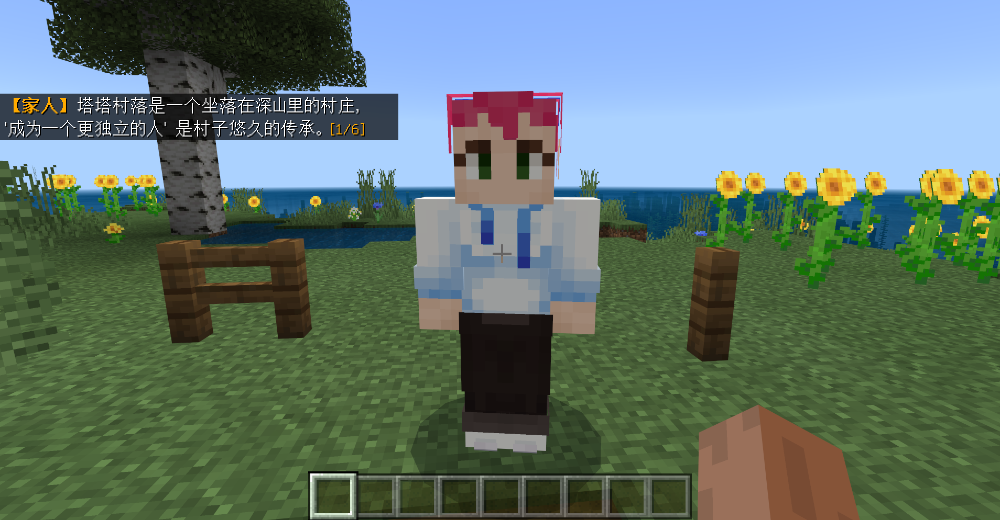

# 使用MODSDK自定义NPC的聊天对话

新手引导是游戏中非常关键的“关卡”，玩家是否可以顺利上手最大程度的取决于新手引导，所以《海滨小岛》也同样需要制作一个简单的引导关卡；我们在出生的小岛设置一个家人NPC，我们可以与之对话并且完成他指定的任务：

提前获取到交互NPC的id作为条件并监听**PlayerAttackEntityEvent**事件

```python
leveldatacomp = serverApi.GetEngineCompFactory().CreateExtraData(serverApi.GetLevelId())
class FarmServerSystem(ServerSystem):
    def __init__(self, namespace, systemName):
        ServerSystem.__init__(self, namespace, systemName)
        # 监听PlayerAttackEntityEvent事件
        self.ListenForEvent(serverApi.GetEngineNamespace(), serverApi.GetEngineSystemName(), "PlayerAttackEntityEvent",
                            self, self.PlayerAttack)
        # 提前获取到的NPCid
        self.guide_id = "-481036336358"
        # 创建一个控制对话阶段的变量
        self.guide_dialogue = {}
        
    # 事件触发的函数
    def PlayerAttack(self, args):
        # 事件获取的玩家id
        self.playername = args["playerId"]
        # 创建指令、方块和物品的接口
        commandcomp = serverApi.GetEngineCompFactory().CreateCommand(serverApi.GetLevelId())
        blockcomp = serverApi.GetEngineCompFactory().CreateBlockInfo(serverApi.GetLevelId())
        itemcomp = serverApi.GetEngineCompFactory().CreateItem(self.playername)
        # 事件获取的生物id
        entityid = args["victimId"]
		# 如果事件获取的生物id和提前获取的NPCid一致
        if entityid == self.guide_id:
            # 获取 player_guide 数据
            guide_data = leveldatacomp.GetExtraData('player_guide')
            # 如果没有此数据则设置一个
            if not guide_data:
                leveldatacomp.SetExtraData('player_guide', self.guide_dialogue)
            else:
                # 如果有就把guide_data传给self.guide_dialogue
                self.guide_dialogue = guide_data
            # 如果self.guide_dialogue={}（说明第一次点击这个NPC）
            if self.guide_dialogue == {}:
                # 使用指令的接口，生成对话和音效
                commandcomp.SetCommand(
                    "execute @a ~ ~ ~ tellraw @a {\"rawtext\":[{\"text\":\" §6§l【家人】 §r§f塔塔村落是一个坐落在深山里的村庄, '成为一个更独立的人' 是村子悠久的传承。 §6[1/6]\"}]}")
                commandcomp.SetCommand("execute @a ~ ~ ~ /playsound random.orb @a ~ ~ ~ 3 1 3")
                # 给变量一个新的参数用于控制进入下一个对话阶段
                self.guide_dialogue["dialogue"] = 0
            # 存储新的player_guide
            leveldatacomp.SetExtraData('player_guide', self.guide_dialogue)
```

现在，当我们点击这个NPC的时候就可以触发对话了：



接下来把所有的对话补齐，也是利用变量和数据的读写控制对话阶段：

```python
leveldatacomp = serverApi.GetEngineCompFactory().CreateExtraData(serverApi.GetLevelId())
class FarmServerSystem(ServerSystem):
    def __init__(self, namespace, systemName):
        ServerSystem.__init__(self, namespace, systemName)
        #···
       	
    def PlayerAttack(self, args):
        #···
            # 如果self.guide_dialogue={}（说明第一次点击这个NPC）
            if self.guide_dialogue == {}:
                # 使用指令的接口，生成对话和音效
                commandcomp.SetCommand("execute @a ~ ~ ~ tellraw @a {\"rawtext\":[{\"text\":\" §6§l【家人】 §r§f塔塔村落是一个坐落在深山里的村庄, '成为一个更独立的人' 是村子悠久的传承。 §6[1/6]\"}]}")
                commandcomp.SetCommand("execute @a ~ ~ ~ /playsound random.orb @a ~ ~ ~ 3 1 3")
                # 给变量一个新的参数用于控制进入下一个对话阶段
                self.guide_dialogue["dialogue"] = 0
                
            elif self.guide_dialogue["dialogue"] == 0:
                commandcomp.SetCommand(
                    "execute @a ~ ~ ~ tellraw @a {\"rawtext\":[{\"text\":\" §6§l【家人】 §r§f每年村庄都会为即将成年的年轻人举办一次成年礼考核,今年留给你的考核就是 §6[2/6]\"}]}")
                commandcomp.SetCommand("execute @a ~ ~ ~ /playsound random.orb @a ~ ~ ~ 3 1 3")
                self.guide_dialogue["dialogue"] = 1
                
            elif self.guide_dialogue["dialogue"] == 1:
                commandcomp.SetCommand(
                    "execute @a ~ ~ ~ tellraw @a {\"rawtext\":[{\"text\":\" §6§l【家人】 §r§f为村庄在乌龟岛上开辟一个海滨农场，作为之后村民度假的旅游点！§6[3/6]\"}]}")
                commandcomp.SetCommand("execute @a ~ ~ ~ /playsound random.orb @a ~ ~ ~ 3 1 3")
                self.guide_dialogue["dialogue"] = 2
                
            elif self.guide_dialogue["dialogue"] == 2:
                commandcomp.SetCommand(
                    "execute @a ~ ~ ~ tellraw @a {\"rawtext\":[{\"text\":\" §6§l【家人】 §r§f为了让你适应，我先带你熟悉一下海滨农场的生活，去试试种下植物吧。§6[4/6]\"}]}")
                commandcomp.SetCommand("execute @a ~ ~ ~ /playsound random.orb @a ~ ~ ~ 3 1 3")
                self.guide_dialogue["dialogue"] = 3
            # 存储新的player_guide
            leveldatacomp.SetExtraData('player_guide', self.guide_dialogue)
```


