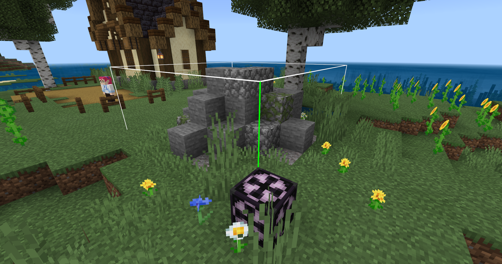

# 在对话聊天过程中添加玩法引导

如果引导只有对话聊天，过程会显得枯燥乏味，而且并不能很好的“引导”玩家，甚至部分玩家根本就不会看对话，所以我们需要在对话中穿插需要去实际操作的玩法，才能让玩家循序渐进，了解地图的内容。

在对话4/6中，给予玩家植物的种子并且指定玩家种植在耕地上：

```python
leveldatacomp = serverApi.GetEngineCompFactory().CreateExtraData(serverApi.GetLevelId())
class FarmServerSystem(ServerSystem):
    def __init__(self, namespace, systemName):
        ServerSystem.__init__(self, namespace, systemName)
        # 监听PlayerAttackEntityEvent事件
        self.ListenForEvent(serverApi.GetEngineNamespace(), serverApi.GetEngineSystemName(), "PlayerAttackEntityEvent",
                            self, self.PlayerAttack)
        # 监听ItemUseOnAfterServerEvent事件
        self.ListenForEvent(serverApi.GetEngineNamespace(), serverApi.GetEngineSystemName(),
                            "ItemUseOnAfterServerEvent", self, self.Item_Use)
        
        # 提前获取到的NPCid
        self.guide_id = "-481036336358"
        # 创建一个控制对话阶段的变量
        self.guide_dialogue = {}
        # 存储物品的变量
        self.guide_itemDict = [
            {
                'name': 'minecraft:farmland',
                'aux': 0

            },
            {
                'itemName': 'farm:spinach_seed',
                'count': 1,
                'enchantData': '',
                'auxValue': 0,
                'customTips': '',
                'extraId': '',
                'userData': {},
            }

        ]
        
    # 事件触发的函数
    def PlayerAttack(self, args):
        # 事件获取的玩家id
        self.playername = args["playerId"]
        # 创建指令、方块和物品的接口
        commandcomp = serverApi.GetEngineCompFactory().CreateCommand(serverApi.GetLevelId())
        blockcomp = serverApi.GetEngineCompFactory().CreateBlockInfo(serverApi.GetLevelId())
        itemcomp = serverApi.GetEngineCompFactory().CreateItem(self.playername)
        # 事件获取的生物id
        entityid = args["victimId"]
		# 如果事件获取的生物id和提前获取的NPCid一致
        if entityid == self.guide_id:
            # 获取 player_guide 数据
            guide_data = leveldatacomp.GetExtraData('player_guide')
            # 如果没有此数据则设置一个
            if not guide_data:
                leveldatacomp.SetExtraData('player_guide', self.guide_dialogue)
            else:
                # 如果有就把guide_data传给self.guide_dialogue
                self.guide_dialogue = guide_data
            # 如果self.guide_dialogue={}（说明第一次点击这个NPC）
            if self.guide_dialogue == {}:
                # ···
            elif self.guide_dialogue["dialogue"] == 0:
				# ···
            elif self.guide_dialogue["dialogue"] == 1:
				# ···
            elif self.guide_dialogue["dialogue"] == 2:
                commandcomp.SetCommand(
                    "execute @a ~ ~ ~ tellraw @a {\"rawtext\":[{\"text\":\" §6§l【家人】 §r§f为了让你适应，我先带你熟悉一下海滨农场的生活，去试试种下植物吧。§6[4/6]\"}]}")
                commandcomp.SetCommand("execute @a ~ ~ ~ /playsound random.orb @a ~ ~ ~ 3 1 3")
                self.guide_dialogue["dialogue"] = 3
                # 设置坐标处为耕地（self.guide_itemDict变量的第一个）
                blockcomp.SetBlockNew((14, 64, 188), self.guide_itemDict[0], 0, 0)
                # 生成粒子在坐标处
                commandcomp.SetCommand("particle minecraft:villager_happy 14 66 188")
                # 给予玩家物品（self.guide_itemDict变量的第二个）
                itemcomp.SpawnItemToPlayerInv(self.guide_itemDict[1], self.playername, )
            # 存储新的player_guide
            leveldatacomp.SetExtraData('player_guide', self.guide_dialogue)

    # 玩家在对方块使用物品时触发
    def Item_Use(self, args):
        # 创建指令接口
        commandcomp = serverApi.GetEngineCompFactory().CreateCommand(serverApi.GetLevelId())
        # 通过事件获取方块的坐标、名称、玩家id和世界id
        x = args['x']
        y = args['y']
        z = args['z']
        blockname = args['blockName']
        playerid = args['entityId']
        worldid = args['dimensionId']
        # 创建方块信息、世界接口
        blockinfocomp = serverApi.GetEngineCompFactory().CreateBlockInfo(playerid)
        gamecomp = serverApi.GetEngineCompFactory().CreateGame(serverApi.GetLevelId())
        # 如果方块名称是耕地并且坐标在设定的位置（说明玩家完成了种植的引导任务）
        if blockname == "minecraft:farmland" and (x, y, z) == (14, 64, 188):
            # 卸载监听
            self.UnListenForEvent(serverApi.GetEngineNamespace(), serverApi.GetEngineSystemName(),
                                  "ItemUseOnAfterServerEvent", self, self.Item_Use)
            # 对话
            commandcomp.SetCommand(
                "execute @a ~ ~ ~ tellraw @a {\"rawtext\":[{\"text\":\" §6§l【家人】 §r§f接下来试试改造建筑，去旁边的资源处挖一些石头吧。§6[5/6]\"}]}")
            # 音效
            commandcomp.SetCommand("execute @a ~ ~ ~ /playsound random.orb @a ~ ~ ~ 3 1 3")
            # 给予玩家一把可以破坏石头的石镐（下一个引导任务的道具）
            commandcomp.SetCommand("/give @s stone_pickaxe 1 0 {\"minecraft:can_destroy\": {\"blocks\":[\"stone\"]}} ")
            # 生成一个结构（下一个引导任务的资源）
            gamecomp.PlaceStructure(None, (14, 65, 202), "design:resource", 0)
            # 生成一个告示牌
            commandcomp.SetCommand("setblock 13 65 186 standing_sign 12")
            # 修改告示牌的文字
            blockinfocomp.SetSignBlockText((13, 65, 186), " 点击升级小湖泊 圆石x1")
            # 生成粒子
            commandcomp.SetCommand("particle minecraft:villager_happy 13 67 186")
            # 修改变量
            self.guide_dialogue["dialogue"] = 4
            
```

添加引导任务后，玩家在对话的过程中就会接收这个”任务“：


继续添加引导任务，让玩家在收集圆石后点击牌子可以改造小池塘并完成引导；

在此之前，我们需要先制作改造后的建筑然后使用结构方块将其保存起来：



```python
leveldatacomp = serverApi.GetEngineCompFactory().CreateExtraData(serverApi.GetLevelId())
class FarmServerSystem(ServerSystem):
    def __init__(self, namespace, systemName):
        ServerSystem.__init__(self, namespace, systemName)
        # 监听PlayerAttackEntityEvent事件
        self.ListenForEvent(serverApi.GetEngineNamespace(), serverApi.GetEngineSystemName(), "PlayerAttackEntityEvent",
                            self, self.PlayerAttack)
        # 监听ItemUseOnAfterServerEvent事件
        self.ListenForEvent(serverApi.GetEngineNamespace(), serverApi.GetEngineSystemName(),
                            "ItemUseOnAfterServerEvent", self, self.Item_Use)
        # 监听ServerBlockUseEvent事件
        self.ListenForEvent(serverApi.GetEngineNamespace(), serverApi.GetEngineSystemName(), 'ServerBlockUseEvent',
                            self, self.Upgrade)
        
		#···
        
    def PlayerAttack(self, args):
        #···

    def Item_Use(self, args):
        #···
        
    # 玩家点击方块触发的函数
    def Upgrade(self, args):
        # 存储需要的物品的变量
        stone_block = {"minecraft:cobblestone": 1}
        # 事件获取的方块名称和玩家id
        blockname = args['blockName']
        playerid = args['playerId']
        # 创建逻辑需要用到的相关接口
        blockinfocomp = serverApi.GetEngineCompFactory().CreateBlockInfo(playerid)
        commandcomp = serverApi.GetEngineCompFactory().CreateCommand(serverApi.GetLevelId())
        gamecomp = serverApi.GetEngineCompFactory().CreateGame(serverApi.GetLevelId())
        # 如果点击的方块是告示牌
        if blockname == "minecraft:standing_sign":
            # 获取告示牌的文字
            text = blockinfocomp.GetSignBlockText((13, 65, 186))
            # 如果文字一致
            if " 点击升级小湖泊 圆石x1" in text:
                # 获取玩家背包物品
                item_comp = serverApi.GetEngineCompFactory().CreateItem(playerid)
                item_dict_list = item_comp.GetPlayerAllItems(serverApi.GetMinecraftEnum().ItemPosType.INVENTORY)
                # 根据槽位依次循坏玩家背包
                for index, item_dict in enumerate(item_dict_list):
                    # 如果是空的就继续下一次循环
                    if item_dict is None:
                        continue
                    # 如果是物品信息字典的物品名在变量中
                    if item_dict["newItemName"] in stone_block:
                        # 获取需要的物品数量
                        item_count = item_dict["count"]
                        # 将该槽位的物品数量-1
                        item_comp.SetInvItemNum(index, item_count - 1)
                        # 替换告示牌为空气
                        commandcomp.SetCommand("setblock 13 65 186 air")
                        # 在坐标位置放置结构
                        gamecomp.PlaceStructure(None, (5, 63, 186), "farm:rockery", 0)
                        # 对话
                        commandcomp.SetCommand(
                            "execute @a ~ ~ ~ tellraw @a {\"rawtext\":[{\"text\":\" §6§l【家人】 §r§f很棒！接下来乘船去岛上找图书馆管理员吧，他会帮你的。§6[6/6]\"}]}")
                        # 在小岛码头旁生成小船
                        self.CreateEngineEntityByTypeStr("farm:guide_boat",(35,62,168),(0,0),0)
                        # 音效
                        commandcomp.SetCommand("execute @a ~ ~ ~ /playsound random.orb @a ~ ~ ~ 3 1 3")
                        # 存储完成引导的玩家id
                        leveldatacomp.SetExtraData("player_id", playerid)
                        # 更新控制对话阶段的变量
                        self.guide_dialogue["dialogue"] = 5
                        # 卸载本事件的监听
                        self.UnListenForEvent(serverApi.GetEngineNamespace(), serverApi.GetEngineSystemName(),
                                              'ServerBlockUseEvent', self, self.Upgrade)
                        # 存储新的player_guide
                        leveldatacomp.SetExtraData('player_guide', self.guide_dialogue)
                        break

```

至此，较完整的新手引导关卡就制作完成了：


完成引导后，现在还无法离开新手岛屿，所以我们需要进一步制作使玩家可以离开这里前往新的小岛。


