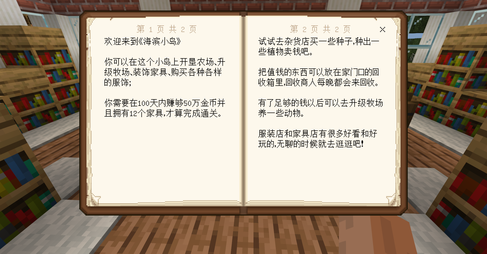

# 制作小船带玩家离开新手岛

完成新手引导后，玩家需要乘船离开岛屿，先制作一个小船使其可以漂浮在水上并且具有寻路的组件：

```json
{
    "format_version":"1.16.0",
    "minecraft:entity":{
        "description":{
            "identifier":"farm:guide_boat",
            "is_spawnable":true,
            "is_summonable":true,
            "is_experimental":false
        },
		"components": {
            "minecraft:buoyant": { //使实体可以像船一样漂浮在水面上
				"apply_gravity": true,
				"base_buoyancy": 1.0,
				"simulate_waves": true,
				"big_wave_probability": 0.03,
				"big_wave_speed": 10.0,
				"drag_down_on_buoyancy_removed": 0,
				"liquid_blocks": ["water"]
			},

			"minecraft:underwater_movement": { //水中的移动速度
				"value": 0.25
			},
			"minecraft:navigation.walk": { //寻路组件（不会沉底）
				"can_sink": false
			},
			"minecraft:rideable": { //玩家可以骑乘实体
				"seat_count": 1,
				"family_types": ["player"],
				"interact_text": "action.interact.enter_boat",
				"seats": {
					"position": [0, 0.5, 0]
				}
			},

            "minecraft:follow_range": { 
                "value": 64,
                "max": 64
          },
			"minecraft:health": { 
				"value": 10,
				"max": 10
			},
			"minecraft:movement": { 
				"value": 0.25
			},
			"minecraft:movement.basic": {}, 
			"minecraft:collision_box": {
				"width": 1,
				"height": 1
			},
			"minecraft:physics": {} 
		},
        "component_groups":{
			"boat_finding":{ //通过py添加的组件组，使船可以寻找特定的方块并移动至方块位置
				"minecraft:behavior.move_to_block": {
					"priority": 0,
					"tick_interval": 1,
					"start_chance": 1.0,
					"search_range": 64,
					"search_height": 10,
					"goal_radius": 1.0,
					"stay_duration": 999.0,
					"target_selection_method": "nearest",
					"target_offset": [
						0,
						0,
						0
					],
					"target_blocks": [ //寻找的方块
						"minecraft:double_wooden_slab:1"
					],
					"on_reach": [ //到达附近触发的事件
						{
							"event": "reach_boat",
							"target": "self"
						}
					]
				}
				
			}

        },
        "events":{
			"start_boat":{ //添加组件组的事件
				"add":{
					"component_groups":["boat_finding"]
				}
			},
			"reach_boat":{ //船到达目的地触发的事件，py将监听此事件
			}
        }
    }
}
```

在"minecraft:behavior.move_to_block"中，设置小船寻找的方块为**"minecraft:double_wooden_slab:1"**，这个方块是双层的云杉木半砖，所以我们需要对地图做一些简单的修改，将码头最外侧的一个云杉木板改为双层云杉木半砖，外观上完全一致，并且可以让小船寻找这个方块前往码头：


玩家完成引导任务后会创建船的实体，需要使用py检测玩家坐上船后触发船的组件并且监听船到达目的地的事件：

```python
leveldatacomp = serverApi.GetEngineCompFactory().CreateExtraData(serverApi.GetLevelId())
timecomp = serverApi.GetEngineCompFactory().CreateTime(serverApi.GetLevelId())
class FarmServerSystem(ServerSystem):
    def __init__(self, namespace, systemName):
        ServerSystem.__init__(self, namespace, systemName)
        # 监听EntityStartRidingEvent事件
        self.ListenForEvent(serverApi.GetEngineNamespace(), serverApi.GetEngineSystemName(),
                            "EntityStartRidingEvent", self, self.Start_Gam
                           )
        # 监听EntityDefinitionsEventServerEvent事件
        self.ListenForEvent(serverApi.GetEngineNamespace(), serverApi.GetEngineSystemName(),
                            'EntityDefinitionsEventServerEvent',
                            self, self.EntityEvent)
        # ···
        
    def Start_Game(self, args):
        # 通过事件获取玩家id和船的id
        self.start_playerid = args["id"]
        boatid = args["rideId"]
        # 获取数据player_guide
        self.guide_dialogue = leveldatacomp.GetExtraData("player_guide")
        # 如果guide_dialogue的dialogue值等于5（说明玩家已经完成新手引导）
        if self.guide_dialogue等于5["dialogue"] == 5:
            # 创建触发实体事件的组件
            entityeventcomp = serverApi.GetEngineCompFactory().CreateEntityEvent(boatid)
            # 触发小船的"start_boat"事件
            result = entityeventcomp.TriggerCustomEvent(boatid, "start_boat")
	
    def EntityEvent(self,args):
        # 获取的实体触发的事件名
        eventname = args['eventName']
        # 如果事件名不是"reach_boat"就返回
        if eventname != "reach_boat":
            return
        # 获取被骑乘者(船)的id
        entityid = args['entityId']
        # 获取乘船玩家的id
        rider_id = serverApi.GetEngineCompFactory().CreateRide(entityid).GetEntityRider()
        # 执行创建数据的函数，并将玩家id作为参数
        self.start_game_data(rider_id)
        # 创建传送玩家的接口
        playertpcomp = serverApi.GetEngineCompFactory().CreatePos(self.start_playerid)
        # 传送玩家到坐标位置
        playertpcomp.SetPos((55, 63, 131))
        # 销毁船
        self.DestroyEntity(entityid)
        # 重置世界时间为0
        timecomp.SetTime(0)
            
    # 新手引导结束，开始游戏触发的函数
    def start_game_data(self, playerid):
        # 设置初始数据：玩家钱数为100
        leveldatacomp.SetExtraData("player_coin", 100)
        # 设置初始数据：玩家家具为0
        leveldatacomp.SetExtraData("player_furniture", 0)
        # 将初始数据存放在event变量中并发送事件到客户端创建数据ui
        event = {"playerid": playerid, "player_data_coin": leveldatacomp.GetExtraData("player_coin"), 
                 "player_data_furniture": leveldatacomp.GetExtraData("player_furniture")}
        self.NotifyToClient(self.playername, "create_data_ui", event)
            
```


现在，《海滨小岛》已经有了一个完整的新手引导，玩家在乘船登上新岛屿后就可以开始正常的游戏了，当然我们也可以继续添加引导使玩家对玩法更加清晰，比如在图书馆里放置一个指引书供玩家阅览。




