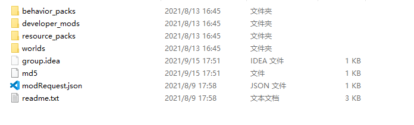

# 知识点拆解

本节将通过官方插件的分析，加强概念的理解。

## 文件结构

按照下列流程，找到之前举例安装的neteaseDaily的文件夹。

1. 基岩版服务器
2. 插件
3. neteaseDaily
4. 右键，打开目录

在弹出的文件夹中，可以看到插件目录下，有4个文件夹。



那么behavior_packs中所包含的，就是发送到玩家设备上运行的客户端mod；developer_mods中所包含的，是运行在服务器上的mod；resource_packs中所包含的，是客户端的资源文件，也会被发送到玩家设备；worlds是mod的地图信息。

如果对这部分有所遗忘，可以点击[这里](../3-插件知识进阶/3-插件文件夹结构.html)进行回顾。

## 回调

回调是编程中非常常用的一个技术，在ModSDK和Apollo插件的开发中，也经常用到它。

比如在监听事件时，用到的ListenForEvent中，就用到了它。

例如下方的语句中，self.OnServerChat就是一个回调函数，在ListenForEvent函数调用后，引擎会将其保存，并在ServerChatEvent触发时，调用这个函数。

```python
self.ListenForEvent(serverApi.GetEngineNamespace(), serverApi.GetEngineSystemName(), 'ServerChatEvent', self, self.OnServerChat)
```

在Apollo开发中，也同样经常用到回调函数，就比如在neteaseDaily中。

打开```developer_mods/neteaseDailyDev/neteaseDailyScript/dailyServerSystem.py```，在这个文件中，可以看到RequestToService之后，调用了DailyServerRender函数作为回调函数。

```python
	def OpenDailyReward(self, uid):
		"""
		使一个玩家打开每日登录奖励的界面
		"""
		stamp = time.time()
		print 'OpenDailyReward', uid, stamp
		playerId = netgameApi.GetPlayerIdByUid(uid)
		if not playerId:
			print 'can not get playerId by uid: %s' % uid
			return
		if self.mRewards is None:
			logout.warning('因无可用奖励配置无法打开每日登录奖励界面')
			return
		if stamp < self.mRewards[0][0]:
			print 'not yet', self.mRewards[0][0]
			return
		self.RequestToService(
			dailyConst.ModName,
			dailyConst.DisplayDailyRewardEvent,
			{'uid': uid, 'stamp': stamp},
			lambda rtn, data: rtn and self.DailyServerRender(playerId, dailyConst.DisplayDailyRewardEvent, data)
		)
```


## 功能服

功能服连接所有服务器和数据库，能够获取所有服务器的信息，可以处理一些全服操作。

比如在聊天插件中，如果在本地频道发消息，不需要经过功能服转发，但如果要在世界频道发消息，就需要在功能服中进行转发，把消息发到所有大厅服和游戏服。

具体代码可以下载官方聊天插件 neteaseChatService 查看。

## 数据库

在官方插件云端玩家信息插件，neteaseCloud中，找到mod.sql文件。

这个文件便是插件的MySQL数据表结构。文件如下:

```sql
-- ###########################version1.0.0####################
-- 云端背包
CREATE TABLE IF NOT EXISTS `neteaseCloudItems` (
`_id` INT UNSIGNED NOT NULL auto_increment COMMENT '唯一ID，自增',
`uid` BIGINT UNSIGNED NOT NULL COMMENT '玩家uid',
`cloud_items` varchar(10000) NOT NULL DEFAULT '' COMMENT '记录云背包内容',
PRIMARY KEY (_id) COMMENT '主键',
INDEX `uid_idx` (`uid`) COMMENT '索引'
)ENGINE=InnoDB DEFAULT CHARSET=utf8mb4;
-- ###########################version2.0.0####################
alter table neteaseCloudItems add column apply_tag varchar(20) not null default "";
ALTER TABLE neteaseCloudItems ADD INDEX apply_tag_index (`apply_tag`, `uid`);
```

sql文件使用SQL语句编写，需要掌握一定的SQL知识，可以访问下方链接进行了解。

https://www.w3school.com.cn/sql/index.asp

而这个数据表，则存储了玩家的背包信息和uid，服务器可以很方便地使用uid查找到对应的背包信息。