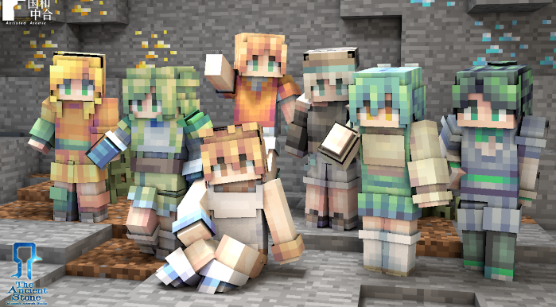

# 让角色与众不同——了解皮肤的概念

#### TAG：皮肤 理论 概念

#### 作者：上古之石

#### 什么是皮肤？

皮肤是《我的世界》中必不可少的元素，是彰显角色个性的存在。
如果从玩家角度来说，皮肤是衣服一样的设定，那么在开发者眼中又会是怎样的呢？如果想创作一个属于自己的专属皮肤又该如何制作呢？
以上问题将在本次教程中得到解答，相信通过本次皮肤入门教程，大家一定会有所收获~

从概念上看，皮肤是由一张人物贴图所构成。这时候你可能会问：什么是贴图？其实贴图可以理解为将“体”按照自身的结构，平铺展开成“面”。即，在未使用前它是平面的，而在使用后，玩家的人物给予了它体积和框架，让贴图被填充并且立体了起来。

#### 皮肤的魔法——分辨率

你们知道吗？皮肤的绘制精细度其实是可选择的。
决定精细度关键在于“分辨率”，分辨率越高则精细程度越高，可进行细微调整的格子越多。目前最基础的常用官方贴图规格为16x，但其实贴图的分辨率精细度是可设置调节的，接下来让我们来认识一下不同分辨率尺寸的皮肤表现。

#### 观看对比后，是否对不同分辨率的皮肤有了初步的概念？

不同皮肤分辨率尺寸给予到视觉效果上的精度提升，分辨率其实就是决定贴图高清精细与否的决定要素之一。
对于刚刚开始练习的初学者，推荐大家选择官方规格的16X进行绘制。想要挑战极致精细程度的，可以选择其他规格。前提当然是先掌握好基础的绘制知识，其他的升级挑战就都不是问题啦~
注意：目前skin3d不支持32x的皮肤绘制，如有对应像素尺寸的皮肤需求，大家可以选择blockbench。