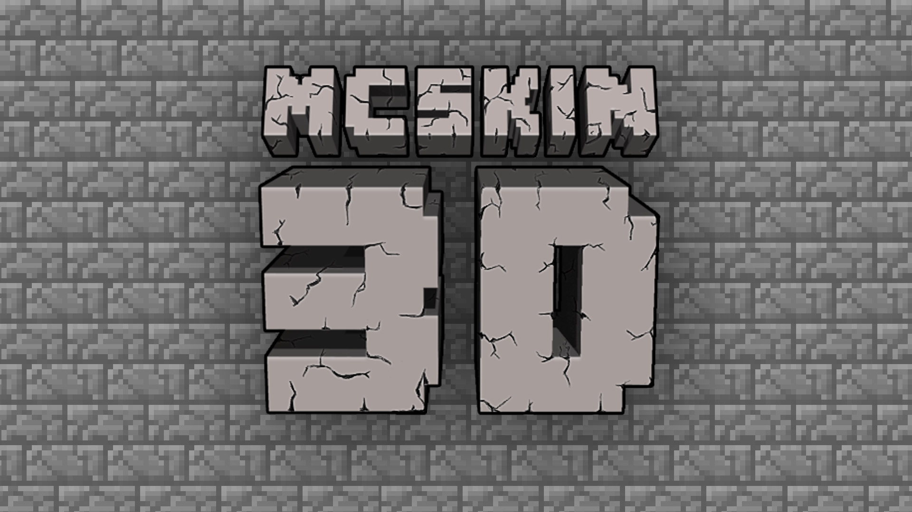
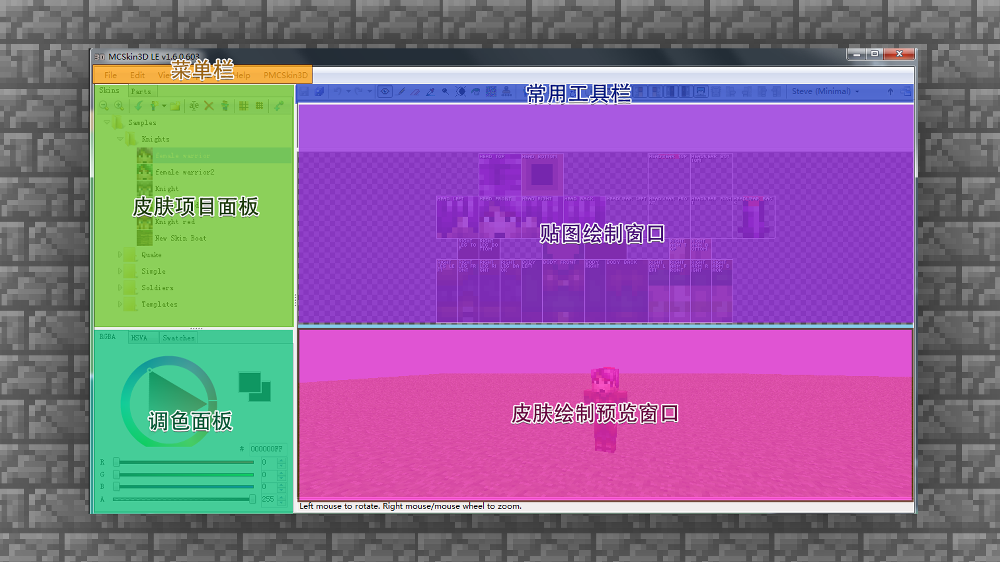
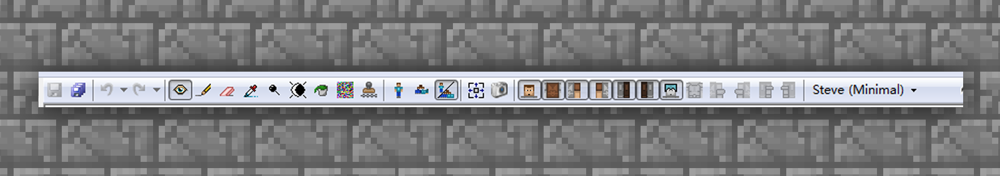
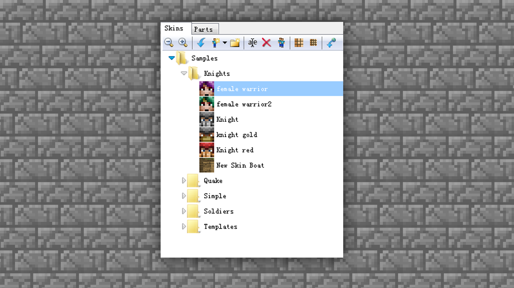
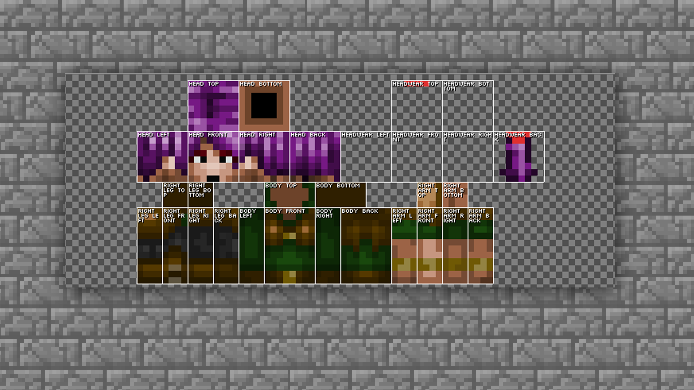
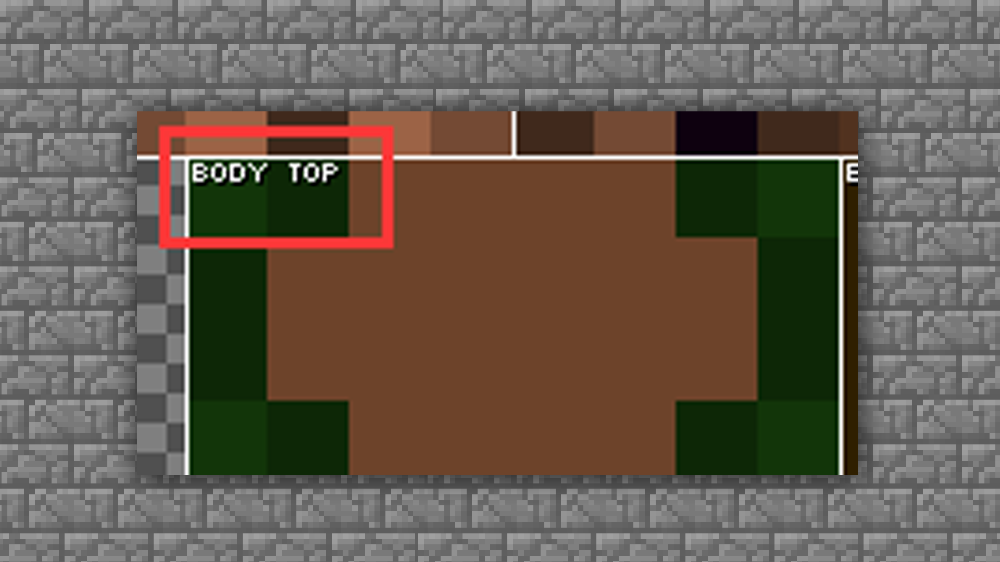
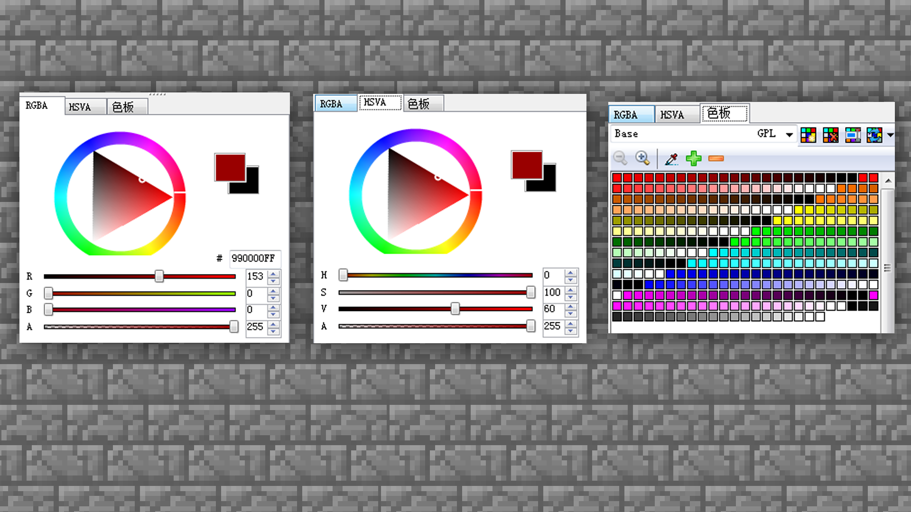
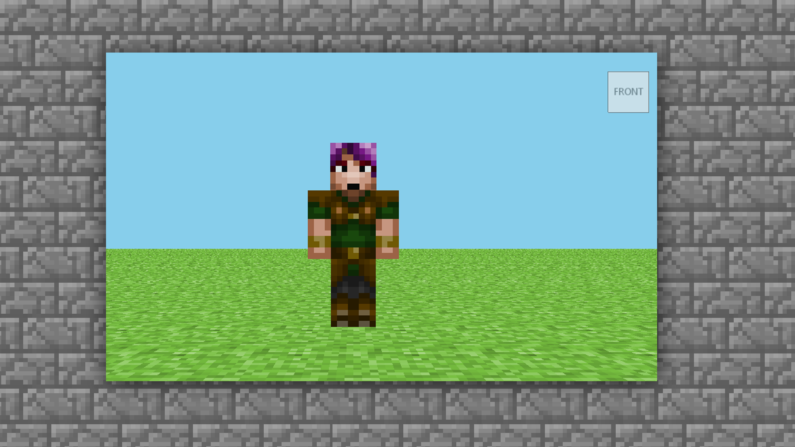
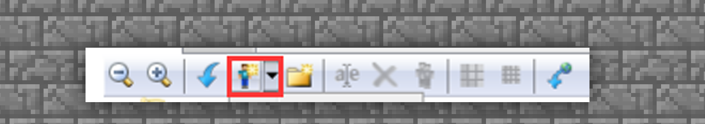
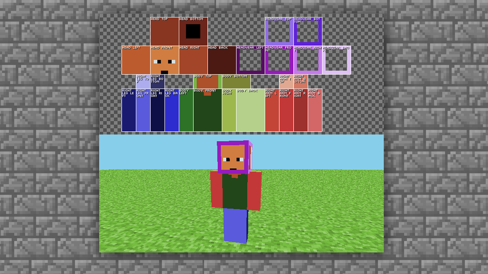

# 创造一个专属皮肤——设计皮肤&MCSKIN3D软件

#### TAG：皮肤设计 MCSKIN3D

#### 作者：上古之石

#### 创造一个专属皮肤——设计皮肤&MCSKIN3D软件

通过上述基础概念的讲解，相信大家对于皮肤有了大致的领悟。但是实践出真知，接下来让我们一起来通过MCskin3D软件，来实际制作一个属于自己的个性皮肤吧。

#### MCskin3d 界面介绍

MCskin3d是一款免费的皮肤制作器，通过它，大家可以对《我的世界》中的皮肤进行制作、使用。你可以在不断的尝试中，找到最适合自己的皮肤绘制方法，同时在软件中还能浏览所有皮肤，以及批量化管理。此编辑器支持在3D视图下编辑，也支持2D视图编辑，还支持3D和 2D各一半视图的编辑，让皮肤设计不再是难题。

接下来我们就一起学习一下如何操作吧~

——首先，我们下载好MCSKIN3D并打开软件界面。

如下图所示，软件界面清晰的分成六大区块：菜单栏、常用工具栏、皮肤项目面板、贴图绘制窗口、调色面板、皮肤绘制预览窗口。

菜单栏：集合MCSKIN3D的所有功能和操作命令，共包括5个大类菜单，通过菜单的操作可以完成项目素材管理、编辑项目、调整视图等操作。

常用工具栏：包含了绘制和编辑皮肤贴图时经常使用的工具，直接单击工具栏中的按钮，即可选择相应的编辑操作，如镜头调整、绘制工具、橡皮擦、取色、皮肤展示模式选择等。要想学好MCSKIN3D首先就要将工具的的功能都进行试用~

皮肤项目面板：所有新建的皮肤或者绘制好的皮肤文件都会保存在这个面板之内，可以直观的从小图标上进行区分，并且可以给皮肤在此处右键进行【重命名】。并且还可以进行放大缩小、复制、升降分辨率的操作，十分清晰和方便。

贴图绘制窗口：该区域是用作贴图细微调整的时候，很重要的部分。像眼睛调色、人物刘海、衣服的饰品绘制的时候就需要用到此部分。当操作熟练时，则基本上可以直接在贴图上进大体绘制，事后进行模型贴图的来回切换及调整。此部分较为进阶，当大家有一定的熟练度后再做尝试即可。

贴图的每一块都已经写上了模型块命名，可以很好的找到需要绘制的部分。如果还是较难区分，那稍后用以下办法进行绘制就可以很好的前期区分色模型区块。

调色面板：色彩调和和选择的面板，在这里可以选择和调出自己喜欢的颜色，然后使用绘图工具进行上色就OK啦。当然这里还有一个黑科技就是色板，可以将自己喜欢的颜色或使用过的颜色在色板进行保存，这样可以方便调取出来。

皮肤绘制预览窗口：绘制好的皮肤会在这个部分进行3D展示和阅览，可以精确的使用鼠标移动视角，看到皮肤呈现的效果和画面感觉。这里预览的模型和游戏内是一样的尺寸，大家完全可以放心调整。

#### MCskin3d 新建皮肤种类

模块都介绍完毕，就让我们开始进入实际操作的环节吧。

首先，在皮肤项目面板中的菜单栏中找到新建皮肤的按钮。

然后选择想要绘制的皮肤类型模型，ALEX 和 STEVE 对应的是最新双层皮肤贴图模型，有minimal标签的是老版本的的贴图模型，即单层皮肤版本ALEX和STEVE。

那什么是单层皮肤，什么是双层皮肤呢？通过案例来学习一下吧。

—单层皮肤：是皮肤只有一层，手臂双脚都只能绘制一种样式，然后软件自动进行镜像复制。一般适合新手练习使用。

—双层皮肤：是指在单层皮肤的基础上再贴图叠加一层，相当于给人物再穿了一个衣服，戴了一个帽子。而且双层皮肤的手脚左右都可以单独绘制，软件不会镜像复制。对于创作来说增加了更多的乐趣和选择。一般都是新手进阶后常选的皮肤格式。

