# MCskin3d 绘制皮肤-新建及头部的绘制

#### TAG：皮肤 头部 绘制 新建

#### 作者：上古之石

#### MCskin3d 绘制皮肤-头部的绘制

那么，我们的入门学习就从单层皮肤开始吧。先新建一个单层的STEVE皮肤。

选择【Skins】→【Players】→【Steve（Minimal）】

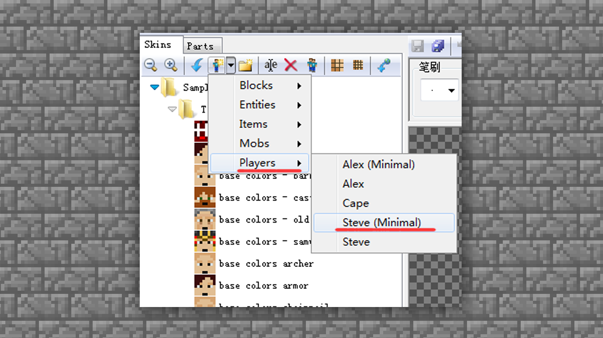

确认新建行为后，我们可以看到软件中生成了一个原版的Steve。打开工具栏中的2D/3D混合模式。将贴图和模型一起展示出来。

注：当然也可以直接上手绘图，只要自信充足什么模式开始都可以。

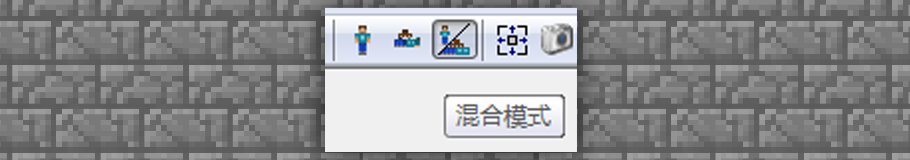

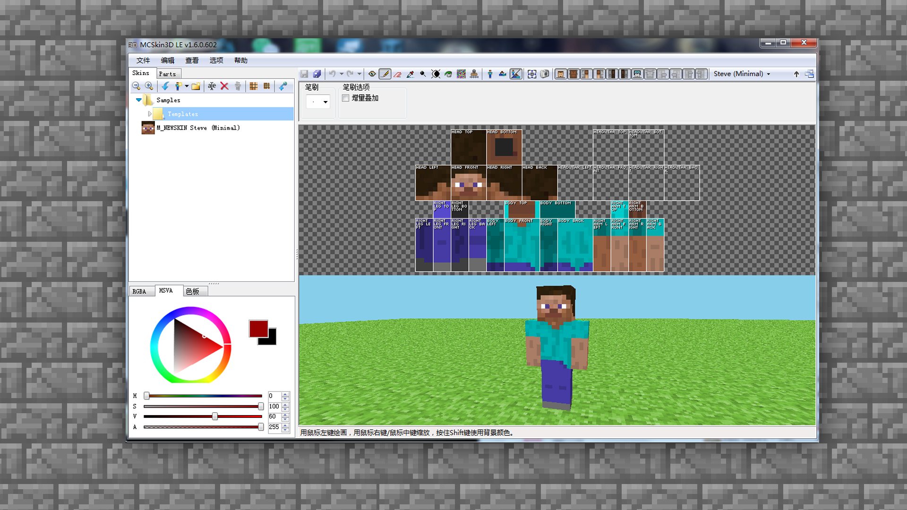

首先，我们开始绘制头部。将头部以外的区域全部取消显示。

点击框内示意选项，从工具栏中将头部以外的部分全部取消显示。

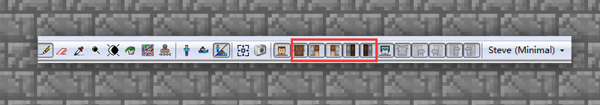

躯干手脚部分都点掉之后，就剩下头部、头盔，这样就可以进行精准的绘制啦。

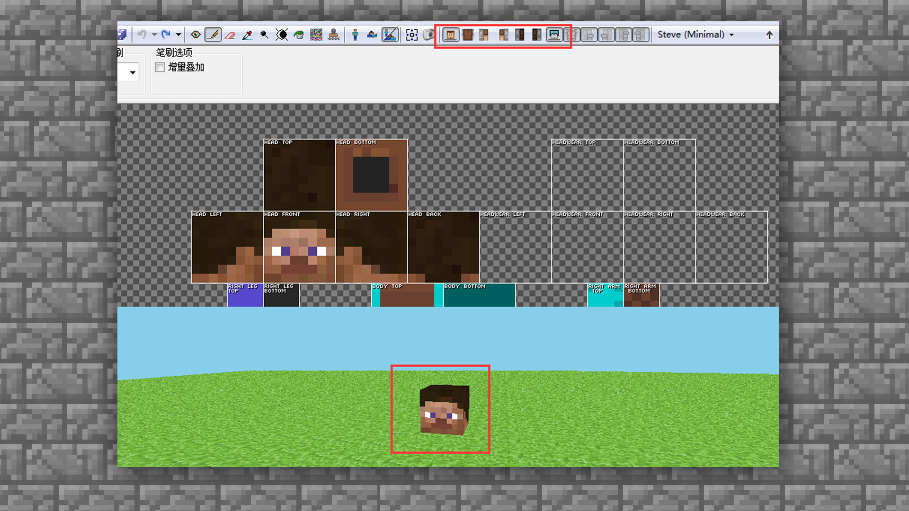

头部的结构是每一个面为8*8的像素格子，在这有限的格子中，我们如需绘制眼睛、头发、嘴部等全部内容，对于格子数量是比较紧张的。

所以，有部分的内容我们就需要取舍。并且需要注意，在绘制的时候一般颜色取色不要过于的鲜艳或者过于的重（饱和度过高），例如亮红色或者是深黑色。

（以上案例都不建议大家使用噢~因为不利于后期的美化）

正确的取色选择方式可以参考以下两种：

第一，可以选择一个比较中间色的色彩，比如黑灰白，灰色是介于黑和白之间的，即灰色在后期可以增加阴影和高光，很适合作为中间色。

第二，大家可以选择自己喜欢或者想要绘制的人物图片案例直接进行取色，也是可以的。

在案例中，我们选择几个中性的头部皮肤、头发可以加减阴影高光的颜色，来给大家做演示。

色彩选好后，使用工具栏中的铅笔模式，进行头部的绘制。先选好的两个颜色分别在贴图空白处留色。

（注：所有的取色都可以在贴图外的地方进行留色，这样可以很好的保证色彩不会在后期绘制后偏移原色噢~在贴图显示外的地方留色不会影响到人物皮肤本身，所以空白处可以随意使用，并且还可以留下作者的署名。）

先将脸部的颜色上色。目前的操作为底色上色，可以直接使用铅笔大笔刷直接涂刷。

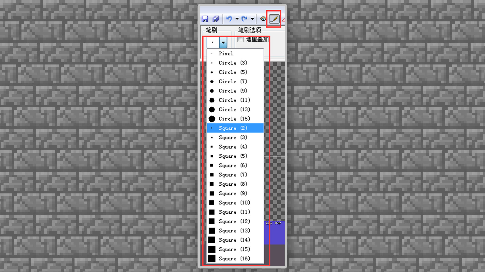

将head模型块的【top】头顶、【bottom】下巴链接脖子的部分、【front】脸、【Right】右边侧脸、【Left】左边侧脸、【Back】后脑勺，全部涂满皮肤底色。

#### 头发的画法：

接着来绘制一下头发，头部区域的发型在可绘制程度上有一定的局限性，我们可以通过刘海来增加皮肤的美观度。

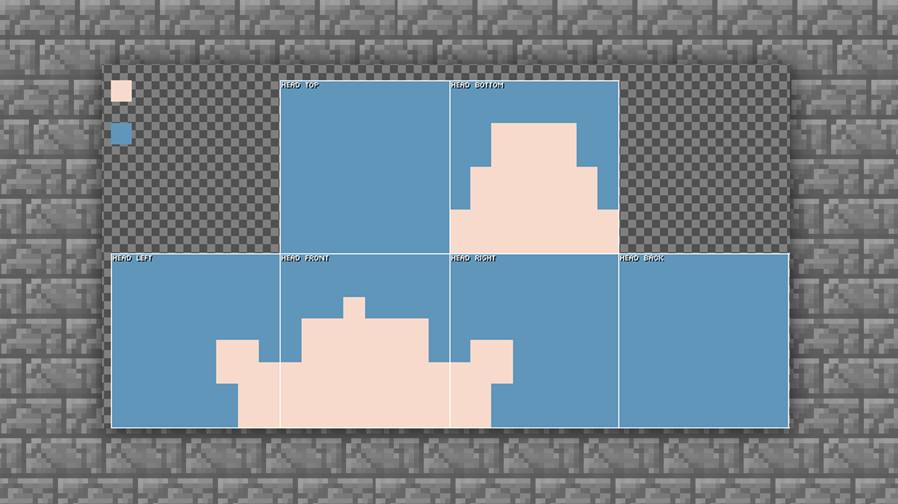

第一部分的底色刘海只需要有一个大概的分布形状就可以了，因为后面会通过头盔进行叠加，所以大家不需要过于纠结刘海在初步的表现中好像有点呆板的问题。

完成一个好看的皮肤需要在后期加入很多美化要素。

接下来，开始给头发进行阴影的叠加，也就是给头发纹路进行上色。让头发看上去更加自然。

我们选择工具栏里面的变亮/变暗工具：

此处工具的强度大家可以自行根据实际调整，找寻绘制的手感。变亮是用来体现高光部分，所以先从暗部阴影开始增加质感。

头发的纹理大家都知道是一条一条的，那么像素里面也是一样需要尝试逐条往下进行绘制。

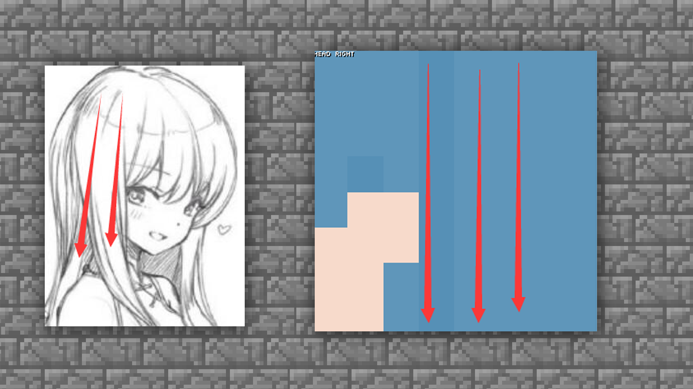

如图所示，先一条隔一条的先把纹路区分出来。

目前的纹路虽然可能比较僵硬，但却对头发的层次有了初步的表现。那么接下来就是重要的环节：暗部阴影的叠色。

从第一个压暗的区域空出一格，一条线画下去。然后空出的格数可以根据个人的视觉效果进行调整。一直重复阴影加深，头发的层次就会凸显出来了。

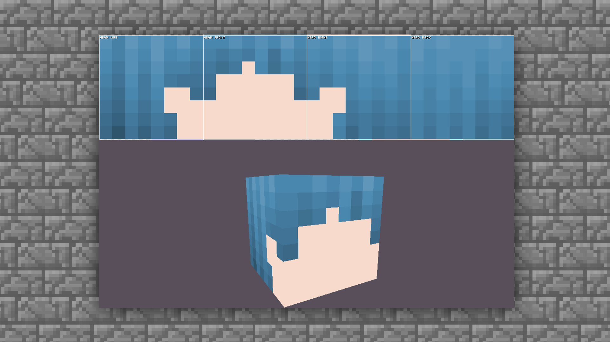

注意：很多时候不需要很有规则的去涂，非常有规律的涂抹会让表现看上去很死板。

接下来增加一个高光部分，高光不需要全涂，只需要部分就好。比如跟例图中的高光一样，头发给个局部亮点的感觉即可。

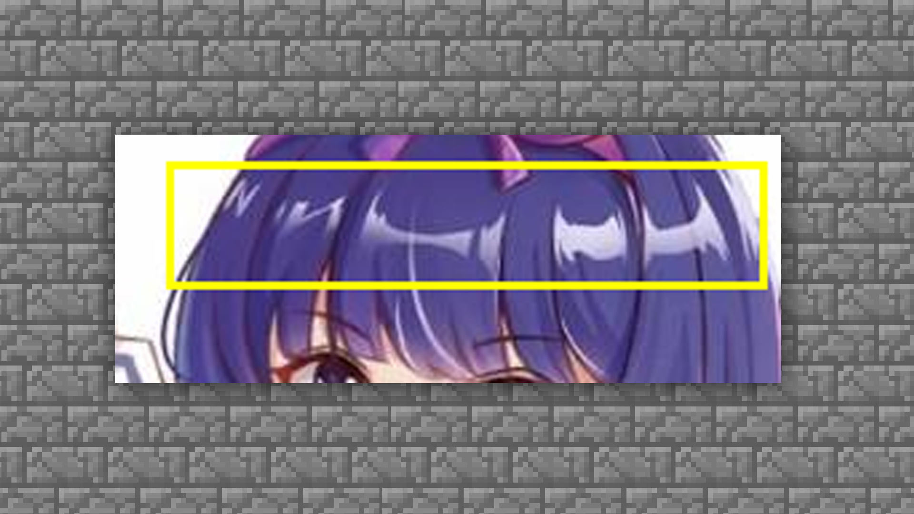

在工具的选择中，需要在变亮/变暗中间选择变亮。为了稍微明显的高光，例图中将强度增加了3，大家可以根据自己的视觉效果进行选择。

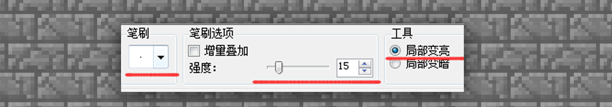

然后选择高光最亮的区域，一般是在额头偏上中间的部分。

直接使用工具画一条增亮。

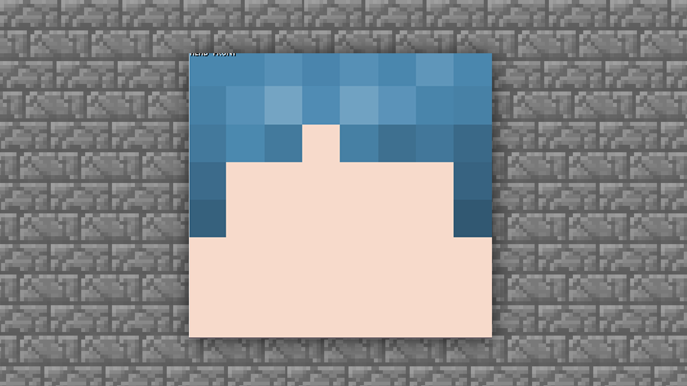

这样的增加后，是不是觉得头发凸出来了一点。

随后我们把周围的渐变过渡调整自然。

接下来开始绘制头顶部分，按照通俗的理解，头顶部分一般是有个【旋】的，即头发是根据一个或多个中心点分散开来。

所以在目前的案例中，如果需要绘制一个中分的感觉，那么需要继续使用变暗功能。

头发分出左右各一半的感觉，然后就开始进行对其他头发垂直方向的绘制。

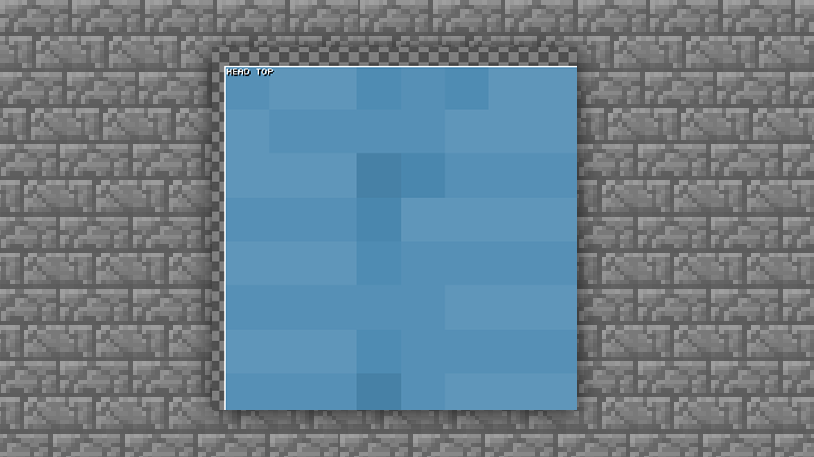

完成当前步骤后，可以看到头顶部分已经有了一定雏形。接下来，需要紧跟着上方已经讲过的内容，将阴影部分和高光部分绘制出来。

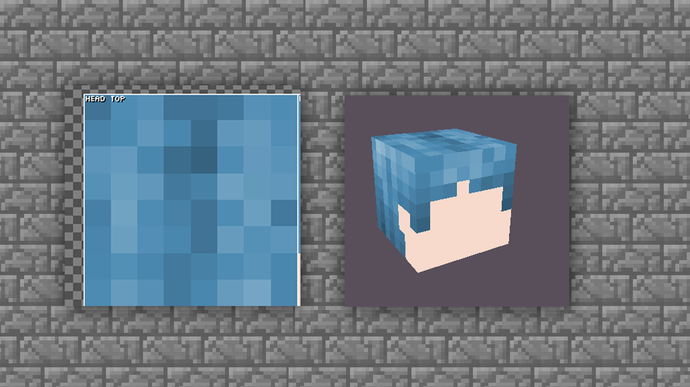

在补齐阴影及高光后，头发的绘制就基本完成。很多细节绘制的部分大家可以根据个人的喜好进行调整。

#### 脸部的画法

接下来，将继续细化脸部。脸部的画法一般是根据头发根部走向进行绘制，同样需要增加阴影和高光。

#### 继续使用【变暗工具】

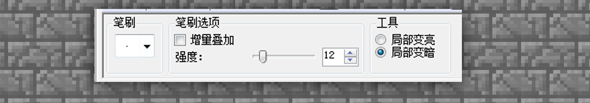

跟着头发的根部绘制一圈阴影。使用叠加的效果，就可以绘制出面部的阴影啦。

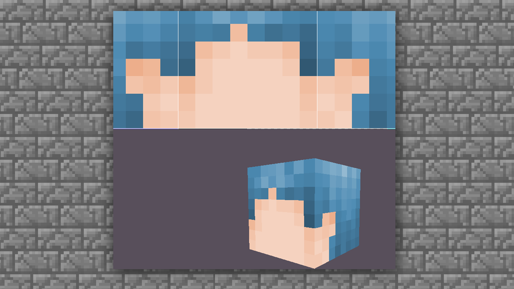

目前的脸部比较平整，我们可以使用高光增加体积感。

脖子以下的部分，因为是盲区，可以稍微画一下就行。大概的涂抹部分阴影效果，同样使用变亮变暗工具进行绘制即可。

完成当前步骤后，脸部的表现大致都差不多了，接下来就要开始头部最重要的两个加分点：刘海（头盔部分）和眼睛。

我们先从刘海开始。

#### 刘海的画法

刘海的绘制部分就是贴图内的头盔绘制部分。

一般来说，如果头发部分已经完成，大家可以使用PS工具进行复制直接修改，当然如果对PS不是很熟悉，那我们就根据头发的画法，再把刘海部分绘制一遍即可。

这就是头发的第二层刘海的部分，目前看起来很呆板，所以我们需要进行调整。

即对边缘进行两次修剪。

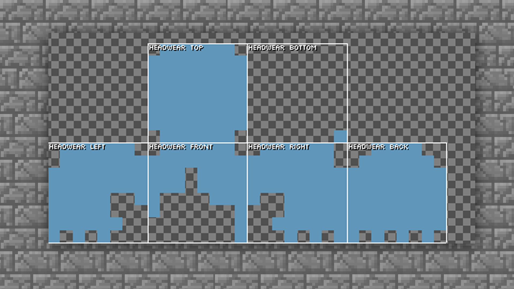

然后我们根据一层头发的阴影表现，进行二层头盔的阴影及高光的上色处理。

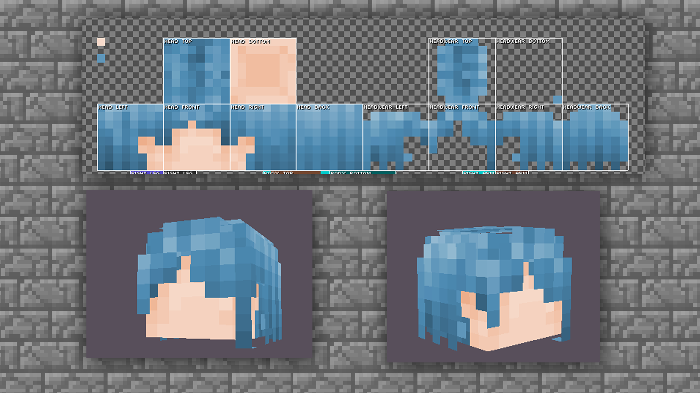

这样修剪过的头发就会变得很自然了，再对颜色阴影进行一些细化调整后，我们就可以画五官眼睛啦。

#### 画眼睛

五官的画法其实分两种，第一种是大家经常使用的常规两格画法，第二种就是日式三眼画法。嘴的部分通常由大家根据自己的喜好自行选择

第一种：常规两格眼睛绘制方法。眼睛的高度最好再脸部的第五到七排。不同的高度位置可以让眼睛展现的状态是不同的。

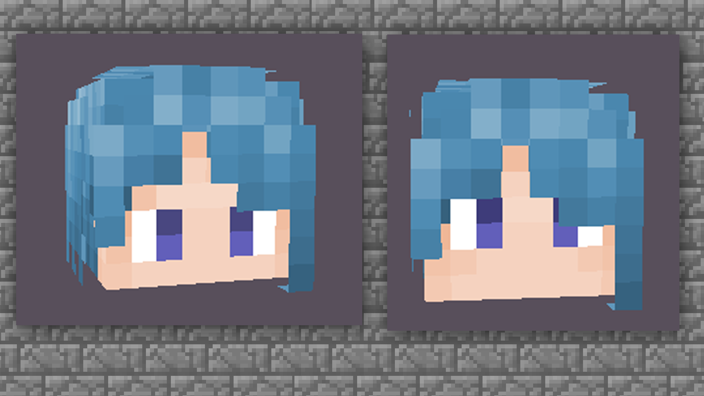

第二种：这类就是偏日式一些的绘制方法，让两眼之间距离变远，并且加上眉毛和淡淡的腮红，效果上会更偏向萌系。

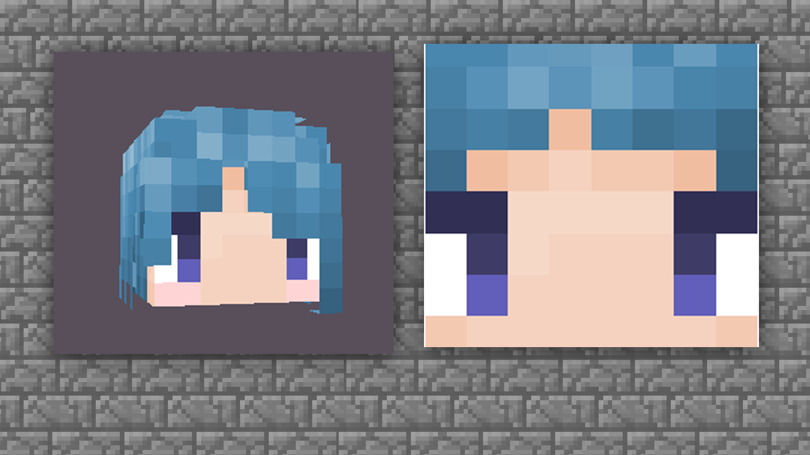

所以大家根据自己的喜好及审美来绘制眼睛即可，同时多尝试给眼睛加上一定的明暗调节。

至此，我们就完成了对头部的绘制步骤。开好了头，那么接下来的绘制就会更加顺利。