# MCskin3d 绘制皮肤-四肢的绘制及完稿

#### TAG：皮肤 四肢 上肢 下肢 完稿

#### 作者：上古之石

#### 手脚的绘制

通过头部和身体的绘制，我们基本对于绘制整体结构的方法有了一定的了解。
手脚的绘制在单层皮肤中只需要绘制一个就会自动变成两个，类似于镜像的感觉。而在双层皮肤中则是不一样的，这里也有一点内容需要注意一下。
首先我们先把手臂部分取消隐藏。

【工具栏】→【混合模式】打开&单独显示【手臂部分】左右都可以

#### —颜色的选择

手脚的衣服颜色就根据本身身体的衣服颜色进行选择即可，如果设计上是无袖的话，根据面部的调色绘制肤色就好了。
接下来就让我们直接开始吧，先将手臂的底色按照衣服的底色进行涂抹。

别忘记把手的部分画出来哦。

然后可以先画出大体的阴影，上肢可以大体分成三部分：即臂、前臂、手部，因为方块的体积是一样的，所以我们只要用阴影把手臂分成两部分即可。

同样使用【工具栏】→【变亮变暗】给手臂分段绘制一下。

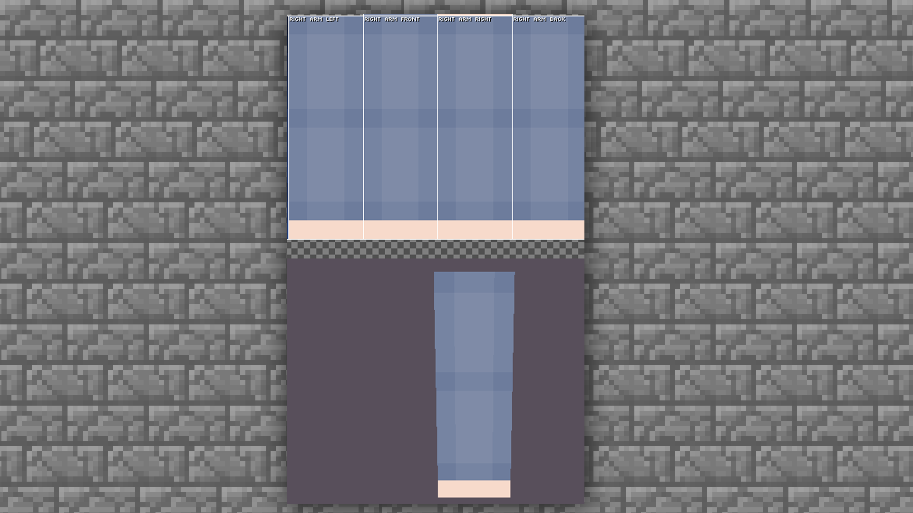

然后加深靠近身体的部分，例如：腋下和贴近身体的侧面和正面。这个时候可以取消身体部分的隐藏，然后进行观察和绘制。

先将胳肢窝和靠近身体的部分给加深。使用【工具栏】→【变亮变暗】选择变暗。

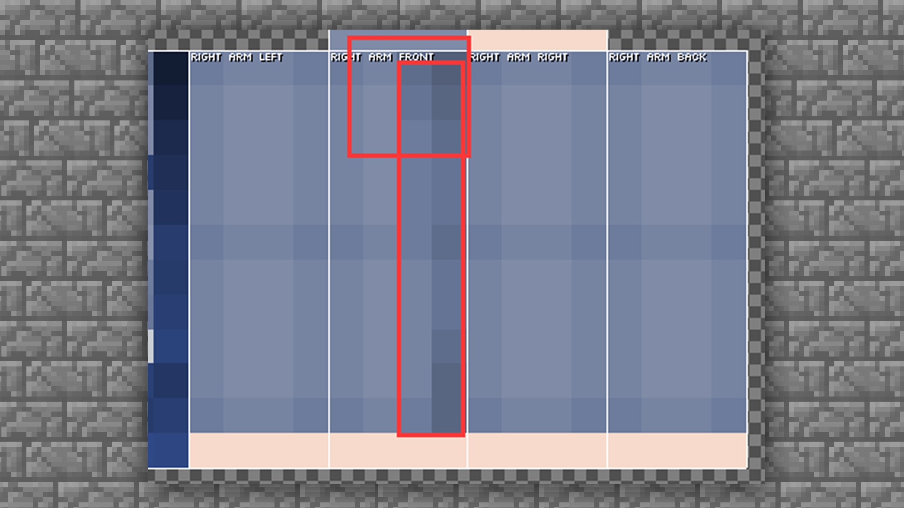

然后手臂中间部分稍微加一点高光就行，不要太亮，亮度问题参照身体部分的服饰设定就OK。

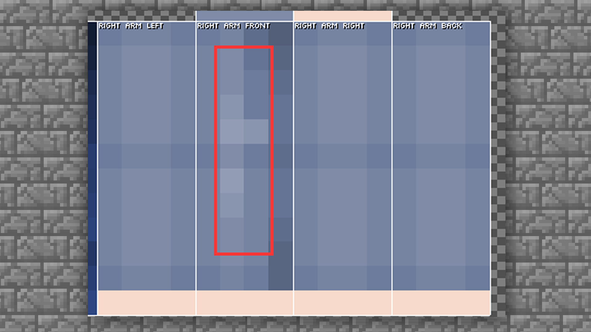

接下来我们就将正面的光影关系过渡到侧面。

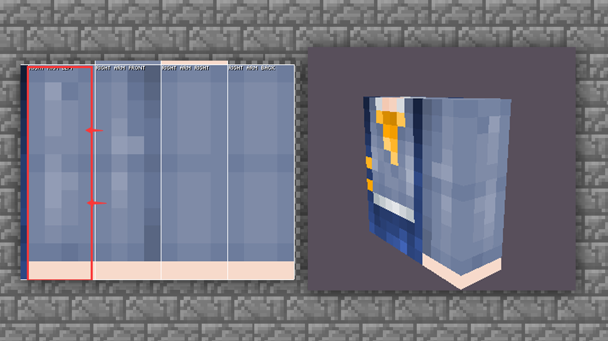

画内侧部分的时，就不需要对高光部分进行安排了。因为此处是背光面，可以过渡暗色压低光照。

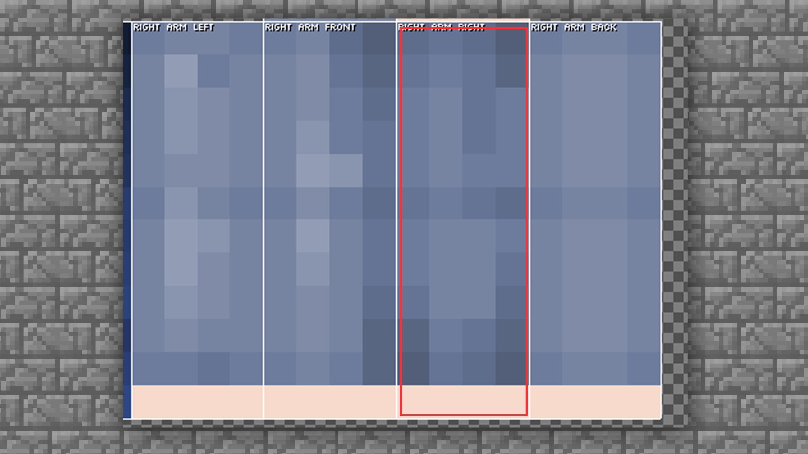

针对另外一个背面，可以直接依葫芦画瓢，或是直接复制一下都是可以的。

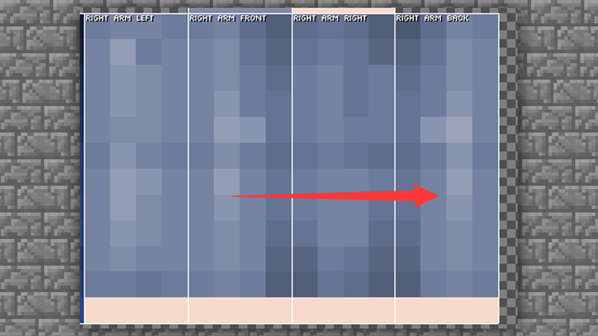

好啦，手臂的部分大体就完成，接下来再把手的部分上色完成即可。

手的部分跟侧面是一样的，靠近身体的部分颜色变深。靠近外面的地方颜色浅一点。这里大家可以握住拳头自行观察一下。

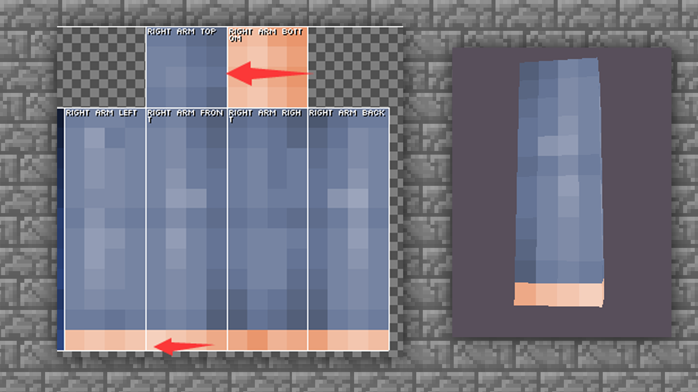

这样，整条手臂的结构就完全画完了。我们把两条手臂都显示，并且把身体部分也显示出来看一下整体效果。

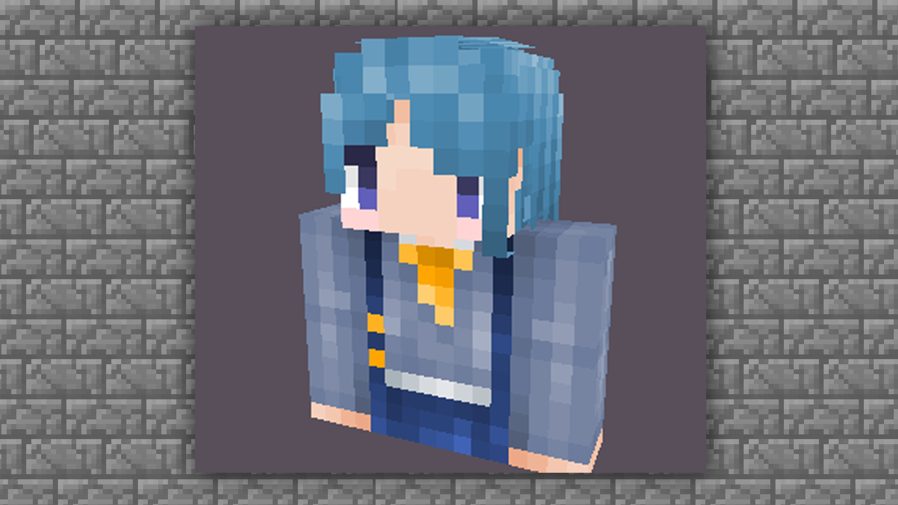

此处主要是看一下衔接的部分有没有问题，如果问题不大的话，就可以开始腿部的绘制啦。

#### 腿部的绘制

腿部的绘制其实就是裤子的绘制，裤子的绘制方法跟袖子大体是相同的，因为下肢也可以分成三个部分，只需要将各个部分展示出来即可。

首先，先老样子先把底色铺好。然后这里向大家展示一个小技巧，如果想要上半身和下半身进行合理的衔接，那就需要把身体部分的衣服延伸下来。

根据手部的绘制，继续来添加腿部光影明暗的区分。

使用【工具栏】→【变亮变暗】选择变暗

与上肢绘制相同，上肢部分加深的是胳肢窝，腿部加深的则是两腿之间，因为此处接触光源最少。同样的我们也需要注意暗部的叠加色彩和次数，并且要多注意与身体上部的无缝衔接。

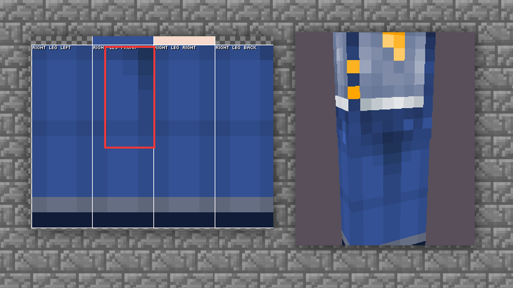

继续叠加暗部，然后将高光部分跟上肢一样进行叠加绘制。

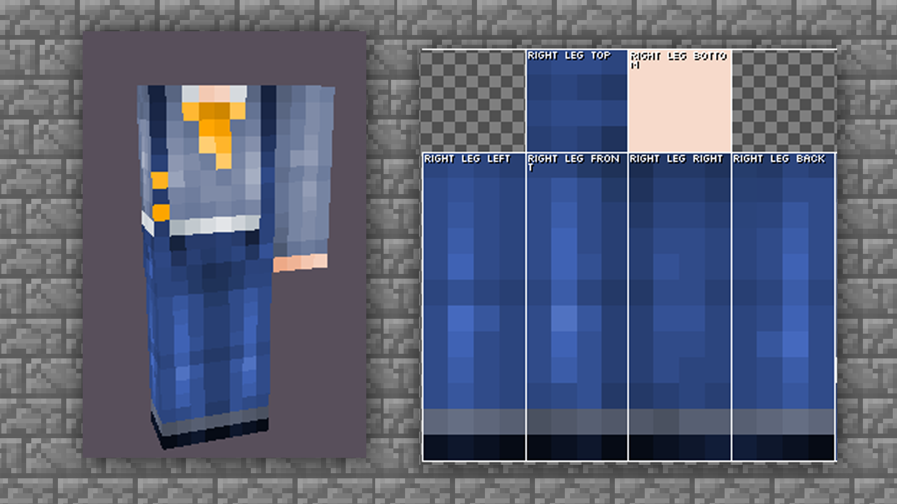

最后我们就将鞋底和大腿根部的两块绘制完善就OK啦~

对于大腿根的部位，建议大家根据上下部分的结合来绘制，不然皮肤在进行走路动作的时候会有些穿帮的感觉。

鞋底有很多种绘制方法，但是因为鞋底在实际情况中是很少看见的，所以大家按照自己的喜好随意发挥即可。案例中选择回形绘制方法。大家也可以选择条纹的绘制方法（条纹参见手指绘制）

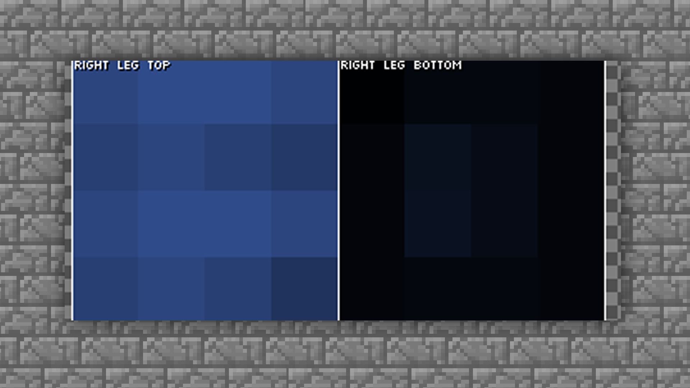

我们来看一下整体效果。

根据整体，可以再加一点小细节装饰即可完稿。

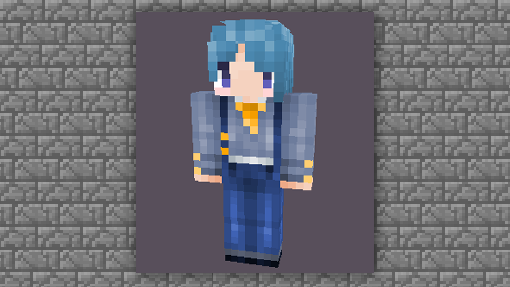

#### 结束语

皮肤基础教程到这里就已经结束啦，基础教程只能作为引导及参考，想要画出自己风格的皮肤更多的是需要大家多多练习，多多动手才能熟能生巧噢~