# 使用MCStudio地图编辑器进行简单建筑的搭建②

#### TAG：建筑工具 MCStudio 地图编辑器

#### 作者：上古之石

 

#### 使用MCStudio地图编辑器进行简单建筑的搭建②

 

#### — 、地基建造，打好基础

在生存模式中，因为有要防御怪物的必要条件，所以我们将地基建高。同时为了让地基看上去更加坚固，可以选择使用石材类的方块来建造“梁”的部分。

使用【笔刷】—【单点笔刷】 设置好材质，勾选【直线生成】+【覆盖原方块】开始地基的框架建造。

注意：所有的调整一定要在打地基的时候完成，如建造后期由于地基没打好出现大错位的话，调整就十分困难了。

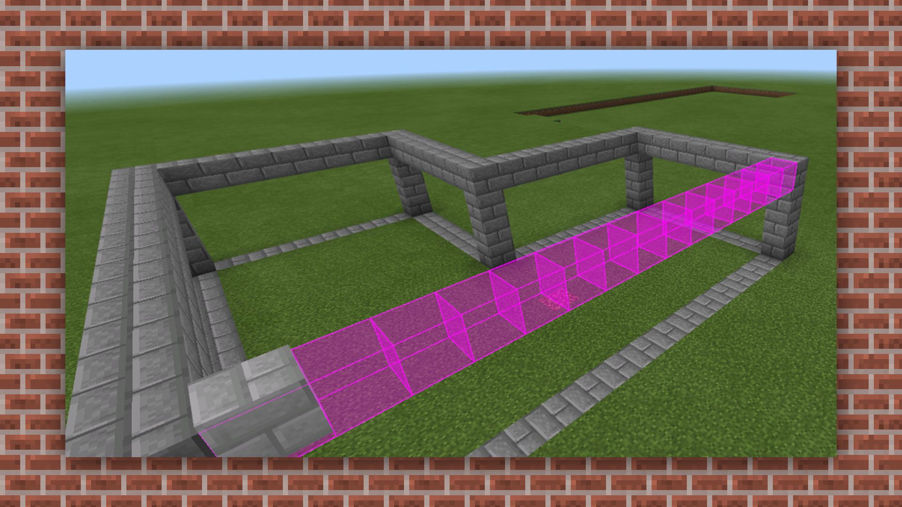

接着需要对整体的造型规划进行检查，没有问题则可以将地基进行填充。在建筑后期，如果大家想要打造一个漂亮的地下室，那么可以保留中间空白的部分作为后期发展即可。

填充大面积时，我们可以使用笔刷，也可以选择【工具栏】中的【选取】工具选择一个区块来进行操作。

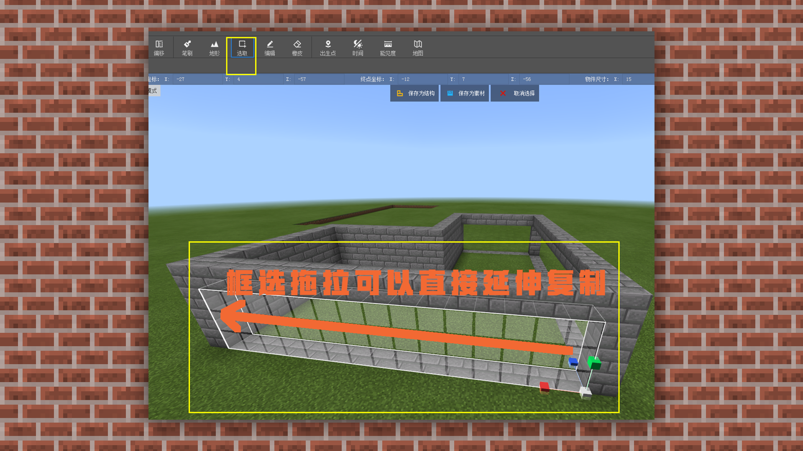

然后使用【填充】选择要填充的方块进行填充。

同理，将四周全部填充完毕。

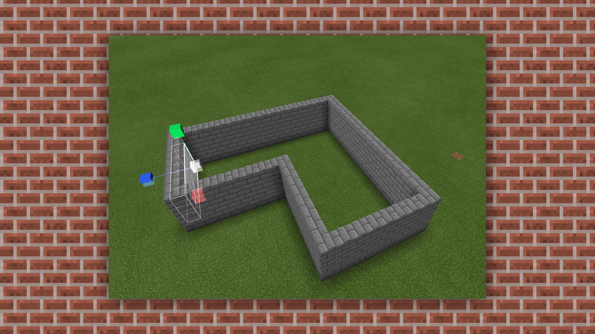

填充完毕后，可以根据美观程度进行关键支柱的替换。将想要替换的支柱选中【替换】

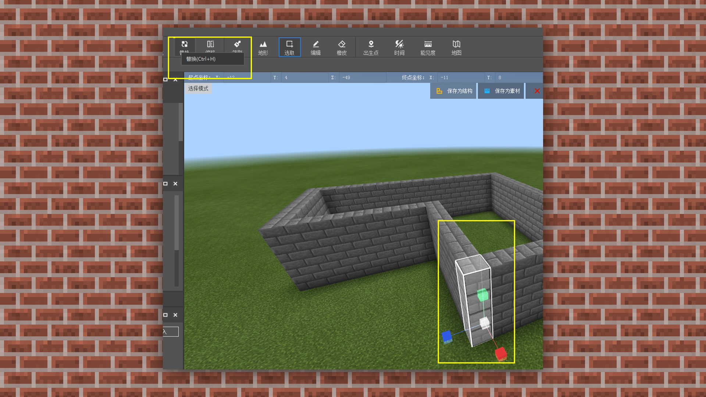

点击【替换】然后将【已选方块】换成【想替换的方块】点击替换就可以了。

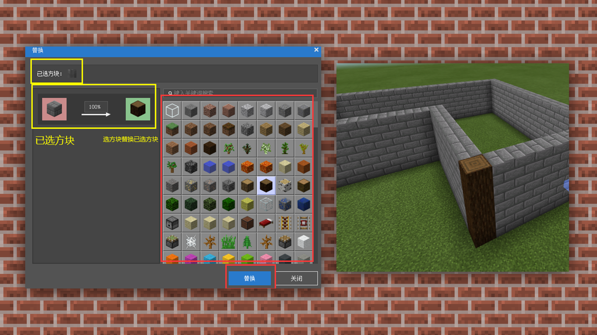

把各个支柱进行替换看看效果。

然后我们继续使用【选取】+【填充】把平台铺满完善，将地基完善固定。

根据上述地基的情况，我们将平台建筑的房屋进行建造。

同样使用【笔刷】进行中部建筑地基的建造。并且将建筑的大致部分先粗略的建造起来。

接着我们把屋顶的部分也通过【笔刷】进行【单点绘制】，但是我们会发现楼梯的部分出来会方向不对，所以我们需要【选取】方块后进行【旋转】，根据XYZ的轴进行角度旋转到自己需要的角度。

然后通过拉伸侧面进行直接复制拉伸成一排。

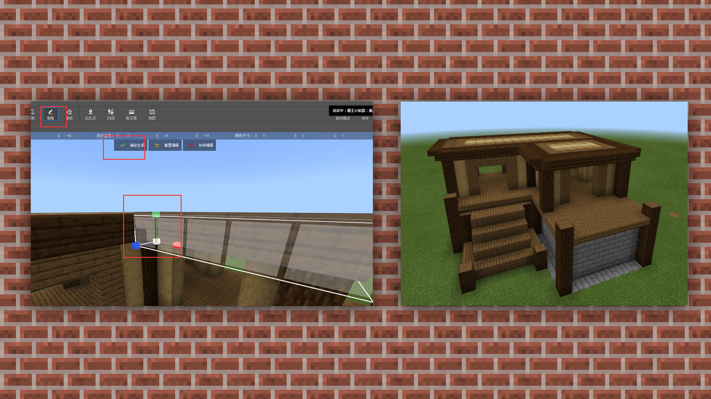

然后，这个时候还有一个办法，如果你觉得软件操作十分困难调整各个角度和各个角的话。那我们就可以点击工具栏里面的游戏模式或者是运行。

【游戏模式】：这个模式可以直接在窗口里面进行游戏内的操作，跟游戏内无差别。然后退出模式直接用ESC退出即可。

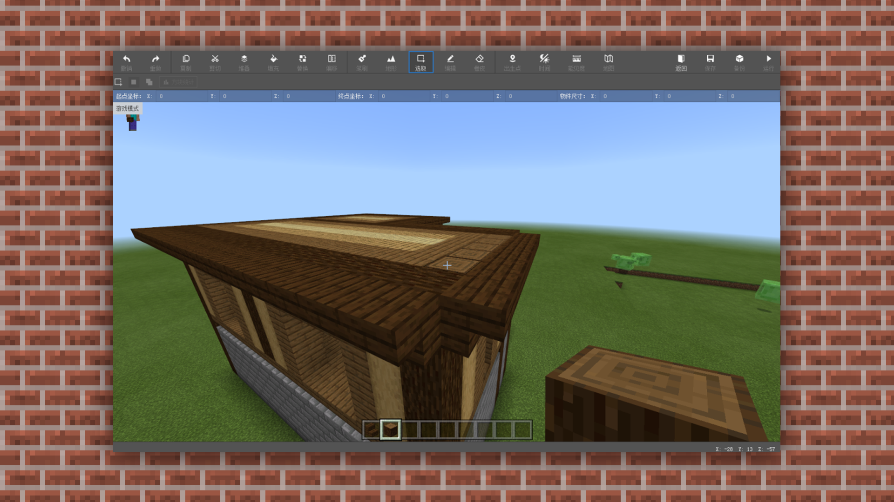

【运行】：在游戏内的进行实景测试，此功能主要是观察游戏内运行的实际情况，可以观察是否有方块丢失。

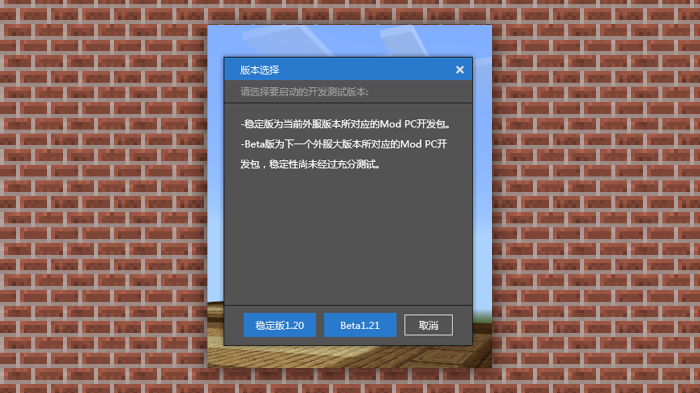

通过在游戏中搭建部分建筑，退出到软件界面使用工具进行复制和延伸。

选中侧面进行拉伸和复制

这样我们就可以很快速的完成对屋顶的重复填充。

重复以上操作将屋顶完善。

接下来就是将一些细节和窗户进行完善就OK啦。

建筑基本完善后，我们可以使用【笔刷】+【材质混合】进行对地面上的路面铺设。但是千万注意比例一定要填满100%，不然就会出现空气方块。

如下图所示，即综合比例分配加总为100%，再用笔刷涂抹一次后就不会产生空缺的效果了

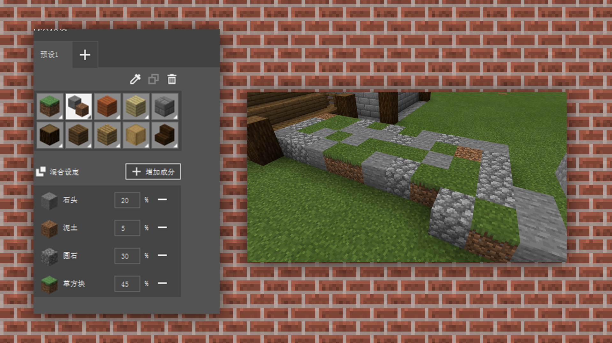

接下来我们试着给建筑周围增加一些自然环境进行过渡。

使用【地形预设】+【工具栏】中的【地形】就可以添加自然植物啦。

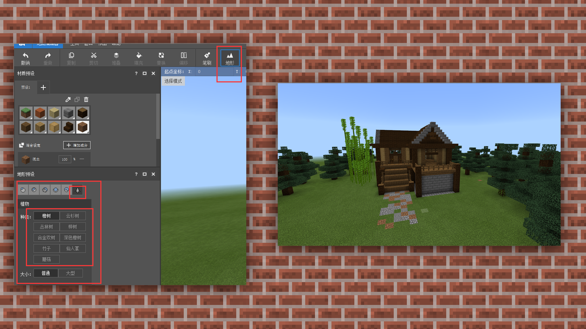

如果大家觉得地形的设计没有落差而导致美观程度降低，那可以继续使用地形的 【隆起】进行地形建设。

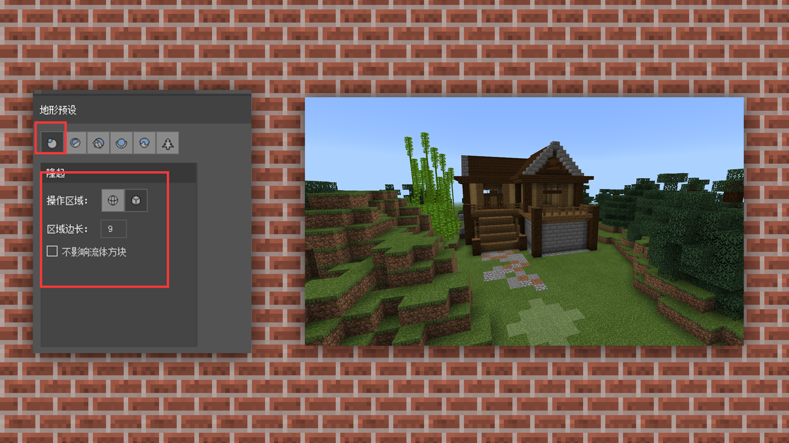

然后在用树木进行周围空白的填充。

这样，我们就完成了一个简单的森林小木屋。然后可以适当增加一点水池和装饰。

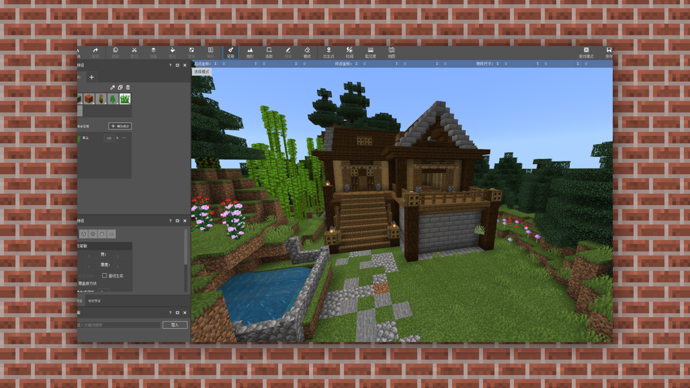

当然，如果我们对于环境的把控没有那么好的话，我们其实可以这样使用【素材库】的基础模板进行周围的美化。那让我们来学习一下如何使用【素材库】。

我们可以在素材库的内置素材中找到一些预设素材。

我们可以选择一个我们喜欢的种类，点击它，建造预览界面的鼠标操作就会生成这个建筑模板。

然后我们只要选择一个我们喜欢的位置，然后鼠标点击一下左键进行【确定生成】就可以啦。Ps：当然如果觉得位置不对重新放置也是可以的呢。

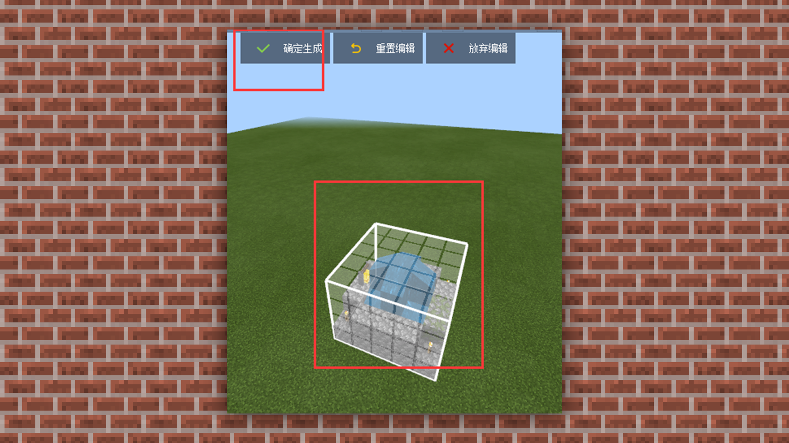

确定生成后，建筑模板就会自己自动生成在场景之上啦。

当然我们也可以导入一些自己喜欢的素材模板进行放置。 我们选择素材库下的自定义素材然后点击导入。

然后我们就可以适配MCS的建筑格式来进行导入啦。最常用的格式就是OBJ格式，我们这边也选择一个OBJ格式的小建筑来进行导入。

选择好文件后点击打开。素材就会自动导入到素材库中。

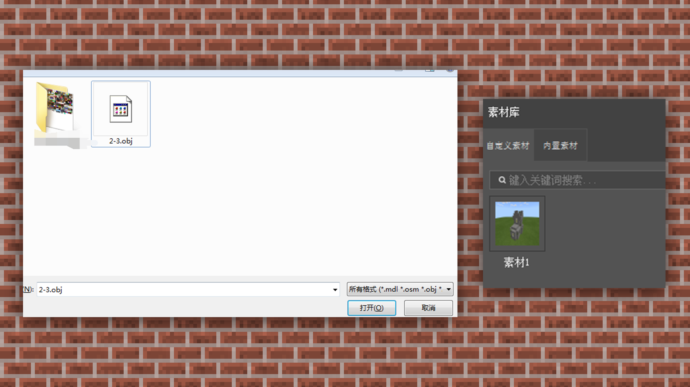

然后我们就可以跟预设素材一样进行操作和放置，就可以啦。

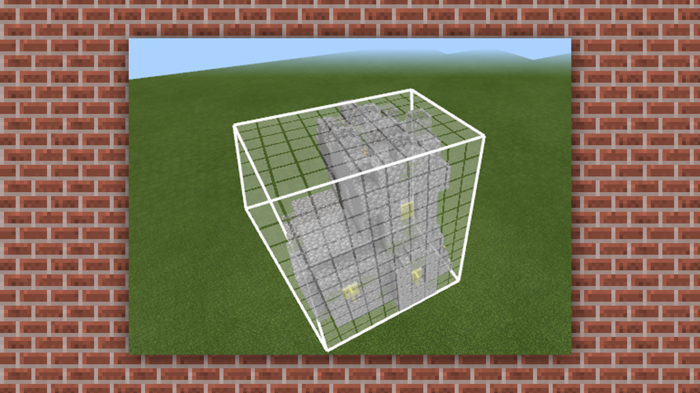

这样制作出来的景观和效果就可以更加的丰富和自然了。

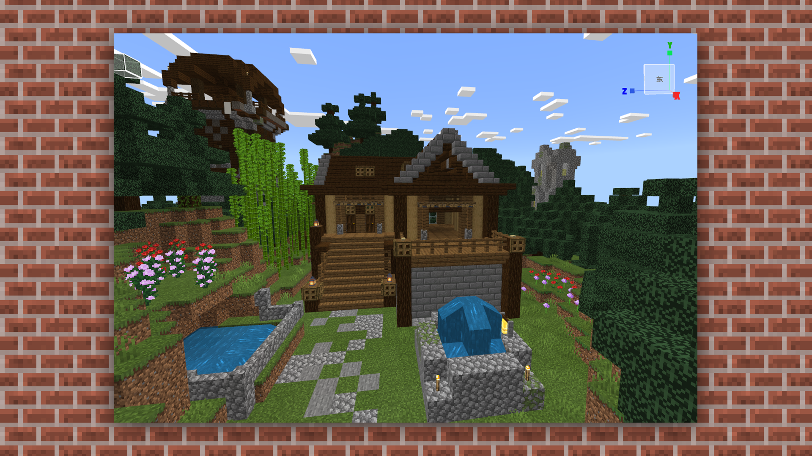

然后当所有的内容都做好后，保存后就可以在【作品库】【基岩版组件】里面找到已经做好的地图。

想要打开或者导出地图，选中地图然后右击进行相应操作即可。成功导出后会得到一个地图的压缩包，方便大家使用和提取。

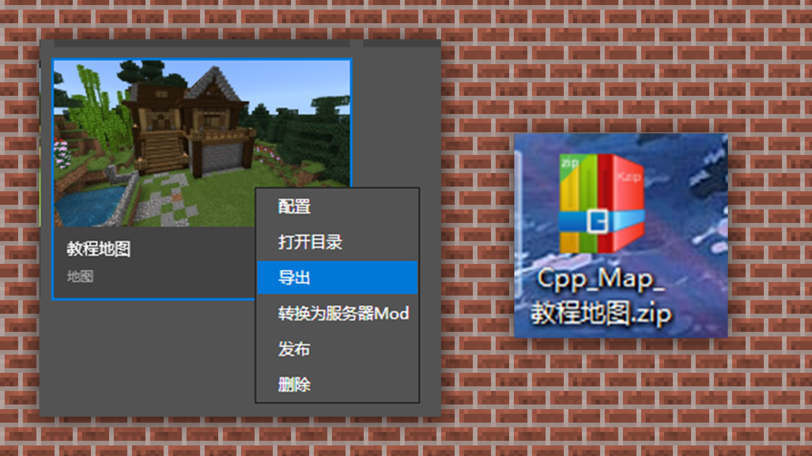