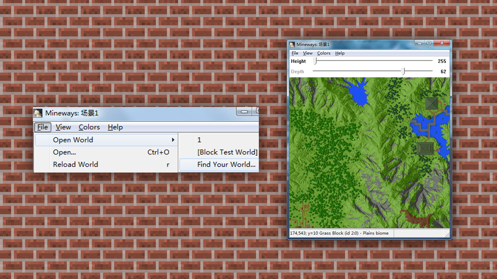
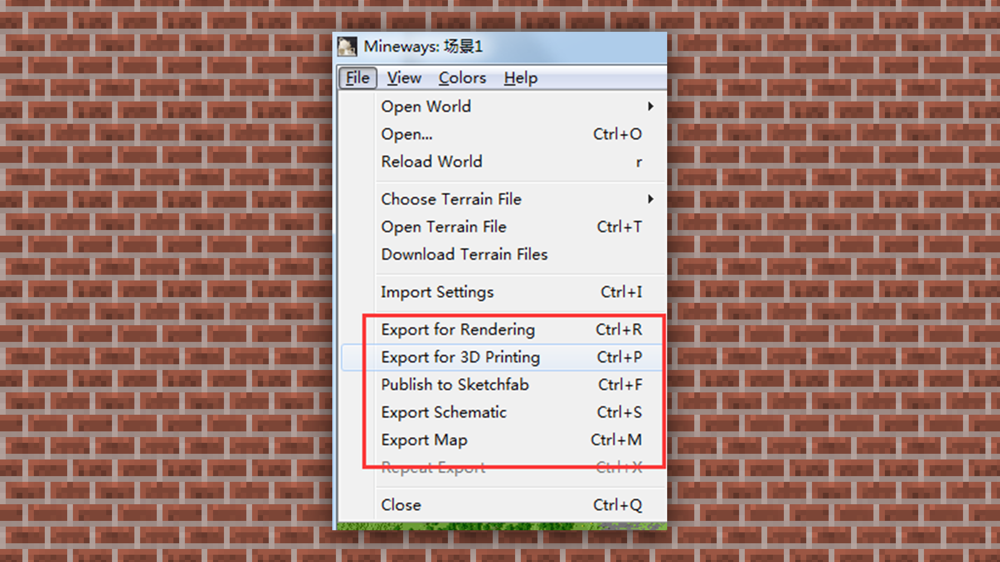
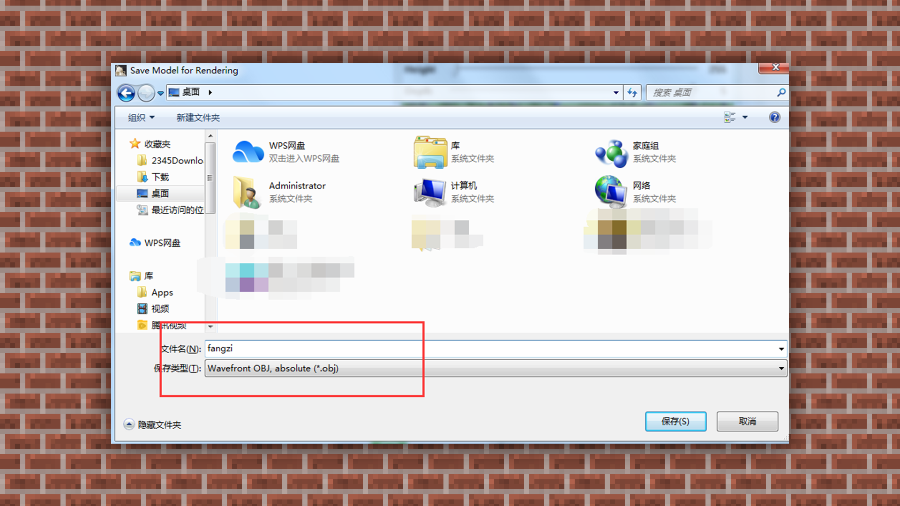
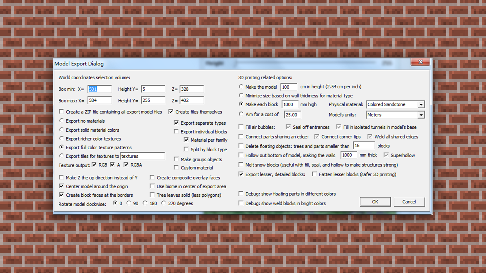
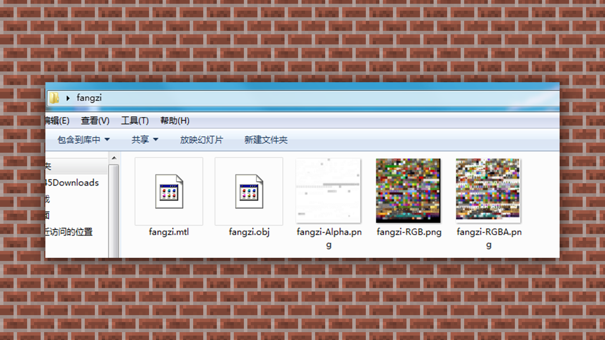

# 建筑地图的格式转换

#### TAG：建筑 格式转换 模型

#### 作者：上古之石

 

#### 建筑的格式转换

我们需要制作动画或者渲染图时，地图地形的导入格式往往会成为难题。

在此部分简单的分享一个将地图转换OBJ 3D格式的办法给大家。

 

首先需要下载Mineways软件，Mineways可以将我的世界地图转化为3D模型，用于3D渲染和动画制作等

我们先将做好的地图，在软件中通过File->Open World->Find Your World的路径，找到导入地图的level.dat文件，载入完成后打开。

Mineways载入地图完成后，可以使用鼠标左键拖动查看地图，ctrl+鼠标左键拖动可以选择和调整一块方形区域。

然后可以选择Files->Export for Rendering(导出用于渲染的模型的OBJ格式)，一种可以轻松导入Maya/3Ds Max等主流3D软件的格式。其余的格式可以根据针对所使用的不同软件进行导入，一般使用频次最多的为OBJ 导入

点击导出，选择文件保存位置和设置文件名字。

弹出模型设置界面，因为已经选取所以无需多余设置。直接默认选项即可。

等待导出读取后，我们就可以在存放位置得到5个文件，包括纹理文件、材质文件和OBJ文件，这些文件通常需要放在一起进行使用。最后我们将其导入到3D软件中就可以进行渲染、动画的制作啦。

通过上述建筑基础教程，对于大家如何入门建筑而言，是不是有一定的理解及领悟了呢？包括文件的导出更换格式都可以随意进行多次练习，让建筑不止步于游戏框架。