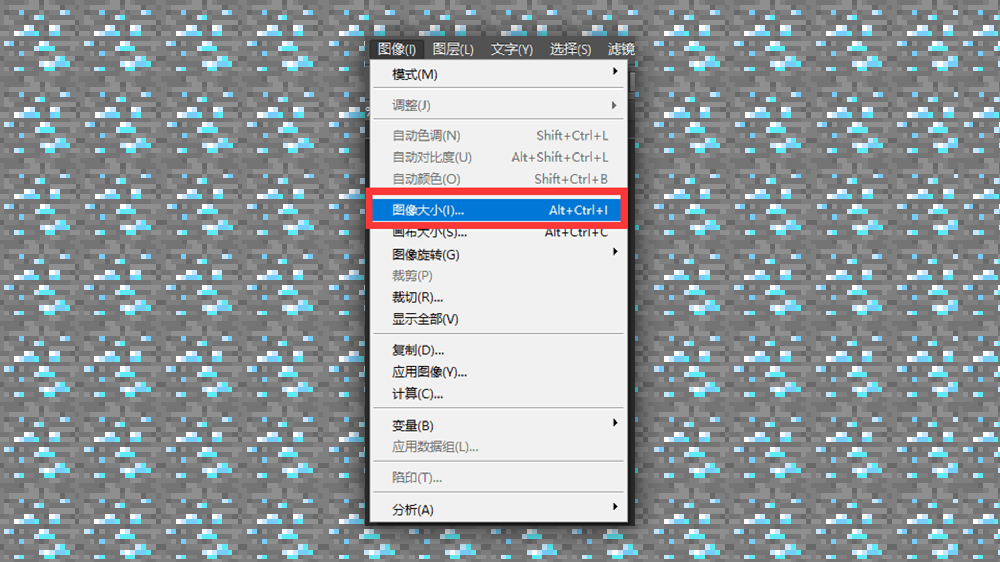
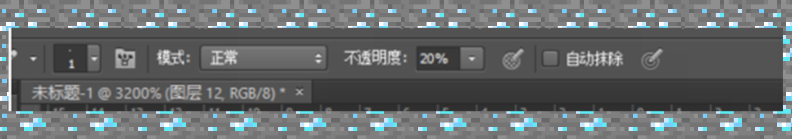
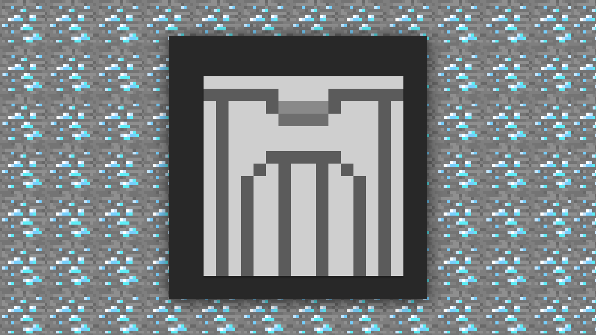
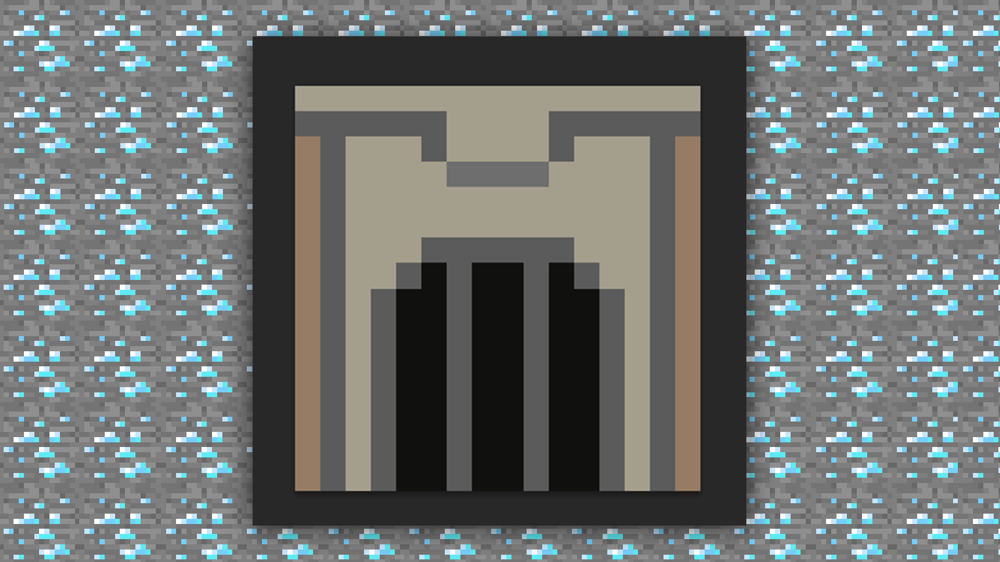
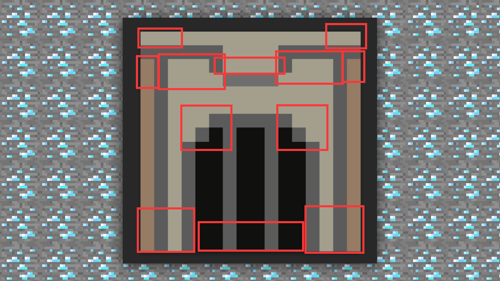
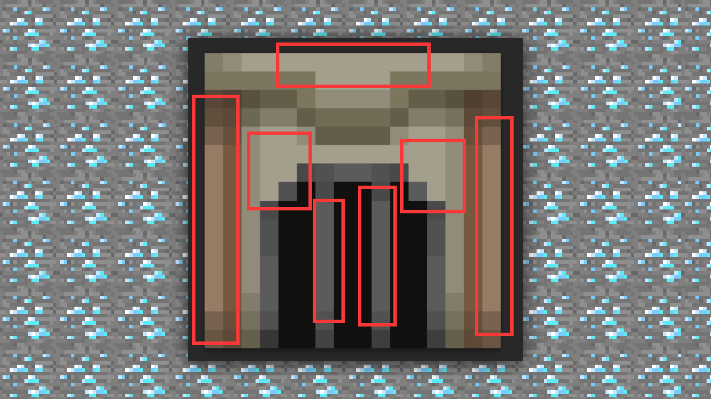
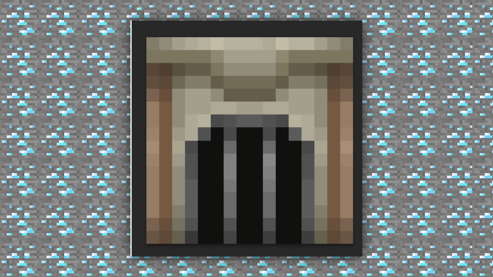
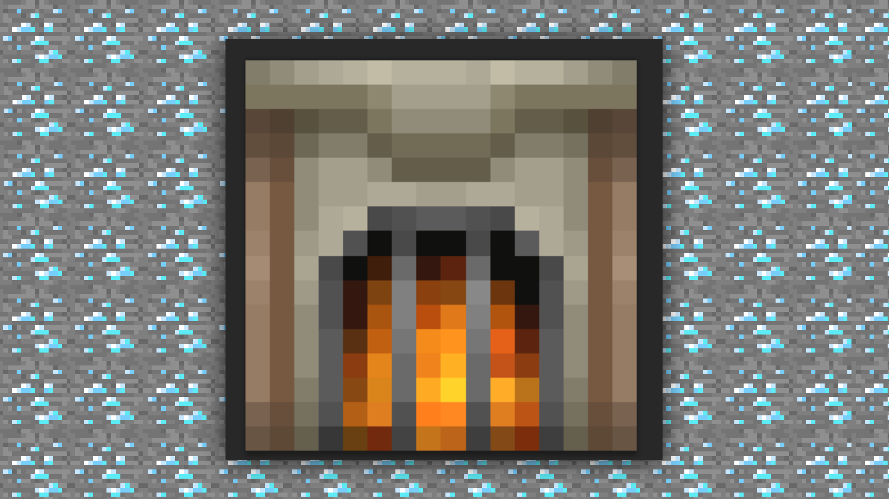
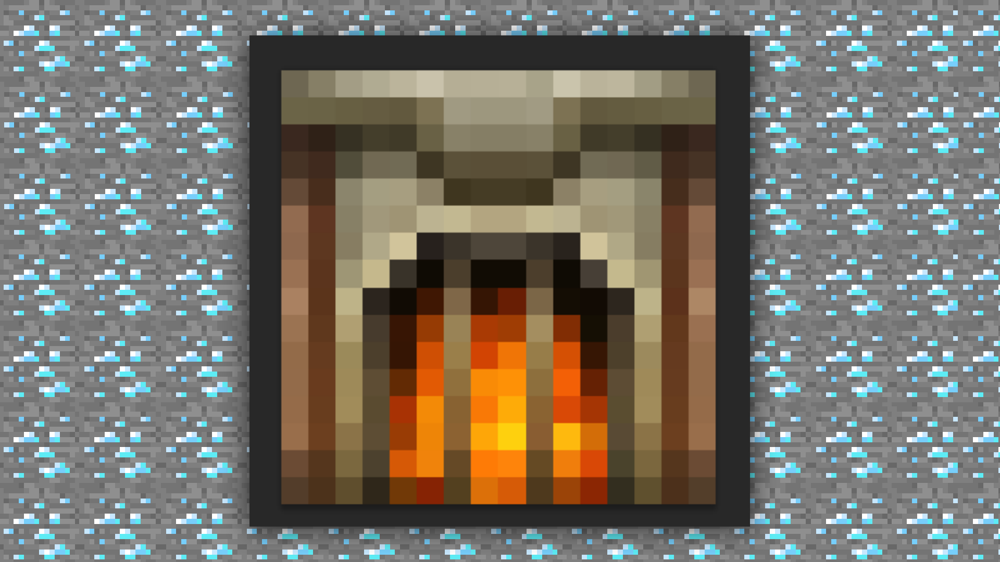

# 1.3入门-基础材质绘制技巧-使用PS来绘制材质的办法

#### TAG：材质 基础技巧

#### 作者：上古之石

#### 基础材质绘制技巧-使用PS来绘制材质的办法

接下来就一起来绘制一张材质方块贴图吧~

首先我们从材质包的方块文件夹里随机选择一张贴图。风格我们就暂定中世纪风格，分辨率选定16X。 在PS中直接导入需要修改的贴图或者新建一个16X的画布。直接的导入可以让尺寸和分辨率都在可控范围内，是很方便的方法。

为了不让大家混淆，我们直接新建画布，并且将下方的画布属性修改为邻近，这样就算放大和缩小也不会导致图片模糊了喔。

在新建好了画布后，如果忘记调整某些参数，也可以在图像模式下找到图像大小进行修改。

接着我们就根据之前讲到的基本方法进行绘制。从打结构开始，首先设置画笔为铅笔，像素为1。透明度根据需求进行选择。想要做叠色的可以选少一点 ，直接用100%的浓度进行绘制也是可以的。这里我们就选择20%的透明度进行绘制。

然后开始打结构，这次我们画中世纪的熔炉。先将大体的想法勾勒出来，熔炉是有燃烧口的，通常熔炉上方会要放置烧制的物品，那么我们就上侧绘制一个凹槽。大致是这样。

然后选择合适的颜色为它铺上底色。

为了突出立体感，要开始增加暗部阴影。因为光照的效果，可以参照皮肤绘制身体的部分来进行关节处的阴影叠加。

绘制阴影后效果。

从目前的效果来看，光有阴影看上去会比较呆板，所以我们可以开始着手进行亮部的修饰，以此来提高质感。

添加高光后的效果。

熔炉是来烧制物品的，那么还需要把它的炉火点亮，这样可以很好的增加功能性特效效果。

增加了火焰后的熔炉是不是就很栩栩如生了呢？然后可以进一步调整画面对比度和亮度。接下里就可以完成绘制啦~

以上，一个熔炉方块贴图就完成了。通过上述步骤，我们可以看到绘制贴图和跟皮肤绘制在原理上是相通的，需要通过不断叠加来达到最后效果。这是一个磨炼和进步的过程，所以大家不需要操之过急，一步一步慢慢练习即可。