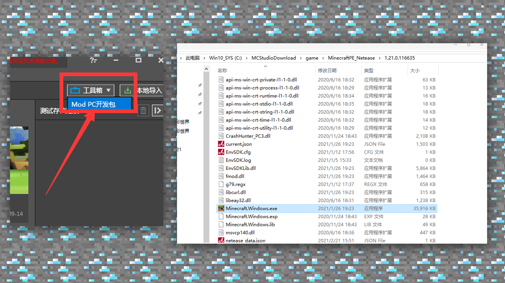
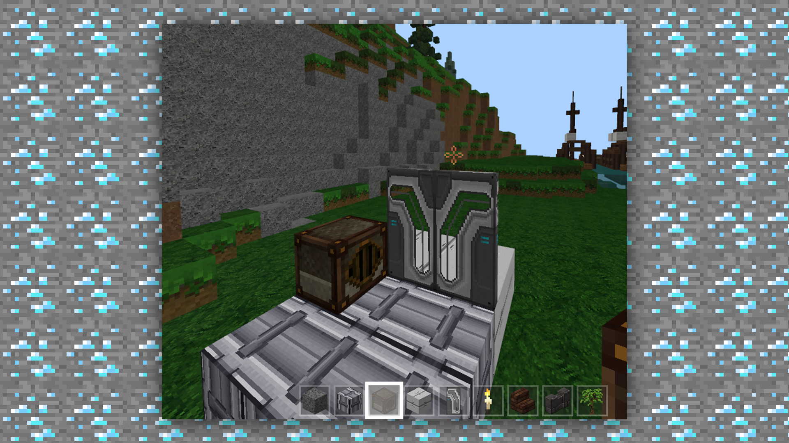

# 1.4入门-材质正确的导入及导出的办法

#### TAG：材质 导入 导出

#### 作者：上古之石

#### 材质正确的导入及导出的办法

首先我们将做好的材质包进行整理打包，即打包成压缩包。

首先，我们需要登录MCstudio。在基岩版组件分类，右侧点击【工具箱】，下载 Mod PC开发包，然后再到C盘这个目录

（C:/MCStudioDownload/game/MinecraftPE_Netease/1.21.0.116635）打开测试端应用程序。

然后我们需要把材质的文件放置到

C:/Users/Administrator/AppData/Roaming/MinecraftPE_Netease/games/com.netease/resource_packs 的文件下，然后运行客户端进行测试。

运行游戏后进入设置—储存中进行查看。

如果储存出现了材质包，那么证明材质包已经成功导入并且可以打开测试啦。

接下来就可以进入游戏内进行放置和观察，看看还有什么需要调整或修改的地方。

材质包的基础教程就到这里啦~

以上基础学习可以作为大家学习的入门，而之后的更深入的学习就需要靠大家的持之以恒的练习。材质及各类绘画方法不是一日学成的，坚持就一定会有成果，让我们一起加油吧。