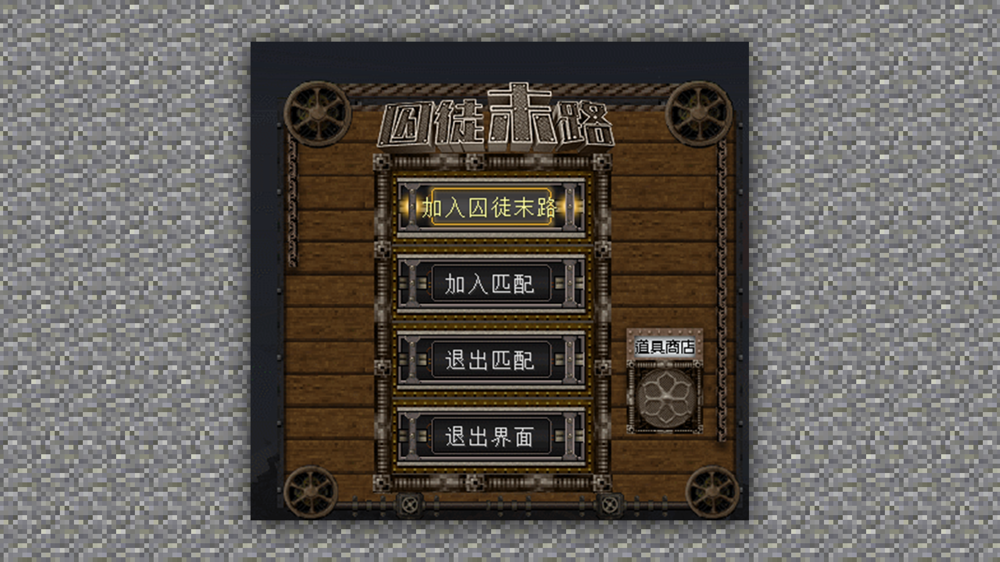
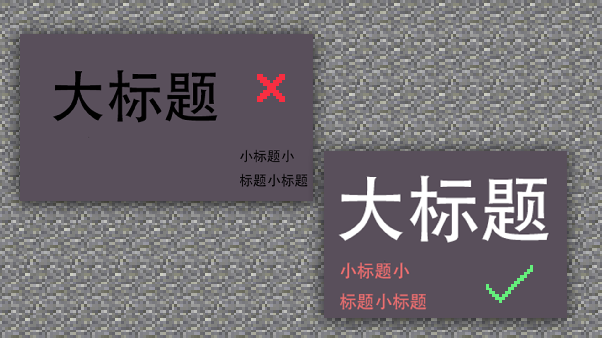
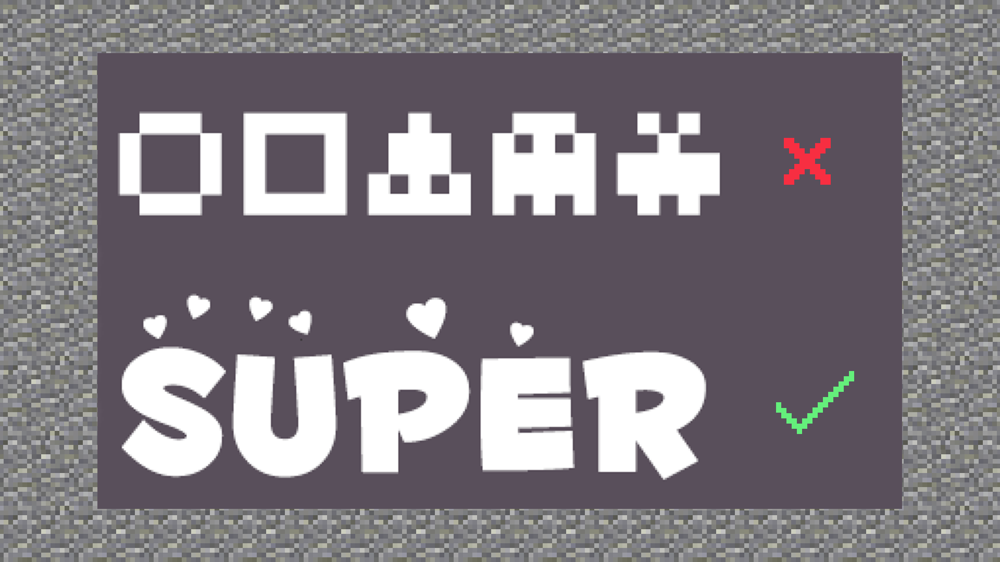
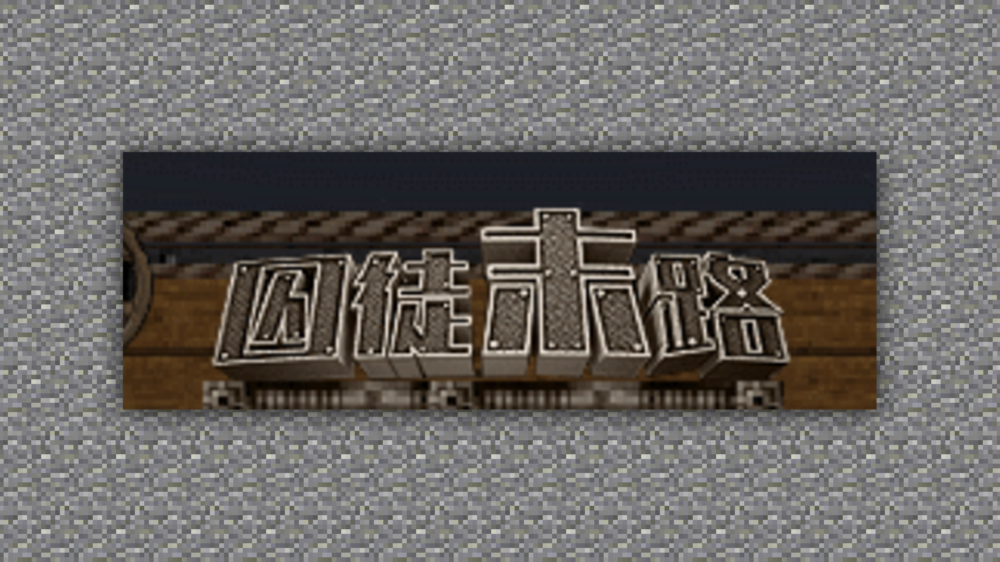
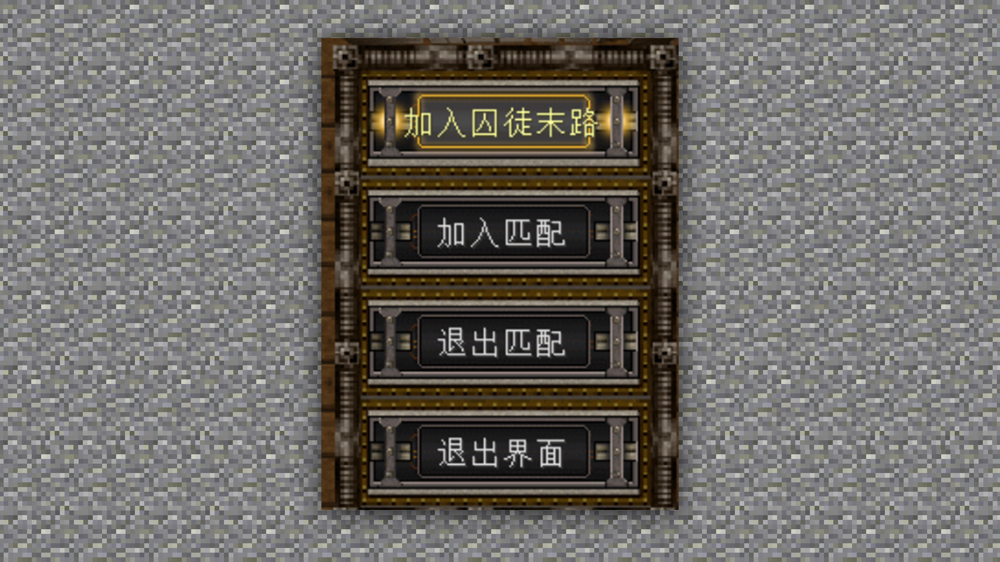

# 字体制作方法及规范、游戏内运用

#### TAG：字体 制作方法 游戏运用

#### 作者：上古之石

#### 字体制作方法及规范、游戏内运用

字体设计是平面设计中绕不开的话题，因为好的UI、平面设计师必须要掌握如何进行合理的字体设计，或者是在不同的地方设计出不同的，符合需求的字体。同理于游戏内也是一样的，这是一套可以通用的理解思路。

#### 第一、标题文字的排版

如果你排版设计的文字不够吸引用户和玩家，或者让他们看这字体的设计觉得很累，没有精神看下去，那就需要观察是不是文字之间的排版有问题，段落与段落间过于跳跃性。一般来说，你的眼睛会首先看到大标题，然后就自然地回车到左边开始阅读。

#### 第二、文字的断节

文字的断节设计具有一定的两面性，如果用得好可以体现硬朗和线条感，如果用不好就是崩塌式的失败。只有合适的字体合适的裂变效果才可以达到恰当的视觉感受。

#### 第三、图形化

有时候过于图形化的设计，会让文字本身的辨识度降低，但适当的图形设计就会让整体的辨识度提升很大的空间。合理化的图形化和融合度是最难的。

文字设计是一个有着框架规范却又设计自由的部分，它和ICON有着差不多的设计思路。天马行空的设计和构思必须都要有一个基础规范的框架，在基础的规范下进行设计，就会给人杂而不乱的感觉，这一点需要大家牢记。

所以在游戏中，由于文字所承载的功能。我们需要考虑，玩家对于游戏游玩的时候是否能看清楚，这些图标的用法和这些按钮的实用性。

 

也就是在游戏中，我们需要考虑对文字的阅读型，参照上面的概念，我们来对游戏内的文字效果进行一个简单的排版。

在文字排版中我们可以看到，大小合适的logo文字，正好作为了整个菜单的主要部分。

将所有匹配信息都放在了中间的部分，同时给到分段均匀的设计。

然后我们看到最后部分 下意识的从左往右阅读就可以直接看到道具商店。

所有的字体设计中，只有logo是单独排版，其余的都是简洁且统一的效果，这样就不会给玩家杂乱的视觉感受。