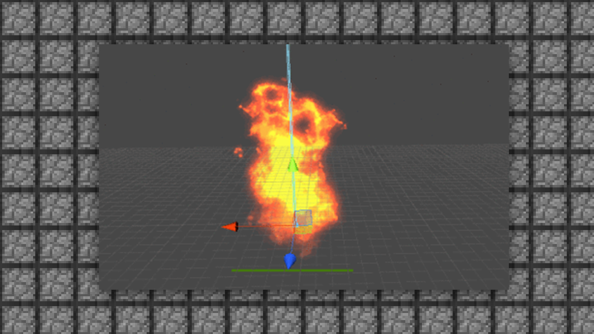

# 1.1特效基本概念的介绍（2D+3D）

#### TAG：特效 概念

#### 作者：上古之石

#### 特效基本概念的介绍（2D+3D）

特效是游戏设计中不可或缺的内容之一，有了好的模型和动作，再加上好的特效，那这个玩法的美术视觉就会得到一定的保障。目前在特效的规格选择上，我们分成2D特效和3D特效。
2D特效可以简单理解为是输出序列帧图片来完成的特效，主要依靠手绘或者图片来完成，然后通过各类转换软件进行格式转换后挂入游戏内。

3D特效则是依靠引擎开发特效，通过引擎的创作后会让特效感更立体和炫酷，并且可以在引擎中叠加渲染特效，是市面上最常见的游戏制作特效方式。

目前在MC游戏内官方最常用的特效格式为2D特效。