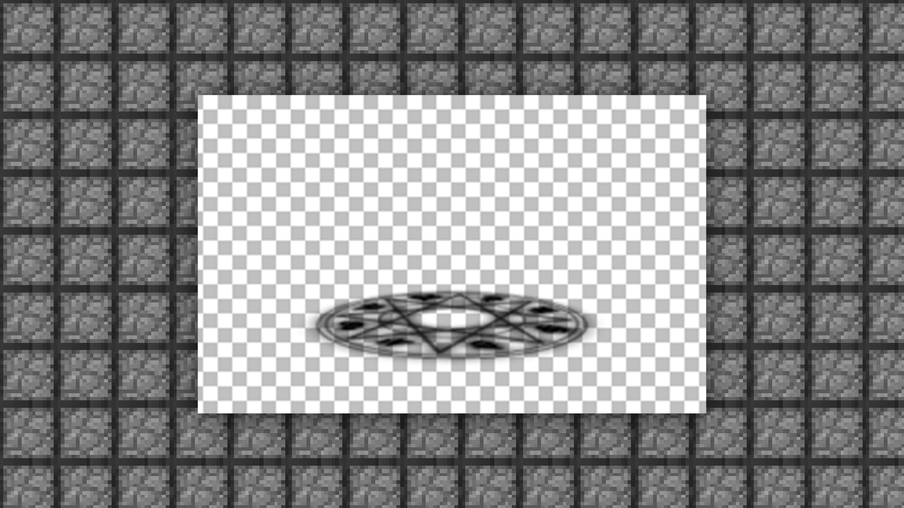
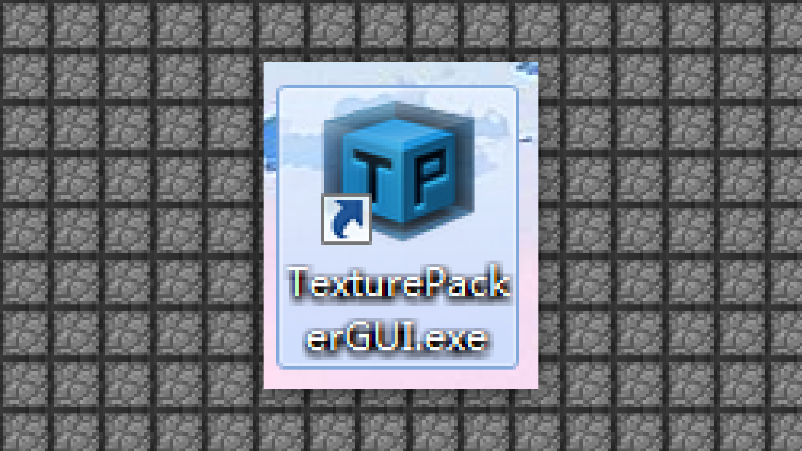
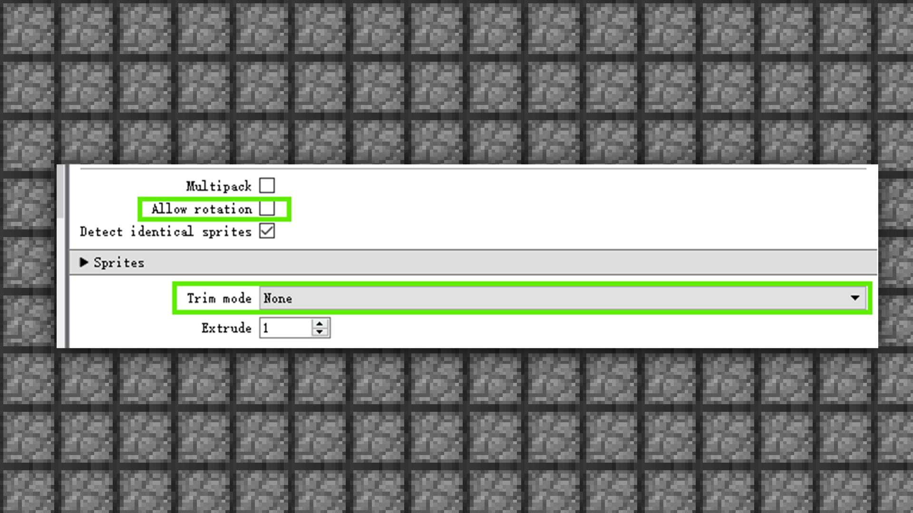
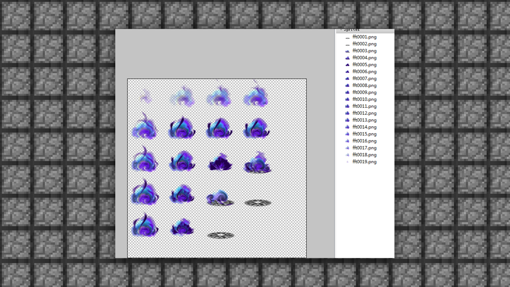
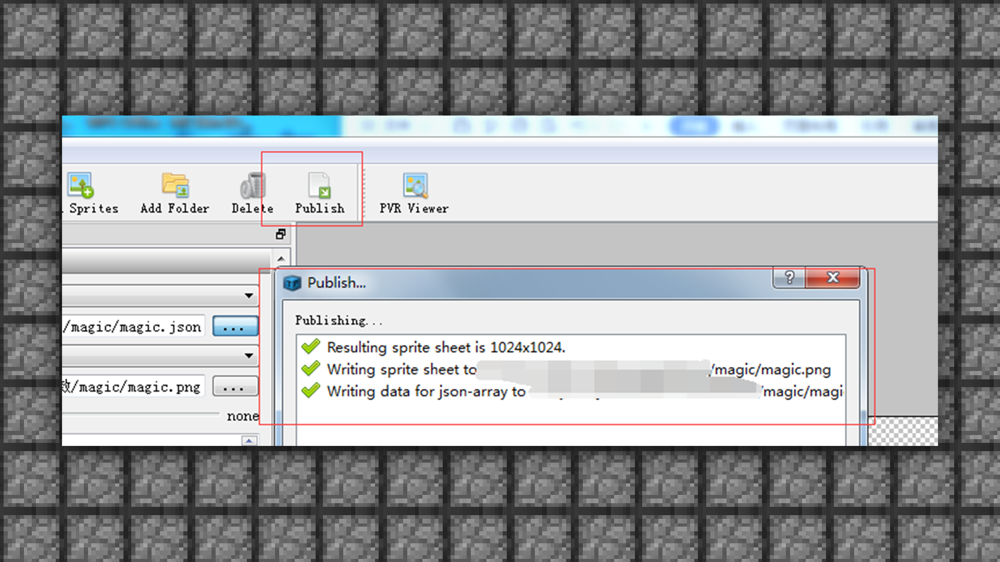
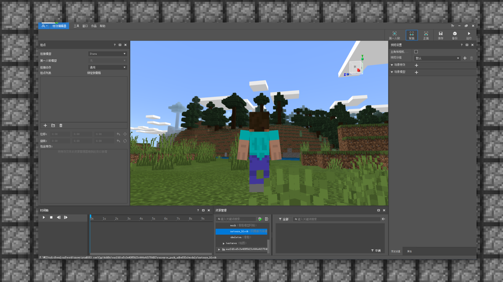
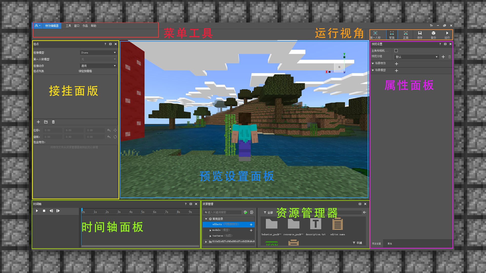
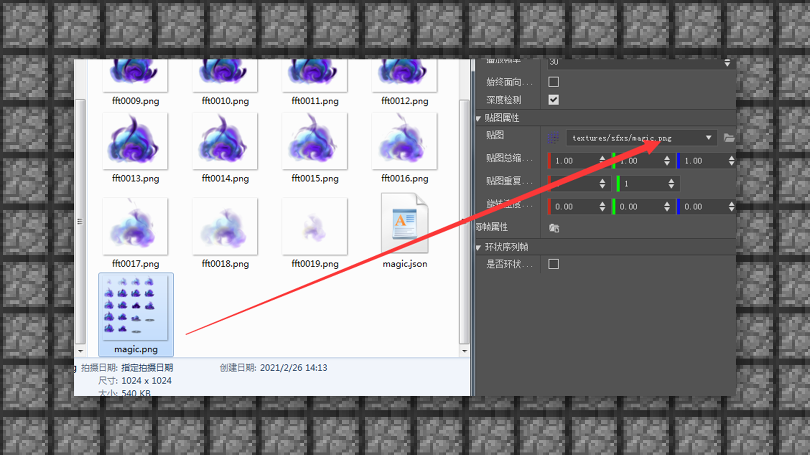

# 1.4制作一个属于自己的特效

#### TAG：特效 MCStudio 制作

#### 作者：上古之石

#### 使用MCStudio特效编辑器和第三方软件一起制作特效

接下来就让我们一起来制作一个属于自己的特效吧。

这里先用MCStudio测试导入为例子，以此来做特效制作介绍。
首先我们先根据前序内容所提到的制作流程，来构思一个从魔法阵出现火焰的特效。我们先来确定魔法阵的造型。这里设定法阵是放置在地面上的，所以魔法阵的视角肯定不是俯瞰视角，而是侧视的。

目前来看，仅有魔法阵的旋转会比较单调，如果我们再加入火焰元素的话，或许就会有不错的效果。

首先我们先来快速打一下稿。

然后我们打开PS来绘制一下火焰的造型。

两个都定型之后，我们来构思一下火焰出现的过程。

正常来说，火焰是从魔法阵中心释放出来，那就来绘制一下基本的过程吧。

接下来我们将图片分层保存为PNG，ps：PNG是可以保留透明图层的格式。

然后我们就可以使用TexturePackerGUI来将序列帧图像给JAVA化。

先打开软件，然后所有序列图片拖入进去。

导入进去之后，我们需要设置一下

Allow rotation不要勾选

Trim mode选择为None

这样导出的大图中，每一幅小图都一样大。

注意：官方当前只支持大小相同的序列帧子图。

然后选择publish进行打包导出。

我们就可以得到json的特效文件。

接下来需要打开MCStudio开始序列帧导入测试。

首先我们打开MCStudio的特效编辑器界面。

先来一起认识一下特效编辑器。

属性面板：用于显示或者修改所选项的属性，包含显示/修改粒子特效及序列帧特效的属性，显示模型相关文件属性。

时间轴面板：用于控制特效和人物的播放，包含播放，停止，逐帧播放，并且可以在播放骨骼动画时拖动特效的时长。

资源管理器面板：用于显示所拥有的资源，包含特效编辑的三个快捷目录和对应的快捷按钮。

挂接面板：用于挂接特效到人物身上，能够控制不同特效播放的位置。

预览设置面板：用于预览人物/模型及特效，能够支持多个不同的模型及特效在指定的位置进行播放。
然后我们将刚才做好的序列图导入到游戏中来测试一下效果。首先需要新建一个序列帧导入。选择【资源管理】—【EFFECTS】下的序列帧新建。

来给他进行命名，点击确定。

随后右边的窗口就会有新建的特效属性框。

然后将已经绘制编辑好的贴图拖入到贴图部分进行替换。

系统软件会自动将特效的配置文件一起导入，我们只需要把json的文件拖入到时间条上就可以看到效果啦。

接下来挂点也要设置一下 可以选择底部挂点或者是身体任何部位进行挂点，挂点位置的不同就会让特效出现的位置不同哦。

