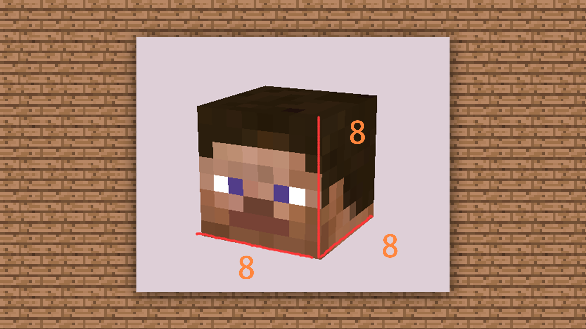
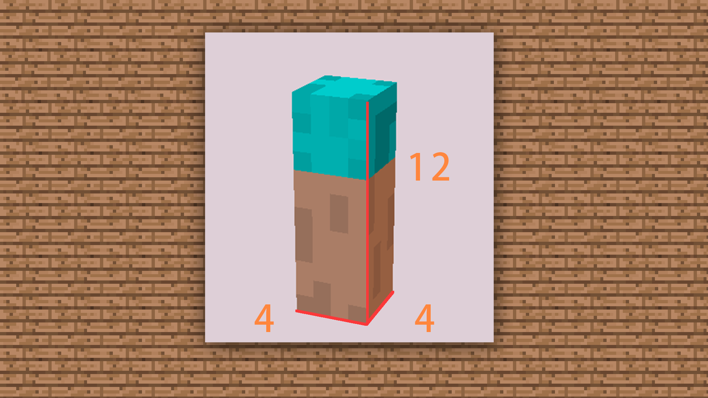
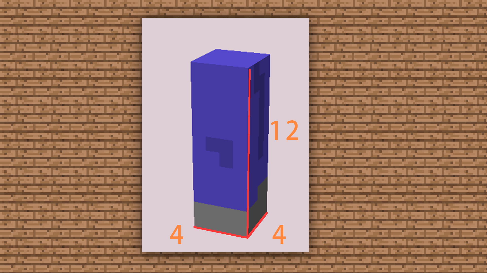
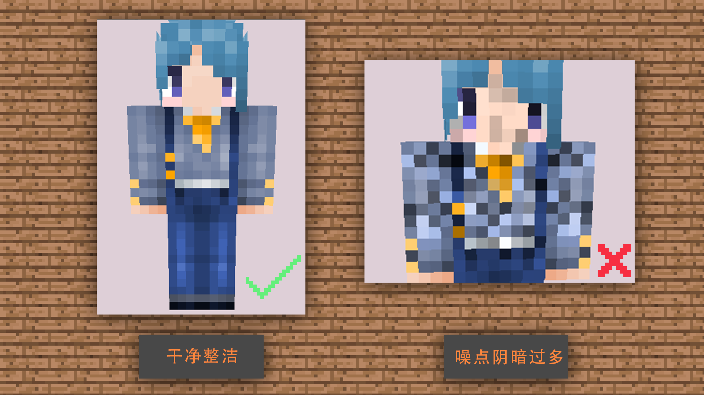
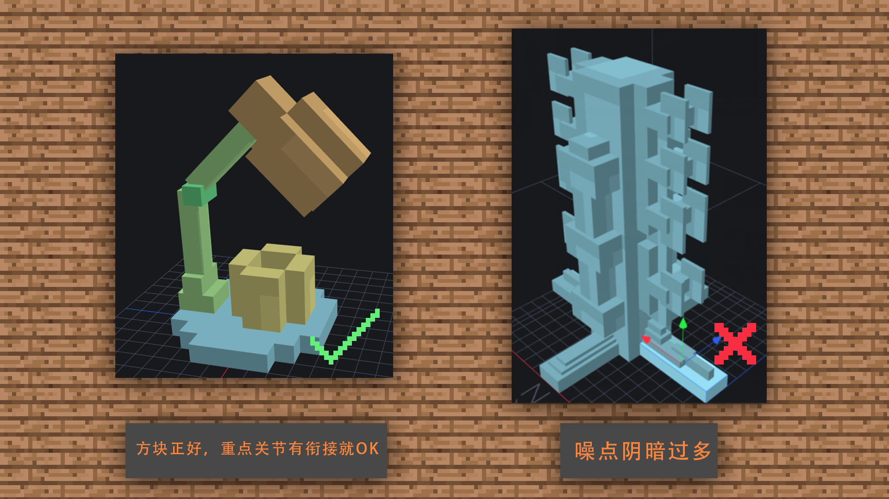
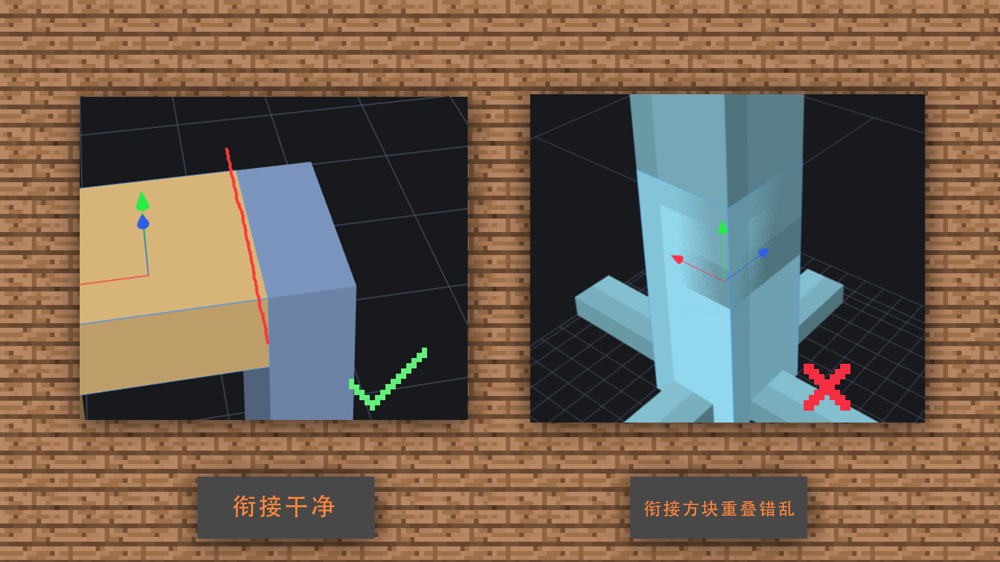

# 1.3制作MC效果模型的思路、规范介绍

#### TAG：模型 思路 规范

#### 作者：上古之石

#### 制作MC效果模型的思路、规范介绍

选好软件后，我们先认识一下MC模型制作的概念思路。首先要知道基本的官方尺寸是多少。其次再是对于贴图的绘制规范和模型的建模规则。

MC的官方模型分辨率和尺寸是16X，即人物设计的分辨率都以16X为界限。

如果大家觉得难以理解，那么最简单的方法就是用官方皮肤数一数格数。

比如：1.头部的尺寸：长宽高为8格

2.身体的尺寸：长8格，宽4格，高12格

3.手臂的尺寸：长4格，宽4格，高12格

4.腿部的尺寸：长4格，宽4格，高12格

#### 制作规范和禁忌

了解清楚人物的比例问题，这样让我们对于minecraft的人物基础模型就有了概念。而如果为了更贴近MC官方本身的风格的话，我们就需要再制作模型的时候进行简洁的处理。

这三点希望大家可以记住：

1、不建议过于杂乱

2、不建议过多关节

3、避免方块重叠

 

#### 1.不建议过于杂乱

这一点关联于贴图的绘制手法，如果贴图的噪点或者阴影交错混乱，模型做的再好都会功亏一篑。

#### 2.不建议过多关节

模型方块如果关节过多会导致与MC原生风格的缺失，并且实装于游戏后会给人不清晰的观感。所以我们可以避免过多关节的设计。

#### 3.避免方块重叠

在建模时如发生重叠，将发生重叠的模型导入游戏或是制作动画，就会出现闪烁或者撕裂，也就是重叠方块和方块衔接过近产生破面。很多错误都会伴随发生。

这里的规范和尺寸规则我们都了解后，后续跟着案例实际操作一下，就可以很好的实践和学习到新技能~