# 1.4-BLOCKBENCH教学-产出模型案例

#### TAG：模型 BLOCKBENCH 案例

#### 作者：上古之石

#### 开源软件：BLOCKBENCH的使用教学-产出模型案例

在制作模型的过程中，我们一定要有顺序的去制作：从下至上，从框架到整体，从整体到细节，从细节到贴图绘制。如果不这样的话，很容易会因为一些小问题返工，或导致全部推翻重来。

所以每一步都需要认真和慎重。接下来就让我们尝试制作1个模型试试看吧。

成品如下：

#### 开始制作

首先，我们先打开 以下简称BB。大家可以直接在搜索引擎中，搜索Blockbench，找到其官网后下载即可。

打开软件后可以看到，在软件界面很清晰的划分了不同类别的模型创造格式。我们只需要选择自己想要制作的版本就可以。Ps：在BB里面皮肤玩家实体都是按照官方格式默认已经设置好了的无需大家重新按照尺寸建设。十分方便的哦。

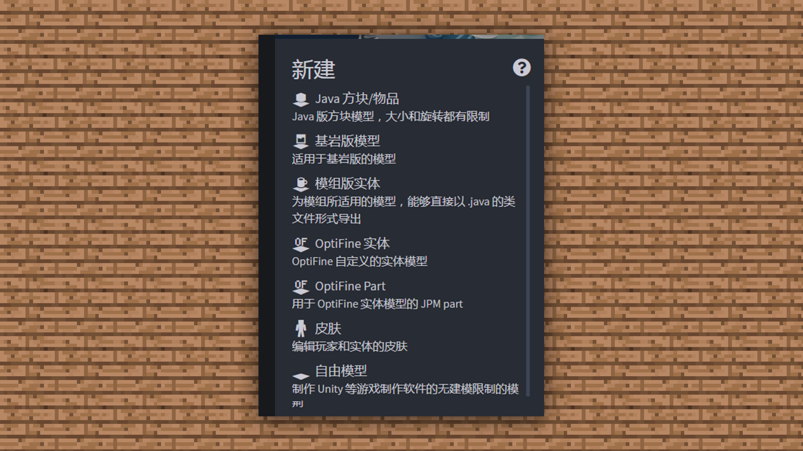

但是在这里我们要注意一下，基岩版创建制作模型中间是有一个旧版基岩模型创作的。两个基岩版本的区别在于。

基岩版模型建立的方块是可以随意旋转方向的，不受限制。

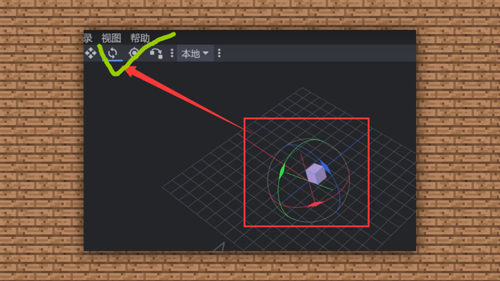

但是旧版基岩版模型是不能直接旋转方块的，需要创建组以后才可以旋转方向。

那我们就选择模组板实体进行汽车的制作吧。

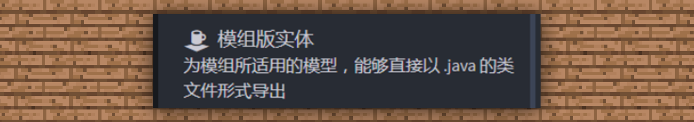

选择后进入界面。

首先创作一个底部作为汽车的底盘。先选择大纲模块中的【添加立方体】，随后我们创建一个立方体。

立方体添加完成后，我们可以直接使用鼠标的左右键及滚轮，进行对物体的缩放及画布的移动，鼠标左键为移动物体的面向，鼠标右键为对物体上下左右的移动，滚轮为放大缩小。

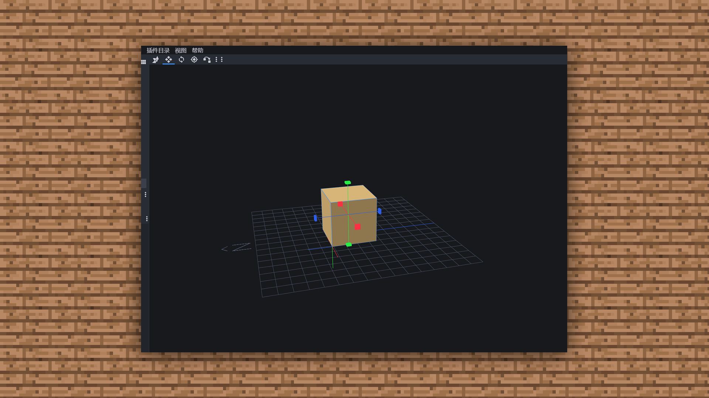

可以使用工具栏的【移动】功能对方块进行移动和方位调整。

使用【尺寸】这个可以调整方块的大小

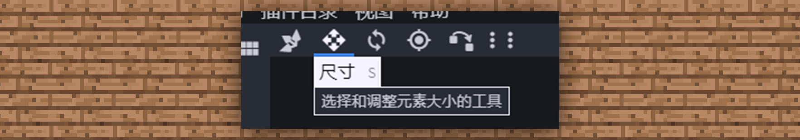

使用【旋转】来选择和旋转立方体工具

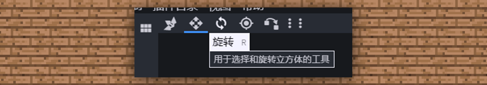

我们使用尺寸按钮，接着鼠标点击在蓝横向箭头上将方块拉长，拉成我们希望的一个长度。（大家在熟练后可以直接输入块面的参数来设定长宽高）

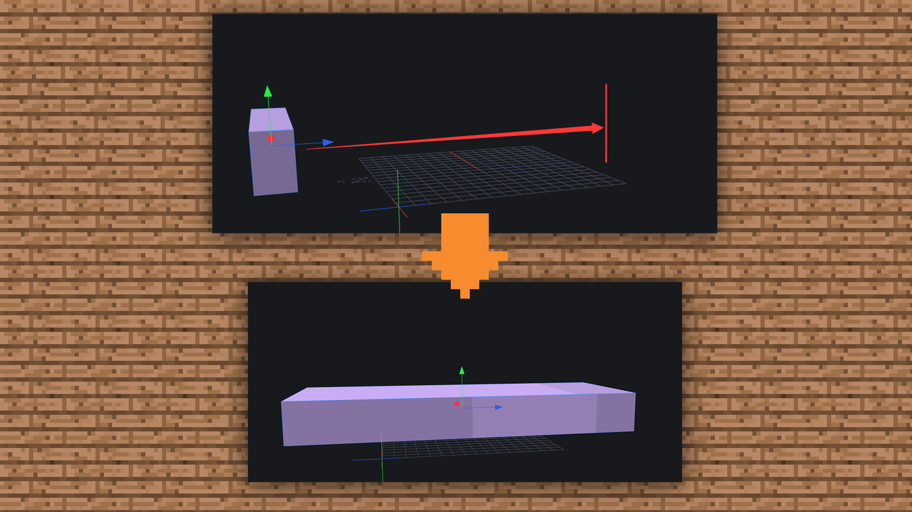

因为汽车的底盘比较宽，所以我们继续选择【尺寸】从侧面选择红色的箭头进行侧面的延伸。

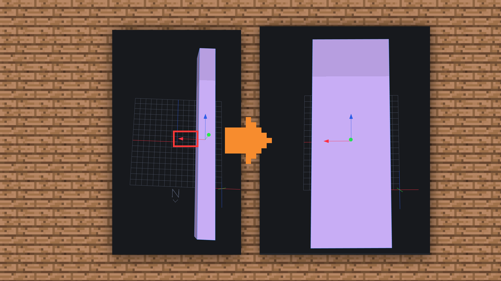

然后我们用同样的方法把汽车尾部的尾杠进行绘制。

并且在做一个长方形放置在尾部之上作为后面车灯的铺垫。

然后继续依照上述操作方法，先将车子的底盘使用方块进行堆叠，将底部完善。

接着我们开始把车窗的框架和上半部分车顶框架全部使用同样的方法进行堆叠。

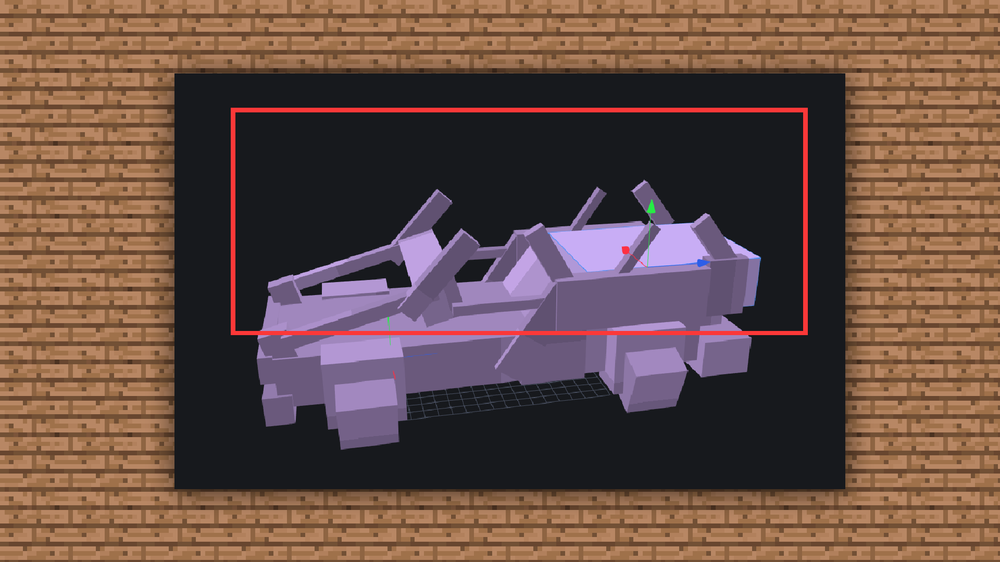

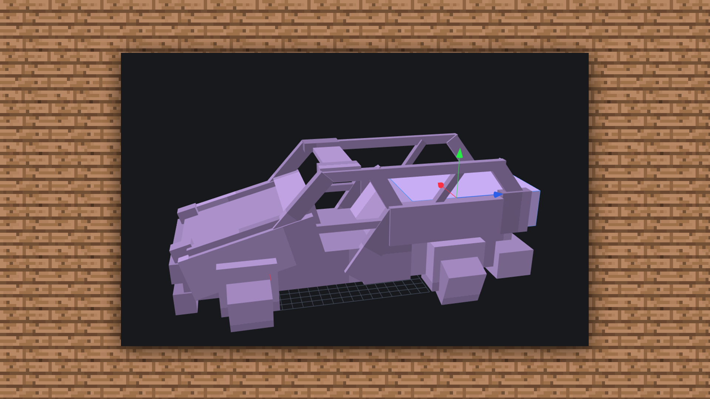

然后将车顶覆盖。

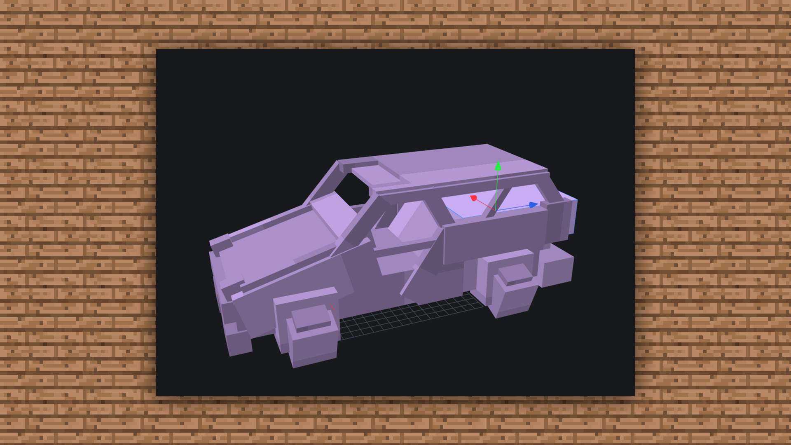

这样一个车子的基础模型就已经完成了。

然后我们来给车子创建一个贴图。

颜色选择一个自己喜欢的就行，但是分辨率一定要是16X

贴图新建好之后，我们将界面切换至画板模式。

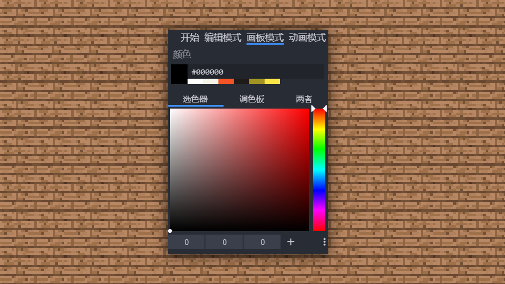

然后将新建好的材质直接拖到想要绘制的面上。然后面变成白色，就可以开始绘制了。

然后我们使用取色器进行取色。

取色好了后，我们选择画笔就可以开始上色啦。

画笔选择后我们可以设置笔刷的尺寸、不透明度和柔软度。根据绘制的个人习惯进行选择就好啦。

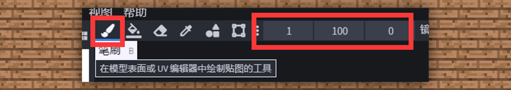

【尺寸】：是指笔刷的笔触大小，1就为1个像素块。数值越大笔刷越大。

【不透明度】：可以调整笔刷色彩透明度，100是实色，0是透明。

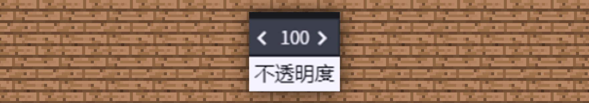

【柔软度】：指的是笔刷下色彩的柔和度效果，会有一层磨砂质感的内容，大家可以实际绘制试试看。

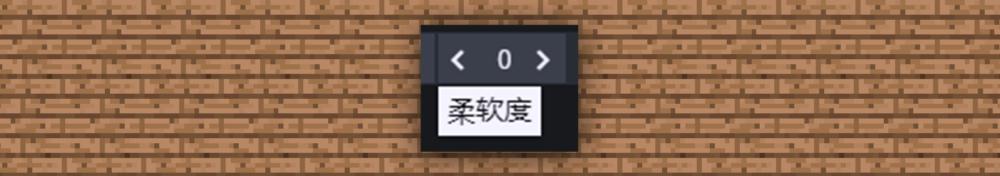

那么就开始试试参考皮肤绘制的手法来上色吧，制作一款属于自己的小汽车~

