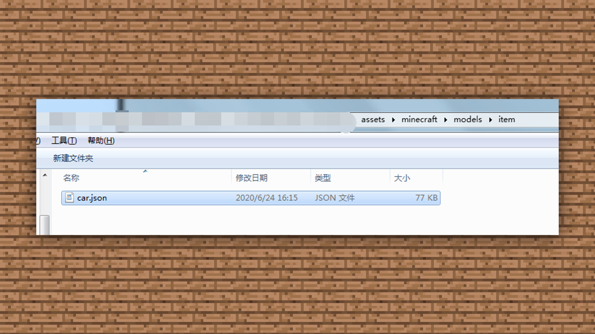

# 1.6模型正确的输出方式

#### TAG：输出 模型

#### 作者：上古之石

#### 模型正确的输出方式

当小汽车建模完毕后，我们可以使用【文件】—【导出】—【导出OBJ模型】OBJ专用于各类3D建模软件进行后期的动画拍摄制作使用。

我们也可以导出jem，json的java读取文件进行导入游戏资源包。替换物品名字即可从资源包里导入游戏。

然后将js文件放入/assets/minecraft/models/item即可。

将材质放入assets/minecraft/textures/item即可。

随即就可以进入到进行实际的测试环节。如果发现游戏中出现什么问题再修改和调整即可，这是一个反复优化的过程，需要大家多多尝试及练习~